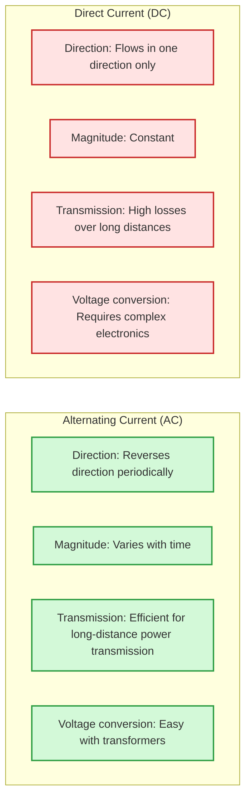
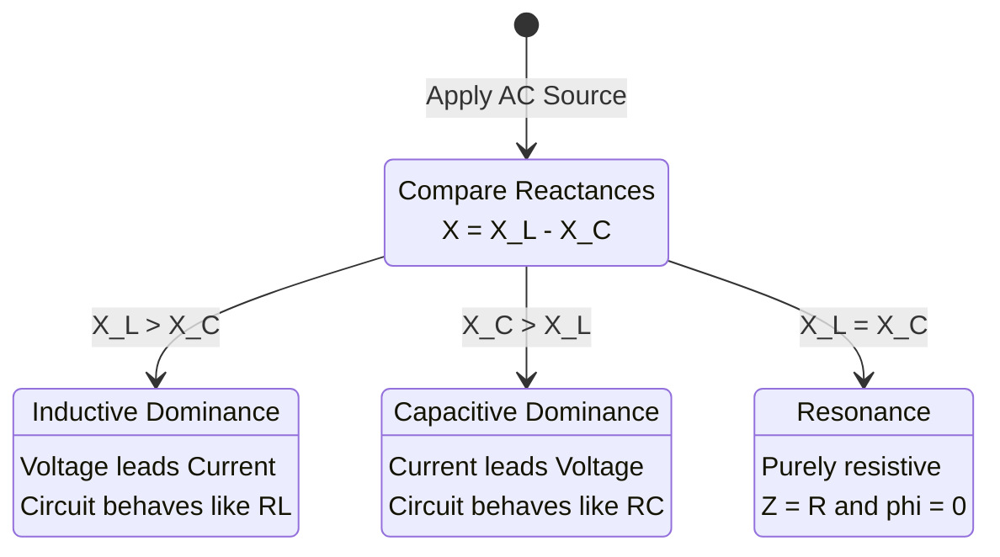
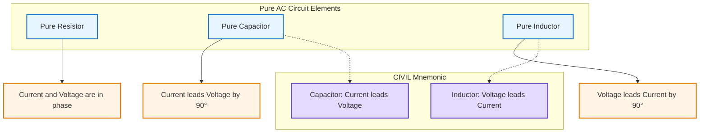

# AC Circuits

Analysis of circuits with time-varying sinusoidal voltages and currents.

## Definition

Alternating Current (AC) circuits involve voltages and currents that vary sinusoidally with time. AC is the standard for power distribution due to efficient voltage transformation using transformers.

## AC vs DC

| Property           | Direct Current (DC)             | Alternating Current (AC)                       |
| ------------------ | ------------------------------- | ---------------------------------------------- |
| Direction          | Flows in one direction only     | Reverses direction periodically                |
| Magnitude          | Constant                        | Varies with time                               |
| Current flow       | +ve to −ve terminal             | Alternates between +ve→−ve and −ve→+ve         |
| Electron flow      | −ve to +ve terminal             | Alternates direction                           |
| Lamp brightness    | Constant                        | Flickering (at line frequency)                 |
| Transmission       | High losses over long distances | Efficient for long-distance power transmission |
| Voltage conversion | Requires complex electronics    | Easy with transformers                         |

> [!note] Why AC won the "War of Currents"
> In the late 1800s, Thomas Edison advocated for DC while Nikola Tesla pioneered AC. AC became the global standard because transformers enable efficient voltage step-up for transmission and step-down for consumption, dramatically reducing power losses ($P_{\text{loss}} = I^2R$) over long distances.

## Sinusoidal AC Signals

AC voltage and current are described by sinusoidal functions. The general forms are:

$$I(t) = I_0 \sin(\omega t)$$

$$V(t) = V_0 \sin(\omega t)$$

Where:
- $I(t)$, $V(t)$ : instantaneous current and voltage
- $I_0$, $V_0$ : peak (maximum) current and voltage
- $\omega$ : angular frequency (rad/s)
- $t$ : time (s)

> [!note] Sinusoidal AC can also be written using a **cosine** function, which is simply a phase-shifted sine wave.

**Frequency relations:**

$$\omega = \frac{2\pi}{T} = 2\pi f$$

- $T$ : period — time for one complete cycle (s)
- $f$ : frequency — number of complete cycles per second (Hz)

### Writing Equations from Graphs
**Step 1:** Identify the peak value ($I_0$ or $V_0$) and period ($T$) from the graph.  
**Step 2:** Calculate angular frequency: $\omega = \frac{2\pi}{T}$.  
**Step 3:** Substitute into the general equation.

## Average & RMS Values

### Average Value
The mathematical average of a sinusoidal AC signal over a **complete cycle is zero**, because the positive and negative half-cycles cancel exactly. While the average is zero, power is still delivered — this is why average value is not useful for power analysis in AC circuits.

> [!example] Analogy: If a basketball bounces up and down, its average height might be zero, but it is still moving and doing work.

### Root Mean Square (RMS)
RMS provides the **effective value** of an AC signal — the equivalent DC value that would deliver the same power to a resistive load.

**The RMS process:**
1. **S**quare all instantaneous values (eliminates negative signs)
2. Take the **M**ean (average) of those squared values over one cycle
3. Take the square **R**oot of that mean

For a pure sinusoid:

$$I_{\text{rms}} = \frac{I_{\max}}{\sqrt{2}} \approx 0.707\, I_{\max}$$

$$V_{\text{rms}} = \frac{V_{\max}}{\sqrt{2}} \approx 0.707\, V_{\max}$$

> [!tip] Real-world context
> - Your home power supply is rated at **230V RMS**; the actual peak voltage is about **325V**.
> - Electric bills are calculated using **RMS power consumption** (kWh).
> - All AC meters and appliance labels display **RMS values**.

### Power in AC Circuits
For resistive loads, average power is calculated using RMS values:

$$P = V_{\text{rms}} I_{\text{rms}}$$

Given peak values:

$$P = \frac{V_0 I_0}{2}$$

## Key Concepts

- Sinusoidal Waveforms — $v(t) = V_m \sin(\omega t + \phi)$
- RMS Values — $V_{rms} = \frac{V_m}{\sqrt{2}}$, effective values for power
- Phasors — rotating vectors representing AC quantities
- Impedance — $Z = \frac{V_{\text{rms}}}{I_{\text{rms}}} = \frac{V_0}{I_0} = \sqrt{R^2 + X^2}$, opposition to AC flow; scalar quantity in ohms ($\Omega$); in DC circuits it behaves like resistance
- Reactance — opposition to AC flow
  - Capacitive: $X_C = \frac{1}{\omega C} = \frac{1}{2\pi f C}$
  - Inductive: $X_L = \omega L = 2\pi f L$
- Phase Angle — phase difference between voltage and current; for series RLC, $\tan\phi = \frac{X_L - X_C}{R}$
  - **Positive** when inductive ($X_L > X_C$): voltage leads current
  - **Negative** when capacitive ($X_C > X_L$): current leads voltage
- Resonance — when $X_L = X_C$, minimum impedance
- Power Factor — $\cos\phi = \frac{R}{Z}$, ratio of real to apparent power
- Power Triangle — $S^2 = P^2 + Q^2$, geometric relationship between real, reactive, and apparent power
- Pure Reactive Elements — inductors and capacitors dissipate zero average power; they only exchange reactive power with the source
- Power Factor Correction — adding capacitors to partially cancel inductive reactance and raise the power factor toward unity
- Quality Factor — $Q = \frac{\omega_0 L}{R}$

## RLC Series Circuit

In an RLC series circuit, the inductor and capacitor voltages are $180°$ out of phase and partially cancel:

- **Net Reactance:** $X = X_L - X_C$
- **Total Voltage:** $V_T = \sqrt{V_R^2 + (V_L - V_C)^2}$
- **Circuit Behavior:**
  - **Inductive dominance** ($X_L > X_C$): circuit behaves like RL, voltage leads current
  - **Capacitive dominance** ($X_C > X_L$): circuit behaves like RC, current leads voltage
  - **Resonance** ($X_L = X_C$): $Z = R$, purely resistive, $\phi = 0$
- RL Series Circuit — $Z = \sqrt{R^2 + X_L^2}$, voltage leads current by $\phi = \tan^{-1}(X_L/R)$
- RC Series Circuit — current leads voltage by negative phase angle
  - Total voltage: $V_T = \sqrt{V_R^2 + V_C^2}$
  - Impedance: $Z = \sqrt{R^2 + X_C^2}$
  - Phase angle: $\phi = \tan^{-1}\left(\frac{-X_C}{R}\right)$ (negative because current leads)

## Pure Circuits

Analysis of circuits containing only a single type of element (R, C, or L).

### Pure Resistive Circuit (PRC)
A pure resistor has **no capacitance and no self-inductance**.
- $I = I_0 \sin(\omega t)$ and $V_R = V_0 \sin(\omega t)$
- **Current is in phase with voltage**: $\Delta\phi = 0$
- Impedance: $Z = R$

### Pure Capacitive Circuit (PCC)
A pure capacitor has **no resistance and no self-inductance**.
- $V_C = V_0 \sin(\omega t)$ and $I = I_0 \sin\left(\omega t + \frac{\pi}{2}\right)$
- **Current leads voltage by $\pi/2$** (or $90°$); equivalently, **voltage lags current by $\pi/2$**
- Capacitive reactance: $X_C = \frac{V_{\text{rms}}}{I_{\text{rms}}} = \frac{V_0}{I_0} = \frac{1}{2\pi f C}$
- $X_C$ is a **scalar quantity** with unit **ohm ($\Omega$)**
- $X_C \propto \frac{1}{f}$ — inversely proportional to frequency

### Pure Inductive Circuit (PLC)
A pure inductor has **no resistance and no capacitance**.
- $V = V_0 \sin\left(\omega t + \frac{\pi}{2}\right)$ and $I = I_0 \sin(\omega t)$
- **Voltage leads current by $\pi/2$** (or $90°$); equivalently, **current lags voltage by $\pi/2$**
- Inductive reactance: $X_L = \frac{V_{\text{rms}}}{I_{\text{rms}}} = \frac{V_0}{I_0} = 2\pi f L$
- $X_L$ is a **scalar quantity** with unit **ohm ($\Omega$)**
- $X_L \propto f$ — directly proportional to frequency

### CIVIL Mnemonic
A memory aid for remembering which quantity leads:
- **C** (Capacitor): **I** leads **V**
- **L** (Inductor): **V** leads **I** (or **I** lags **V**)

## Phasor Diagrams

A phasor diagram represents an AC quantity as a rotating vector. The phasor rotates **anticlockwise** at angular velocity $\omega$ from the positive x-axis. The vertical projection of the phasor onto the time axis traces the corresponding sinusoidal waveform.

### Phase Angle & Phase Shift
The phase angle $\phi$ describes the horizontal shift of a sine wave relative to a reference:

| Condition | Equation | Sign |
|-----------|----------|------|
| In-phase | $A(t) = A_m \sin(\omega t)$ | $\phi = 0^\circ$ |
| Lead (left shift) | $A(t) = A_m \sin(\omega t + \phi)$ | positive $\phi$ |
| Lag (right shift) | $A(t) = A_m \sin(\omega t - \phi)$ | negative $\phi$ |

> [!note] Sign Convention
> **LEFT is positive (+$\phi$)** → LEAD
> **RIGHT is negative (-$\phi$)** → LAG

### Leading & Lagging
- A signal **leads** when it reaches its peak or zero-crossing earlier than the reference signal.
- A signal **lags** when it reaches its peak or zero-crossing later than the reference signal.
- In AC circuit analysis, the phase angle is often defined as the phase difference between voltage and current.

## Key Formulas

| Formula | Description |
|---------|-------------|
|$V_{rms} = \frac{V_m}{\sqrt{2}}$ | RMS voltage |
|$I_{rms} = \frac{I_m}{\sqrt{2}}$ | RMS current |
|$Z = \frac{V_{rms}}{I_{rms}} = \frac{V_0}{I_0}$ | Impedance (general definition) |
|$Z = R$ | Impedance in pure resistor |
|$Z = X_C$ | Impedance in pure capacitor |
|$Z = X_L$ | Impedance in pure inductor |
|$X_C = \frac{1}{\omega C} = \frac{1}{2\pi f C}$ | Capacitive reactance |
|$X_L = \omega L = 2\pi f L$ | Inductive reactance |
|$X = X_L - X_C$ | Net reactance (RLC series) |
|$Z = \sqrt{R^2 + (X_L - X_C)^2}$ | Series RLC impedance |
|$\tan\phi = \frac{X_L - X_C}{R}$ | Phase angle (positive = inductive) |
|$Z_{RL} = \sqrt{R^2 + X_L^2}$ | Series RL impedance |
|$\tan\phi = \frac{X_L}{R}$ | RL phase angle (voltage leads) |
|$V_T = \sqrt{V_R^2 + V_L^2}$ | Total voltage in RL series |
|$V_T = \sqrt{V_R^2 + (V_L - V_C)^2}$ | Total voltage in RLC series |
|$f_0 = \frac{1}{2\pi\sqrt{LC}}$ | Resonant frequency |
|$P_{avg} = V_{rms}I_{rms}\cos\phi$ | Average power |
|$S = V_{rms}I_{rms}$ | Apparent power |
|$Q = V_{rms}I_{rms}\sin\phi$ | Reactive power |
|$S = \sqrt{P^2 + Q^2}$ | Apparent power (power triangle) |
|$PF = \frac{R}{Z} = \cos\phi$ | Power factor |

## Related Concepts

- [[Capacitors & Dielectrics]] — capacitive reactance foundation
- [[Inductance & Transformers]] — inductive reactance foundation
- [[Electrostatics]] — DC circuit principles

## Course Links

- [[FAD1022 - Basic Physics II]] — main course page
- [[FAD1022 L14-L16 — AC Analysis]] — AC fundamentals
- [[FAD1022 L17-L21 — AC Series Circuits]] — RLC circuit analysis
- [[Nurul Izzati (NIA)]] — AC Analysis lecturer
- [[Mohd Fahmi Azman (MFA)]] — AC Series Circuits lecturer