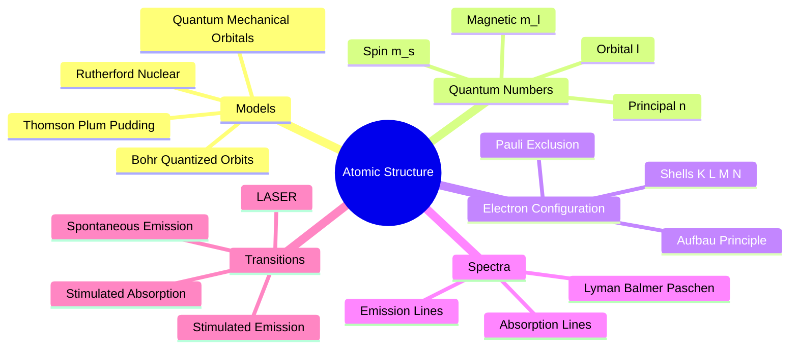
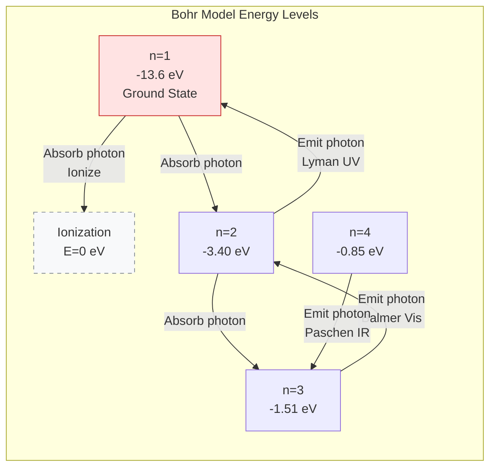

# Atomic Physics

Study of atomic structure, electron configurations, and atomic spectra.

## Definition

Atomic physics examines the structure of atoms, the arrangement of electrons around the nucleus, and the interaction of atoms with electromagnetic radiation. It bridges classical and quantum physics.

## Key Concepts

- Atomic Structure — nucleus (protons, neutrons) + electrons
- Thomson Model — plum pudding model; discovery of the electron
- Rutherford Model — nuclear atom, scattering experiments
- Bohr Model — quantized electron orbits, angular momentum quantization
- Bohr's Postulates — stationary states, $L=n\hbar$, photon emission during transitions
- Energy Levels — discrete allowed energies for electrons
- Quantum Numbers — $n$, $l$, $m_l$, $m_s$ describing electron states
- Electron Shells — K, L, M, N... shells corresponding to $n = 1, 2, 3, 4...$
- Atomic Spectra — emission and absorption line spectra
- Spectral Series — Lyman (UV, $n \to 1$), Balmer (visible, $n \to 2$), Paschen (IR, $n \to 3$)
- Rydberg Formula — wavelengths of spectral lines:
  $$\frac{1}{\lambda} = R_H\left(\frac{1}{n_f^2} - \frac{1}{n_i^2}\right)$$
- Ionization Energy — energy to remove an electron
- Quantum Mechanical Model — Schrödinger orbitals, probability clouds, wave-particle duality
- Pauli Exclusion Principle — no two electrons same quantum state
- Stimulated Absorption — electron absorbs photon, excites to higher state
- Spontaneous Emission — excited electron emits photon randomly ($\sim 10^{-8}$ s lifetime)
- Stimulated Emission — incident photon triggers emission of an identical photon
- LASER — Light Amplification by Stimulated Emission of Radiation; coherent, monochromatic, directional light

## Key Formulas

| Formula | Description |
|---------|-------------|
|$r_n = n^2 a_0 = (5.29 \times 10^{-11} \text{ m})\,n^2$ | Bohr orbit radius |
|$E_n = -\frac{13.6}{n^2}$ eV | Hydrogen energy levels |
|$\frac{1}{\lambda} = R_H\left(\frac{1}{n_f^2} - \frac{1}{n_i^2}\right)$ | Rydberg formula |
|$L = n\hbar = r_n m v_n$ | Quantized angular momentum |
|$\hbar = \frac{h}{2\pi} \approx 1.06 \times 10^{-34} \text{ J}\cdot\text{s}$ | Reduced Planck constant |
|$hf = E_i - E_f$ | Photon energy from transition |
|$E_{\text{ionization}} = 13.6$ eV | Hydrogen ionization energy |
|$\mu = \frac{m_e M}{m_e + M}$ | Reduced mass |

## Related Concepts

- [[Nuclear Physics]] — nuclear structure, extension to nucleus
- [[Modern Physics — Wave-Particle Duality]] — quantum foundations
- [[Electrostatics]] — Coulomb force in atoms

## Course Links

- [[FAD1022 - Basic Physics II]] — main course page
- [[FAD1022 L39-L42 — Atomic & Nuclear Physics]] — lecture source
- [[Hafizul Mat]] — lecturer