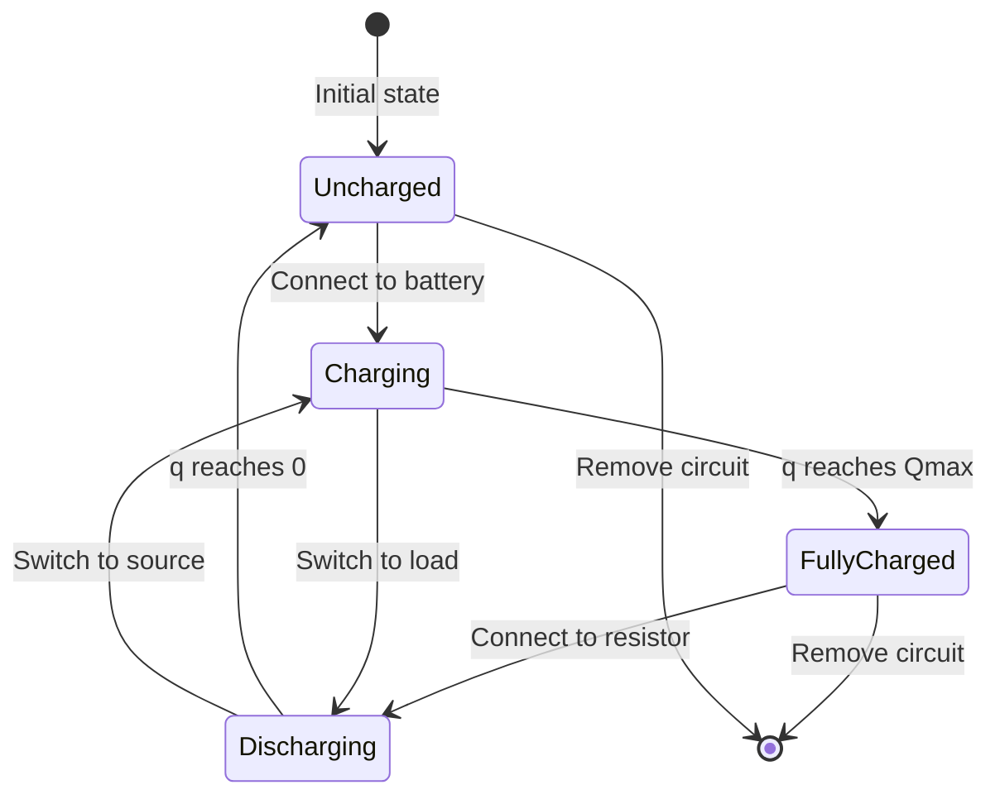
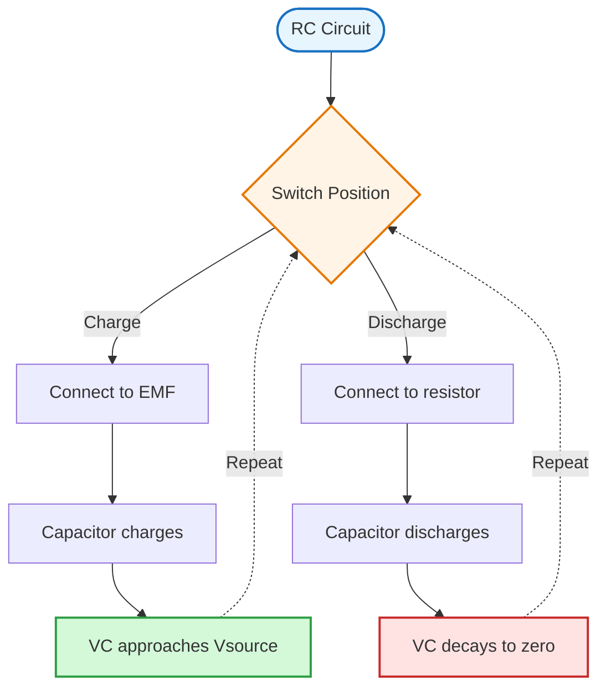
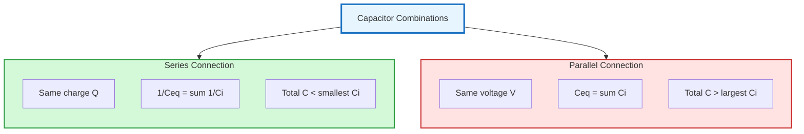

# Capacitors & Dielectrics

Devices and materials for storing electric charge and energy in electric fields.

## Definition

A capacitor is a device that stores electric charge and energy in an electric field. It consists of two conductors separated by an insulator (dielectric). Capacitance measures the ability to store charge per unit voltage.

**Key point:** A capacitor does not create charge — it separates and stores existing charges $Q$ on opposite plates, creating a potential difference $\Delta V$ between them.

**Capacitance:**
$$C = \frac{Q}{\Delta V}$$
where $C$ is in farads (F), $Q$ in coulombs (C), and $\Delta V$ in volts (V).

**Symbols for capacitor:**
- Standard symbol: two parallel lines (—||—)
- Polarized capacitor: one straight line and one curved line (+|()

## Parallel-Plate Capacitor

Consists of two conducting plates of area $A$ separated by distance $d$. The space between plates is vacuum or air.

**Electric field strength** between the plates:
$$E = \frac{\sigma}{\varepsilon_0} = \frac{Q}{A\varepsilon_0}$$
where $\sigma$ is surface charge density and $\varepsilon_0 = 8.85 \times 10^{-12} \text{ F m}^{-1}$ is the permittivity of free space.

Since $d \ll A$, the electric field $E$ is uniform between the plates and zero elsewhere:
$$E = \frac{\Delta V}{d}$$

**Capacitance** (vacuum/air):
$$C = \varepsilon_0 \frac{A}{d}$$

**Factors affecting capacitance:**
1. **Area** of the plate, $A$ — directly proportional ($C \propto A$)
2. **Distance** between the plates, $d$ — inversely proportional ($C \propto 1/d$)

## Dielectrics

A **dielectric** is a non-conducting material placed between the plates of a capacitor.

**Dielectric constant** (relative permittivity):
$$\kappa = \frac{\varepsilon}{\varepsilon_0} = \frac{C}{C_0}$$
where $\varepsilon$ is the permittivity of the dielectric material.

**Advantages** of inserting a dielectric:
1. Increases capacitance by factor $\kappa$
2. Increases the maximum operating voltage (higher dielectric strength)
3. Provides mechanical support between the plates

**Dielectric strength** is the maximum electric field that can exist in a dielectric without electrical breakdown.

| Material | Dielectric constant, $\kappa$ | Dielectric Strength ($10^6$ V m$^{-1}$) |
|----------|------------------------------|----------------------------------------|
| Paper | 3.7 | 16 |
| Mylar | 3.2 | 7 |
| Rubber | 6.7 | 12 |
| Silicone oil | 2.5 | 15 |
| Nylon | 3.4 | 14 |
| Teflon | 2.1 | 60 |

**Effect on isolated capacitor (battery disconnected):**
When a dielectric is inserted into a charged capacitor with the battery disconnected, charge $Q_0$ remains constant while the potential difference decreases:
$$\Delta V = \frac{\Delta V_0}{\kappa}$$

The capacitance becomes:
$$C = \kappa C_0 = \kappa \varepsilon_0 \frac{A}{d}$$

(Subscript 0 denotes parameters for the vacuum-filled capacitor)

**Polarization mechanism:**
- Polar molecules are randomly oriented in the absence of an electric field
- When an external field $\vec{E}_0$ is applied, molecules partially align with the field
- The polarized dielectric creates an induced electric field $\vec{E}_{ind}$ opposite to $\vec{E}_0$
- Net field is reduced: $\vec{E} = \frac{\vec{E}_0}{\kappa}$
- Weaker field means lower voltage for the same charge, resulting in higher capacitance

## Energy Storage

A charged capacitor stores electrical potential energy in the electric field between the plates. Energy stored equals the work done to charge the capacitor.

Work is required because electrons must be forced onto a plate that already has electrons (they repel each other). The fuller the plate gets, the more work is required.

From the area under the $\Delta V$ vs $Q$ graph:
$$U = W = \frac{1}{2}\frac{Q^2}{C} = \frac{1}{2}C(\Delta V)^2 = \frac{1}{2}Q\Delta V$$

**Energy density** in the electric field:
$$u = \frac{1}{2}\varepsilon_0 E^2 \quad \text{(vacuum)}$$
$$u = \frac{1}{2}\varepsilon E^2 = \frac{1}{2}\kappa\varepsilon_0 E^2 \quad \text{(with dielectric)}$$

State transitions during charging and discharging:

## Key Formulas

| Formula | Description |
|---------|-------------|
| $C = \frac{Q}{\Delta V}$ | Capacitance definition |
| $C = \varepsilon_0 \frac{A}{d}$ | Parallel plate (vacuum) |
| $C = \kappa\varepsilon_0 \frac{A}{d}$ | With dielectric |
| $E = \frac{\sigma}{\varepsilon_0} = \frac{Q}{A\varepsilon_0}$ | Electric field (vacuum) |
| $E = \frac{\Delta V}{d}$ | Uniform field between plates |
| $\vec{E} = \frac{\vec{E}_0}{\kappa}$ | Net field with dielectric |
| $\Delta V = \frac{\Delta V_0}{\kappa}$ | Potential with dielectric (isolated) |
| $\frac{1}{C_{eq}} = \frac{1}{C_1} + \frac{1}{C_2} + \dots$ | Series combination |
| $C_{eq} = C_1 + C_2 + \dots$ | Parallel combination |
| $U = \frac{1}{2}CV^2 = \frac{1}{2}QV = \frac{Q^2}{2C}$ | Stored energy |
| $u = \frac{1}{2}\varepsilon_0 E^2$ | Energy density (vacuum) |
| $\tau = RC$ | RC time constant |
| $q(t) = Q_{max}(1 - e^{-t/\tau})$ | Charging capacitor |
| $q(t) = Q_0 e^{-t/\tau}$ | Discharging capacitor |

Charging and discharging process in an RC circuit:

Comparison of series and parallel capacitor combinations:

## Related Concepts

- [[Electrostatics]] — fundamental charge and field concepts
- [[AC Circuits]] — capacitors in AC circuits, capacitive reactance
- [[Inductance & Transformers]] — energy storage comparison

## Course Links

- [[FAD1022 - Basic Physics II]] — main course page
- [[FAD1022 L7-L9 — Capacitors]] — lecture source
- [[Dr Siti Nabila Aidit]] — lecturer
