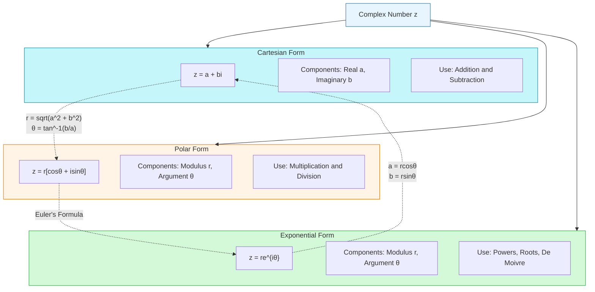
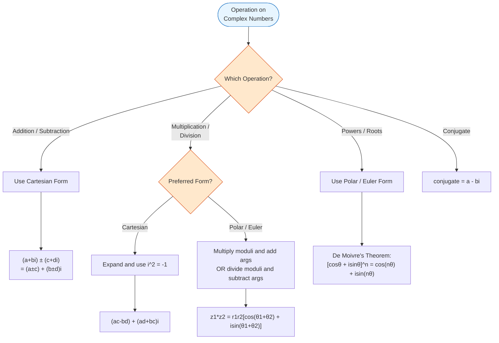

# Complex Numbers

Complex numbers extend the real numbers by introducing the imaginary unit $i$, where $i^2 = -1$.

## Definition

A complex number $z$ is expressed in standard (Cartesian) form as:

$$z = a + bi$$

where:
- $a$ is the real part: $\text{Re}(z) = a$
- $b$ is the imaginary part: $\text{Im}(z) = b$
- $i$ is the imaginary unit with $i^2 = -1$

### Number System Hierarchy

$$\mathbb{N} \subset \mathbb{Z} \subset \mathbb{Q} \subset \mathbb{R} \subset \mathbb{C}$$

- $\mathbb{N}$ — Natural numbers
- $\mathbb{Z}$ — Integers
- $\mathbb{Q}$ — Rational numbers
- $\mathbb{R}$ — Real numbers (including irrational numbers $\mathbb{I}$)
- $\mathbb{C}$ — Complex numbers (encompassing all of the above plus imaginary numbers)

### Real and Imaginary Parts: Examples

| $z = a + bi$ | $2 + 3i$ | $-1 - i\pi$ | $10i$ | $3$ | $0$ |
|---|---|---|---|---|---|
| $\text{Re}(z)$ | $2$ | $-1$ | $0$ | $3$ | $0$ |
| $\text{Im}(z)$ | $3$ | $-\pi$ | $10$ | $0$ | $0$ |

Note: For real numbers like $3$, $\text{Im}(z) = 0$. For purely imaginary numbers like $10i$, $\text{Re}(z) = 0$.

## Argand Diagram

The **Argand diagram** (or complex plane) provides a geometric representation of complex numbers:
- **Horizontal axis:** Real axis
- **Vertical axis:** Imaginary axis
- A complex number $z = a + ib$ corresponds to the point $(a, b)$
- The **modulus** $r = |z| = \sqrt{a^2 + b^2}$ is the distance from the origin to the point
- The **argument** $\theta = \arg(z)$ is the angle measured from the positive real axis to the line joining the origin to $z$
- The **complex conjugate** $\overline{z} = a - ib$ is the reflection of $z$ across the real axis

## Forms of Complex Numbers

### Cartesian Form
$$z = a + bi$$

### Polar Form
$$z = r(\cos\theta + i\sin\theta) = r[\cos\theta + i\sin\theta]$$

where:
- $r = |z| = \sqrt{a^2 + b^2}$ (modulus)
- $\theta = \tan^{-1}\left(\frac{b}{a}\right)$ (argument)

#### Conversion Procedure (4 Steps)
Given $z = a + bi$:
1. **Identify** $a$ and $b$
2. **Find the radius:** $r = \sqrt{a^2 + b^2}$
3. **Find the angle:** $\theta = \tan^{-1}\left(\frac{b}{a}\right)$
   - **Note:** $-\pi < \theta \leq \pi$ (Principal Argument)
4. **Write:** $z = r[\cos\theta + i\sin\theta]$

#### Examples from Lecture
- Write $z = -4 + 4i$ in polar form
- Write $z = \sqrt{3} - i$ in polar form

### Exponential Form (Euler's Formula)
$$z = re^{i\theta} = r(\cos\theta + i\sin\theta)$$

### Forms Comparison

## Powers of $i$

The imaginary unit cycles every 4 powers:

| $i^0$ | $i^1$ | $i^2$ | $i^3$ |
|:---:|:---:|:---:|:---:|
| $1$ | $i$ | $-1$ | $-i$ |

| $i^4$ | $i^5$ | $i^6$ | $i^7$ |
|:---:|:---:|:---:|:---:|
| $1$ | $i$ | $-1$ | $-i$ |

General rule: to simplify $i^n$, divide $n$ by 4 and use the remainder.

## Operations

### Addition/Subtraction
$$(a + bi) \pm (c + di) = (a \pm c) + (b \pm d)i$$

**Example:** Given $z_1 = 2 + 4i$ and $z_2 = 1 - 3i$:
$$z_1 - z_2 = (2 + 4i) - (1 - 3i) = 1 + 7i$$

### Multiplication
$$(a + bi)(c + di) = (ac - bd) + (ad + bc)i$$

**Example:** $(2 + 4i)(1 - 3i) = 2 - 6i + 4i - 12i^2 = 2 - 2i + 12 = 14 - 2i$

### Division
To divide complex numbers, multiply numerator and denominator by the conjugate of the denominator:
$$\frac{a + bi}{c + di} = \frac{(a + bi)(c - di)}{c^2 + d^2}$$

**Example:** $\frac{2 + 4i}{1 - 3i} = \frac{(2 + 4i)(1 + 3i)}{1^2 + 3^2} = \frac{2 + 6i + 4i + 12i^2}{10} = \frac{-10 + 10i}{10} = -1 + i$

### Operations Flowchart

### Complex Conjugate
$$\overline{z} = a - bi$$

Properties:
- $z \cdot \overline{z} = |z|^2 = a^2 + b^2$
- $\overline{z_1 + z_2} = \overline{z_1} + \overline{z_2}$
- $\overline{z_1 \cdot z_2} = \overline{z_1} \cdot \overline{z_2}$

## Multiplication and Division in Polar Form

For $z_1 = r_1[\cos\theta_1 + i\sin\theta_1]$ and $z_2 = r_2[\cos\theta_2 + i\sin\theta_2]$:

### Multiplication Rule
$$z_1 z_2 = r_1 r_2[\cos(\theta_1 + \theta_2) + i\sin(\theta_1 + \theta_2)]$$

*When multiplying in polar form: multiply the moduli and add the arguments.*

### Division Rule
$$\frac{z_1}{z_2} = \frac{r_1}{r_2}[\cos(\theta_1 - \theta_2) + i\sin(\theta_1 - \theta_2)]$$

*When dividing in polar form: divide the moduli and subtract the arguments.*

**Example:** Find the product and division for $z_1 = -1 + i$ and $z_2 = \sqrt{3} + i$.

## Roots of Complex Numbers

To find the square root of a complex number $z = a + bi$, let $\sqrt{z} = x + yi$ and solve:
$$(x + yi)^2 = a + bi$$
Equate real and imaginary parts to form a system of equations in $x$ and $y$.

**Example:** Find $\sqrt{5 + 12i}$.
Let $z_1 = a + bi$ such that $(z_1)^2 = 5 + 12i$.
$$a^2 - b^2 = 5 \quad \text{and} \quad 2ab = 12$$
Solving gives $a = 3, b = 2$ or $a = -3, b = -2$.
Thus $\sqrt{5 + 12i} = \pm(3 + 2i)$.

## De Moivre's Theorem

$$(\cos\theta + i\sin\theta)^n = \cos(n\theta) + i\sin(n\theta)$$

## n-th Roots

The n-th roots of a complex number $z = r(\cos\theta + i\sin\theta)$ are:

$$z^{1/n} = r^{1/n}\left[\cos\left(\frac{\theta + 2\pi k}{n}\right) + i\sin\left(\frac{\theta + 2\pi k}{n}\right)\right]$$

for $k = 0, 1, 2, ..., n-1$

## Geometric Interpretations

### Circle
$$|z - z_0| = r$$
Circle with center $z_0$ and radius $r$

### Perpendicular Bisector
$$|z - z_1| = |z - z_2|$$
Perpendicular bisector of line segment joining $z_1$ and $z_2$

### Half-line
$$\arg(z - z_0) = \theta$$
Half-line (ray) from $z_0$ at angle $\theta$

## Related

- [[FAC1001 - Advanced Mathematics II]] — Science stream course
- [[FAC1004 - Advanced Mathematics II (Computing)]] — Computing stream course
- [[FAC1004 L01 — Complex Numbers]] — lecture on introduction
- [[FAC1004 L02 — Euler's Formula]] — lecture on Euler's formula
- [[FAC1004 L5-L6 — Functions of Complex Numbers (n-th Roots)]] — lecture on De Moivre's theorem
- [[FAC1004 L7-L8 — Complex Equations (Geometric Interpretation)]] — lecture on geometry
- [[FAC1004 Tutorial 2 — Complex Numbers]] — practice problems
- [[FAC1004 Tutorial 3 — Complex Logarithm]] — practice problems
