# Counting & Probability

Fundamental concepts in combinatorics and probability theory essential for statistical analysis.

## Overview

```mermaid
graph TB
    ROOT((Probability and Counting))
    
    ROOT --> COUNT[Counting Methods]
    COUNT --> MULT[Multiplication Rule]
    COUNT --> PERM[Permutations]
    PERM --> PERM1[n distinct objects]
    PERM --> PERM2[r from n]
    PERM --> PERM3[with repetition]
    PERM --> PERM4[identical objects]
    PERM --> PERM5[circular]
    COUNT --> COMB[Combinations]
    COUNT --> REST[Arrangements with Restrictions]
    REST --> REST1[grouping method]
    REST --> REST2[complementary counting]
    
    ROOT --> PROB[Probability Rules]
    PROB --> BASIC[Basic Probability]
    BASIC --> BASIC1[sample space S]
    BASIC --> BASIC2[theoretical probability]
    BASIC --> BASIC3[complement rule]
    PROB --> COMP[Compound Events]
    COMP --> COMP1[union A or B]
    COMP --> COMP2[intersection A and B]
    COMP --> COMP3[addition rule]
    PROB --> MEX[Mutually Exclusive]
    MEX --> MEX1[no overlap]
    PROB --> COND[Conditional Probability]
    COND --> COND1[probability of B given A]
    COND --> COND2[multiplication rule]
    PROB --> IND[Independent Events]
    IND --> IND1[product of probabilities]
    PROB --> TOT[Total Probability]
    TOT --> TOT1[partition of sample space]
    PROB --> BAY[Bayes Theorem]
    BAY --> BAY1[prior to posterior]
    BAY --> BAY2[tree diagrams]
    
    style ROOT fill:#e7f5ff,stroke:#1971c2,stroke-width:2px
    style COUNT fill:#d3f9d8,stroke:#2f9e44
    style PROB fill:#ffe8cc,stroke:#d9480f
```

## Counting Principles

### Multiplication Rule
If there are $n, m, p, r, s$ ways to choose distinct objects of category 1, 2, 3, 4 and 5 respectively, then the number of ways to choose one object from each category is:

$n \times m \times p \times r \times s$

In general, if one event can occur in $m$ ways and a second in $n$ ways, both can occur in sequence in $m \times n$ ways.

### Permutations
Permutation is the **arrangement of some or all distinct objects that considers the order of the objects**.

**Permutations of $n$ distinct objects:**
$n! = n \times (n-1) \times (n-2) \times \cdots \times 2 \times 1$

> **Note:** $0! = 1$ by definition.

**Permutations of $r$ from $n$ distinct objects:**
$P(n,r) = {}_n P_r = \frac{n!}{(n-r)!}$

**Permutations with repetition allowed:**
When arranging $r$ objects chosen from $n$ distinct objects with repetition allowed:
$n^r$

**Permutations with identical objects:**
When arranging $n$ objects where there are $n_1$ identical of type 1, $n_2$ identical of type 2, ..., $n_k$ identical of type $k$:
$\frac{n!}{n_1! \times n_2! \times \cdots \times n_k!}$

**Circular permutations:**
- Clockwise and anticlockwise considered **different** (e.g. round table): $(n-1)!$
- Clockwise and anticlockwise considered **the same** (e.g. ring, necklace): $\frac{(n-1)!}{2}$

### Arrangements with Restrictions
Common techniques:
- **Grouping method**: Treat items that must be together as a single block/unit, then multiply by arrangements within the block.
- **Complementary counting**: Calculate total arrangements minus invalid arrangements.
  - e.g. $P(\text{A and B not together}) = \text{Total} - P(\text{A and B together})$

---

## Combinations

Combination is the **selection of objects where order does not matter**.

The number of combinations of choosing $r$ objects from $n$ distinct objects:

$C(n,r) = {}_n C_r = \binom{n}{r} = \frac{n!}{r!(n-r)!}$

**Key difference from permutations**: In combinations, $AB = BA$ (order irrelevant). In permutations, $AB \neq BA$ (order matters).

---

## Permutation vs Combination

| | Permutation | Combination |
|---|---|---|
| **Order** | Matters | Does not matter |
| **Action** | Arrangement | Selection |
| **Formula** | $P(n,r) = \frac{n!}{(n-r)!}$ | $C(n,r) = \frac{n!}{r!(n-r)!}$ |
| **Examples** | PIN codes, seating, race positions | Committees, teams, lottery |

## Basic Probability

### Experiment, Sample Space, Event and Outcome
- **Probability experiment**: A process that involves chance which gives several possible results known as **outcomes**.
- **Outcome**: A result of a trial of an experiment.
- **Sample space ($S$)**: The set of all possible outcomes of a probability experiment.
- **Event**: A set consisting of one or more outcomes of a probability experiment.

### Theoretical Probability

For any event $E$ in sample space $S$:

$P(E) = \frac{n(E)}{n(S)} = \frac{\text{number of outcomes in event } E}{\text{number of outcomes in sample space } S}$

**Properties:**
- $0 \leq P(A) \leq 1$
- $P(S) = 1$
- A probability of $0$ indicates an **impossible** event.
- A probability of $1$ indicates a **certain** event.

**Complement Rule:**
$P(A') = 1 - P(A)$

### Playing Cards
An ordinary pack has **52 cards** in four suits:
- **Red**: Diamonds ($\diamondsuit$), Hearts ($\heartsuit$)
- **Black**: Clubs ($\clubsuit$), Spades ($\spadesuit$)
Each suit has 13 cards: Ace, 2–10, Jack, Queen, King. J, Q, K are **picture cards**.

### Probability Using Counting Methods
When sample spaces are large, use permutations and combinations to count:
- $n(S)$ = total possible arrangements/selections
- $n(E)$ = favourable arrangements/selections
- $P(E) = n(E)/n(S)$

### Probability of Compound Events

For two events $A$ and $B$:
- **Intersection** ($A \cap B$): both $A$ and $B$ occur
  $P(A \text{ and } B) = P(A \cap B)$
- **Union** ($A \cup B$): at least one of $A$ or $B$ occurs
  $P(A \text{ or } B) = P(A \cup B)$

**Addition Rule (General):**
$P(A \cup B) = P(A) + P(B) - P(A \cap B)$

If $A$ and $B$ are **mutually exclusive** ($A \cap B = \emptyset$):
$P(A \cup B) = P(A) + P(B)$

### Mutually Exclusive Events

Events are **mutually exclusive** if they **cannot occur at the same time**. When $A$ and $B$ are mutually exclusive, there is no overlap between them:

$$P(A \cap B) = 0$$

For mutually exclusive events, the general addition rule simplifies to:
$$P(A \cup B) = P(A) + P(B)$$

This extends to $n$ mutually exclusive events $A_1, A_2, \dots, A_n$:
$$P(A_1 \cup A_2 \cup \dots \cup A_n) = P(A_1) + P(A_2) + \dots + P(A_n)$$

> **Note:** Mutual exclusivity and independence are distinct concepts. If two events are mutually exclusive and both have positive probability, they cannot be independent.

### Conditional Probability

The conditional probability of $B$ given $A$ is the probability that event $B$ occurs, given that event $A$ has already occurred. Since $A$ has already occurred, the sample space is reduced to just $A$.

**Using counts:**
$$P(B|A) = \frac{n(A \cap B)}{n(A)}$$

**Using probabilities:**
$$P(B|A) = \frac{P(A \cap B)}{P(A)}, \quad P(A) > 0$$

**Multiplication Rule:**
$$P(A \cap B) = P(A) \cdot P(B|A) = P(B) \cdot P(A|B)$$

**Complement under conditioning:**
For any event $B$ with $P(B) > 0$:
$$P(A|B) + P(A'|B) = 1$$

### Dependent and Independent Events

The events $A$ and $B$ are **dependent** if the first event affects the outcome or occurrence of the second event.

On the other hand, the events $A$ and $B$ are **independent** if the first event does not affect the outcome or occurrence of the second event.

Mathematically, independence means:
$$P(A|B) = P(A) \quad \text{and} \quad P(B|A) = P(B)$$

Equivalently, the multiplication rule for independent events is:
$$P(A \cap B) = P(A) \cdot P(B)$$

For $n$ independent events $A_1, A_2, \dots, A_n$:
$$P(A_1 \cap A_2 \cap \dots \cap A_n) = P(A_1) \cdot P(A_2) \cdot \dots \cdot P(A_n)$$

> **Note:** Mutual exclusivity and independence are distinct concepts. If two events are mutually exclusive and both have positive probability, they cannot be independent.

> [!summary] Independence — Key Takeaways
> Events $A$ and $B$ are independent:
> $$P(A \text{ and } B) = P(A) \times P(B)$$
> In set notation $P(A \cap B) = P(A) \times P(B)$
> $$P(B|A) = P(B)$$
> $$P(A|B) = P(A)$$

## Total Probability Theorem

For any event $E$ and an event $B$ with its complement $B'$:
$$P(E) = P(E \cap B) + P(E \cap B') = P(E|B)P(B) + P(E|B')P(B')$$

More generally, if $B_1, B_2, \dots, B_n$ form a **partition** of the sample space (mutually exclusive and exhaustive):
$$P(E) = \sum_{i=1}^{n} P(E|B_i) \cdot P(B_i)$$

This is the **law of total probability**, used to compute an overall probability by conditioning on a set of scenarios.

## Bayes' Theorem

Given a partition $B_1, B_2, \dots, B_n$ and an observed event $A$, Bayes' theorem updates the probability of a particular partition element $B_i$:

$$P(B_i|A) = \frac{P(A|B_i) \cdot P(B_i)}{\sum_{j=1}^{n} P(A|B_j) \cdot P(B_j)}$$

The term $P(B_i)$ is the **prior probability**, and $P(B_i|A)$ is the **posterior probability** after observing $A$.

**Applications:**
- Medical testing (diagnostic probabilities)
- Quality control
- Spam filtering
- Reverse-cause inference from observed effects

### Tree Diagram

For two events $A$ and $B$, each with two outcomes, a tree diagram can be used to visualise multi-stage probabilities:

- $P(A \text{ and } B) = P(A) \times P(B|A)$
- $P(A \text{ and } B') = P(A) \times P(B'|A)$
- $P(A' \text{ and } B) = P(A') \times P(B|A')$
- $P(A' \text{ and } B') = P(A') \times P(B'|A')$

The sum of all path probabilities equals 1:
$$[P(A) \times P(B|A)] + [P(A) \times P(B'|A)] + [P(A') \times P(B|A')] + [P(A') \times P(B'|A')] = 1$$

Tree diagrams are especially useful for Bayes' theorem problems with two stages (e.g. choosing a route then observing lateness, or selecting a factory then inspecting for defects).

## Related Sources

- [[FAD1015 Week 1 — Counting Rules & Permutation]]
- [[FAD1015 Week 2 — Mutually Exclusive & Conditional Probability]]
- [[FAD1015 Week 3 — Independent Events & Bayes' Theorem]]

## Related Courses

- [[FAD1015 - Mathematics III]]
