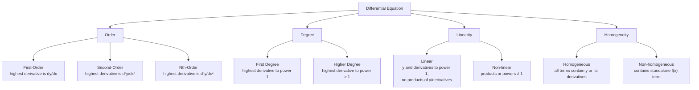
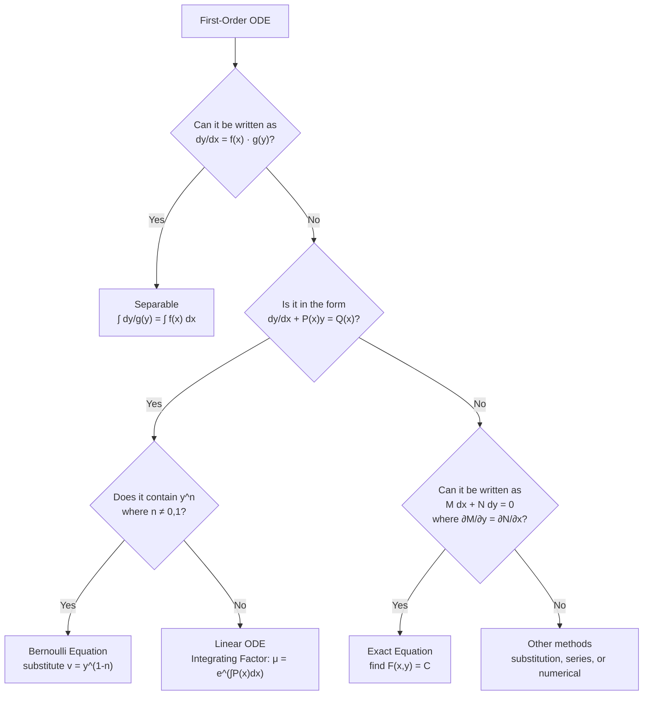

# Differential Equations

An equation that contains variables $x$ and $y$, with at least one derivative of $y$ with respect to $x$. First-order ODEs model rates of change in physical systems.

## Order and Degree

| Term | Definition |
|------|------------|
| **Order** | The highest derivative present in the equation |
| **Degree** | The power of the highest derivative |

For example, $\displaystyle \left(\frac{d^2y}{dx^2}\right)^3 - \frac{dy}{dx} = 3y$ is a **2nd order, 3rd degree** DE.

## Classification

## General and Particular Solutions

A **solution** to a differential equation is any function that satisfies the given equation.

- **General solution**: contains an arbitrary constant (e.g., $y = x^3 + C$)
- **Particular solution**: the constant is determined by an initial condition

## First-Order ODE Solution Methods

## Separable First-Order ODEs

A first-order DE is **separable** if it can be written in the form:

$$g(y)\frac{dy}{dx} = f(x) \quad \text{or equivalently} \quad \frac{dy}{dx} = \frac{f(x)}{g(y)}$$

### Solution Method

1. **Separate variables**: $g(y)\,dy = f(x)\,dx$
2. **Integrate both sides**: $\displaystyle \int g(y)\,dy = \int f(x)\,dx$
3. **Solve for $y$** (if possible) to get the **general solution**
4. **Apply initial condition** (if given) to find the **particular solution**

### Worked Examples

**Example 1** — $y\frac{dy}{dx} = 3x^2$

Separating and integrating: $\displaystyle \int y\,dy = \int 3x^2\,dx \Rightarrow \frac{y^2}{2} = x^3 + C$

General solution: $y^2 = 2x^3 + A$ (where $A = 2C$)

**Example 2** — $x\frac{dy}{dx} = 2y$

Separating and integrating: $\displaystyle \frac{1}{2}\ln y = \ln x + C$

General solution: $y = Ax^2$ (where $A = e^{2C}$)

**Example 3 (Particular Solution)** — $\displaystyle \frac{dy}{dx} = \frac{2y}{x^2 - 1}$, given $y(2) = 1$

General solution: $\displaystyle y = \frac{A(x-1)}{x+1}$

Substituting $y=1, x=2$: $A = 3$

Particular solution: $\displaystyle y = \frac{3(x-1)}{x+1}$

## Mixing Problems (First-Order Linear ODE)

General form:
$$
\frac{dA}{dt} = \text{rate in} - \text{rate out}
$$

**Constant volume**: $V(t) = V_0$ when inflow = outflow. Reduces to a separable/linear ODE.

**Variable volume**: $V(t) = V_0 + (r_{in} - r_{out})t$ when inflow ≠ outflow. Requires solving a first-order linear ODE using integrating factors.

## Applications
- [[Application of DE - Mixing Problems]]

## Related Courses
- [[FAD1014 - Mathematics II]]