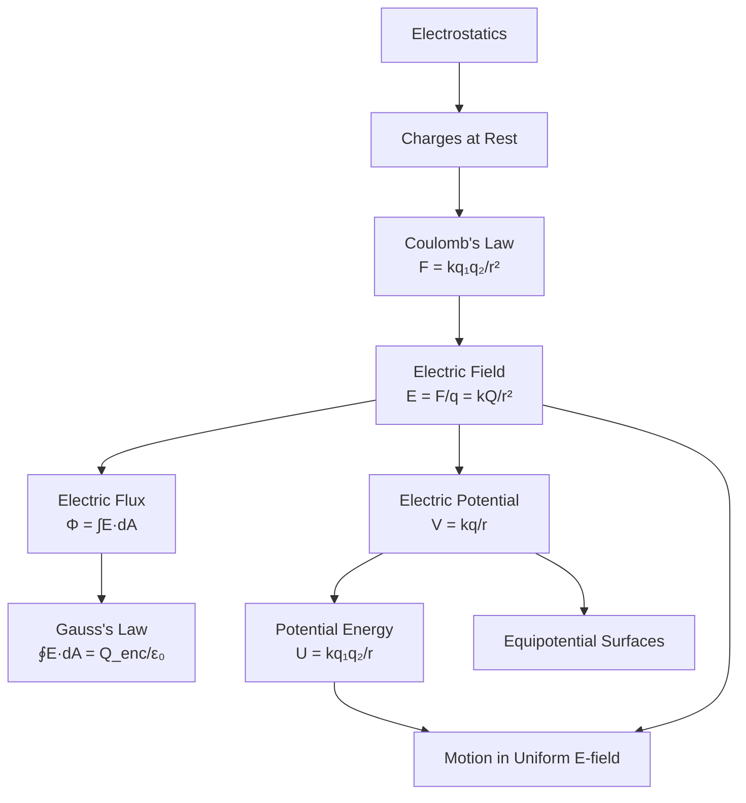
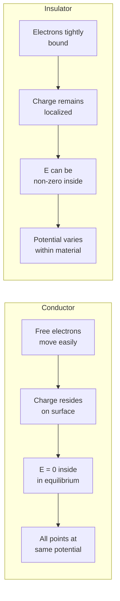
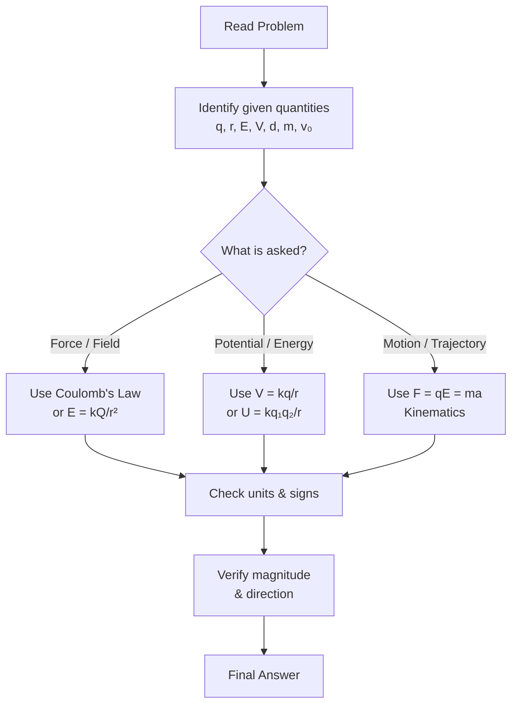

# Electrostatics

Study of stationary electric charges and the forces and fields they produce.

## Definition

Electrostatics is the branch of physics that deals with phenomena due to electric charges at rest. It forms the foundation for understanding electric circuits, electromagnetic waves, and atomic structure.

## Key Concepts

- Electric Charge — fundamental property (positive/negative), quantized in units of $e$
- Conservation of Charge — charge cannot be created or destroyed
- Coulomb's Law — force between point charges:
  $$F = k\frac{q_1 q_2}{r^2}$$
- Electric Field — force per unit charge:
  $$\vec{E} = \frac{\vec{F}}{q}$$
- Electric Field Lines — visualization, density represents field strength
- Electric Flux — $\Phi_E = \int \vec{E} \cdot d\vec{A}$
- Gauss's Law — relates flux to enclosed charge:
  $$\oint \vec{E} \cdot d\vec{A} = \frac{Q_{enc}}{\varepsilon_0}$$
- Electric Potential — potential energy per unit charge
- Equipotential Surfaces — surfaces of constant potential
- Motion in Uniform Electric Field — charged particle trajectories in parallel-plate fields
  - Perpendicular entry → parabolic path ($a_y = qE/m$)
  - Parallel entry → linear acceleration ($a = qE/m$)
  - Dynamic equilibrium → $qE = mg$

### Concept Map

## Charge Properties

### Quantization
Charge is quantized. Any electric charge $Q$ occurs as **integer multiples** of the elementary charge $e$:

$$Q = ne$$

where $n = 1, 2, 3, \dots$ and $e = 1.6 \times 10^{-19} \text{ C}$.

### Scalar Nature
Total charge $Q$ is a **scalar quantity**.

### SI Unit Definition
**1 Coulomb (C)** is defined as the total charge transferred by a current of one ampere in one second.

## Conductors and Insulators

## Coulomb's Law Details

### Coulomb's Constant
$$k = 8.9875 \times 10^{9} \text{ N m}^2 \text{ C}^{-2} \approx 9.0 \times 10^{9} \text{ N m}^2 \text{ C}^{-2}$$

Also expressed as:
$$k = \frac{1}{4\pi\varepsilon_0}$$

where $\varepsilon_0 = 8.85 \times 10^{-12} \text{ C}^2 \text{ N}^{-1} \text{ m}^{-2}$ is the **permittivity of free space**.

### Vector Nature
The electrostatic force is a **vector quantity** with unit **Newton (N)**.

### Newton's Third Law
For two point charges, the force on $q_1$ due to $q_2$ equals in magnitude the force on $q_2$ due to $q_1$:

$$F_{12} = F_{21} = k\frac{q_1 q_2}{r^2}$$

### Sign Conventions
- The **sign of charge can be ignored** when substituting into Coulomb's law to calculate **magnitude**:
  $$F = k\frac{|q_1||q_2|}{r^2}$$
- The **sign is important** for determining the **direction** of the force (attractive for opposite signs, repulsive for same signs).

### Point Charge Approximation
Charges can be treated as **point-like** when their physical size is negligible compared to the separation distance $r$ between them.

### Graphical Relationships
| Graph | Shape | Physical Meaning |
|-------|-------|------------------|
| $F$ vs $r$ | Inverse-square curve | Force falls off as $1/r^2$ |
| $F$ vs $1/r^2$ | Straight line through origin | Gradient $= kq_1q_2$ |

## Electric Field Strength

The electric field strength $E$ at a point is defined as the electric force per unit positive test charge:

$$E = \frac{F}{q_0}$$

- It is a **vector** quantity.
- Units: $\text{N C}^{-1}$ or $\text{V m}^{-1}$
- Derived from Coulomb's law for a point charge $Q$ at distance $r$:
  $$E = \frac{kQ}{r^2}$$
- The **direction** of $\vec{E}$ depends on the sign of the source charge: radially outward for positive, radially inward for negative.

### Direction of Force vs. Field

| Test Charge | Direction of $\vec{F}$ relative to $\vec{E}$ |
|-------------|------------------------------------------|
| Positive ($+q$) | Same direction as $\vec{E}$ |
| Negative ($-q$) | Opposite direction to $\vec{E}$ |

**Examples:**
- **Electron:** $F = Ee$, force opposite to field direction.
- **Proton:** $F = Ee$, force in same direction as field.
- **Alpha particle** ($^4_2\text{He}$): $F = 2Ee$, force in same direction as field.

## Electric Field Lines

**Michael Faraday** introduced electric field lines as a visualization tool with these properties:

1. The field vector $\vec{E}$ is **tangent** to the field line at every point.
2. The magnitude of $E$ is proportional to the **density** of lines (number per unit area perpendicular to the lines). Closer lines = stronger field.
3. Field lines **start on positive charges** and **end on negative charges**. The number of lines is proportional to the magnitude of the charge.
4. Field lines **never cross** because the electric field has a unique value at each point.

### Field Patterns

| Configuration | Field Pattern |
|--------------|---------------|
| Single positive charge | Radially outward |
| Single negative charge | Radially inward |
| Two equal opposite charges ($+q$, $-q$) | Curved lines from $+q$ to $-q$ |
| Two equal positive charges ($+q$, $+q$) | Bulging outward; **neutral point** exists where $\vec{E} = 0$ |
| Two opposite unequal charges ($+2q$, $-q$) | Lines proportional to charge magnitude |
| Opposite charged parallel plates | Uniform, parallel, perpendicular to plates (except near edges) |

### Neutral Point

A **neutral point** is a point (or region) in space where the **resultant electric field is zero**. For example, it lies along the perpendicular bisector between two equal like charges.

## Key Formulas

| Formula                                   | Description                    |
| ----------------------------------------- | ------------------------------ |
| $F = k\frac{q_1 q_2}{r^2}$                | Coulomb's Law                  |
| $E = \frac{F}{q_0}$                       | Electric field strength (definition) |
| $E = k\frac{q}{r^2}$                      | Electric field of point charge |
| $E = \frac{\sigma}{\varepsilon_0}$        | Infinite plane of charge       |
| $E = \frac{\lambda}{2\pi\varepsilon_0 r}$ | Infinite line of charge        |
| $V = k\frac{q}{r}$                        | Electric potential             |
| $U = k\frac{q_1 q_2}{r}$                  | Potential energy               |
| $a = \frac{qE}{m}$                        | Acceleration in uniform field  |
| $v_y = \frac{qEx}{mv_0}$                  | Vertical velocity (perpendicular entry) |
| $t = \frac{x}{v_0}$                       | Transit time between plates    |
| $\theta = \tan^{-1}\!\left(\frac{v_y}{v_x}\right)$ | Deflection angle        |
| $qE = mg$                                 | Electrostatic-weight equilibrium |

## Problem-Solving Flowchart

## Related Concepts

- [[Capacitors & Dielectrics]] — applications of electrostatics
- [[AC Circuits]] — time-varying electric fields
- [[Atomic Physics]] — electrostatics at atomic scale

## Course Links

- [[FAD1022 - Basic Physics II]] — main course page
- [[FAD1022 L1-L3 — Electrostatics]] — lecture source
- [[Nik Nur Atiqah]] — lecturer