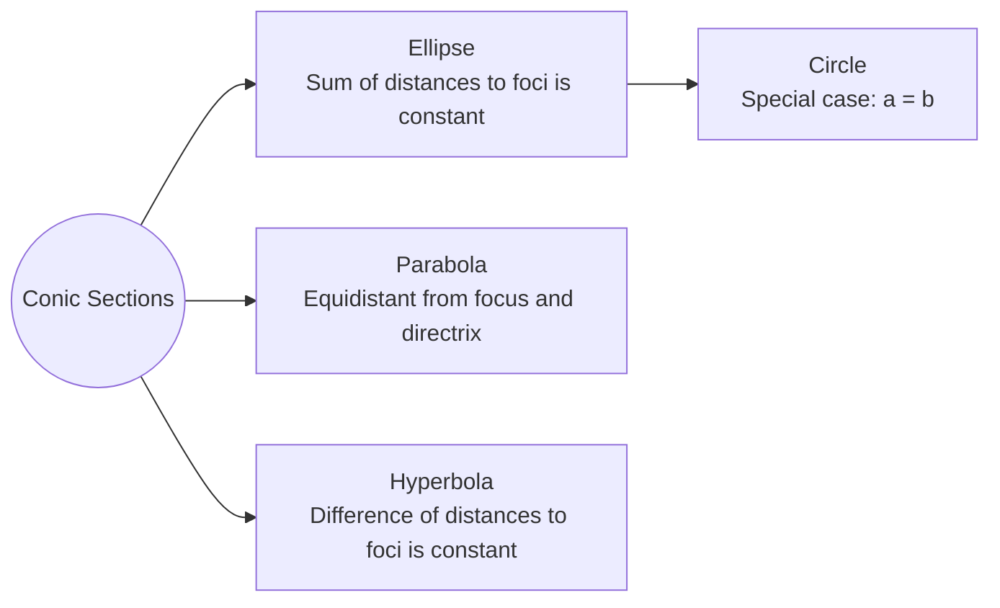
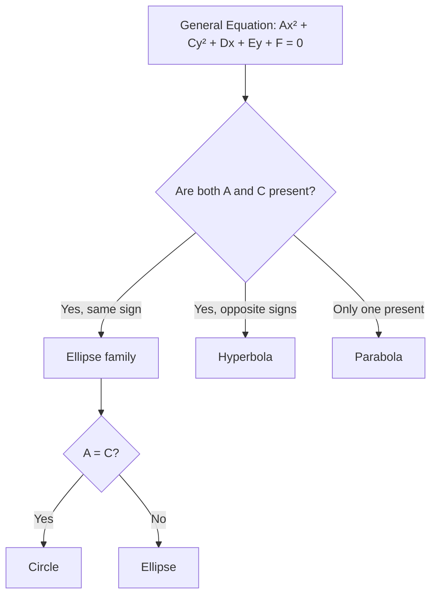

# Circle

A conic section defined as the set of points equidistant from a centre.

## Standard Equation

Centre $(h,k)$, radius $r$:
$$
(x - h)^2 + (y - k)^2 = r^2
$$

## General Equations

**Standard general form**:
$$
x^2 + y^2 + Ax + By + C = 0
$$
where centre is $\left(-\frac{A}{2}, -\frac{B}{2}\right)$ and radius $r = \sqrt{\frac{A^2}{4} + \frac{B^2}{4} - C}$.

**Lecture form** (coefficients tied to centre coordinates):
$$
x^2 - 2hx + y^2 - 2ky + C = 0 \quad ; \quad C = h^2 + k^2 - r^2
$$
where $(h,k)$ is the centre and:
$$
r = \sqrt{h^2 + k^2 - C}
$$

## Intersection with a Straight Line

Solve the line and circle equations simultaneously. The discriminant determines the geometric relationship:

| Discriminant | Roots | Relationship |
|---|---|---|
| $\Delta > 0$ | Two distinct real roots | Line cuts circle at two points |
| $\Delta = 0$ | One repeated real root | Line is tangent to the circle |
| $\Delta < 0$ | No real roots | Line does not intersect the circle |

## Tangent and Normal

**Tangent at a point**: perpendicular to the radius at the point of contact.

**Normal at a point**: perpendicular to the tangent (passes through the centre).

**Length of tangent from external point** $(m,n)$ to circle with centre $(h,k)$ and radius $r$:
$$
ST = \sqrt{(m-h)^2 + (n-k)^2 - r^2}
$$

**Equation from diameter endpoints** $(x_1,y_1)$ and $(x_2,y_2)$:
$$(x - x_1)(x - x_2) + (y - y_1)(y - y_2) = 0$$

## Conic Section Relationships

## Identifying Conic Sections

## Related
- [[Geometry - Parabola]]
- [[Geometry - Ellipse]]
- [[Geometry - Hyperbola]]
- [[FAD1014 - Mathematics II]]
