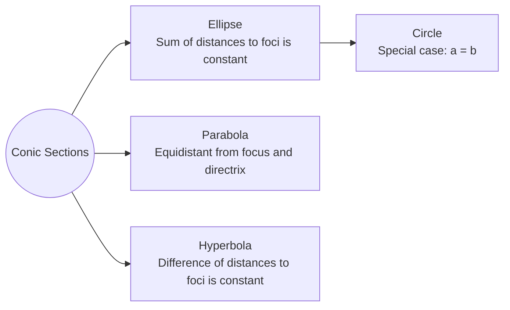
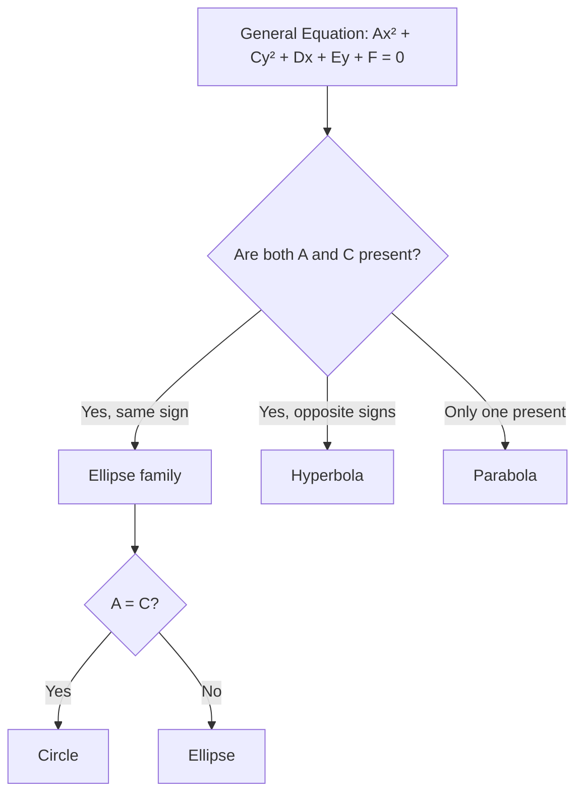

# Ellipse

A conic section defined as the set of all points $P(x,y)$ in a plane such that the **sum of distances to two fixed points (the foci)** is constant ($2a$).

## Derivation

Place the centre at the origin with foci at $(-c,0)$ and $(c,0)$. For any point $P(x,y)$ on the ellipse:

$$d_1 + d_2 = 2a$$
$$\sqrt{(x+c)^2 + y^2} + \sqrt{(x-c)^2 + y^2} = 2a$$

After isolating one radical, squaring twice, and simplifying:

$$\left(1 - \frac{c^2}{a^2}\right)x^2 + y^2 = a^2 - c^2$$

Dividing by $a^2 - c^2$:

$$\frac{x^2}{a^2} + \frac{y^2}{a^2 - c^2} = 1$$

Since $b^2 = a^2 - c^2$ (by the Pythagorean theorem):

$$\boxed{\frac{x^2}{a^2} + \frac{y^2}{b^2} = 1}$$

## Standard Equations (Centre at Origin)

### Horizontal Major Axis ($a > b$)
$$\frac{x^2}{a^2} + \frac{y^2}{b^2} = 1$$
- Vertices: $(\pm a, 0)$
- Foci: $(\pm c, 0)$ where $c^2 = a^2 - b^2$
- Major axis length: $2a$
- Minor axis length: $2b$

### Vertical Major Axis ($b > a$)
$$\frac{x^2}{a^2} + \frac{y^2}{b^2} = 1$$
- Vertices: $(0, \pm b)$
- Foci: $(0, \pm c)$ where $c^2 = b^2 - a^2$
- Major axis length: $2b$
- Minor axis length: $2a$

## Standard Equations (Centre at $(h,k)$)

**Horizontal major axis** ($a > b$):
$$
\frac{(x-h)^2}{a^2} + \frac{(y-k)^2}{b^2} = 1
$$
- Vertices: $(h \pm a, k)$
- Foci: $(h \pm c, k)$ where $c^2 = a^2 - b^2$

**Vertical major axis** ($b > a$):
$$
\frac{(x-h)^2}{a^2} + \frac{(y-k)^2}{b^2} = 1
$$
- Vertices: $(h, k \pm b)$
- Foci: $(h, k \pm c)$ where $c^2 = b^2 - a^2$

## Key Features
- Major axis length $2a$, minor axis length $2b$ (where $a$ is the semi-major axis)
- Co-vertices at distance $b$ from centre (endpoints of minor axis)

## Latus Rectum

The **latus rectum** is the chord through a focus perpendicular to the major axis.

For a horizontal ellipse, substituting $x = c$ gives $y = \pm \frac{b^2}{a}$.

**Length of latus rectum**:
$$\boxed{\frac{2b^2}{a}}$$

(For a vertical ellipse, the length is $\frac{2a^2}{b}$.)

## General Equation

Expanding the standard equation with centre $(h,k)$:

$$b^2(x-h)^2 + a^2(y-k)^2 = a^2b^2$$

$$b^2x^2 - 2hb^2x + a^2y^2 - 2ka^2y + K = 0$$

This takes the form:
$$\boxed{Ax^2 + By^2 + Cx + Dy + K = 0 \quad ; \quad A \neq B}$$

where $A$ and $B$ have the **same sign**.

To convert from general to standard form, **complete the square** separately for $x$ and $y$.

## Conic Section Relationships

## Identifying Conic Sections

## Related
- [[Geometry - Circle]] (a circle is an ellipse with $a = b$)
- [[Geometry - Parabola]]
- [[Geometry - Hyperbola]]
- [[FAD1014 - Mathematics II]]