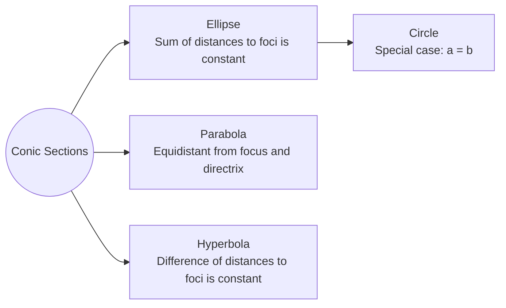
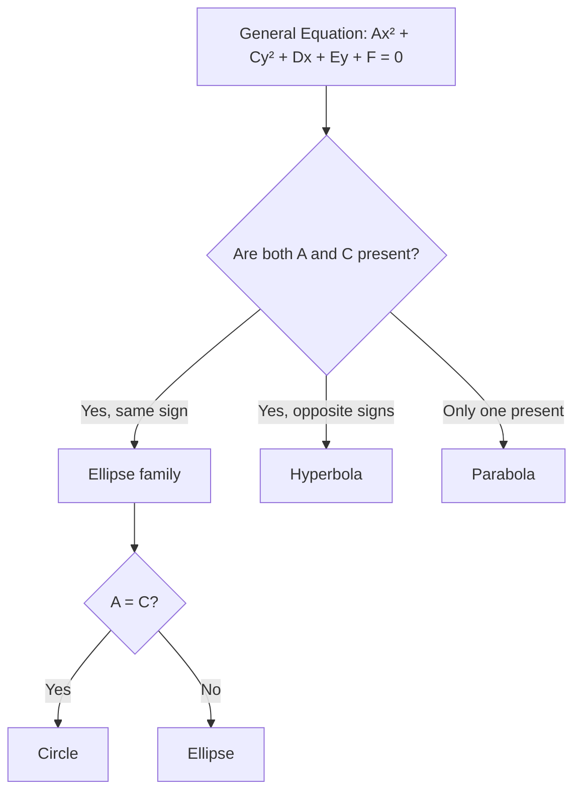

# Hyperbola

A conic section defined as the set of all points where the absolute difference of distances to two foci is constant.

## Standard Equations

| Orientation | Equation | Transverse axis |
|---|---|---|
| Horizontal | $\frac{(x-h)^2}{a^2} - \frac{(y-k)^2}{b^2} = 1$ | Horizontal ($y = k$) |
| Vertical | $\frac{(y-k)^2}{a^2} - \frac{(x-h)^2}{b^2} = 1$ | Vertical ($x = h$) |

## Key Relations

- $a^2 + b^2 = c^2$ (where $c$ is focal distance from centre)
- Vertices are $a$ units from centre along transverse axis
- Foci are $c$ units from centre along transverse axis

## Asymptotes

- Horizontal: $y - k = \pm \frac{b}{a}(x - h)$
- Vertical: $y - k = \pm \frac{a}{b}(x - h)$

## Conic Section Relationships

## Identifying Conic Sections

## Related Concepts
- [[Geometry - Circle]]
- [[Geometry - Parabola]]
- [[Geometry - Ellipse]]
- [[FAD1014 - Mathematics II]]