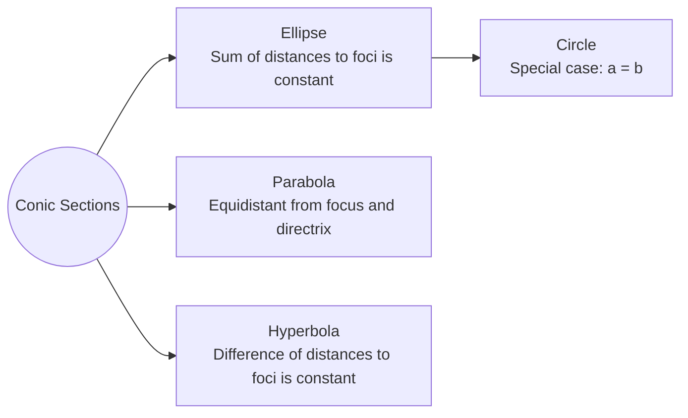
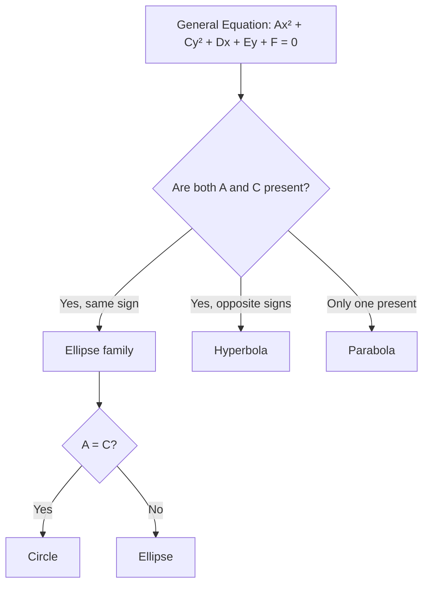

# Parabola

A conic section defined as the set of points equidistant from a focus and a directrix.

## Derivation

When vertex is at origin, focus $F(0,a)$, directrix $y = -a$:
$$\sqrt{x^2 + (y-a)^2} = y + a$$
$$x^2 + (y-a)^2 = (y+a)^2$$
$$x^2 = 4ay$$

When vertex is at $(h,k)$, focus $F(h, k+a)$, directrix $y = k-a$:
$$\sqrt{(x-h)^2 + (y-(k+a))^2} = |y-(k-a)|$$
$$(x-h)^2 = 4a(y-k)$$

## Important Terms

- **Focus**: fixed point, $a$ units from the vertex on the axis of the parabola
- **Directrix**: fixed line perpendicular to the axis, $a$ units from the vertex
- **Axis**: line through the focus and vertex, also perpendicular to the directrix
- **Vertex**: point of intersection between parabola and axis; midpoint of focus and directrix
- **Latus rectum**: chord through the focus parallel to the directrix

For $x^2 = 4ay$, the points on the parabola with $y = a$ are $(\pm 2a, a)$.
**Length of latus rectum**:
$$\sqrt{(2a - (-2a))^2 + (a-a)^2} = 4a$$

## Standard Equations

| Orientation | Equation | Vertex | Focus | Directrix | Shape |
|---|---|---|---|---|---|
| Vertical | $(x-h)^2 = 4a(y-k); a>0$ | $(h,k)$ | $(h, k+a)$ | $y = k-a$ | Opens upward |
| Vertical | $(x-h)^2 = 4a(y-k); a<0$ | $(h,k)$ | $(h, k-a)$ | $y = k+a$ | Opens downward |
| Horizontal | $(y-k)^2 = 4a(x-h); a>0$ | $(h,k)$ | $(h+a, k)$ | $x = h-a$ | Opens to the right |
| Horizontal | $(y-k)^2 = 4a(x-h); a<0$ | $(h,k)$ | $(h-a, k)$ | $x = h+a$ | Opens to the left |

## General Form

The general form can be transformed to standard form by **completing the square**.

## Conic Section Relationships

## Identifying Conic Sections

## Related
- [[Geometry - Circle]]
- [[Geometry - Ellipse]]
- [[Geometry - Hyperbola]]
- [[FAD1014 - Mathematics II]]
