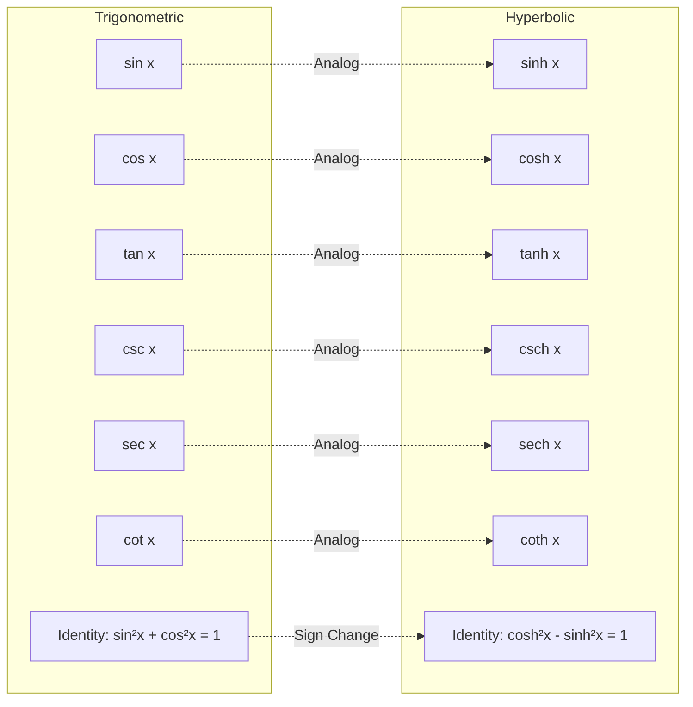
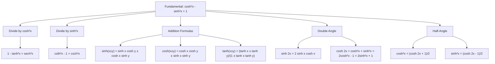

# Hyperbolic Functions

Hyperbolic functions are analogs of trigonometric functions defined using exponential functions. They have applications in physics, engineering, and calculus.

## Definitions

Hyperbolic functions arise from the even/odd decomposition of the exponential function $e^x$:

$$e^x = \underbrace{\frac{e^x + e^{-x}}{2}}_{\text{even}} + \underbrace{\frac{e^x - e^{-x}}{2}}_{\text{odd}}$$

### Hyperbolic Sine
$$\sinh x = \frac{e^x - e^{-x}}{2} = \frac{1}{2}e^x - \frac{1}{2}e^{-x}$$
- **Domain:** $(-\infty, \infty)$
- **Range:** $(-\infty, \infty)$
- **Parity:** Odd ($\sinh(-x) = -\sinh x$)

### Hyperbolic Cosine
$$\cosh x = \frac{e^x + e^{-x}}{2} = \frac{1}{2}e^x + \frac{1}{2}e^{-x}$$
- **Domain:** $(-\infty, \infty)$
- **Range:** $[1, \infty)$
- **Parity:** Even ($\cosh(-x) = \cosh x$)

### Hyperbolic Tangent
$$\tanh x = \frac{\sinh x}{\cosh x} = \frac{e^x - e^{-x}}{e^x + e^{-x}}$$
- **Domain:** $(-\infty, \infty)$
- **Range:** $(-1, 1)$
- **Parity:** Odd
- **Asymptotes:** Horizontal asymptotes $y = -1$ and $y = 1$

### Other Hyperbolic Functions
- $\coth x = \frac{\cosh x}{\sinh x} = \frac{e^x + e^{-x}}{e^x - e^{-x}}$
- $\operatorname{sech} x = \frac{1}{\cosh x} = \frac{2}{e^x + e^{-x}}$
- $\operatorname{cosech} x = \frac{1}{\sinh x} = \frac{2}{e^x - e^{-x}}$

> **Note:** $\operatorname{cosech} x$ is also commonly written as $\operatorname{csch} x$.

## Hyperbolic vs Trigonometric Comparison

## Fundamental Identity

$$\cosh^2 x - \sinh^2 x = 1$$

Compare to: $\cos^2 x + \sin^2 x = 1$

## Key Identities

- $\sinh(-x) = -\sinh x$ (odd function)
- $\cosh(-x) = \cosh x$ (even function)
- $\cosh x + \sinh x = e^x$
- $\cosh x - \sinh x = e^{-x}$
- $1 - \tanh^2 x = \text{sech}^2 x$
- $\coth^2 x - 1 = \text{csch}^2 x$

## Hyperbolic Identities Flowchart

## Addition Formulas

- $\sinh(x \pm y) = \sinh x \cosh y \pm \cosh x \sinh y$
- $\cosh(x \pm y) = \cosh x \cosh y \pm \sinh x \sinh y$
- $\tanh(x \pm y) = \frac{\tanh x \pm \tanh y}{1 \pm \tanh x \tanh y}$

## Double Angle Formulas

- $\sinh(2x) = 2\sinh x \cosh x$
- $\cosh(2x) = \cosh^2 x + \sinh^2 x = 2\cosh^2 x - 1 = 2\sinh^2 x + 1$

## Half-Angle (Power-Reduction) Formulas

- $\cosh^2 x = \dfrac{\cosh 2x + 1}{2}$
- $\sinh^2 x = \dfrac{\cosh 2x - 1}{2}$

## Derivatives

### Basic Derivatives

- $\frac{d}{dx}\sinh x = \cosh x$
- $\frac{d}{dx}\cosh x = \sinh x$
- $\frac{d}{dx}\tanh x = \text{sech}^2 x$
- $\frac{d}{dx}\coth x = -\text{csch}^2 x$
- $\frac{d}{dx}\text{sech } x = -\text{sech } x \tanh x$
- $\frac{d}{dx}\text{csch } x = -\text{csch } x \coth x$

### Chain Rule Forms

If $u$ is a differentiable function of $x$:

- $\frac{d}{dx}\sinh u = \cosh u \cdot \frac{du}{dx}$
- $\frac{d}{dx}\cosh u = \sinh u \cdot \frac{du}{dx}$
- $\frac{d}{dx}\tanh u = \text{sech}^2 u \cdot \frac{du}{dx}$
- $\frac{d}{dx}\coth u = -\text{csch}^2 u \cdot \frac{du}{dx}$
- $\frac{d}{dx}\text{sech } u = -\text{sech } u \tanh u \cdot \frac{du}{dx}$
- $\frac{d}{dx}\text{csch } u = -\text{csch } u \coth u \cdot \frac{du}{dx}$

## Integrals

### Basic Integrals

- $\int \sinh x \, dx = \cosh x + C$
- $\int \cosh x \, dx = \sinh x + C$
- $\int \text{sech}^2 x \, dx = \tanh x + C$
- $\int \text{csch}^2 x \, dx = -\coth x + C$
- $\int \text{sech } x \tanh x \, dx = -\text{sech } x + C$
- $\int \text{csch } x \coth x \, dx = -\text{csch } x + C$

### General Forms

- $\int \sinh u \, du = \cosh u + C$
- $\int \cosh u \, du = \sinh u + C$
- $\int \text{sech}^2 u \, du = \tanh u + C$
- $\int \text{csch}^2 u \, du = -\coth u + C$
- $\int \text{sech } u \tanh u \, du = -\text{sech } u + C$
- $\int \text{csch } u \coth u \, du = -\text{csch } u + C$

### Common Hyperbolic Integrals by Substitution

- $\int \tanh x \, dx = \ln(\cosh x) + C$  
  *(Let $u = \cosh x$, $du = \sinh x \, dx$)*

## Inverse Hyperbolic Functions

### Definitions and Domain/Range

Inverse hyperbolic functions are established by reflecting the graphs of hyperbolic functions (with appropriate restrictions) about the line $y = x$.

| Function | Definition | Domain | Range |
|----------|-----------|--------|-------|
| $\sinh^{-1} x$ | Inverse of $\sinh x$ | $(-\infty, \infty)$ | $(-\infty, \infty)$ |
| $\cosh^{-1} x$ | Inverse of $\cosh x$ (principal branch) | $(1, \infty)$ | $[0, \infty)$ |
| $\tanh^{-1} x$ | Inverse of $\tanh x$ | $(-1, 1)$ | $(-\infty, \infty)$ |
| $\coth^{-1} x$ | Inverse of $\coth x$ | $(-\infty, -1) \cup (1, \infty)$ | $(-\infty, 0) \cup (0, \infty)$ |
| $\text{sech}^{-1} x$ | Inverse of $\text{sech } x$ (principal branch) | $(0, 1)$ | $[0, \infty)$ |
| $\text{csch}^{-1} x$ | Inverse of $\text{csch } x$ | $(-\infty, 0) \cup (0, \infty)$ | $(-\infty, 0) \cup (0, \infty)$ |

> **Note**: For $\cosh^{-1} x$ and $\text{sech}^{-1} x$, the restriction $x \geq 0$ on the original function selects the principal branch, making the function invertible.

### Logarithmic Forms

All inverse hyperbolic functions can be expressed using natural logarithms:

$$\sinh^{-1} x = \ln(x + \sqrt{x^2 + 1})$$

$$\cosh^{-1} x = \ln(x + \sqrt{x^2 - 1})$$

$$\tanh^{-1} x = \frac{1}{2}\ln\left(\frac{1+x}{1-x}\right)$$

$$\coth^{-1} x = \frac{1}{2}\ln\left(\frac{x+1}{x-1}\right)$$

$$\text{sech}^{-1} x = \ln\left(\frac{1 + \sqrt{1-x^2}}{x}\right)$$

$$\text{csch}^{-1} x = \ln\left(\frac{1}{x} + \frac{\sqrt{1+x^2}}{|x|}\right)$$

### Derivatives

| $f(x)$ | $\frac{d}{dx}f(x)$ | Domain |
|--------|-------------------|--------|
| $\sinh^{-1} x$ | $\dfrac{1}{\sqrt{1+x^2}}$ | all $x$ |
| $\cosh^{-1} x$ | $\dfrac{1}{\sqrt{x^2-1}}$ | $x > 1$ |
| $\tanh^{-1} x$ | $\dfrac{1}{1-x^2}$ | $|x| < 1$ |
| $\coth^{-1} x$ | $\dfrac{1}{1-x^2}$ | $|x| > 1$ |
| $\text{sech}^{-1} x$ | $\dfrac{-1}{x\sqrt{1-x^2}}$ | $0 < x < 1$ |
| $\text{csch}^{-1} x$ | $\dfrac{-1}{|x|\sqrt{1+x^2}}$ | $x \neq 0$ |

> **Note**: $\frac{d}{dx}\tanh^{-1} x$ and $\frac{d}{dx}\coth^{-1} x$ have the same formula but apply on different domains.

### Integrals Leading to Inverse Hyperbolic Functions

The following standard forms produce inverse hyperbolic results. They are often reached after a preliminary $u$-substitution.

- **Inverse sine hyperbolic form**:
  $$\int \frac{dx}{\sqrt{a^2+x^2}} = \sinh^{-1}\left(\frac{x}{a}\right) + C = \ln\left|x + \sqrt{a^2+x^2}\right| + D$$

- **Inverse cosine hyperbolic form**:
  $$\int \frac{dx}{\sqrt{x^2-a^2}} = \cosh^{-1}\left(\frac{x}{a}\right) + C$$

- **Inverse tangent/cotangent hyperbolic form** (piecewise):
  $$\int \frac{dx}{a^2-x^2} =
  \begin{cases}
  \displaystyle\frac{1}{a}\tanh^{-1}\left(\frac{x}{a}\right) + C, & |x| < a \\
  \displaystyle\frac{1}{a}\coth^{-1}\left(\frac{x}{a}\right) + C, & |x| > a
  \end{cases}$$

- **Inverse cosecant hyperbolic form**:
  $$\int \frac{dx}{x\sqrt{a^2+x^2}} = -\frac{1}{a}\operatorname{csch}^{-1}\left(\frac{x}{a}\right) + C$$

- **Inverse secant hyperbolic form**:
  $$\int \frac{dx}{x\sqrt{a^2-x^2}} = -\frac{1}{a}\operatorname{sech}^{-1}\left(\frac{x}{a}\right) + C$$

## Integration Techniques

### $u$-Substitution with Hyperbolic Functions
When one factor is the derivative of another hyperbolic term, substitute:
- $u = \sinh x$ when $\cosh x \, dx$ is present
- $u = \cosh x$ when $\sinh x \, dx$ is present
- $u = \tanh x$ when $\operatorname{sech}^2 x \, dx$ is present
- $u = \coth x$ when $\operatorname{csch}^2 x \, dx$ is present

### Trigonometric vs. Hyperbolic Substitution
For radical forms, either substitution works, but hyperbolic substitution often yields the inverse hyperbolic form directly:

| Form | Trig Substitution | Hyperbolic Substitution |
|------|-------------------|------------------------|
| $\sqrt{a^2+x^2}$ | $x = a\tan\theta$ | $x = a\sinh u$ |
| $\sqrt{x^2-a^2}$ | $x = a\sec\theta$ | $x = a\cosh u$ |

**Example** — $\displaystyle\int \frac{dx}{\sqrt{a^2+x^2}}$
- With $x = a\sinh u$: $\displaystyle\int du = u + C = \sinh^{-1}\!\left(\frac{x}{a}\right) + C$
- With $x = a\tan\theta$: reduces to $\ln\bigl|x + \sqrt{a^2+x^2}\bigr| + D$

Both answers are equivalent because $\sinh^{-1}(x/a) = \ln\bigl|x + \sqrt{a^2+x^2}\bigr| - \ln a$.

## Related

- [[FAC1001 - Advanced Mathematics II]] — Science stream course
- [[FAC1004 - Advanced Mathematics II (Computing)]] — Computing stream course
- [[FAC1004 L17 — Hyperbolic Functions]] — introduction lecture
- [[FAC1004 L18 — Hyperbolic Functions (Derivatives & Integrals)]] — derivatives lecture
- [[FAC1004 L19-L20 — Inverse Hyperbolic Functions]] — inverse functions lecture
- [[FAC1004 L21-L22 — Integrals Involving Hyperbolic Functions]] — integrals lecture
- [[FAC1004 Tutorial 8 — Hyperbolic Functions]] — practice problems
- [[FAC1004 Tutorial 9 — Inverse Hyperbolic Functions]] — inverse functions practice
- [[FAC1004 Tutorial 10 — Integration of Hyperbolic Functions]] — integration practice
