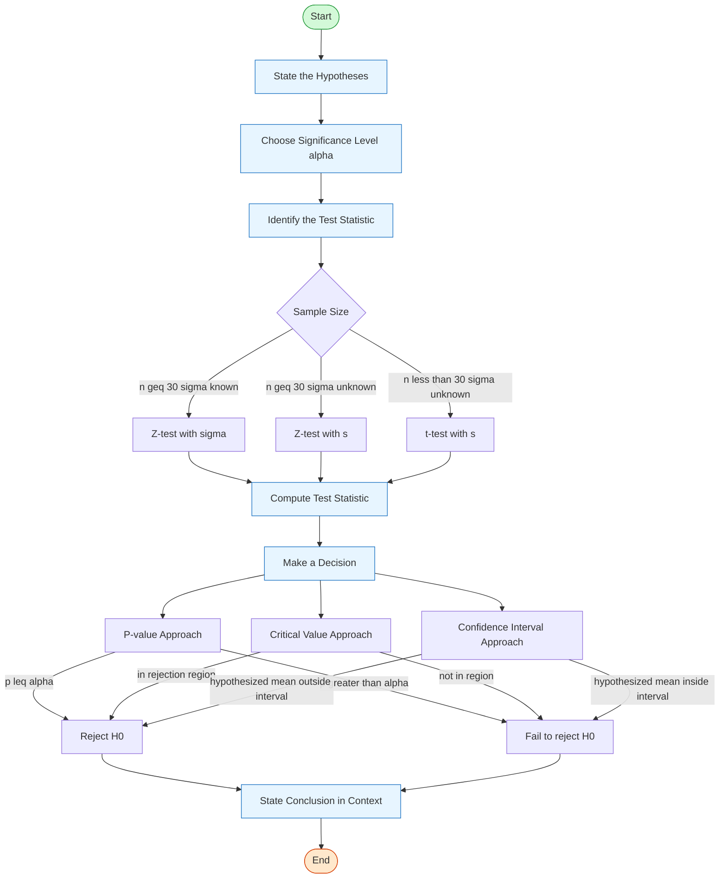

# Hypothesis Testing

Statistical method for making decisions about population parameters based on sample data. One of the two main branches of **statistical inference** — the other being [[FAD1015 L21-L22 — Estimation of Population Mean|estimation]].

## Context: Types of Statistical Inference

Statistical inference uses sample statistics to draw conclusions about population parameters. There are two approaches:

1. **Estimation** — estimating the value of a population parameter (e.g., constructing a confidence interval for $\mu$)
   - *Example*: A consumer wants to estimate the average price of similar homes in her city before putting her home on the market.
2. **Hypothesis Testing** — making a decision about a population parameter
   - *Example*: A manufacturer wants to know if a new type of steel is more resistant to high temperatures than an old type.

## Framework

### The Two Hypotheses

**Null Hypothesis ($H_0$)**
- Statement of no effect or no difference
- Assumed true until evidence contradicts
- Always contains equality (=, ≤, or ≥)

**Alternative Hypothesis ($H_1$ or $H_a$)**
- Research hypothesis
- What we want to find evidence for
- Can be two-tailed (≠) or one-tailed (< or >)

### Types of Tests

| Alternative | Type | Rejection Region |
|-------------|------|------------------|
| $H_1: \mu \neq \mu_0$ | Two-tailed | Both tails |
| $H_1: \mu > \mu_0$ | Right-tailed | Right tail |
| $H_1: \mu < \mu_0$ | Left-tailed | Left tail |

### Three Approaches

The lecture (L23–L24) presents three equivalent methods for reaching a decision:

1. **Traditional method** — compare the test statistic to a critical value (rejection region)
2. **Confidence Interval method** — reject $H_0$ if $\mu_0$ lies outside the confidence interval for $\mu$
3. **P-value method** — reject $H_0$ if the observed P-value $\leq \alpha$

## Test Procedure



### Step 1: State Hypotheses
Clearly specify $H_0$ and $H_1$ with parameter value.

### Step 2: Choose Significance Level ($\alpha$)
- Common values: 0.10, 0.05, 0.01
- Probability of Type I error

### Step 3: Identify the Test Statistic

The choice depends on sample size and whether $\sigma$ is known.

**Large sample ($n \geq 30$):**
- $\sigma$ **known**: $Z = \dfrac{\bar{x} - \mu_0}{\sigma/\sqrt{n}} \sim N(0,1)$
- $\sigma$ **unknown**: $Z = \dfrac{\bar{x} - \mu_0}{s/\sqrt{n}} \sim N(0,1)$

**Small sample ($n < 30$) with $\sigma$ unknown:**
- $t = \dfrac{\bar{x} - \mu_0}{s/\sqrt{n}}, \quad df = n-1$

### Step 4: Identify the Rejection Region

Determine the critical value(s) that define the boundary of the rejection region based on $\alpha$ and the tail(s) of the test.

### Step 5: Make a Decision

**Traditional (Critical-Value) Approach:**
- Test statistic falls in the rejection region → **Reject $H_0$**
- Otherwise → **Do not reject $H_0$**

**P-value Approach:**
- P-value $\leq \alpha$ → **Reject $H_0$**
- P-value $> \alpha$ → **Do not reject $H_0$**

**Confidence Interval Approach:**
- Construct a $(1-\alpha)$ confidence interval for $\mu$
- If $\mu_0$ lies **outside** the interval → **Reject $H_0$**
- If $\mu_0$ lies **inside** the interval → **Do not reject $H_0$**

### Step 6: Conclusion
Interpret the decision in the context of the original problem. Use phrasing such as:
- "At the $\alpha$ significance level, there is (not) sufficient evidence to conclude that …"
- "We are $(1-\alpha)100\%$ confident that the mean differs from $\mu_0$"

## Types of Errors

> *Not explicitly covered in L23–L24; see [[FAD1015 L25-L26 — Hypothesis Testing in R]] for extended treatment.*

| Decision | $H_0$ True | $H_0$ False |
|----------|------------|-------------|
| Reject $H_0$ | Type I Error ($\alpha$) | Correct (Power = $1-\beta$) |
| Fail to reject $H_0$ | Correct ($1-\alpha$) | Type II Error ($\beta$) |

- **Type I Error**: False positive (rejecting true null)
- **Type II Error**: False negative (failing to reject false null)

**Trade-off**: Decreasing $\alpha$ increases $\beta$ for fixed sample size.

## Interpreting Results

**Correct Interpretations:**
- "At the 5% significance level, there is sufficient evidence to conclude that..."
- "We are 95% confident that the mean differs from $\mu_0$"

**Incorrect Interpretations:**
- "The probability that $H_0$ is true is 5%"
- "There is a 95% probability that $\mu$ is in the confidence interval"

## R Implementation

This section reflects the practical R workflow taught in [[FAD1015 L25-L26 — Hypothesis Testing in R]].

### One-Sample Z-Test in R

Use when the **population standard deviation is known** or the **sample size is large** ($n > 30$).

**Syntax (BSDA package):**
```r
library(BSDA)
z.test(x, mu = mu0, sigma.x = population_sd)
```

**Parameters:**
- `x`: numeric vector of sample data
- `mu`: hypothesized mean under $H_0$
- `sigma.x`: known population standard deviation

**Manual computation with summary statistics:**
```r
z_score <- (sample_mean - population_mean) / (population_std / sqrt(n))
p_value <- 2 * (1 - pnorm(abs(z_score)))   # two-tailed
```

### One-Sample t-Test in R

Use when the **population standard deviation is unknown**.

**Syntax:**
```r
t.test(x, mu = mu0)
```

**Parameters:**
- `x`: numeric vector of data
- `mu`: true value of the mean under $H_0$
- `alternative`: `"two.sided"` (default), `"less"`, or `"greater"`
- `conf.level`: confidence level (default 0.95)

**Manual computation with summary statistics:**
```r
t_score <- (x_bar - mu_0) / (s / sqrt(n))
df      <- n - 1
p_value <- 2 * (1 - pt(abs(t_score), df))   # two-tailed
```

### Interpreting R Test Output

Typical R output for `t.test()` or `z.test()` includes:

| Field | Meaning |
|-------|---------|
| **t / z** | The test statistic value. |
| **df** | Degrees of freedom ($n - 1$ for t-test). |
| **p-value** | Probability of observing the sample result if $H_0$ is true. |
| **95% CI** | Confidence interval for the true population mean. |
| **sample estimates** | Sample mean ($\bar{x}$). |

**Decision rule:**
```r
if (p_value < alpha) {
  "Reject H0"
} else {
  "Fail to reject H0"
}
```

### Normality Testing in R

Verifying normality is critical before applying parametric tests.

**Shapiro-Wilk test:**
```r
shapiro.test(x)
```
- If $p < 0.05$, reject normality (data is not normally distributed).
- Valid for sample sizes between 3 and 5,000.

**Graphical checks:**
```r
hist(x)          # Histogram
qqnorm(x)        # QQ plot
qqline(x)        # Reference line for QQ plot
```

## Related Sources

- [[FAD1015 L21-L22 — Estimation of Population Mean]] — statistical inference context (estimation vs hypothesis testing)
- [[FAD1015 L23-L24 — Hypothesis Testing About the Mean]]
- [[FAD1015 L25-L26 — Hypothesis Testing in R]]
- [[FAD1015 Tutorial 11 — Hypothesis Testing About the Mean]]
- [[FAD1015 Tutorial 12 — Hypothesis Testing in R]]

## Related Courses

- [[FAD1015 - Mathematics III]]
