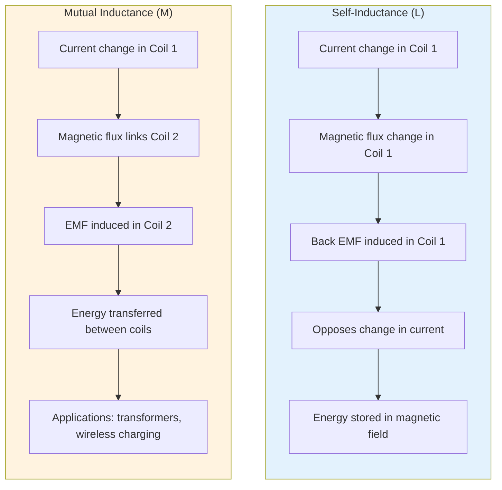
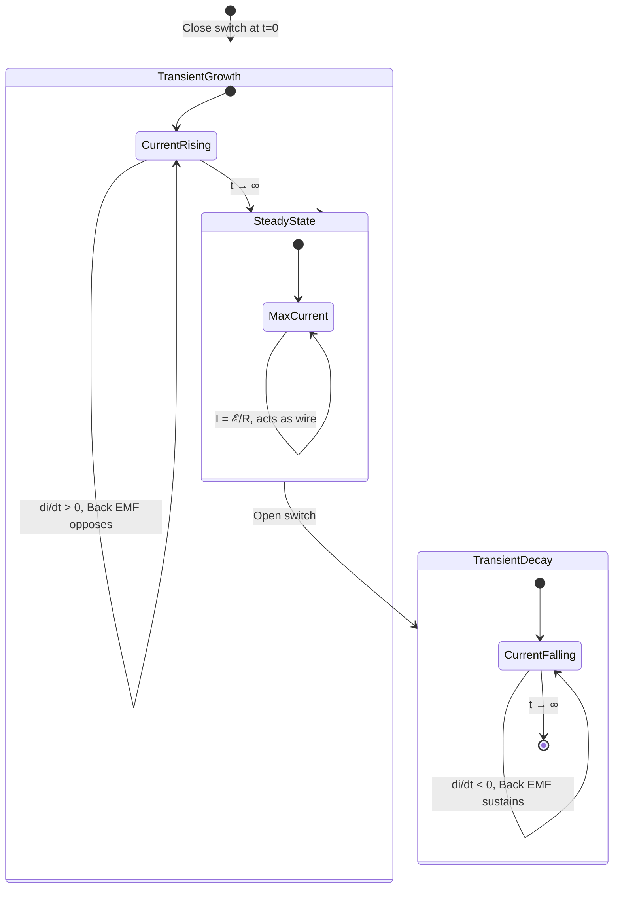

# Inductance & Transformers

Electromagnetic induction, self and mutual inductance, and transformer operation.

## Definition

Inductance is the property of an electrical conductor by which a change in current induces an electromotive force (EMF). An inductor (also called a **choke**) consists of a conductor wound into a coil. When current flows, energy is stored temporarily in the coil's magnetic field; when current changes, the induced voltage opposes that change (Faraday's law). Typical inductance values range from $1\ \mu\text{H}$ to $1\ \text{H}$. Transformers use mutual inductance to transfer electrical energy between circuits via a magnetic field, typically using a laminated soft-iron core to maximize flux linkage and minimize eddy-current losses.

## Magnetic Flux

Magnetic flux $\Phi_B$ through a loop of area $A$ in a magnetic field $B$:

$$\Phi_B = BA\cos\theta = B_\perp A$$

- $\theta$ = angle between $\vec{B}$ and the normal to the loop area
- **Unit:** weber (Wb)
- Only the perpendicular component of area contributes to flux
- $\theta = 0^\circ$ → $\Phi_B$ is maximum; $\theta = 90^\circ$ → $\Phi_B = 0$

## Key Concepts

- Faraday's Law — induced EMF proportional to rate of change of flux:
  $$\mathcal{E} = -\frac{d\Phi_B}{dt}$$
  - **Discrete form (lecture):** $\mathcal{E} = N\left(\frac{\Delta\Phi_B}{\Delta t}\right)$ where $N$ = number of loops
  - Magnitude from Faraday's Law; direction from Lenz's Law
- Lenz's Law — induced current opposes the change causing it
  - Two fields to consider: external changing field and field produced by induced current
  - **Increasing flux:** induced field points in opposite direction to oppose the increase
  - **Decreasing flux:** induced field points in same direction to oppose the decrease
- Self-Inductance — $L = \frac{N\Phi}{I}$, unit: Henry (H)
- Back EMF — the self-induced emf $\mathcal{E} = -L\frac{dI}{dt}$ opposes changes in current
  - When $I$ is **increasing**, induced emf is in the **opposite** direction to $I$
  - When $I$ is **decreasing**, induced emf is in the **same** direction as $I$
- Inductor Energy Storage — $U = \frac{1}{2}LI^2$
- Mutual Inductance — $M = \frac{N_2\Phi_{21}}{I_1} = \frac{N_1\Phi_{12}}{I_2}$; for coaxial solenoids $M = \frac{\mu_0 N_p N_s A}{l}$
- Mutually Induced EMF — $\mathcal{E}_1 = M\frac{dI_2}{dt}$ and $\mathcal{E}_2 = M\frac{dI_1}{dt}$
- Transformers — AC voltage transformation using a soft-iron core; primary ($N_p$) driven by AC source, secondary ($N_s$) has induced voltage
- Turns Ratio — $\frac{V_s}{V_p} = \frac{N_s}{N_p}$; rate of change of flux is same for both coils
- Step-Up Transformer — $N_s > N_p$ → increases voltage, decreases current
- Step-Down Transformer — $N_s < N_p$ → decreases voltage, increases current
- Power Conservation — $V_p I_p = V_s I_s$ (ideal); real transformers have losses
- Transformer Losses — copper loss ($I^2R$), hysteresis loss, flux leakage, eddy currents
- Power Transmission — high-voltage transmission reduces $I^2R$ losses; voltage stepped up at source and stepped down at destination
- RL Circuits — transient current growth/decay
- Time Constant — $\tau = \frac{L}{R}$

### Transformer Operation

```mermaid
flowchart LR
    A[AC Source] -->|V_p, I_p| P[Primary Coil<br/>(N_p turns)]
    P -->|Magnetic flux Φ| C[Soft-Iron Core]
    C -->|Induced flux Φ| S[Secondary Coil<br/>(N_s turns)]
    S -->|V_s, I_s| L[Load]

    C -.->|N_s > N_p| U[Step-Up<br/>V_s ↑ I_s ↓]
    C -.->|N_s < N_p| D[Step-Down<br/>V_s ↓ I_s ↑]

    style U fill:#e1f5e1
    style D fill:#ffe1e1
```

## Key Formulas

| Formula | Description |
|---------|-------------|
|$\mathcal{E} = -L\frac{dI}{dt}$ | Self-induced EMF (back emf) |
|$L = \mu_0 n^2 A l = \frac{\mu_0 N^2 A}{\ell}$ | Solenoid inductance |
|$U = \frac{1}{2}LI^2$ | Stored energy in inductor |
|$\mu_0 = 1.2567 \times 10^{-6}\ \text{H/m}$ | Permeability of free space |
|$M = \frac{N_2\Phi_{21}}{I_1} = \frac{N_1\Phi_{12}}{I_2}$ | Mutual inductance |
|$\mathcal{E}_2 = -M\frac{dI_1}{dt}$ | Mutually induced EMF |
|$M = \frac{\mu_0 N_p N_s A}{l}$ | Mutual inductance (coaxial solenoids) |
|$\frac{V_s}{V_p} = \frac{N_s}{N_p}$ | Transformer voltage ratio |
|$\frac{I_s}{I_p} = \frac{N_p}{N_s}$ | Transformer current ratio (ideal) |
|$P_{\text{loss}} = I^2R$ | Power loss in transmission |
|$\tau = \frac{L}{R}$ | RL time constant |
|$i(t) = \frac{\mathcal{E}}{R}(1 - e^{-t/\tau})$ | RL current growth |

## Capacitor–Inductor Analogy

Both components depend on geometric factors and store energy, but with complementary roles:

| Aspect | Capacitor | Inductor |
|--------|-----------|----------|
| Geometry | $C = \frac{\varepsilon_0 A}{d}$ | $L = \frac{\mu_0 N^2 A}{\ell}$ |
| Energy stored | $U = \frac{1}{2} C V^2$ | $U = \frac{1}{2} L I^2$ |
| Defining relation | $C = \frac{Q}{V}$ | $L = \frac{N\Phi}{I}$ |

## Self Induction vs Mutual Induction



| Aspect | Self Induction ($L$) | Mutual Induction ($M$) |
|---|---|---|
| Definition | Opposes change in current in the same coil | Induces EMF in one coil due to current change in another |
| Dependence | Geometry of coil and core material | Geometry of both coils, distance, and orientation |
| Energy | Stores energy in magnetic field | Transfers energy between coils via magnetic field |
| Cause | Change in current in same coil | Change in current in neighboring coil |
| Interaction | Single coil | Two or more coils |
| Applications | Inductors, chokes, tuning circuits | Transformers, wireless charging, inductive coupling |

## Related Concepts

- [[Magnetism]] — magnetic field foundation
- [[AC Circuits]] — inductive reactance, transformers in AC
- [[Capacitors & Dielectrics]] — complementary energy storage

## Quick Quiz 2026 — Key Insights

From [[FAD1022 Quick Quiz 2026 — Inductance & Transformers]]:

### Mutual Inductance Independence
- **Mutual inductance $M$ depends only on geometry** (turns, area, length, separation, core material) and **not on the current** flowing through either coil. Changing current changes the induced emf, but $M$ itself is invariant.

### Reciprocal EMF Relationship
- For two coupled coils, the ratio of induced emf to current change is reciprocal:
  $$\frac{\varepsilon_2}{\Delta i_1} = \frac{\varepsilon_1}{\Delta i_2}$$
  This follows directly from $M_{12} = M_{21} = M$.

### Inductor Transient Behaviour
- In an RL circuit immediately after closing a switch, an inductor **opposes current flow** via back emf ($\varepsilon = -L\,dI/dt$).
- At steady state ($t \to \infty$), $dI/dt \to 0$ and the inductor behaves like a **connecting wire** (short circuit) with only its internal wire resistance remaining.



### Maximum Self-Induced EMF
- $|\varepsilon| = L|dI/dt|$; the magnitude depends on the **rate of change** of current, not the current magnitude itself. Rapidly increasing current produces the maximum emf.

### Transformer Losses Detail
- **Iron Loss (Core Loss)** = Hysteresis loss + Eddy current loss, both occurring in the **magnetic core**.
- **Copper Loss** = $I^2R$ heating in the primary and secondary windings — distinct from core loss.
- Transformer efficiency:
  $$\eta = \frac{P_{\text{out}}}{P_{\text{in}}} \quad \Rightarrow \quad P_{\text{loss}} = P_{\text{in}} - P_{\text{out}}$$

## Course Links

- [[FAD1022 - Basic Physics II]] — main course page
- [[FAD1022 L31-L33 — Inductance & Transformers]] — lecture source
- [[Revision Faraday and Lenz Law]] — revision lecture (Faraday's Law, Lenz's Law, magnetic flux)
- [[FAD1022 Quick Quiz 2026 — Inductance & Transformers]] — quiz source
- [[Amirul Hakimi Bin Baderus (AHB)]] — lecturer