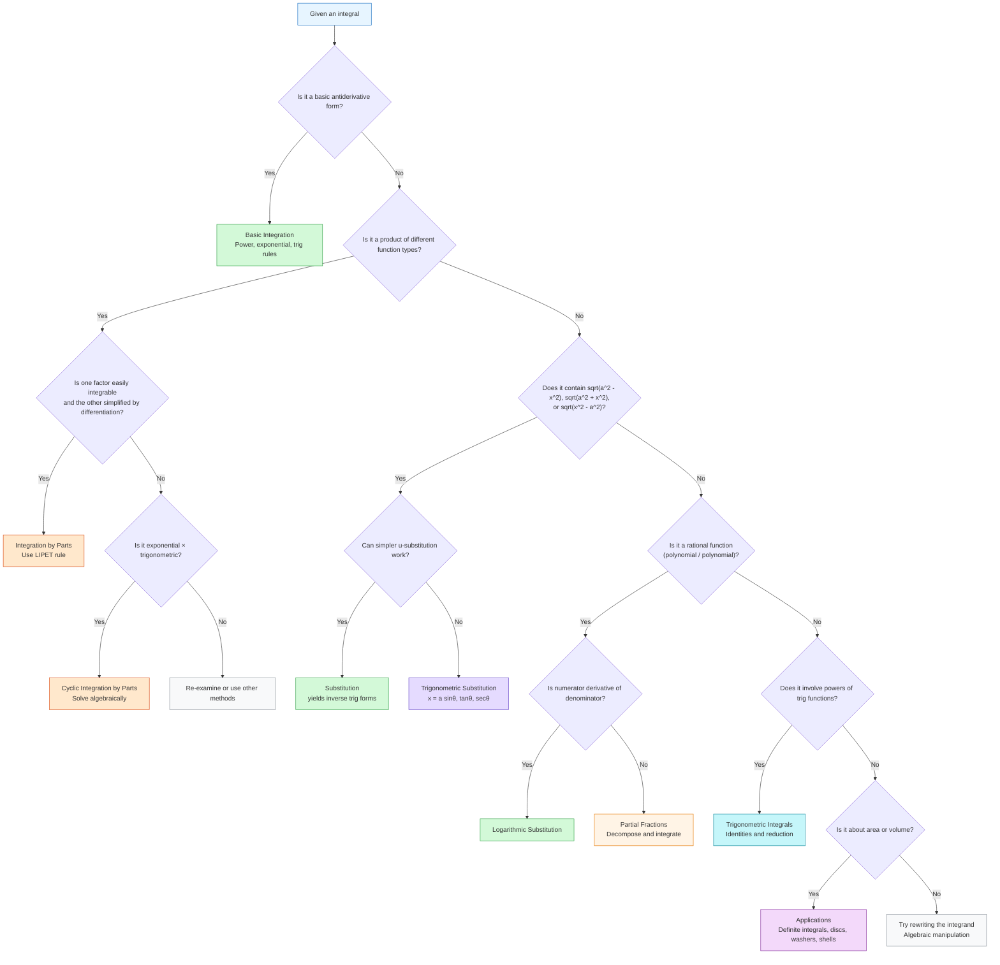
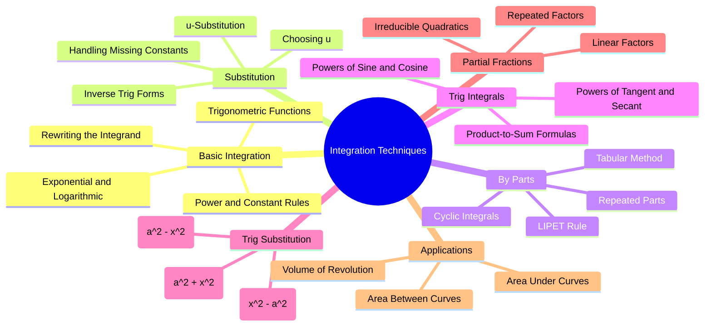

# Integration Techniques

Comprehensive overview of techniques for evaluating integrals in calculus.

## Overview

Integration is the reverse process of differentiation. Various techniques are needed because not all integrals can be evaluated by simple antiderivative rules.

### Decision Tree: Which Technique to Use?

### Integration Concepts Mindmap

## 1. Basic Integration

### Fundamental Rules

Reversing differentiation rules gives the basic integration formulas.

**Constant Rule:**
$$\int a\,dx = ax + C \qquad (a \text{ constant})$$

**Power Rule** (where $n \neq -1$):
$$\int x^n\,dx = \frac{x^{n+1}}{n+1} + C$$
*(Add 1 to the exponent and divide by that number.)*

**Special Case — $x^{-1}$:**
The power rule does not apply when $n = -1$:
$$\int x^{-1}\,dx = \int \frac{1}{x}\,dx = \ln|x| + C$$

The absolute value is essential because $\ln x$ is undefined for negative $x$.

### Properties of Indefinite Integrals

- **Constant Multiple:** If $k$ is a constant,
  $$\int k \cdot f(x)\,dx = k\int f(x)\,dx$$

- **Sum/Difference:**
  $$\int \bigl[f(x) \pm g(x)\bigr]\,dx = \int f(x)\,dx \pm \int g(x)\,dx$$

### Standard Integral Formulas

#### Exponential Functions
$$\int e^x\,dx = e^x + C$$

$$\int e^{kx}\,dx = \frac{e^{kx}}{k} + C \qquad (k \neq 0)$$

$$\int a^x\,dx = \frac{a^x}{\ln a} + C$$

$$\int a^{kx}\,dx = \frac{a^{kx}}{k(\ln a)} + C \qquad (k \neq 0)$$

**General forms:**
$$\int f'(x)e^{f(x)}\,dx = e^{f(x)} + C$$

#### Logarithmic Form
$$\int \frac{f'(x)}{f(x)}\,dx = \ln\bigl|f(x)\bigr| + C$$

#### Trigonometric Functions
$$\int \sin x\,dx = -\cos x + C$$

$$\int \cos x\,dx = \sin x + C$$

$$\int \tan x\,dx = \ln|\sec x| + C$$

$$\int \sec x\,dx = \ln|\sec x + \tan x| + C$$

$$\int \cot x\,dx = \ln|\sin x| + C$$

$$\int \sec^2 x\,dx = \tan x + C$$

$$\int \csc x\,dx = \ln|\csc x - \cot x| + C$$

$$\int \csc^2 x\,dx = -\cot x + C$$

$$\int \sec x \tan x\,dx = \sec x + C$$

$$\int \csc x \cot x\,dx = -\csc x + C$$

> You can always check your answers by taking the derivative!

### Rewriting the Integrand

Before integrating, it is often necessary to rewrite the integrand into a standard form using algebra:
- Split fractions (divide each term by the denominator)
- Convert radicals to fractional exponents ($\sqrt{x} = x^{1/2}$)
- Move variables from denominator to numerator using negative exponents ($\frac{1}{x^n} = x^{-n}$)
- Perform polynomial long division when the degree of the numerator is greater than or equal to the degree of the denominator

**Example:**
$$\int \frac{x^2+1}{\sqrt{x}}\,dx = \int \left(x^{3/2} + x^{-1/2}\right)dx = \frac{2}{5}x^{5/2} + 2x^{1/2} + C$$

---

## 2. Integration by Substitution (u-substitution)

Method of integration related to chain rule differentiation. It depends on the idea of a differential: if $u = f(x)$, then $du = f'(x)\,dx$.

### The Formula

If $u = g(x)$, then $du = g'(x)\,dx$ and:
$$\int f[g(x)]g'(x)\,dx = \int f(u)\,du = F(u) + C = F(g(x)) + C$$

Alternative form used in the lecture:
$$\int f\,dx = \int \left(\frac{f}{du/dx}\right) du$$

### Choosing $u$

For the types of problems in this course, choose $u$ to be one of the following:
1. **The quantity under a root or raised to a power**
2. **The quantity in the denominator**
3. **The exponent on $e$**

Some integrands may need to be rearranged algebraically to fit one of these cases.

### Handling Missing Constant Factors

When $du$ contains a constant multiple of what appears in the integrand (e.g., $du = 3x^2\,dx$ but you only have $x^2\,dx$), multiply inside the integral by that constant and counteract by multiplying the entire integral by its reciprocal.

### Substitution Categories

| Category | Typical $u$ | Result |
|----------|-------------|--------|
| **Variable / Power** | Inner function: $ax+b$, $x^n$, $\sqrt{x}$ | Power rule |
| **Trigonometric** | Argument of trig function | Standard trig integral |
| **Exponential** | Exponent: $e^{f(x)}$, $a^{f(x)}$ | $\frac{a^{u}}{\ln a}$ or $e^{u}$ |
| **Logarithmic** | Quantity in denominator | $\ln\|u\| + C$ |
| **Inverse Trig** | Forms matching $\sqrt{a^2-x^2}$ or $a^2+x^2$ | $\sin^{-1}$ or $\tan^{-1}$ |

### Key Inverse Trigonometric Forms (via Substitution)

These standard forms frequently arise from u-substitution:
$$\int \frac{dx}{\sqrt{a^2 - x^2}} = \sin^{-1}\frac{x}{a} + C \qquad (a > 0)$$
$$\int \frac{dx}{a^2 + x^2} = \frac{1}{a}\tan^{-1}\frac{x}{a} + C \qquad (a \neq 0)$$

## 3. Integration by Parts

Integration by parts is the integration counterpart to the product rule for differentiation. It is used for integrals involving products of different function types that cannot be handled by substitution alone.

### The Formula

Derived from the product rule $\frac{d}{dx}(uv) = u'v + uv'$:

$$\int u\,dv = uv - \int v\,du$$

In function notation:
$$\int f(x)g'(x)\,dx = f(x)g(x) - \int f'(x)g(x)\,dx$$

### Guidelines for Choosing $u$ and $dv$

The goal is to obtain a simpler integral. To choose wisely:

1. $dx$ must be part of $dv$.
2. $dv$ should be readily integrated.
3. $u$ should become simpler when differentiated (ideally to zero).
4. The new integral $\int v\,du$ must be simpler than $\int u\,dv$.

> A poor choice can make the integral *more* complicated rather than simpler.

### LIPET / LIATE Rule for Choosing $u$

Choose $u$ in this order of preference:

| Priority | Function Type | Examples |
|----------|---------------|----------|
| 1 | **L**ogarithmic | $\ln x$, $\log_a x$ |
| 2 | **I**nverse trigonometric | $\sin^{-1} x$, $\tan^{-1} x$, $\sec^{-1} x$ |
| 3 | **P**olynomial / **A**lgebraic | $x^n$, polynomials, rational powers |
| 4 | **E**xponential | $e^x$, $e^{ax}$, $a^x$ |
| 5 | **T**rigonometric | $\sin x$, $\cos x$, $\tan x$ |

This course uses the acronym **LIPET** (Polynomial before Exponential before Trig). Many other texts use **LIATE**, which places Trigonometric before Exponential. Both are heuristics; the key is that logarithmic and inverse trig functions are almost always chosen as $u$ because they simplify when differentiated, while exponentials and trigonometrics are easy to integrate repeatedly.

### Repeated Integration by Parts

When powers are involved (e.g., $\int x^2 e^x\,dx$ or $\int x^3 \sin x\,dx$), integration by parts must be applied multiple times until the polynomial factor differentiates to zero.

**Example:** $\int x^2 e^x\,dx$
- First application: $u = x^2$, $dv = e^x\,dx$ → reduces to $\int x e^x\,dx$
- Second application: $u = x$, $dv = e^x\,dx$ → reduces to $\int e^x\,dx$
- Final result: $x^2 e^x - 2x e^x + 2e^x + C$

### Tabular Integration

Tabular integration is a streamlined bookkeeping method for repeated integration by parts, most effective when one factor is a polynomial that eventually differentiates to zero.

**Setup:**
1. Create two columns: **$u$** (successive derivatives) and **$dv$** (successive integrals).
2. Differentiate $u$ until you reach $0$.
3. Integrate $dv$ the same number of times.
4. Multiply diagonally, alternating signs starting with $+$.

**Example for $\int x^2 e^x\,dx$:**

| Sign | $u$ and derivatives | $dv$ and integrals |
|------|---------------------|--------------------|
| $+$ | $x^2$ | $e^x$ |
| $-$ | $2x$ | $e^x$ |
| $+$ | $2$ | $e^x$ |
| $-$ | $0$ | $e^x$ |

Reading diagonally:
$$+x^2 e^x - 2x e^x + 2e^x + C$$

### Cyclic Integrals (Solving for the Unknown Integral)

For integrals where both factors differentiate and integrate indefinitely — such as **exponential × trigonometric** — applying integration by parts twice produces the original integral on the right-hand side. Solve algebraically for the original integral.

**Critical rule:** You must be **consistent** in selecting which factor is $u$ across both applications. Inconsistent choices cause the original integral to cancel out ($0 = 0$).

**Example:** $\int e^x \cos x\,dx$
- Apply parts twice, choosing $u = e^x$ both times.
- This yields: $\int e^x \cos x\,dx = e^x \sin x + e^x \cos x - \int e^x \cos x\,dx$
- Solving: $2\int e^x \cos x\,dx = e^x \sin x + e^x \cos x$
- Result: $\displaystyle \int e^x \cos x\,dx = \frac{e^x(\sin x + \cos x)}{2} + C$

Similarly:
$$\int e^x \sin x\,dx = \frac{e^x(\sin x - \cos x)}{2} + C$$

## 4. Trigonometric Integrals

The goal is to rewrite the integrand into a form that can be integrated using standard rules, substitution, or integration by parts.

### Key Identities

**Pythagorean**
- $\sin^2 x + \cos^2 x = 1$
- $1 + \tan^2 x = \sec^2 x$
- $1 + \cot^2 x = \csc^2 x$

**Power-Reducing (Half-Angle)**
- $\sin^2 u = \frac{1 - \cos(2u)}{2}$
- $\cos^2 u = \frac{1 + \cos(2u)}{2}$
- $\tan^2 u = \frac{1 - \cos(2u)}{1 + \cos(2u)}$

**Double-Angle**
- $\sin 2x = 2\sin x \cos x$
- $\cos 2x = \cos^2 x - \sin^2 x = 2\cos^2 x - 1 = 1 - 2\sin^2 x$

### Powers of Sine and Cosine: $\int \sin^n x \cos^m x\,dx$

| Case | Strategy |
|------|----------|
| **$n$ odd** | Strip one $\sin x$, convert remaining even sines to cosines with $\sin^2 x = 1 - \cos^2 x$, then $u = \cos x$. |
| **$m$ odd** | Strip one $\cos x$, convert remaining even cosines to sines with $\cos^2 x = 1 - \sin^2 x$, then $u = \sin x$. |
| **Both odd** | Use either of the above. |
| **Both even** | Apply power-reducing / double-angle formulas repeatedly. Count zero as even. |

### Powers of Tangent and Secant

**Tangent**
- Basic: $\int \tan x\,dx = \ln|\sec x| + C$
- For $\int \tan^m x\,dx$ ($m > 1$): strip $\tan^2 x$, replace with $\sec^2 x - 1$, and use $u = \tan x$ on the term containing $\sec^2 x$.

**Secant**
- Basic: $\int \sec x\,dx = \ln|\sec x + \tan x| + C$, $\int \sec^2 x\,dx = \tan x + C$
- **Even powers:** factor out $\sec^2 x$, replace with $1 + \tan^2 x$, substitute $u = \tan x$.
- **Odd powers ($m \ge 3$):** use integration by parts or the reduction formula:
  $$\int \sec^n x\,dx = \frac{\sec^{n-2} x \tan x}{n-1} + \frac{n-2}{n-1}\int \sec^{n-2} x\,dx$$
- Classic by-parts result:
  $$\int \sec^3 x\,dx = \frac{1}{2}\sec x \tan x + \frac{1}{2}\ln|\sec x + \tan x| + C$$

### Products $\int \tan^m x \sec^n x\,dx$

| Case | Strategy |
|------|----------|
| **$n$ even** | Split off $\sec^2 x$, replace remaining $\sec^2 x$ with $1 + \tan^2 x$, $u = \tan x$. |
| **$m$ odd** | Split off $\sec x \tan x$, replace $\tan^2 x$ with $\sec^2 x - 1$, $u = \sec x$. |
| **$m$ even, $n$ odd** | Reduce to powers of $\sec x$ alone using $\tan^2 x = \sec^2 x - 1$, then use secant procedures (often integration by parts / reduction). |

### Product-to-Sum Formulas

For integrals of the form $\int \sin mx \cos nx\,dx$, $\int \sin mx \sin nx\,dx$, $\int \cos mx \cos nx\,dx$:

- $\sin A \cos B = \frac{1}{2}\big[\sin(A-B) + \sin(A+B)\big]$
- $\sin A \sin B = \frac{1}{2}\big[\cos(A-B) - \cos(A+B)\big]$
- $\cos A \cos B = \frac{1}{2}\big[\cos(A-B) + \cos(A+B)\big]$

## 5. Trigonometric Substitution

A specialized technique for integrals containing radical expressions of the forms $\sqrt{a^2-x^2}$, $\sqrt{a^2+x^2}$, or $\sqrt{x^2-a^2}$ (where $a > 0$), based on Pythagorean identities.

> **Note**: In [[FAD1014 L3-L4 — Integration by Substitution|L3-L4]], we encounter *simpler* integrals involving $\sqrt{a^2-x^2}$ and $a^2+x^2$ that can be resolved via **u-substitution** alone, yielding inverse trigonometric results. The full trigonometric substitution method (using $x = a\sin\theta$, $x = a\tan\theta$, etc.) is covered in [[FAD1014 L9-L10 — Trigonometric Substitution|L9-L10]].

### Standard Substitutions

| Expression | Substitution | Domain Restriction | Identity | Triangle |
|------------|--------------|-------------------|----------|----------|
| $\sqrt{a^2 - x^2}$ | $x = a\sin\theta$ | $-\frac{\pi}{2} \le \theta \le \frac{\pi}{2}$ | $1 - \sin^2\theta = \cos^2\theta$ | Opp $= x$, Hyp $= a$, Adj $= \sqrt{a^2-x^2}$ |
| $\sqrt{a^2 + x^2}$ | $x = a\tan\theta$ | $-\frac{\pi}{2} < \theta < \frac{\pi}{2}$ | $1 + \tan^2\theta = \sec^2\theta$ | Opp $= x$, Adj $= a$, Hyp $= \sqrt{a^2+x^2}$ |
| $\sqrt{x^2 - a^2}$ | $x = a\sec\theta$ | $0 \le \theta < \frac{\pi}{2}$ or $\pi \le \theta < \frac{3\pi}{2}$ | $\sec^2\theta - 1 = \tan^2\theta$ | Adj $= a$, Hyp $= x$, Opp $= \sqrt{x^2-a^2}$ |

### General Procedure
1. Identify which radical form matches the integrand.
2. Make the appropriate substitution and compute $dx$.
3. Simplify the radical using the corresponding identity (this eliminates the square root).
4. Evaluate the resulting trigonometric integral.
5. **Construct a right triangle** to express all trig functions in terms of $x$, then convert back to the original variable.

### Key Principle
> In ordinary $u$-substitution, the new variable is a function of the old one. In trig substitution, the old variable is a function of the new one.

### Preliminary Checks
Before applying trig substitution, verify that a simpler method does not exist:
- **$u$-substitution** may work if the integrand contains an extra factor of $x$ (e.g. $\int x\sqrt{a^2-x^2}\,dx$).
- **Completing the square** may be needed first to bring the expression into one of the three standard forms (e.g. $\sqrt{3-2x-x^2} = \sqrt{4-(x+1)^2}$).

### Inverse Trigonometric Results
These standard forms arise directly from substitution or are used when back-substituting:

$$\int \frac{dx}{\sqrt{a^2 - x^2}} = \sin^{-1}\frac{x}{a} + C \qquad (a > 0)$$

$$\int \frac{dx}{a^2 + x^2} = \frac{1}{a}\tan^{-1}\frac{x}{a} + C \qquad (a \neq 0)$$

$$\int \frac{dx}{x\sqrt{x^2 - a^2}} = \frac{1}{a}\sec^{-1}\frac{x}{a} + C \qquad (a > 0)$$

### Worked Patterns from Lecture

**$\sqrt{a^2-x^2}$ form:**
$$\int \frac{\sqrt{4-x^2}}{2}\,dx \quad\xrightarrow{x=2\sin\theta}\quad \sin^{-1}\!\left(\frac{x}{2}\right) + \frac{x\sqrt{4-x^2}}{4} + C$$

**$\sqrt{x^2-a^2}$ form:**
$$\int \frac{\sqrt{x^2-9}}{x}\,dx \quad\xrightarrow{x=3\sec\theta}\quad \sqrt{x^2-9} - 3\sec^{-1}\!\left(\frac{x}{3}\right) + C$$

**$\sqrt{a^2+x^2}$ form:**
$$\int \frac{dx}{x\sqrt{4x^2+9}} \quad\xrightarrow{x=\frac{3}{2}\tan\theta}\quad \frac{1}{3}\ln\!\left(\frac{\sqrt{4x^2+9}-3}{2x}\right) + C$$

---

## 6. Partial Fractions

A method for decomposing rational functions into simpler fractions that can be integrated term by term.

### Decomposition Templates

| Factor in Denominator | Partial Fraction Term(s) |
|-----------------------|--------------------------|
| $ax + b$ | $\dfrac{A}{ax+b}$ |
| $(ax+b)^k$ | $\dfrac{A_1}{ax+b} + \dfrac{A_2}{(ax+b)^2} + \cdots + \dfrac{A_k}{(ax+b)^k}$ |
| $ax^2+bx+c$ (irreducible) | $\dfrac{Ax+B}{ax^2+bx+c}$ |
| $(ax^2+bx+c)^k$ | $\dfrac{A_1x+B_1}{ax^2+bx+c} + \cdots + \dfrac{A_kx+B_k}{(ax^2+bx+c)^k}$ |

### Procedure
1. If the degree of the numerator is $\ge$ degree of the denominator, perform polynomial long division first.
2. Cancel any common factors between numerator and denominator.
3. Factor the denominator completely into linear and irreducible quadratic factors.
4. Write the partial fraction decomposition using the templates above.
5. Solve for the unknown constants $A, B, C, \dots$ (cover-up method or equating coefficients).
6. Integrate each term separately.

### Special Shortcut
If the numerator is (or is a constant multiple of) the derivative of the denominator, use $u$-substitution instead:
$$\int \frac{2x-1}{x^2-x-6}\,dx = \ln|x^2-x-6| + C$$

---

## 7. Definite Integrals and Area

The definite integral $\displaystyle\int_a^b f(x)\,dx$ is defined as the limit of Riemann sums and provides a powerful tool for computing exact areas bounded by curves.

### 7.1 Riemann Sums and the Definite Integral

**Riemann sum**: approximating area under a curve by summing the areas of rectangles.

- **Subinterval**: the width of one rectangle.
- **Partition**: the division of the interval $[a, b]$ into subintervals.
- **Norm** $\|P\|$: the length of the longest subinterval in partition $P$.

For a general partition:
$$\text{Area} = \lim_{\|P\| \to 0} \sum_{k=1}^{n} f(c_k)\,\Delta x_k$$

For $n$ equal subintervals where $\Delta x = \frac{b-a}{n}$:
$$\int_a^b f(x)\,dx = \lim_{n \to \infty} \sum_{k=1}^{n} f(c_k)\,\Delta x$$

### 7.2 Fundamental Theorem of Calculus (Evaluation)

If $f$ is continuous on $[a, b]$ and $F$ is an antiderivative of $f$:

$$\int_a^b f(x)\,dx = F(b) - F(a) = \bigl[F(x)\bigr]_a^b$$

> The definite integral is a **number**, not a function. The variable of integration is a dummy variable.

### 7.3 Area Under a Single Curve

**When $f(x) \ge 0$ on $[a, b]$:**
$$A = \int_a^b f(x)\,dx$$

**When the curve crosses the $x$-axis:**
The definite integral gives signed area (positive above, negative below). Since **geometric area is always positive**, split at the $x$-intercepts and take absolute values:

$$A = \int_a^b |f(x)|\,dx$$

In practice:
1. Sketch the graph.
2. Find any $x$-intercepts in $[a, b]$.
3. Integrate over each subregion separately.
4. Add the absolute values of each result.

**Example:** Area under $y = x^2 - 4$ from $x = 0$ to $x = 4$.
The curve crosses at $x = 2$.
$$\text{Area} = \left|\int_0^2 (x^2-4)\,dx\right| + \left|\int_2^4 (x^2-4)\,dx\right| = \frac{16}{3} + \frac{32}{3} = 16$$

### 7.4 Area Between Two Curves

For curves $y = f(x)$ (top) and $y = g(x)$ (bottom) with $f(x) \ge g(x)$ on $[a, b]$:

$$A = \int_a^b \bigl[f(x) - g(x)\bigr]\,dx$$

**Vertical strips** ($dx$): width $dx$, length $(y_{\text{top}} - y_{\text{bottom}})$.

**Horizontal strips** ($dy$): when vertical strips would require multiple integrals, switch to integrating with respect to $y$. Solve both curves for $x$ in terms of $y$; width is $dy$, length is $(x_{\text{right}} - x_{\text{left}})$.

**General strategy:**
1. Sketch the curves.
2. Decide on vertical or horizontal strips (whichever requires fewer integrals).
3. Write the strip area expression (length must match the integration variable).
4. Find limits ( $x$-values for $dx$, $y$-values for $dy$ ).
5. Integrate.

### 7.5 Area with Respect to the y-axis

Area bounded by a curve, the $y$-axis, and $y = c$ to $y = d$:

$$A = \int_c^d x\,dy$$

Rewrite the curve as $x$ in terms of $y$ before integrating.

**Example:** Area between $y = \sqrt{x}$, the $y$-axis, and $y = 1$ to $y = 2$:
$$x = y^2 \quad\Rightarrow\quad \int_1^2 y^2\,dy = \frac{7}{3}$$

### 7.6 Symmetry and Signed Area

- The definite integral of an odd function over a symmetric interval $[-a, a]$ is $0$.
- The **geometric area** of such a region is found by integrating over $[0, a]$ and doubling.
- For non-symmetric curves that cross the axis, compute each subregion separately and sum their absolute areas.

---

## 8. Volume of Solids of Revolution

Methods for finding the volume of a solid obtained by rotating a region in the plane about an axis. The three standard techniques are the **disc method**, the **washer method**, and the **shell method**.

### 8.1 Disc Method

Used when the region touches the axis of revolution (no hole in the solid). The solid is sliced into thin circular discs perpendicular to the axis.

**About the $x$-axis** (vertical discs):
If $y = f(x)$ is continuous and $f(x) \geq 0$ on $[a, b]$:
$$V = \pi \int_{a}^{b} \bigl[f(x)\bigr]^{2}\,dx$$

**About the $y$-axis** (horizontal discs):
If $x = g(y)$ is continuous and $g(y) \geq 0$ on $[c, d]$:
$$V = \pi \int_{c}^{d} \bigl[g(y)\bigr]^{2}\,dy$$

> Each disc has radius $r = f(x)$ (or $g(y)$) and thickness $dx$ (or $dy$). The volume of one disc is $\pi r^{2} \cdot (\text{thickness})$.

### 8.2 Washer Method

Used when the region does **not** touch the axis of revolution, leaving a hollow centre (a "hole"). The cross-section is a **washer** — a disc with a hole in the middle.

**About the $x$-axis:**
If the region is bounded above by $y = f(x)$ (outer radius) and below by $y = g(x)$ (inner radius) from $x = a$ to $x = b$:
$$V = \pi \int_{a}^{b} \Bigl(\bigl[f(x)\bigr]^{2} - \bigl[g(x)\bigr]^{2}\Bigr)\,dx$$

**About the $y$-axis:**
If the region is bounded right by $x = f(y)$ (outer radius) and left by $x = g(y)$ (inner radius) from $y = c$ to $y = d$:
$$V = \pi \int_{c}^{d} \Bigl(\bigl[f(y)\bigr]^{2} - \bigl[g(y)\bigr]^{2}\Bigr)\,dy$$

> The integrand is $\pi(R^{2} - r^{2})$, where $R$ is the outer radius and $r$ is the inner radius.

### 8.3 Shell Method

Used as an alternative to the disc/washer method, especially when revolving around an axis parallel to the variable of integration. The solid is sliced into thin cylindrical **shells** parallel to the axis of revolution.

**About the $y$-axis** (cylindrical shells with vertical strips):
If $y = f(x) \geq 0$ on $[a, b]$:
$$V = 2\pi \int_{a}^{b} x \cdot f(x)\,dx$$

**About the $x$-axis** (cylindrical shells with horizontal strips):
If $x = g(y) \geq 0$ on $[c, d]$:
$$V = 2\pi \int_{c}^{d} y \cdot g(y)\,dy$$

> Each shell has radius equal to its distance from the axis of revolution, height $f(x)$, and thickness $dx$. The volume of one shell is $2\pi \cdot (\text{radius}) \cdot (\text{height}) \cdot (\text{thickness})$.

### Choosing a Method

| Situation | Preferred Method |
|-----------|------------------|
| Region touches axis of revolution | Disc |
| Region has a hole (does not touch axis) | Washer |
| Revolving around vertical axis, integrating in $x$ | Shell |
| Revolving around horizontal axis, integrating in $y$ | Shell |
| Functions are easier to square | Disc / Washer |
| Functions are easier to leave unsquared | Shell |

---

## Applications

- **Area**: Definite integrals for areas under and between curves, Riemann sums, area between curves, horizontal/vertical strips, symmetry considerations
- **Volume**: Disk, washer, and shell methods for solids of revolution
- **Physics**: Work, center of mass, moments

## PASUM Course Links

- [[FAD1014 L1-L2 — Integration (Anti-Derivative)]]
- [[FAD1014 L3-L4 — Integration by Substitution]]
- [[FAD1014 L5-L6 — Integration by Parts]]
- [[FAD1014 L7-L8 — Trigonometric Integrals]]
- [[FAD1014 L9-L10 — Trigonometric Substitution]]
- [[FAD1014 L11-L12 — Area Under Curves]]
- [[FAD1014 L13 — Volume of Solids of Revolution]]
- [[FAD1014 L14 — Volume (Area Between Curves)]]

## Tutorial Practice

- [[FAD1014 Tutorial 1 — Indefinite Integrals]]
- [[FAD1014 Tutorial 2 — Integration by Parts]]
- [[FAD1014 Tutorial 3 — Trigonometric Integrals]]
- [[FAD1014 Tutorial 4 — Trigonometric Substitution]]
- [[FAD1014 Tutorial 5 — Area Enclosed by Curves]]
- [[FAD1014 Tutorial 6 — Volume of Solids of Revolution]]
