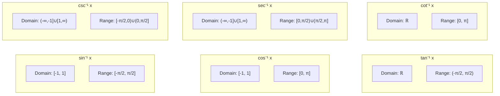

# Inverse Trigonometric Functions

Inverse trigonometric functions (also called arc functions) return the angle whose trigonometric function equals a given value.

## Definitions and Properties

### Inverse Sine ($\sin^{-1}$ or $\arcsin$)
$$y = \sin^{-1} x \iff \sin y = x$$
- **Domain:** $[-1, 1]$
- **Range:** $\displaystyle\left[-\frac{\pi}{2}, \frac{\pi}{2}\right]$
- **Restricted Domain:** $\displaystyle y = \sin x, \; -\frac{\pi}{2} \le x \le \frac{\pi}{2}$
- **Derivative:** $\frac{d}{dx}\sin^{-1} x = \frac{1}{\sqrt{1-x^2}}$

### Inverse Cosine ($\cos^{-1}$ or $\arccos$)
$$y = \cos^{-1} x \iff \cos y = x$$
- **Domain:** $[-1, 1]$
- **Range:** $[0, \pi]$
- **Restricted Domain:** $\displaystyle y = \cos x, \; 0 \le x \le \pi$
- **Derivative:** $\frac{d}{dx}\cos^{-1} x = -\frac{1}{\sqrt{1-x^2}}$

### Inverse Tangent ($\tan^{-1}$ or $\arctan$)
$$y = \tan^{-1} x \iff \tan y = x$$
- **Domain:** $(-\infty, \infty)$ or $\mathbb{R}$
- **Range:** $\displaystyle\left(-\frac{\pi}{2}, \frac{\pi}{2}\right)$
- **Restricted Domain:** $\displaystyle y = \tan x, \; -\frac{\pi}{2} < x < \frac{\pi}{2}$
- **Derivative:** $\frac{d}{dx}\tan^{-1} x = \frac{1}{1+x^2}$

### Inverse Cosecant ($\csc^{-1}$ or $\text{arccsc}$)
$$y = \csc^{-1} x \iff \csc y = x$$
- **Domain:** $(-\infty, -1] \cup [1, \infty)$
- **Range:** $\displaystyle\left[-\frac{\pi}{2}, 0\right) \cup \left(0, \frac{\pi}{2}\right]$
- **Restricted Domain:** $\displaystyle y = \csc x, \; -\frac{\pi}{2} \le x < 0, \; 0 < x \le \frac{\pi}{2}$
- **Derivative:** $\frac{d}{dx}\csc^{-1} x = -\frac{1}{|x|\sqrt{x^2-1}}$

### Inverse Secant ($\sec^{-1}$ or $\text{arcsec}$)
$$y = \sec^{-1} x \iff \sec y = x$$
- **Domain:** $(-\infty, -1] \cup [1, \infty)$
- **Range:** $\displaystyle\left[0, \frac{\pi}{2}\right) \cup \left(\frac{\pi}{2}, \pi\right]$
- **Restricted Domain:** $\displaystyle y = \sec x, \; 0 \le x < \frac{\pi}{2}, \; \frac{\pi}{2} < x \le \pi$
- **Derivative:** $\frac{d}{dx}\sec^{-1} x = \frac{1}{|x|\sqrt{x^2-1}}$

### Inverse Cotangent ($\cot^{-1}$ or $\text{arccot}$)
$$y = \cot^{-1} x \iff \cot y = x$$
- **Domain:** $(-\infty, \infty)$ or $\mathbb{R}$
- **Range:** $[0, \pi]$
- **Restricted Domain:** $\displaystyle y = \cot x, \; 0 < x < \pi$
- **Derivative:** $\frac{d}{dx}\cot^{-1} x = -\frac{1}{1+x^2}$

## Summary Table

| Function | Domain | Range (Principal Value) |
|---|---|---|
| $y = \sin^{-1} x$ | $[-1, 1]$ | $\displaystyle\left[-\frac{\pi}{2}, \frac{\pi}{2}\right]$ |
| $y = \cos^{-1} x$ | $[-1, 1]$ | $[0, \pi]$ |
| $y = \tan^{-1} x$ | $\mathbb{R}$ | $\displaystyle\left(-\frac{\pi}{2}, \frac{\pi}{2}\right)$ |
| $y = \cot^{-1} x$ | $\mathbb{R}$ | $[0, \pi]$ |
| $y = \sec^{-1} x$ | $(-\infty, -1] \cup [1, \infty)$ | $\displaystyle\left[0, \frac{\pi}{2}\right) \cup \left(\frac{\pi}{2}, \pi\right]$ |
| $y = \csc^{-1} x$ | $(-\infty, -1] \cup [1, \infty)$ | $\displaystyle\left[-\frac{\pi}{2}, 0\right) \cup \left(0, \frac{\pi}{2}\right]$ |

## Domain and Range Comparison



## Derivative Proofs

All six derivative formulas follow from the **inverse rule**:

$$\frac{d}{dx}\left[f^{-1}(x)\right] = \frac{1}{f'\left(f^{-1}(x)\right)}$$

### Proof for $\sin^{-1} x$
Let $y = \sin^{-1} x \Rightarrow \sin y = x$.

Differentiate implicitly: $\cos(y) \frac{dy}{dx} = 1 \Rightarrow \frac{dy}{dx} = \frac{1}{\cos(y)}$.

Using a right triangle with angle $y$, opposite side $x$, hypotenuse $1$:
- Adjacent side $= \sqrt{1-x^2}$
- Therefore $\cos(y) = \sqrt{1-x^2}$

$$\frac{d}{dx}\sin^{-1} x = \frac{1}{\sqrt{1-x^2}}$$

### Proof for $\cos^{-1} x$
Let $y = \cos^{-1} x \Rightarrow \cos y = x$.

Differentiate implicitly: $-\sin(y) \frac{dy}{dx} = 1 \Rightarrow \frac{dy}{dx} = \frac{-1}{\sin(y)}$.

Using a right triangle with angle $y$, adjacent side $x$, hypotenuse $1$:
- Opposite side $= \sqrt{1-x^2}$
- Therefore $\sin(y) = \sqrt{1-x^2}$

$$\frac{d}{dx}\cos^{-1} x = \frac{-1}{\sqrt{1-x^2}}$$

### Proof for $\tan^{-1} x$
Let $y = \tan^{-1} x \Rightarrow \tan y = x$.

By the inverse rule: $\frac{dy}{dx} = \frac{1}{\sec^2(y)}$.

Using a right triangle with angle $y$, opposite side $x$, adjacent side $1$:
- Hypotenuse $= \sqrt{1+x^2}$
- Therefore $\sec(y) = \sqrt{1+x^2}$

$$\frac{d}{dx}\tan^{-1} x = \frac{1}{(\sqrt{1+x^2})^2} = \frac{1}{1+x^2}$$

### Proof for $\csc^{-1} x$
Let $y = \csc^{-1} x \Rightarrow \csc y = x$.

Differentiate implicitly: $-\csc(y)\cot(y) \frac{dy}{dx} = 1$.

$$\frac{dy}{dx} = \frac{-1}{\csc(y)\cot(y)} = \frac{-1}{x\sqrt{x^2-1}}$$

Since hypotenuse must be positive, we use $|x|$:

$$\frac{d}{dx}\csc^{-1} x = \frac{-1}{|x|\sqrt{x^2-1}}$$

### Proof for $\sec^{-1} x$ and $\cot^{-1} x$
These follow by analogous methods:
- $\frac{d}{dx}\sec^{-1} x = \frac{1}{|x|\sqrt{x^2-1}}$ (positive, with absolute value)
- $\frac{d}{dx}\cot^{-1} x = \frac{-1}{1+x^2}$ (negative of $\tan^{-1}$)

## Chain Rule Generalizations

When the argument is a function $g(x)$ rather than just $x$:

| Function | Derivative |
|----------|------------|
| $\frac{d}{dx}\sin^{-1}(g(x))$ | $\frac{g'(x)}{\sqrt{1-(g(x))^2}}$ |
| $\frac{d}{dx}\cos^{-1}(g(x))$ | $\frac{-g'(x)}{\sqrt{1-(g(x))^2}}$ |
| $\frac{d}{dx}\tan^{-1}(g(x))$ | $\frac{g'(x)}{1+(g(x))^2}$ |
| $\frac{d}{dx}\cot^{-1}(g(x))$ | $\frac{-g'(x)}{1+(g(x))^2}$ |
| $\frac{d}{dx}\sec^{-1}(g(x))$ | $\frac{g'(x)}{|g(x)|\sqrt{(g(x))^2-1}}$ |
| $\frac{d}{dx}\csc^{-1}(g(x))$ | $\frac{-g'(x)}{|g(x)|\sqrt{(g(x))^2-1}}$ |

## Applications and Worked Examples

### FAC1004 L13 — Principal Values

**Example 1:** Find the principal value of $\displaystyle\sin^{-1}\left(\frac{1}{\sqrt{2}}\right)$.

Let $\displaystyle\sin^{-1}\left(\frac{1}{\sqrt{2}}\right) = \theta$. Then:
$$\sin \theta = \frac{1}{\sqrt{2}} = \sin\left(\frac{\pi}{4}\right) \quad\Rightarrow\quad \boxed{\theta = \frac{\pi}{4}}$$

**Example 2:** Find the principal value of $\displaystyle\cos^{-1}\left(-\frac{1}{2}\right)$.

Let $\displaystyle\cos^{-1}\left(-\frac{1}{2}\right) = \theta$. Then:
$$\cos \theta = -\frac{1}{2} = \cos\left(\pi - \frac{\pi}{3}\right) = \cos\left(\frac{2\pi}{3}\right) \quad\Rightarrow\quad \boxed{\theta = \frac{2\pi}{3}}$$

**Example 3:** Find the principal value of $\displaystyle\tan^{-1}\left(-\frac{1}{\sqrt{3}}\right)$.

Let $\displaystyle\tan^{-1}\left(-\frac{1}{\sqrt{3}}\right) = \theta$. Then:
$$\tan \theta = -\frac{1}{\sqrt{3}} = \tan\left(-\frac{\pi}{6}\right) \quad\Rightarrow\quad \boxed{\theta = -\frac{\pi}{6}}$$

### FAC1004 L13 — Composition of Functions

**Example 4:** Evaluate $\displaystyle\sec\left[\cos^{-1}\frac{\sqrt{3}}{2}\right]$.

Let $\displaystyle\cos^{-1}\left(\frac{\sqrt{3}}{2}\right) = \theta$. Then:
$$\cos \theta = \frac{\sqrt{3}}{2} = \cos\left(\frac{\pi}{6}\right) \quad\Rightarrow\quad \theta = \frac{\pi}{6}$$

Therefore:
$$\sec\left[\cos^{-1}\frac{\sqrt{3}}{2}\right] = \sec\left(\frac{\pi}{6}\right) = \boxed{\frac{2}{\sqrt{3}}}$$

### FAC1004 L13 — Algebraic Simplification

**Example 5:** Simplify $\cos\left(\sin^{-1} x\right)$.

Let $\sin^{-1} x = \theta \;\Rightarrow\; x = \sin \theta$.

$$\cos\left(\sin^{-1} x\right) = \cos \theta = \sqrt{1 - \sin^{2}\theta} = \boxed{\sqrt{1 - x^{2}}}$$

**Example 6:** Simplify $\cot\left(\csc^{-1} x\right)$.

Let $\csc^{-1} x = \theta \;\Rightarrow\; x = \csc \theta$.

$$\cot\left(\csc^{-1} x\right) = \cot \theta = \sqrt{\csc^{2}\theta - 1} = \boxed{\sqrt{x^{2} - 1}}$$

### FAC1004 L14 — Properties and Identities

**Example 7:** Find the exact value of $\displaystyle\cos\left(\sin^{-1}\left(\frac{3}{5}\right) + \frac{\pi}{2}\right)$.

Using the cosine addition formula:
$$\cos\left(\sin^{-1}\left(\frac{3}{5}\right) + \frac{\pi}{2}\right) = \cos\left(\sin^{-1}\left(\frac{3}{5}\right)\right)\cos\left(\frac{\pi}{2}\right) - \sin\left(\sin^{-1}\left(\frac{3}{5}\right)\right)\sin\left(\frac{\pi}{2}\right)$$

By interconversion (Property 7), $\cos\left(\sin^{-1}\left(\frac{3}{5}\right)\right) = \sqrt{1 - \left(\frac{3}{5}\right)^2} = \frac{4}{5}$.

$$= \left(\frac{4}{5}\right)(0) - \left(\frac{3}{5}\right)(1) = \boxed{-\frac{3}{5}}$$

**Example 8:** Prove that $\displaystyle\tan^{-1}\left(\frac{1}{7}\right) + \tan^{-1}\left(\frac{1}{13}\right) = \tan^{-1}\left(\frac{2}{9}\right)$.

Applying the sum formula:
$$\tan^{-1}\left(\frac{1}{7}\right) + \tan^{-1}\left(\frac{1}{13}\right) = \tan^{-1}\left(\frac{\frac{1}{7} + \frac{1}{13}}{1 - \frac{1}{7} \cdot \frac{1}{13}}\right) = \tan^{-1}\left(\frac{\frac{20}{91}}{\frac{90}{91}}\right) = \tan^{-1}\left(\frac{20}{90}\right) = \boxed{\tan^{-1}\left(\frac{2}{9}\right)}$$

### Example 9: Chain Rule with Power Rule
$$\frac{d}{dx}\left[\sqrt{\cos^{-1}(x)}\right] = \frac{1}{2}(\cos^{-1} x)^{-1/2} \cdot \frac{-1}{\sqrt{1-x^2}} = \frac{-1}{2\sqrt{\cos^{-1}(x)}\sqrt{1-x^2}}$$

### Example 10: Chain Rule with Linear Argument
$$\frac{d}{dx}\left[\cos^{-1}(3x)\right] = \frac{-1}{\sqrt{1-(3x)^2}} \cdot 3 = \frac{-3}{\sqrt{1-9x^2}}$$

### Example 11: Exponential + Inverse Tangent
$$\frac{d}{dx}\left[e^{\tan^{-1}(x)}\right] = e^{\tan^{-1}(x)} \cdot \frac{1}{1+x^2}$$

### Example 12: Logarithmic + Inverse Sine
$$\frac{d}{dx}\left[\ln(\sin^{-1}(x))\right] = \frac{1}{\sin^{-1}(x)} \cdot \frac{1}{\sqrt{1-x^2}}$$

### Example 13: Product Rule + Chain Rule
For $f(x) = x^2 \cos^{-1}(e^{3x})$:
$$f'(x) = 2x\cos^{-1}(e^{3x}) + x^2 \cdot \frac{-3e^{3x}}{\sqrt{1-e^{6x}}}$$

### Example 14: Quotient Rule + Chain Rule
For $y = \frac{\sin^{-1}(3x)}{x^2}$:
$$\frac{dy}{dx} = \frac{x^2 \cdot \frac{3}{\sqrt{1-9x^2}} - \sin^{-1}(3x) \cdot 2x}{x^4} = \frac{3x - 2\sin^{-1}(3x)\sqrt{1-9x^2}}{x^3\sqrt{1-9x^2}}$$

## Key Identities

### Complementary Relationships
- $\sin^{-1} x + \cos^{-1} x = \frac{\pi}{2}$
- $\tan^{-1} x + \cot^{-1} x = \frac{\pi}{2}$
- $\sec^{-1} x + \csc^{-1} x = \frac{\pi}{2}$

### Negative Arguments
- $\sin^{-1}(-x) = -\sin^{-1} x$
- $\cos^{-1}(-x) = \pi - \cos^{-1} x$
- $\tan^{-1}(-x) = -\tan^{-1} x$

### Composition Properties
- $\sin(\sin^{-1} x) = x$ for $x \in [-1, 1]$
- $\sin^{-1}(\sin x) = x$ for $x \in [-\frac{\pi}{2}, \frac{\pi}{2}]$
- $\cos(\cos^{-1} x) = x$ for $x \in [-1, 1]$
- $\cos^{-1}(\cos x) = x$ for $x \in [0, \pi]$

## Inverse Trigonometric Properties Mindmap

```mermaid
mindmap
  root((Inverse Trig Properties))
    Complementary
      sin⁻¹x + cos⁻¹x = π/2
      tan⁻¹x + cot⁻¹x = π/2
      sec⁻¹x + csc⁻¹x = π/2
    Negative Arguments
      sin⁻¹(-x) = -sin⁻¹x
      cos⁻¹(-x) = π - cos⁻¹x
      tan⁻¹(-x) = -tan⁻¹x
    Composition
      sin(sin⁻¹x) = x
      sin⁻¹(sin x) = x
      cos(cos⁻¹x) = x
      cos⁻¹(cos x) = x
    Sum and Difference
      tan⁻¹x ± tan⁻¹y = tan⁻¹((x±y)/(1∓xy))
    Double Angle
      2tan⁻¹x = sin⁻¹(2x/(1+x²))
      2tan⁻¹x = cos⁻¹((1-x²)/(1+x²))
      2tan⁻¹x = tan⁻¹(2x/(1-x²))
    Interconversion
      Express any inverse trig in terms of others
```

## Sum and Difference Formulas (L14)

For inverse tangent:

$$\tan^{-1} x + \tan^{-1} y = \tan^{-1}\left(\frac{x + y}{1 - xy}\right)$$

$$\tan^{-1} x - \tan^{-1} y = \tan^{-1}\left(\frac{x - y}{1 + xy}\right)$$

**Proof:** Let $\tan^{-1} x = \theta$ and $\tan^{-1} y = \phi$, so $x = \tan \theta$ and $y = \tan \phi$.

$$\text{L.H.S.} = \theta + \phi$$
$$\text{R.H.S.} = \tan^{-1}\left(\frac{\tan \theta + \tan \phi}{1 - \tan \theta \tan \phi}\right) = \tan^{-1}[\tan(\theta + \phi)] = \theta + \phi = \text{L.H.S.}$$

## Double Angle Formula (L14)

$$2\tan^{-1} x = \sin^{-1}\left(\frac{2x}{1 + x^2}\right) = \cos^{-1}\left(\frac{1 - x^2}{1 + x^2}\right) = \tan^{-1}\left(\frac{2x}{1 - x^2}\right)$$

**Proof:** Let $x = \tan \theta$. Then:
- $2\tan^{-1} x = 2\theta$
- $\sin^{-1}\left(\frac{2x}{1+x^2}\right) = \sin^{-1}(\sin 2\theta) = 2\theta$
- $\cos^{-1}\left(\frac{1-x^2}{1+x^2}\right) = \cos^{-1}(\cos 2\theta) = 2\theta$
- $\tan^{-1}\left(\frac{2x}{1-x^2}\right) = \tan^{-1}(\tan 2\theta) = 2\theta$

## Interconversion Formulas (L14)

Any inverse trig function can be expressed in terms of the others using right-triangle relationships.

### Expressing $\sin^{-1} x$ in terms of others

Let $\sin^{-1} x = \theta \Rightarrow \sin \theta = x$. Then:
$$\cos \theta = \sqrt{1 - x^2}, \quad \tan \theta = \frac{x}{\sqrt{1 - x^2}}, \quad \sec \theta = \frac{1}{\sqrt{1 - x^2}}, \quad \cot \theta = \frac{\sqrt{1 - x^2}}{x}, \quad \csc \theta = \frac{1}{x}$$

Therefore:
$$\sin^{-1} x = \cos^{-1}\left(\sqrt{1 - x^2}\right) = \tan^{-1}\left(\frac{x}{\sqrt{1 - x^2}}\right) = \sec^{-1}\left(\frac{1}{\sqrt{1 - x^2}}\right) = \cot^{-1}\left(\frac{\sqrt{1 - x^2}}{x}\right) = \csc^{-1}\left(\frac{1}{x}\right)$$

### Expressing $\cos^{-1} x$ in terms of others

Let $\cos^{-1} x = \theta \Rightarrow \cos \theta = x$. Then:
$$\sin \theta = \sqrt{1 - x^2}, \quad \tan \theta = \frac{\sqrt{1 - x^2}}{x}, \quad \csc \theta = \frac{1}{\sqrt{1 - x^2}}, \quad \cot \theta = \frac{x}{\sqrt{1 - x^2}}, \quad \sec \theta = \frac{1}{x}$$

Therefore:
$$\cos^{-1} x = \sin^{-1}\left(\sqrt{1 - x^2}\right) = \tan^{-1}\left(\frac{\sqrt{1 - x^2}}{x}\right) = \csc^{-1}\left(\frac{1}{\sqrt{1 - x^2}}\right) = \cot^{-1}\left(\frac{x}{\sqrt{1 - x^2}}\right) = \sec^{-1}\left(\frac{1}{x}\right)$$

## Related

- [[FAC1001 - Advanced Mathematics II]] — Science stream course
- [[FAC1004 - Advanced Mathematics II (Computing)]] — Computing stream course
- [[FAC1004 L13 — Inverse Trigonometric Functions]] — introduction lecture
- [[FAC1004 L14 — Properties of Inverse Trig Functions]] — properties lecture
- [[FAC1004 L15-L16 — Derivatives of Inverse Trig Functions]] — derivatives lecture
- [[FAC1004 Tutorial 6 — Inverse Trigonometric Functions]] — practice problems
- [[FAC1004 Tutorial 7 — Derivatives of Inverse Trig Functions]] — differentiation practice
