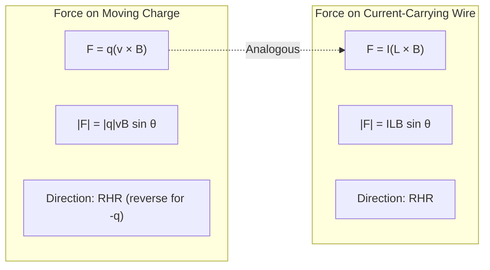
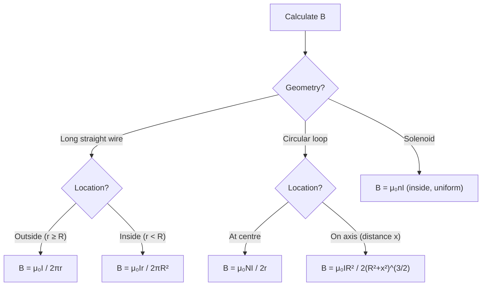
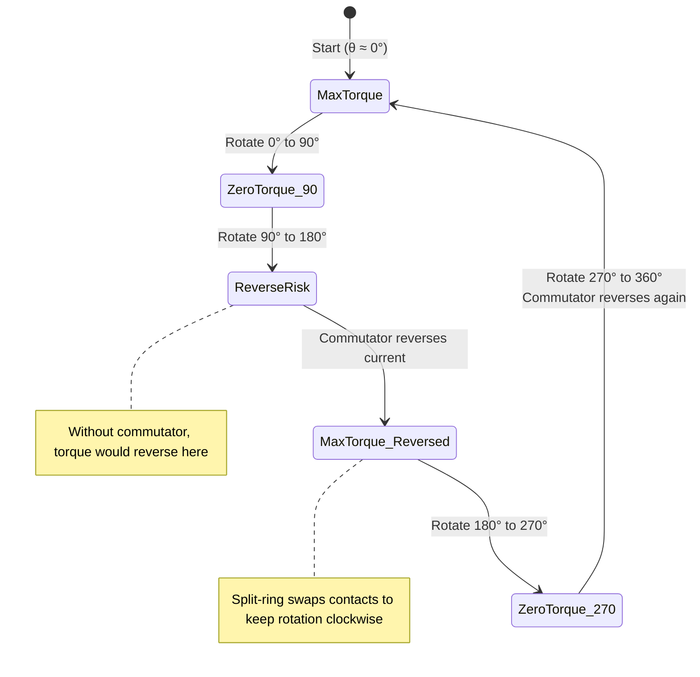

# Magnetism

Study of magnetic fields, forces, and their relationship to electric currents.

## Definition

Magnetism is a physical phenomenon produced by the motion of electric charge, resulting in attractive and repulsive forces between objects. Magnetic fields are vector fields that exert forces on moving charges and magnetic materials.

## Direction Rules

### Right Hand Grip Rule (RHR)

For a current-carrying straight wire or solenoid:
1. **Thumb** points in the direction of conventional current $I$ ($+$ to $-$).
2. **Curled fingers** show the direction of magnetic field $\vec{B}$.
3. The direction of $\vec{B}$ at any point is **tangent** to the field line.

For a solenoid or coil, the thumb points toward the **North pole** (direction of $\vec{B}$ inside).

### 2D Vector Notation

| Symbol | Meaning |
|--------|---------|
| $\odot$ | Out of the page (arrow head coming toward you) |
| $\otimes$ | Into the page (arrow tail moving away) |

These apply to current $I$, magnetic field $\vec{B}$, force $\vec{F}$, and velocity $\vec{v}$.

**Direction relationships:**
- $I$ out of page → $\vec{B}$ is **counter-clockwise**
- $I$ into page → $\vec{B}$ is **clockwise**

## Key Concepts

- Magnetic Field (B) — field that exerts force on moving charges
- Magnetic Field Lines — form closed loops, from N to S pole
- Lorentz Force — force on moving charge:
  $$\vec{F} = q\vec{v} \times \vec{B}$$
  Magnitude: $|F_B| = |q|vB\sin\theta$
- Direction Rules — RHR, LHR (Fleming's); for $-q$, reverse the force direction or swap $v$ and $B$
- Stationary Charge — no magnetic force when $v = 0$
- Cyclotron Motion — circular motion when $v \perp B$
- Helical Motion — spiral path when $v$ is at an angle to $B$
- Velocity Selector — crossed $E$ and $B$ fields; particles with $v = E/B$ pass undeflected
- Mass Spectrometer — uses velocity selector + mass selector to separate ions by mass
- Force on Current-Carrying Wire — $\vec{F} = I\vec{L} \times \vec{B}$
- Force Between Parallel Wires — same-direction currents attract, opposite-direction currents repel; magnitude $F = \frac{\mu_0 I_1 I_2 L}{2\pi d}$; per-unit-length force $f = \frac{\mu_0 I_1 I_2}{2\pi d}$
- Ampere's Law — relates current to magnetic field:
  $$\oint \vec{B} \cdot d\vec{l} = \mu_0 I_{enc}$$
- Magnetic Field of Solenoid — $B = \mu_0 nI$ (nearly uniform inside; external field $\approx 0$ near centre when $L \gg r$)
- Magnetic Field of Circular Loop (centre) — $B = \frac{\mu_0 NI}{2r}$ ($N=1$ by default; note there is **no $\pi$** in this formula)
- Magnetic Field Inside Wire — for $r < R$, $B = \frac{\mu_0 I r}{2\pi R^2}$; enclosed current scales with area ratio $I_{enc} = \frac{\pi r^2}{\pi R^2}I$
- Superposition Principle — net $\vec{B}$ is the vector sum of fields from all current elements
- Magnetic Dipole Moment — $\vec{\mu} = N I\vec{A}$ for an $N$-turn coil
- Torque on Current Loop — $\vec{\tau} = \vec{\mu} \times \vec{B}$; magnitude $\tau = N I A B \sin\theta$ (valid for **any planar shape**)
- Torque Direction — Fleming's rule or RHR; torque acts to align $\vec{A}$ with $\vec{B}$
- DC Motor Commutator — split-ring reverses current every half-rotation, enabling continuous rotation

### Force Comparison: Moving Charge vs Current-Carrying Wire

## Key Formulas

| Formula | Description |
|---------|-------------|
|$|F_B| = |q|vB\sin\theta$ | Lorentz force magnitude |
|$r = \frac{mv}{qB}$ | Cyclotron radius |
|$T = \frac{2\pi m}{qB}$ | Period of circular motion (independent of $v$) |
|$\omega = \frac{qB}{m}$ | Angular frequency (cyclotron) |
|$v = \frac{E}{B}$ | Velocity selector condition |
|$m = \frac{qrB^2}{E}$ | Mass selector (mass spectrometer) |
|$F = \frac{\mu_0 I_1 I_2 L}{2\pi d}$ | Force between parallel wires |
|$f = \frac{\mu_0 I_1 I_2}{2\pi d}$ | Force per unit length between parallel wires |
|$B = \frac{\mu_0 I}{2\pi r}$ | Field around long straight wire ($r \ge R$) |
|$B = \frac{\mu_0 I r}{2\pi R^2}$ | Field inside long straight wire ($r < R$) |
|$B = \frac{\mu_0 NI}{2r}$ | Field at centre of circular loop ($N=1$ default) |
|$B = \mu_0 nI$ | Solenoid interior field |
|$B = \frac{\mu_0 IR^2}{2(R^2 + x^2)^{3/2}}$ | Field on axis of loop |
|$\tau = N I A B \sin\theta$ | Torque on $N$-turn current loop |
|$\tau = \mu B\sin\theta$ | Torque via dipole moment |
|$\mu = NIA$ | Magnetic dipole moment ($N$-turn coil) |

### Field Formula Decision Flowchart

## Physical Constants

- **Permeability of free space:** $\mu_0 = 4\pi \times 10^{-7}\; \text{T}\cdot\text{m}\cdot\text{A}^{-1}$
- **Unit conversion:** $1\,\text{G} = 10^{-4}\,\text{T}$

## Force Between Parallel Wires

When two long straight parallel wires carry currents, each wire produces a magnetic field that exerts a force on the other.

- **Same-direction currents** → **attract**
- **Opposite-direction currents** → **repel**

The magnitude of the force on a length $L$ of either wire is:

$$F = \frac{\mu_0 I_1 I_2 L}{2\pi d}$$

where $d$ is the perpendicular separation between the wires. The force per unit length is:

$$f = \frac{F}{L} = \frac{\mu_0 I_1 I_2}{2\pi d}$$

The two forces form a Newton's third-law pair: $F_{21} = F_{12}$.

## Definition of the Ampere

The **ampere** (A) is the SI base unit of electric current. One ampere is defined as the constant current that, if maintained in two straight parallel conductors of infinite length, of negligible circular cross-section, and placed $1\,\text{m}$ apart in vacuum, would produce between these conductors a force of $2 \times 10^{-7}\,\text{N}$ per metre of length. This definition fixes the value of the permeability of free space at exactly:

$$\mu_0 = 4\pi \times 10^{-7}\;\text{T}\cdot\text{m}\cdot\text{A}^{-1}$$

## Permeability vs Permittivity

| Aspect | Permittivity ($\varepsilon$) | Permeability ($\mu$) |
|--------|------------------------------|----------------------|
| Definition | Ability of a material to polarize in response to an external electric field | Ability of a material to magnetize in response to an external magnetic field |
| Symbol | $\varepsilon$ | $\mu$ |
| SI unit | Fm$^{-1}$ | Hm$^{-1}$ (kg$\cdot$m$\cdot$s$^{-2}\cdot$A$^{-2}$) |
| Free-space value | $8.85 \times 10^{-12}$ Fm$^{-1}$ | $1.26 \times 10^{-6}$ Hm$^{-1}$ |
| Related to | Electric fields | Magnetic fields |
| Application | Dielectric materials in capacitors | Transformer cores and inductors |

> Note: The free-space permeability value $1.26 \times 10^{-6}$ Hm$^{-1}$ is the approximate value of $\mu_0 = 4\pi \times 10^{-7}$ T$\cdot$m$\cdot$A$^{-1}$ used in calculations.

## Torque on Current Loops

When a current-carrying coil is placed in a uniform magnetic field, the field exerts forces on opposite sides of the loop, creating a torque.

### Maximum and Minimum Torque

| Condition | Geometry | Torque |
|-----------|----------|--------|
| **Maximum** | Plane of coil **parallel** to $\vec{B}$ (or $\vec{B} \perp \vec{A}$) | $\tau_{max} = N I A B$ ($\sin 90^\circ = 1$) |
| **Minimum** | Plane of coil **perpendicular** to $\vec{B}$ (or $\vec{B} \parallel \vec{A}$) | $\tau_{min} = 0$ ($\sin 0^\circ = 0$) |

### DC Motors
A loop carrying **DC** in a uniform $\vec{B}$ oscillates back and forth (~$90^\circ$) rather than rotating continuously. A **split-ring commutator** reverses the current direction every half-rotation, allowing the loop to spin continuously.

### DC Motor Operation State Diagram

## Related Concepts

- [[Inductance & Transformers]] — electromagnetic induction
- [[Electrostatics]] — electric force analogues
- [[AC Circuits]] — magnetic fields in inductors

## Course Links

- [[FAD1022 - Basic Physics II]] — main course page
- [[FAD1022 L22-L26 — Magnetism]] — lecture source
- [[Revision Faraday and Lenz Law]] — revision lecture on electromagnetic induction (flux, Faraday's Law, Lenz's Law)
- [[Aisyah Hartini Jahidin (AHJ)]] — lecturer