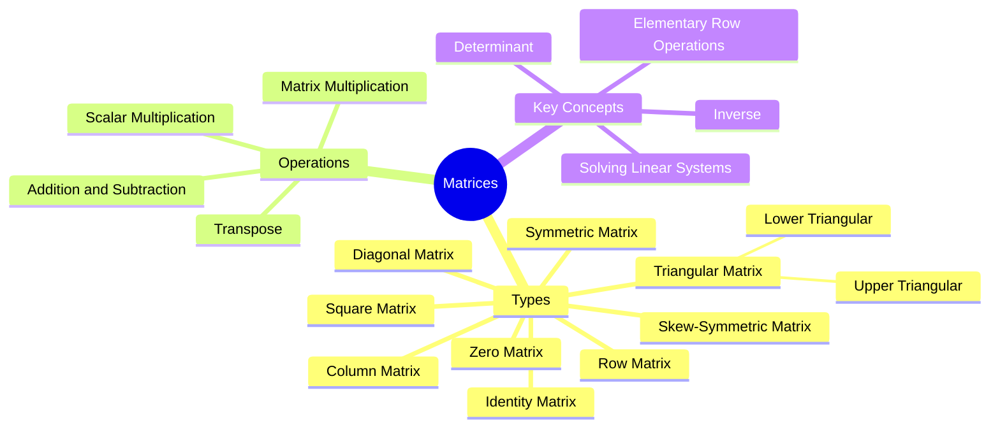
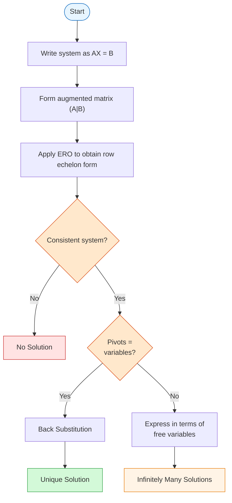

# Matrices

Rectangular arrays of numbers used to represent linear transformations and systems of equations.

## Definitions

A **matrix** is a rectangular array of real numbers enclosed by a pair of brackets, with $m$ rows and $n$ columns, denoted as $m \times n$.

$$A = [a_{ij}] = \begin{bmatrix} a_{11} & a_{12} & \cdots & a_{1n} \\ a_{21} & a_{22} & \cdots & a_{2n} \\ \vdots & \vdots & \ddots & \vdots \\ a_{m1} & a_{m2} & \cdots & a_{mn} \end{bmatrix}$$

where $a_{ij}$ refers to the element in the $i$-th row and $j$-th column.

**Leading entry, $P_i$** — the first non-zero element from the left of the $i$-th row.

**Leading diagonal** — diagonal elements $a_{11}, a_{22}, \ldots, a_{mm}$ of the matrix.

## Types of Matrices

| Type | Definition | Notation / Example |
|------|------------|-------------------|
| **Row matrix** | A matrix with only one row | $(2 \quad 5 \quad 1)$ |
| **Column matrix** | A matrix with only one column | $\begin{pmatrix} 1 \\ 0 \\ 6 \end{pmatrix}$ |
| **Square** | Equal number of rows and columns ($m = n$) | $n \times n$ |
| **Zero** | All elements are 0 | $0$ |
| **Diagonal** | Square matrix where all non-diagonal elements are 0 | $\text{diag}(d_1, \ldots, d_n)$ |
| **Identity** | Square matrix with 1s on principal diagonal and 0s elsewhere | $I_n$ |
| **Upper Triangular** | Square matrix where all entries under the diagonal are 0 | |
| **Lower Triangular** | Square matrix where all entries above the diagonal are 0 | |
| **Symmetric** | Square matrix with $a_{ij} = a_{ji}$ for all $i, j$; i.e., $B^T = B$ | |
| **Skew-symmetric** | Square matrix where $B^T = -B$ and $b_{ii} = 0$ | |

### Matrix Types and Operations Mindmap

## Matrix Operations

### Addition and Subtraction
Element-wise for matrices of same dimension:
$$(A \pm B)_{ij} = a_{ij} \pm b_{ij}$$

### Scalar Multiplication
The product of a scalar $k$ and a matrix $A$, written $kA$, is the matrix obtained by multiplying each element of $A$ by $k$.

$$(kA)_{ij} = k \cdot a_{ij}$$

**Properties:**
- $k(A + B) = kA + kB$
- $(k_1 + k_2)A = k_1A + k_2A$
- $k_1(k_2A) = k_2(k_1A) = (k_1k_2)A$

### Matrix Multiplication
Multiplication between two matrices $A$ and $B$, $AB$, can only be done if the number of columns of $A$ equals the number of rows of $B$.

If $A$ is of order $m \times p$ and $B$ is of order $p \times n$, then $AB$ is of order $m \times n$:

$$(AB)_{ij} = \sum_{k=1}^{p} a_{ik} \cdot b_{kj}$$

The principle **'row into column'** is used to obtain each element of the product.

**Properties:**
- NOT commutative: $AB \neq BA$ (in general)
- Distributive: $A(B + C) = AB + AC$
- If $A$ is a zero matrix of order $m \times n$, $B$ is of order $n \times p$, then $AB = 0$
- Identity: $AI = IA = A$
- Powers: $A^m = A \cdot A \cdot \ldots \cdot A$ ($m$ times), for square matrix $A$
- Law of exponents: $A^p A^q = A^{p+q}$, $(A^p)^q = A^{pq}$ for $p > 0, q > 0$
- Identity powers: $I = I^2 = I^3 = \cdots = I^n$

### Transpose
Let $A$ be an $m \times n$ matrix, the **transpose** of $A$ written as $A^T$, is an $n \times m$ matrix obtained by interchanging the rows and columns of $A$.

$$(A^T)_{ij} = a_{ji}$$

**Properties:**
- $(kA)^T = kA^T$, $k$ a scalar
- $(A^T)^T = A$
- $(A \pm B)^T = A^T \pm B^T$
- $(AB)^T = B^T A^T$

## Determinant

Notation: $|A|$ or $\det(A)$

### 2×2 Matrix
Let $A = \begin{pmatrix} a_{11} & a_{12} \\ a_{21} & a_{22} \end{pmatrix}$ then:

$$|A| = \begin{vmatrix} a_{11} & a_{12} \\ a_{21} & a_{22} \end{vmatrix} = a_{11}a_{22} - a_{12}a_{21}$$

### Minor and Cofactor
If $A$ is a square matrix of order $3 \times 3$, the **minor** of $a_{ij}$, denoted by $M_{ij}$, is the determinant of the $2 \times 2$ matrix obtained by deleting the $i$-th row and $j$-th column.

The **cofactor** of $a_{ij}$ is denoted by $C_{ij}$ and:

$$C_{ij} = (-1)^{i+j} M_{ij}$$

> **Note:** For a $3 \times 3$ matrix, the sign of the cofactors are:
> $$\begin{pmatrix} + & - & + \\ - & + & - \\ + & - & + \end{pmatrix}$$

### 3×3 Matrix

#### Diagonal Expansion (for checking)
For checking purposes, the determinant of $3 \times 3$ matrix $A$ can be evaluated by diagonal expansion:

$$|A| = a_{11}a_{22}a_{33} + a_{12}a_{23}a_{31} + a_{13}a_{21}a_{32} - a_{13}a_{22}a_{31} - a_{11}a_{23}a_{32} - a_{12}a_{21}a_{33}$$

#### Cofactor Expansion
The determinant of a $3 \times 3$ matrix $A$ is the product of $a_{ij}$ and $C_{ij}$ of one of the rows or columns of $A$.

Based on $i$-th row:
$$|A| = a_{i1}C_{i1} + a_{i2}C_{i2} + a_{i3}C_{i3} = \sum_{j=1}^{3} a_{ij}C_{ij}$$

Based on $j$-th column:
$$|A| = a_{1j}C_{1j} + a_{2j}C_{2j} + a_{3j}C_{3j} = \sum_{i=1}^{3} a_{ij}C_{ij}$$

### Properties of Determinants
1. If $A$ is an $n \times n$ matrix and $k$ is a scalar, then $|kA| = k^n |A|$
2. If $A$ and $B$ are two square matrices, then $|AB| = |A||B|$
3. $|A| = |A^T|$ (determinant unchanged by transpose)
4. If two rows or columns are interchanged, the sign of the determinant is changed
5. The value of the determinant is unchanged by interchanging rows and columns
6. If any two rows or columns are identical, then the value of the determinant is zero
7. If $A$ is a triangular matrix, then $|A|$ is the product of the elements on the leading diagonal

**Singularity:**
- If $|A| = 0$, $A$ is **singular** (no inverse exists)
- If $|A| \neq 0$, $A$ is **non-singular** (inverse exists)

## Matrix Inverse

For square matrix $A$, inverse $A^{-1}$ satisfies:
$$AA^{-1} = A^{-1}A = I$$

**Inverse exists iff:** $|A| \neq 0$ (non-singular). If $|A| = 0$, $A$ is singular and has no inverse.

### 2×2 Inverse
$$A^{-1} = \frac{1}{|A|} \begin{pmatrix} d & -b \\ -c & a \end{pmatrix} \quad \text{where } |A| = ad - bc$$

**Shortcut for 2×2:**
1. **Interchange** the elements of the leading diagonal ($a \leftrightarrow d$)
2. **Reverse the sign** of the other elements ($b \rightarrow -b$, $c \rightarrow -c$)
3. **Divide** by the determinant

### General Formula (Adjoint Method)
$$A^{-1} = \frac{1}{|A|} \cdot \text{adj}(A)$$

where $\text{adj}(A) = C^T$ is the adjoint (transpose of the cofactor matrix)

### Inverse via Elementary Row Operations (ERO)
Write the augmented matrix $(A|I)$ and apply ERO until it becomes $(I|A^{-1})$.

**Key property:** $(AB)^{-1} = B^{-1}A^{-1}$

## Elementary Row Operations (ERO)

There are three elementary row operations:

1. **Interchange** any two rows: $R_i \leftrightarrow R_j$
2. **Multiply** all elements of a row by a scalar: $R_i \rightarrow kR_i$
3. **Multiply** a row by a scalar and add to another row: $R_j \rightarrow kR_i + R_j$

When $A$ is changed to $B$ using ERO, the matrices are **equivalent**.

ERO are used to:
- Find matrix inverses: $(A|I) \rightarrow (I|A^{-1})$
- Solve linear systems: $(A|B) \rightarrow (I|X)$ (Gauss-Jordan)

---

## Solving Linear Systems

**Matrix form:** $AX = B$
- $A$: coefficients matrix
- $X$: variables matrix
- $B$: constants matrix

### Method 1: Inverse Matrix
$$X = A^{-1}B$$
> Cannot be used if $A$ is singular ($|A| = 0$).

### Method 2: Gauss-Jordan Elimination
1. Write the system as $AX = B$
2. Form the **augmented matrix** $(A|B)$
3. Use ERO to reduce to $(I|X)$

### Method 3: Cramer's Rule
Uses determinants. For $n$ equations and $n$ variables: $x_i = \frac{|A_i|}{|A|}$ where $A_i$ is $A$ with column $i$ replaced by $B$.

> See [[Cramer's Rule]] for detailed theory, worked examples (2×2, 3×3), word problems, and comparison with other methods.

### Solution Types
1. **Unique solution:** $|A| \neq 0$ (system is consistent and independent)
2. **Infinitely many solutions:** $|A| = 0$ and $(\text{adj } A)B = 0$ (consistent, dependent)
3. **No solution:** $|A| = 0$ and $(\text{adj } A)B \neq 0$ (inconsistent)

### Gaussian Elimination Flowchart

## Related Sources

- [[FAD1015 L27-L28 — Matrices (Types, Operations & Determinants)]]
- [[FAD1015 L29-L30 — Matrices (Inverse & Systems of Equations)]]

## Related Courses

- [[FAD1015 - Mathematics III]]
