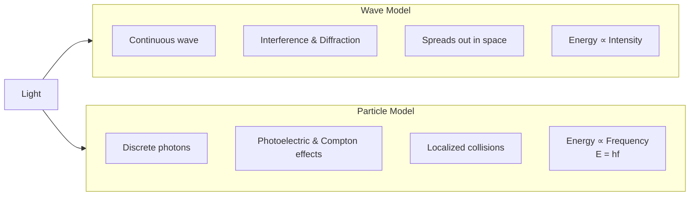
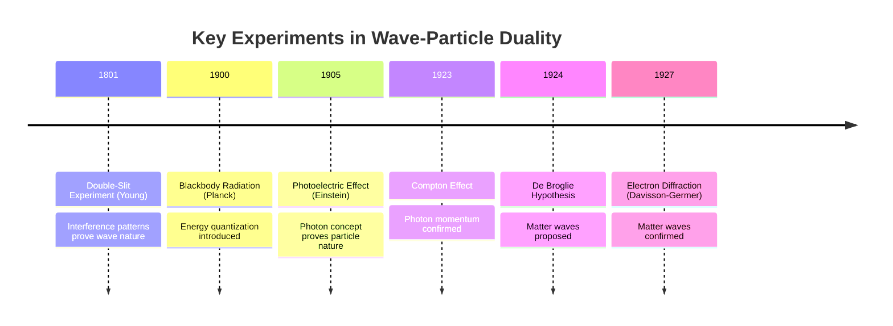

# Modern Physics — Wave-Particle Duality

Quantum mechanical nature of matter and radiation exhibiting both wave and particle properties.

## Definition

Wave-particle duality is a phenomenon where under certain circumstances a particle exhibits wave properties and under other conditions a wave exhibits properties of a particle. This fundamental principle of quantum mechanics reveals the limitations of classical physics at microscopic scales.

> **Light is both wave and particle—not only one.** Under certain circumstances a particle exhibits wave properties; under other conditions a wave exhibits particle properties.

## Wave vs Particle Nature

| Aspect | Wave Nature | Particle Nature |
|--------|-------------|-----------------|
| **Shown by** | Interference, Diffraction, Polarization | Photoelectric effect, Compton effect, Black body radiation |
| **Key experiments** | Double-slit experiment | Photoelectric effect, Black body radiation spectrum |
| **Light quanta** | Continuous wave | Discrete packets called **photons** |

- **Wave evidence:** Double-slit experiment produces interference patterns (bright and dark fringes). Only waves produce interference.
- **Particle evidence:** Black body radiation and the photoelectric effect show light behaves like discrete energy packets.

### Comparison: Wave Model vs Particle Model

## Key Concepts

- Classical vs Quantum — breakdown of classical physics at atomic scales
- Blackbody Radiation — thermal emission spectrum from a perfect absorber/emitter
- **Absorptivity Identity:** $\alpha_v + \rho_v + \tau_v = 1$ (absorptivity + reflectivity + transmissivity = 1)
- Blackbody Conceptual Model — idealized cavity with a small hole; radiation depends only on temperature
- **Ultraviolet Catastrophe** — classical Rayleigh-Jeans Law predicted infinite intensity at short wavelengths (UV), contradicting experiment
- Planck's Quantum Hypothesis — energy quantized in discrete packets (quanta); $E = hf$
- Planck's "Act of Despair" — abandoning the classical assumption that energy is continuous
- Quantization of Energy — foundation of quantum physics; energy is "pixelated" not continuous
- Classical Determinism vs Quantum Physics — classical: continuous and predictable; quantum: quantized at smallest scales
- Photoelectric Effect — light as particles (photons)
- Photon Energy — $E = hf = \frac{hc}{\lambda}$
- Photon Momentum — $p = \frac{h}{\lambda}$
- Compton Effect — photon scattering, momentum transfer
- De Broglie Hypothesis — matter has wave properties
- De Broglie Wavelength — $\lambda = \frac{h}{p} = \frac{h}{mv}$
- Wave Function — $\psi$, probability amplitude
- Probability Density — $|\psi|^2$, likelihood of finding particle
- Heisenberg Uncertainty Principle — fundamental limits on measurement
  - Position-momentum: $\Delta x \Delta p \geq \frac{\hbar}{2}$
  - Energy-time: $\Delta E \Delta t \geq \frac{\hbar}{2}$

## Key Formulas

| Formula | Description |
|---------|-------------|
|$E = hf = \hbar\omega$ | Photon energy |
|$p = \frac{h}{\lambda} = \hbar k$ | Photon/matter momentum |
|$\lambda = \frac{h}{p} = \frac{h}{mv}$ | De Broglie wavelength |
|$K_{max} = hf - \phi$ | Photoelectric equation |
|$\lambda' - \lambda = \frac{h}{m_e c}(1 - \cos\theta)$ | Compton shift |
|$\Delta x \Delta p \geq \frac{\hbar}{2}$ | Uncertainty principle |
|$u(\lambda, T) = \frac{8\pi hc}{\lambda^5}\frac{1}{e^{hc/\lambda kT} - 1}$ | Planck's law |
|$\lambda_{max} = \frac{b}{T}$ | Wien's law (peak wavelength, $b = 2.90 \times 10^{-3}$ m·K) |
|$\frac{P}{A} = \sigma T^4$ | Stefan-Boltzmann law ($\sigma = 5.67 \times 10^{-8}$ W·m⁻²·K⁻⁴) |
|$\alpha_v + \rho_v + \tau_v = 1$ | Absorptivity identity |

### Timeline of Key Experiments

## Real-World Blackbody Examples

- **Stars (like the Sun)** — approximate blackbodies
- **Heated metals** — glow and emit thermal radiation
- **The Cosmic Microwave Background (CMB)** — relic radiation from the Big Bang
- **Black holes** — as close to a perfect black body as real objects come

## The Ultraviolet Catastrophe & Planck's Solution

### The Problem
Classical physics (Rayleigh-Jeans Law) predicted that a hot object should emit **infinite** energy at short wavelengths (ultraviolet region). Experimentally, intensity increases to a maximum then decreases. This contradiction is the **Ultraviolet Catastrophe**.

> If Rayleigh-Jeans were correct, a toaster would emit lethal UV, X-ray, and gamma radiation.

### Planck's "Act of Despair" (1900)
Max Planck abandoned the classical assumption that energy is continuous. He proposed energy is emitted in discrete **packets** or "chunks" called **quanta**:

$$E = hf$$

Where $h = 6.626 \times 10^{-34}$ J·s.

**Why it worked:** At high frequency, energy packets become very large; atoms cannot easily emit them. Therefore radiation **decreases** at short wavelengths instead of becoming infinite.

**Analogy:** Energy is not like water flowing smoothly, but like water dropping drop by drop.

### Significance
This destroyed the classical belief in continuous energy and introduced the **Quantization of Energy** — the foundation of Quantum Physics. It killed **Classical Determinism** and birthed the modern era where everything is "pixelated" (quantized) at the smallest level.

## Related Concepts

- [[Atomic Physics]] — Bohr model quantization
- [[Nuclear Physics]] — quantum nuclear structure
- [[Electrostatics]] — classical physics foundation

## Course Links

- [[FAD1022 - Basic Physics II]] — main course page
- [[FAD1022 L43 — Modern Physics]] — lecture source
- [[Nurul Izzati (NIA)]] — lecturer