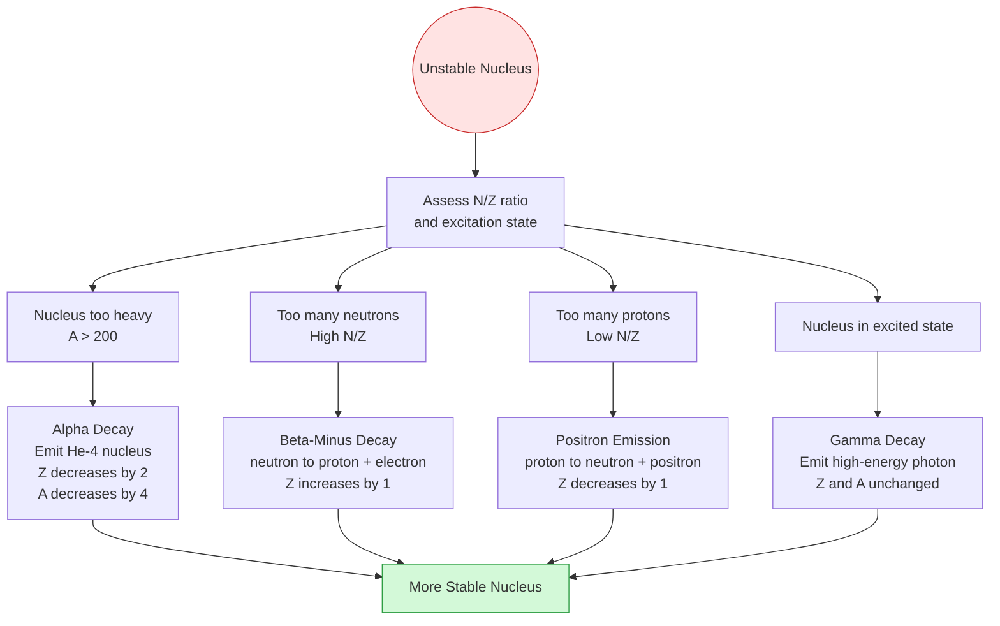
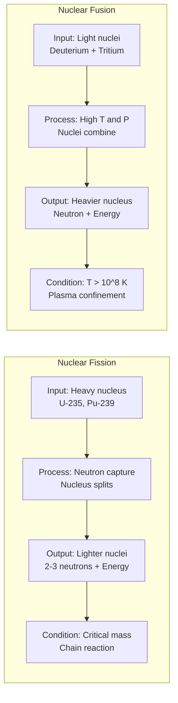

# Nuclear Physics

Study of atomic nuclei, nuclear forces, radioactivity, and nuclear reactions.

## Definition

Nuclear physics studies the constituents and interactions of atomic nuclei. It encompasses nuclear structure, radioactive decay, nuclear reactions, and applications in energy and medicine.

## Key Concepts

- Nuclear Composition — protons ($Z$) and neutrons ($N$), mass number $A = Z + N$
- Isotopes — same $Z$, different $N$ (e.g., $^{12}_6\text{C}$ vs $^{14}_6\text{C}$; $^{235}_{92}\text{U}$ vs $^{238}_{92}\text{U}$)
- Nuclear Forces — strong force binding nucleons, short range; competes with long-range Coulomb repulsion
- Nuclear Radius — $R = R_0 A^{1/3}$ where $R_0 = 1.2\ \text{fm} = 1.2 \times 10^{-15}\ \text{m}$
- Mass Defect — $\Delta m = Zm_p + Nm_n - m_N$; the nucleus mass is less than the sum of its constituent nucleons
- Binding Energy — $E_B = (\Delta m)c^2 = [Zm_p + Nm_n - m_N]c^2$; energy required to break the nucleus into its constituent particles (or energy released when nucleons combine to form a nucleus)
- Binding Energy per Nucleon — $\frac{E_B}{A}$; measure of nuclear stability. Higher value = more stable nucleus. Peaks at Fe-56 ($\approx 8.8\ \text{MeV/nucleon}$)
- Stability Limits — atoms become unstable when $Z > 83$, $N > 126$, or $N/Z \gtrsim 1.5$
- Nuclear Fission — heavy nucleus splitting, chain reactions, critical mass
- Nuclear Fusion — light nuclei combining, thermonuclear reactions, proton-proton cycle
- Carbon Dating — C-14 half-life (5,730 yr), uranium-lead dating
- Nuclear Waste Management — LLW/ILW/HLW classification, storage, disposal, recycling

## Radioactive Decay

**Definition:** A process where an unstable nucleus spontaneously decays or breaks down, emitting particles and rays to form a more stable nucleus. Discovered in 1897 by Henri Becquerel.

### Decay Modes

| Mode | Particle | $\Delta Z$ | $\Delta A$ | Trigger |
|------|----------|------------|------------|---------|
| Alpha ($\alpha$) | $^{4}_{2}\text{He}$ | $-2$ | $-4$ | Nucleus too heavy |
| Beta minus ($\beta^{-}$) | $^{0}_{-1}e$ (electron) | $+1$ | $0$ | Too many neutrons |
| Positron ($\beta^{+}$) | $^{0}_{+1}e$ (positron) | $-1$ | $0$ | Too many protons |
| Gamma ($\gamma$) | Photon | $0$ | $0$ | Nucleus in excited state |

**Key principle:** Radioactive decay only occurs when the mass difference $\Delta m$ (or Q-value) is positive.

**Examples:**
- Alpha: $^{238}_{92}\text{U} \rightarrow ^{234}_{90}\text{Th} + ^{4}_{2}\text{He}$
- Beta minus: $^{14}_{6}\text{C} \rightarrow ^{14}_{7}\text{N} + ^{0}_{-1}e$
- Positron: $^{18}_{9}\text{F} \rightarrow ^{18}_{8}\text{O} + ^{0}_{+1}e$
- Gamma: $^{12}_{6}\text{C}^{*} \rightarrow ^{12}_{6}\text{C} + \gamma$

## Decay Law and Half-Life

**Decay Law:** The rate of decay is proportional to the number of radioactive nuclei:
$$-\frac{dN}{dt} = \lambda N$$

Integrating gives the **decay equation:**
$$N(t) = N_0 e^{-\lambda t}$$

where $\lambda$ is the **decay constant** (probability per unit time of decay).

**Half-Life ($T_{1/2}$):** Time for half the nuclei to decay:
$$T_{1/2} = \frac{\ln 2}{\lambda} = \frac{0.693}{\lambda}$$

## Activity

**Activity ($A$)** is the rate of decay of a sample:
$$A = \lambda N = -\frac{dN}{dt}$$

Activity also follows exponential decay:
$$A = A_0 e^{-\lambda t}$$

**Units:**
- **Becquerel (Bq):** SI unit, $1\ \text{Bq} = 1\ \text{decay s}^{-1}$
- **Curie (Ci):** $1\ \text{Ci} = 3.70 \times 10^{10}\ \text{Bq} = 3.70 \times 10^{10}\ \text{decays s}^{-1}$

## Nuclear Reactions

A physical process in which the identity of an atomic nucleus changes. Must obey:

1. **Conservation of charge (Z)** — total atomic number conserved
2. **Conservation of mass number (A)** — total nucleon number conserved
3. **Conservation of energy** — total energy conserved

**Reaction Energy (Q-value):**
$$\Delta m = \sum m_{\text{reactants}} - \sum m_{\text{products}}$$
$$Q = (\Delta m)c^2$$

- $Q > 0$: **exothermic (exoergic)** — energy released
- $Q < 0$: **endothermic (endoergic)** — energy absorbed

## Key Formulas

| Formula | Description |
|---------|-------------|
|$R = R_0 A^{1/3}$ | Nuclear radius ($R_0 = 1.2\ \text{fm}$) |
|$\Delta m = Zm_p + Nm_n - m_N$ | Mass defect |
|$E_B = [Zm_p + Nm_n - m_N]c^2$ | Binding energy |
|$E_B = \Delta m \times 931.5\ \text{MeV/u}$ | Binding energy in MeV (using $c^2 = 931.5\ \text{MeV/u}$) |
|$\frac{E_B}{A}$ | Binding energy per nucleon |
|$N(t) = N_0 e^{-\lambda t}$ | Radioactive decay |
|$T_{1/2} = \frac{\ln 2}{\lambda} = \frac{0.693}{\lambda}$ | Half-life |
|$A = \lambda N = -\frac{dN}{dt}$ | Activity |
|$A = A_0 e^{-\lambda t}$ | Activity decay |
|$Q = (\Delta m)c^2$ | Reaction energy |
|$\Delta m = \sum m_{\text{reactants}} - \sum m_{\text{products}}$ | Mass difference |

## Key Constants (Lecture Values)

| Constant | Value |
|----------|-------|
| Proton mass ($m_p$) | $1.00728\ \text{u}$ ($1.67262 \times 10^{-27}\ \text{kg}$) |
| Neutron mass ($m_n$) | $1.00867\ \text{u}$ ($1.67492 \times 10^{-27}\ \text{kg}$) |
| Electron mass ($m_e$) | $0.000549\ \text{u}$ ($9.10938 \times 10^{-31}\ \text{kg}$) |
| Atomic mass unit ($1\ \text{u}$) | $1.6606 \times 10^{-27}\ \text{kg}$ |
| $1\ \text{u}$ in energy | $931.5\ \text{MeV}/c^2$ |
| Speed of light ($c$) | $3.00 \times 10^8\ \text{m/s}$ |
| $1\ \text{eV}$ | $1.602 \times 10^{-19}\ \text{J}$ |
| $1\ \text{MeV}$ | $1.602 \times 10^{-13}\ \text{J}$ |
| Nuclear density ($\rho$) | $\approx 2.3 \times 10^{17}\ \text{kg/m}^3$ |

## Binding Energy Curve (Stability Curve)

The graph of binding energy per nucleon ($E_B/A$) versus mass number ($A$) reveals four distinct regions:

### 1. Steep Rise — Light Nuclei ($A < 50$)
- $E_B/A$ increases rapidly with $A$
- Small nuclei (e.g., hydrogen, helium, lithium) are relatively unstable
- To gain stability, they undergo **nuclear fusion**, combining into heavier nuclei and releasing massive energy

### 2. Peak of Stability — The Iron Group ($A \approx 56$)
- Maximum at **Fe-56** with $E_B/A \approx 8.8\ \text{MeV}$
- The most stable nucleus in the universe
- Nucleons are packed as tightly as physics allows
- Neither fusion nor fission occurs naturally here

### 3. Gradual Decline — Heavy Nuclei ($A > 62$)
- Curve slopes downward as $A$ increases
- The short-range strong nuclear force struggles to overcome the long-range Coulomb repulsion between many protons

### 4. Radioactive Zone — Very Heavy Nuclei ($A > 200$)
- $E_B/A$ drops to $\sim 7.5$–$8.0\ \text{MeV}$ (e.g., Uranium-235)
- Nuclei are unstable and "top-heavy"
- Undergo **nuclear fission** (splitting) or radioactive decay to move toward iron, increasing $E_B/A$ and releasing energy

## Nuclear Waste Management

Nuclear waste management deals with the safe handling, storage, and disposal of radioactive byproducts from nuclear power generation and medical procedures.

### Classification of Radioactive Waste

| Type | Description | Examples |
|------|-------------|----------|
| Low-Level Waste (LLW) | Low radioactivity | Clothing, filters |
| Intermediate-Level Waste (ILW) | Moderate radioactivity | Resins, chemical sludges |
| High-Level Waste (HLW) | Highly radioactive | Used nuclear fuel |

### Management Methods

**Storage**
Temporary containment in shielded facilities, allowing for decay over time or awaiting final disposal.
- Example: *Sellafield, UK* — stores high-level waste in stainless steel tanks.

**Disposal**
Long-term disposal by burying radioactive waste deep underground in stable rock formations, designed to isolate waste for thousands of years.
- Example: *Onkalo Repository, Finland* — world's first deep geological repository for spent nuclear fuel; located in stable bedrock at 400–450 meters deep.

**Recycling**
Treating spent nuclear fuel to separate out materials that can be reused in new fuel.
- Example: *La Hague Plant, France* — reprocesses spent fuel from France and other countries.

### Safety and Environmental Concerns

- Long-term monitoring of disposal sites is essential
- Potential risks of leakage or contamination must be managed
- Public awareness and international cooperation are key

## Related Concepts

- [[Atomic Physics]] — electron structure of atoms
- [[Modern Physics — Wave-Particle Duality]] — quantum nuclear models
- [[Electrostatics]] — Coulomb repulsion between protons

## Course Links

- [[FAD1022 - Basic Physics II]] — main course page
- [[FAD1022 L39-L42 — Atomic & Nuclear Physics]] — lecture source
- [[Hafizul Mat]] — lecturer
