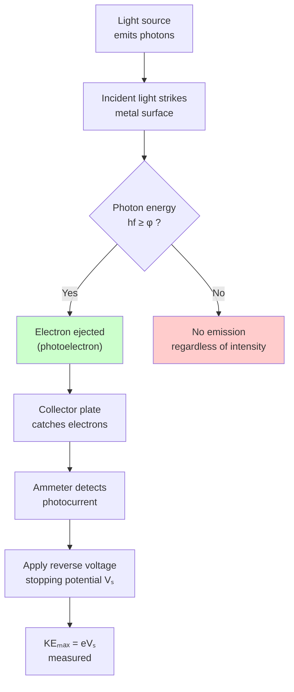
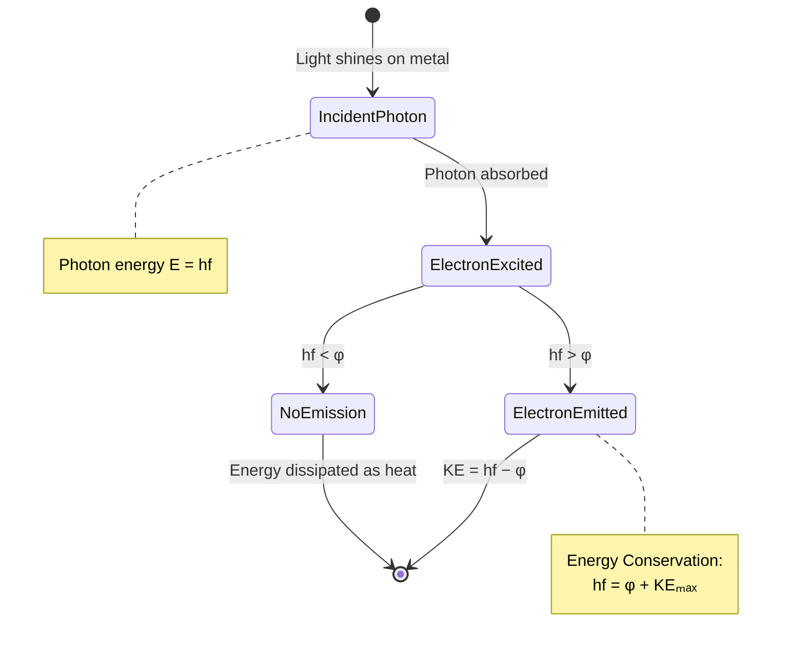

# Photoelectric Effect

The **photoelectric effect** is the emission of electrons from a metal surface when light of suitable frequency shines on it. It is one of the strongest experimental proofs that light behaves as particles called **photons**, not only as waves.

## Definition

When light strikes a metal surface, electrons may be ejected. These emitted electrons are called **photoelectrons**.

## Historical Context

### Classical Wave Theory Failure

According to classical physics (wave theory):
- Light is purely a wave
- Stronger light (higher intensity) should always eject electrons
- Energy should be transferred gradually over time
- Any frequency of light, given enough intensity, should cause emission

**Experimental Observations (contradicting classical theory):**
- Low frequency bright light **cannot** eject electrons
- High-frequency dim light **can** eject electrons **immediately**
- There exists a minimum frequency (threshold) below which no emission occurs

### Experimental Setup & Observations Flowchart

### Einstein's Explanation (1905)

Albert Einstein resolved this paradox using the **photon concept**:
- Light consists of discrete packets called photons
- Each photon carries energy $E = hf$
- One photon interacts with one electron (one-to-one)

This explanation earned Einstein the **Nobel Prize in Physics (1921)**.

## Key Concepts

### 1. Work Function ($\phi$)

The **minimum energy** required to remove an electron from a metal surface.

- Each metal has a characteristic work function
- Depends on the material's atomic structure
- Typical values: 2-5 eV for most metals

### 2. Threshold Frequency ($f_0$)

The **minimum frequency** of light needed to eject electrons from a metal:

$$f_0 = \frac{\phi}{h}$$

Where:
- $f_0$ = threshold frequency (Hz)
- $\phi$ = work function (J)
- $h$ = Planck's constant

**Key point:** If $f < f_0$, no photoelectric effect occurs, regardless of light intensity.

### 3. Three Cases of Photon-Electron Interaction

| Condition | Result |
|-----------|--------|
| $hf < \phi$ | **No emission** — photon energy insufficient |
| $hf = \phi$ | **Electron escapes** with zero kinetic energy |
| $hf > \phi$ | **Electron emitted** with kinetic energy |

## Einstein's Photoelectric Equation

The maximum kinetic energy of ejected electrons:

$$KE_{max} = hf - \phi$$

Where:
- $KE_{max}$ = maximum kinetic energy of photoelectron (J or eV)
- $hf$ = photon energy
- $\phi$ = work function of the metal

**Interpretation:**
- Photon energy $hf$ is transferred to the electron
- Part of this energy ($\phi$) is used to overcome the work function
- Remaining energy becomes kinetic energy of the electron

### Energy Conservation State Diagram

## Intensity vs. Frequency

| Property | Controls |
|----------|----------|
| **Frequency ($f$)** | **Whether** electrons are emitted (energy per photon) |
| **Intensity** | **How many** electrons are emitted (number of photons) |

- **Frequency determines:** If emission occurs at all
- **Intensity determines:** The rate of electron emission (photocurrent)

## Stopping Potential ($V_s$)

The minimum voltage required to stop the most energetic photoelectrons from reaching the anode:

$$KE_{max} = eV_s$$

Where:
- $e$ = electron charge = $1.6 \times 10^{-19}$ C
- $V_s$ = stopping potential (V)

**Measurement:** By applying a reverse voltage and finding the value that reduces photocurrent to zero.

## Graphical Representations

### $KE_{max}$ vs. Frequency Graph

- Linear relationship with slope = $h$ (Planck's constant)
- X-intercept = threshold frequency $f_0$
- Y-intercept = $-\phi$ (negative work function)

### Photocurrent vs. Voltage Graph

- At $V = 0$: current flows (electrons have kinetic energy)
- At $V = V_s$: current stops (stopping potential reached)
- Higher intensity → higher saturation current

## Work Functions of Common Metals

| Metal | Work Function $\phi$ (eV) | Threshold Wavelength (nm) |
|-------|---------------------------|---------------------------|
| Cesium (Cs) | ~2.1 | ~590 |
| Potassium (K) | ~2.3 | ~540 |
| Sodium (Na) | ~2.7 | ~460 |
| Zinc (Zn) | ~4.3 | ~290 |
| Copper (Cu) | ~4.7 | ~264 |

## Applications

- **Photocells** — automatic light sensors
- **Solar panels** — converting light to electricity
- **Photomultiplier tubes** — detecting low light levels
- **Night vision devices**
- **Barcode scanners**
- **Light meters** in cameras

## Significance

The photoelectric effect was pivotal in the development of quantum mechanics because it:

1. **Proved light's particle nature** — photons exist as discrete energy packets
2. **Established energy quantization** — energy transfer occurs in discrete amounts
3. **Led to quantum mechanics** — foundation for modern physics
4. **Demonstrated wave-particle duality** — light exhibits both wave and particle properties

## Related Concepts

- [[Photons]] — the particles of light
- [[Modern Physics — Wave-Particle Duality]] — foundational principle
- [[Planck's Quantum Hypothesis]] — origin of quantization
- [[Compton Effect]] — additional proof of photon momentum
- [[Quantum Mechanics]] — theoretical framework

## Sources

- [[FAD1022 L44 — Photons and Photoelectric Effect]] — primary lecture
- [[FAD1022 L43 — Modern Physics]] — wave-particle duality background
