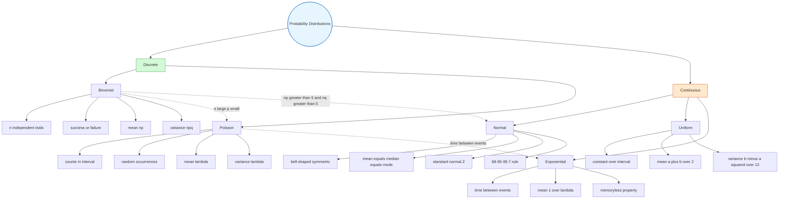

# Probability Distributions

Mathematical functions that describe the probabilities of possible outcomes for random variables.

## Random Variables

A **random variable** is a numerical outcome of a random phenomenon.

- **Discrete**: Countable outcomes (e.g., number of successes)
- **Continuous**: Uncountable outcomes in an interval (e.g., time, weight)

Random variables are denoted by upper-case letters ($X, Y, R, \dots$); particular values by lower-case letters ($x, y, r, \dots$). The probability that $X$ takes value $x$ is written $P(X=x)$.

---

## Distribution Family Tree



## Discrete Random Variables

### Probability Distribution Function (pdf)

For a discrete random variable $X$, the **probability distribution function** (also called the probability mass function, PMF) gives the probability of each possible value:

$$f(x)=P(X=x)$$

It can be presented as a **table** or a **piecewise function**.

**Properties:**
1. $0\leq P(X=x)\leq 1$ for every $x$
2. $\displaystyle\sum_{\text{all }x} P(X=x)=1$

**Example — fair die:**
$$f(x)=\begin{cases}\dfrac{1}{6}, & x=1,2,3,4,5,6 \\ 0, & \text{otherwise}\end{cases}$$

### Cumulative Distribution Function (CDF)

The **cumulative distribution function** $F(t)$ gives the probability that $X$ takes a value less than or equal to $t$:

$$F(t)=P(X\leq t)=\sum_{x_1}^{t} P(X=x)$$

**Key relationships:**
$$P(a<X\leq b)=F(b)-F(a)$$
$$P(X=b)=F(b)-F(a)$$
where $a$ is the value immediately preceding $b$ in the support of $X$.

**Example — fair die CDF:**
$$F(x)=\begin{cases}0, & x<1 \\ \dfrac{1}{6}, & 1\leq x<2 \\ \dfrac{2}{6}, & 2\leq x<3 \\ \vdots \\ 1, & x\geq 6\end{cases}$$

---

## Expected Value & Variance (Discrete)

For a discrete random variable $X$ with probability distribution $P(X = x)$:

**Mean (Expected Value):**
$$\mu = E(X) = \sum x \, P(X = x)$$

**Expectation of a Function $g(X)$:**
$$E[g(X)] = \sum g(x) \, P(X = x)$$

Frequently used case: $g(X) = X^2$:
$$E(X^2) = \sum x^2 \, P(X = x)$$

**Variance:**
$$\text{Var}(X) = \sigma^2 = \sum (x - \mu)^2 \, P(X = x)$$

**Computational form:**
$$\text{Var}(X) = E(X^2) - [E(X)]^2 = E(X^2) - \mu^2$$

**Standard Deviation:**
$$\sigma = \sqrt{\text{Var}(X)}$$

**Rules for Constants $a$ and $b$:**
- $E(a) = a$; $\quad \text{Var}(a) = 0$
- $E(aX) = a\,E(X)$; $\quad \text{Var}(aX) = a^2\,\text{Var}(X)$
- $E(aX + b) = a\,E(X) + b$; $\quad \text{Var}(aX + b) = a^2\,\text{Var}(X)$

**Mode and Median:**
- **Mode:** The value of $x$ with the greatest probability.
- **Median ($m$):** The value such that $P(X \leq m) = 0.5$, i.e. $F(m) = 0.5$.

---

## Named Discrete Distributions

### Binomial Distribution
Models number of successes in $n$ independent Bernoulli trials.

**Four Conditions (all must hold):**
1. Fixed number of trials ($n$ identical trials)
2. Each trial has only two possible outcomes — success or failure
   - $P(\text{success}) = p$
   - $P(\text{failure}) = 1-p = q$
3. The trials are independent
4. The probability of the two outcomes remains constant

**PMF:**
$P(X = x) = \binom{n}{x} p^x (1-p)^{n-x} = \frac{n!}{x!(n-x)!} \cdot p^x \cdot q^{n-x}$

**Mean:** $\mu = np$

**Variance:** $\sigma^2 = npq$

**Standard Deviation:** $\sigma = \sqrt{npq}$

**Using the Binomial Table (Cumulative $P(X \geq r)$):**

| Probability Wanted | Table Reading Rule |
|--------------------|-------------------|
| $P(X \geq x)$ | Read directly from table |
| $P(X \leq x)$ | $1 - P(X \geq x+1)$ |
| $P(X < x)$ | $1 - P(X \geq x)$ |
| $P(X = x)$ | $P(X \geq x) - P(X \geq x+1)$ |
| $P(X > x)$ | $P(X \geq x+1)$ |

**When $p > 0.5$:** Flip success and failure. If $X \sim B(n, p)$ with $p > 0.5$, let $Y = n - X$. Then $Y \sim B(n, 1-p)$ where $1-p \leq 0.5$, and the table can be used on $Y$.

**Real-life applications:**
- Medical trials (patients experiencing side effects)
- Banking (fraudulent credit card transactions)
- Flood control (river overflows per year)
- Retail (shopping returns per week)

---

### Poisson Distribution
Models the number of occurrences of an event over a fixed interval with constant average rate.

**Conditions:**
- $X$ is a **discrete** random variable
- $X$ counts the number of occurrences of an event **over some interval** (time, distance, area, volume)
- Occurrences must be **random** (no pattern, unpredictable)
- Occurrences must be **independent** of each other

**Notation:**
$$X \sim P_o(\lambda)$$

**PMF:**
$$P(X = x) = \frac{\lambda^x e^{-\lambda}}{x!}, \quad x = 0, 1, 2, \ldots$$

where $\lambda > 0$ is the mean number of occurrences in the interval.

**Mean:** $\mu = \lambda$

**Variance:** $\sigma^2 = \lambda$

**Standard Deviation:** $\sigma = \sqrt{\lambda}$

**Poisson Tables:** Cumulative upper-tail probabilities $P(X \geq r)$ are tabulated for common $\lambda$ values, allowing quick lookup without direct computation.

**Applications:** Patients arriving at emergency ward, defective items in production, accidents on a highway, customers at a store, television sets sold in a week

## Continuous Distributions

### Cumulative Distribution Function (CDF)

For a continuous random variable $X$ with PDF $f(x)$, the **cumulative distribution function** $F(t)$ gives the probability that $X$ takes a value less than or equal to $t$:

$$F(t) = P(X \leq t) = \int_{-\infty}^{t} f(x)\,dx$$

**Key properties:**
1. **Boundary values:** If the domain is $x_0 \leq x \leq x_1$, then $F(x_0) = 0$ and $F(x_1) = 1$.
2. **Interval probability:** $P(a \leq X \leq b) = F(b) - F(a)$.
3. **Median:** $F(m) = \dfrac{1}{2}$.
4. **Recovering the PDF:** $\dfrac{d}{dx}F(x) = f(x)$.

---

### Probability Density Function (PDF)

For a continuous random variable $X$, the **probability density function** $f(x)$ satisfies:

1. $f(x) \geq 0$ for all $x$.
2. The total area under the graph is $1$:
   $$\int_{-\infty}^{\infty} f(x)\,dx = 1$$
3. Probability over an interval:
   $$P(a \leq X \leq b) = \int_a^b f(x)\,dx$$

**Key facts:**
- $P(a \leq X \leq b) = P(a \leq X < b) = P(a < X \leq b) = P(a < X < b)$
- $P(X = a) = 0$ for any specific value $a$

---

### Mean, Variance & Linear Transformations (General Continuous)

**Mean (Expected Value):**
$$\mu = E(X) = \int_{-\infty}^{\infty} x\,f(x)\,dx$$

**Expectation of a Function $g(X)$:**
$$E[g(X)] = \int_{-\infty}^{\infty} g(x)\,f(x)\,dx$$

Frequently used case: $g(X) = X^2$:
$$E(X^2) = \int_{-\infty}^{\infty} x^2\,f(x)\,dx$$

**Rules for Expectation** ($a$, $b$ constants):
- $E(a) = a$
- $E(aX) = a\,E(X)$
- $E(aX + b) = a\,E(X) + b$

**Variance:**
$$\text{Var}(X) = \sigma^2 = \int_{-\infty}^{\infty} (x - \mu)^2\,f(x)\,dx$$

**Computational forms:**
$$\text{Var}(X) = \int_{-\infty}^{\infty} x^2\,f(x)\,dx - \mu^2 = E(X^2) - [E(X)]^2$$

**Standard Deviation:**
$$\sigma = \sqrt{\text{Var}(X)}$$

**Rules for Variance** ($a$, $b$ constants):
- $\text{Var}(a) = 0$
- $\text{Var}(aX) = a^2\,\text{Var}(X)$
- $\text{Var}(aX + b) = a^2\,\text{Var}(X)$ *(adding a constant does not affect spread)*

*(See [[FAD1015 Week 6 — Continuous Random Variables]] for full derivation and worked examples.)*

---

### Normal Distribution
The most important continuous distribution in statistics. Bell-shaped, symmetric, also known as the Gaussian distribution.

**PDF:**
$$f(x) = \frac{1}{\sigma\sqrt{2\pi}} \exp\left(\frac{-(x-\mu)^2}{2\sigma^2}\right), \quad -\infty < x < +\infty$$

**Notation:** $X \sim N(\mu, \sigma^2)$

**Key Properties:**
- **Bell-shaped**, symmetric about mean
- **Unimodal** (single peak)
- **Mean = Median = Mode**
- Asymptotic to x-axis (never touches)
- Defined by two parameters: mean $\mu$ and standard deviation $\sigma$
- Changing $\mu$ shifts the curve left/right
- Changing $\sigma$ changes spread (larger $\sigma$ = wider/flatter)

**Empirical Rule (68-95-99.7):**
| Interval | Approximate Probability |
|----------|-------------------------|
| $\mu \pm \sigma$ | 68% (0.6827) |
| $\mu \pm 2\sigma$ | 95% (0.9545) |
| $\mu \pm 3\sigma$ | 99.7% (0.9973) |

---

**Standard Normal Distribution:**

The normal distribution with $\mu = 0$ and $\sigma = 1$ is the **standard normal distribution**.

$$Z \sim N(0, 1)$$

**Z-Transformation (Standardization):**
Any $X \sim N(\mu, \sigma^2)$ can be transformed to $Z \sim N(0, 1)$:

$$Z = \frac{X - \mu}{\sigma}$$

Z-values (Z scores) represent the number of standard deviations a value is from the mean.

**Symmetry Properties:**
- $P(Z < 0) = P(Z > 0) = 0.5$
- $P(Z < -z) = P(Z > z)$
- $P(Z > -z) = 1 - P(Z > z)$

---

**Using Standard Normal Tables:**

Standard normal tables typically give $P(Z > z)$ — the area in the right tail.

| Probability Wanted | Formula Using Table |
|--------------------|---------------------|
| $P(Z > a)$ | Read directly from table |
| $P(Z < a)$ | $1 - P(Z > a)$ |
| $P(a < Z < b)$ | $P(Z > a) - P(Z > b)$ |
| $P(\|Z\| < a)$ | $1 - 2 \cdot P(Z > a)$ |

---

**Normal Approximation to Binomial:**

For $X \sim B(n, p)$, when the following conditions are met:
- $np > 5$ and $nq > 5$ (where $q = 1 - p$)
- Or equivalently: $np \geq 5$ and $nq \geq 5$

Then $X$ can be approximated by $Y \sim N(\mu, \sigma^2)$ where:
- $\mu = np$
- $\sigma^2 = npq$
- $\sigma = \sqrt{npq}$

**Continuity Correction:**

Since binomial is discrete and normal is continuous, apply continuity correction:

| Discrete | Continuous Equivalent |
|----------|----------------------|
| $P(X \leq k)$ | $P(Y < k + 0.5)$ |
| $P(X < k)$ | $P(Y < k - 0.5)$ |
| $P(X \geq k)$ | $P(Y > k - 0.5)$ |
| $P(X > k)$ | $P(Y > k + 0.5)$ |
| $P(X = k)$ | $P(k - 0.5 < Y < k + 0.5)$ |
| $P(a \leq X \leq b)$ | $P(a - 0.5 < Y < b + 0.5)$ |

---

**Real-World Applications:**
- Test scores and academic performance
- Heights and weights of populations
- Measurement errors in scientific experiments
- Quality control in manufacturing (product dimensions)
- Blood pressure readings in medical studies
- Financial returns (often modeled as normal)
- Approximating binomial probabilities for large samples

---

### Uniform Distribution
Constant probability over interval $[a, b]$.

**PDF:**
$$f(x) = \begin{cases} \dfrac{1}{b-a} & a \leq x \leq b \\[6pt] 0 & \text{otherwise} \end{cases}$$

**CDF:**
$$F(x) = \begin{cases} 0 & x < a \\[6pt] \dfrac{x-a}{b-a} & a \leq x \leq b \\[6pt] 1 & x > b \end{cases}$$

**Mean:** $\dfrac{a+b}{2}$

**Standard Deviation:** $\sigma = \dfrac{b-a}{\sqrt{12}}$

**Variance:** $\dfrac{(b-a)^2}{12}$

---

### Exponential Distribution
Models time between events in a Poisson process with rate $\lambda$.

**PDF:**
$$f(x) = \lambda e^{-\lambda x}, \quad x \geq 0$$

**CDF:**
$$F(x) = 1 - e^{-\lambda x}, \quad x \geq 0$$

**Mean:** $\dfrac{1}{\lambda}$

**Standard Deviation:** $\sigma = \dfrac{1}{\lambda}$

**Variance:** $\dfrac{1}{\lambda^2}$

Note: For the exponential distribution, the mean equals the standard deviation.

**Memoryless Property:**
$$P(X > s + t \mid X > s) = P(X > t) = e^{-\lambda t}$$

---

## Sampling Distributions

A **sampling distribution** is the probability distribution of a statistic (such as the sample mean) obtained from all possible samples of a given size from a population. It bridges probability theory and statistical inference.

### Sampling Distribution of the Mean

If repeated random samples of size $n$ are drawn from a population with mean $\mu$ and standard deviation $\sigma$, the distribution of the sample mean $\bar{X}$ has:

**Mean:**
$$\mu_{\bar{X}} = \mu$$

**Standard Error (SE):**
$$\sigma_{\bar{X}} = \frac{\sigma}{\sqrt{n}}$$

**If the population is normal:**
$$\bar{X} \sim N\left(\mu, \frac{\sigma}{\sqrt{n}}\right)$$

This holds **regardless of sample size** when the population is normally distributed.

### Central Limit Theorem (CLT)

For **any** population distribution with finite mean $\mu$ and variance $\sigma^2$:

> As $n \to \infty$, the sampling distribution of $\bar{X}$ approaches $N(\mu, \sigma/\sqrt{n})$.

**Practical guidelines:**
- $n \geq 30$: CLT applies well for most population shapes
- $n \geq 5$: Often sufficient for fairly symmetric populations
- Normal population: sampling distribution is normal for **any** $n$

The CLT is foundational because it allows probability calculations for sample means without knowing the exact shape of the population distribution.

### Standardized Sample Mean

To find probabilities involving $\bar{X}$, standardize using:

$$Z = \frac{\bar{X} - \mu}{\sigma/\sqrt{n}} \sim N(0, 1)$$

## Distribution Relationships

```
Poisson Process
    ├── Poisson: Number of events in fixed time (discrete)
    └── Exponential: Time until next event (continuous)
```

**Approximations:**
- **Binomial $\approx$ Poisson** when $n$ is large and $p$ is small:
  - Test: $n > 20$ and $np < 5$ **or** $nq < 5$
  - New parameter: $\lambda = np$
- **Binomial $\approx$ Normal** when $np \geq 5$ and $n(1-p) \geq 5$

## Related Sources

- [[FAD1015 L13 — Binomial Distribution]]
- [[FAD1015 L14 — Poisson Distribution]]
- [[FAD1015 L15-L16 — Normal Distribution & Approximation]]
- [[FAD1015 L17-L18 — Uniform & Exponential Distributions + R Intro]]
- [[FAD1015 L20 — Sampling Distribution of the Mean]]

## Related Courses

- [[FAD1015 - Mathematics III]]
