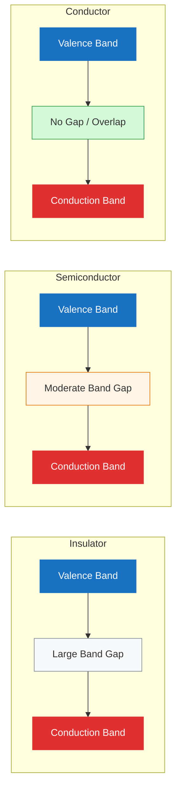
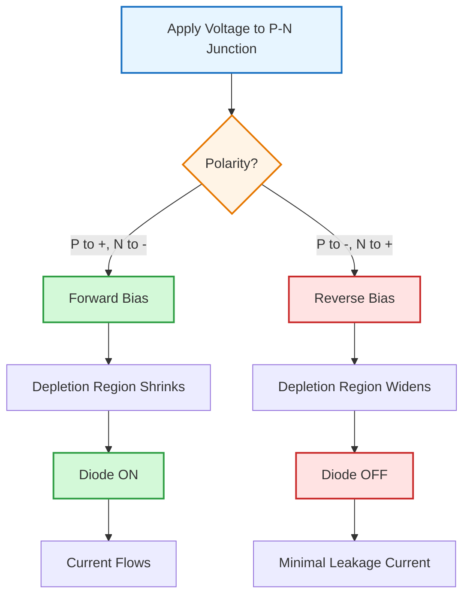
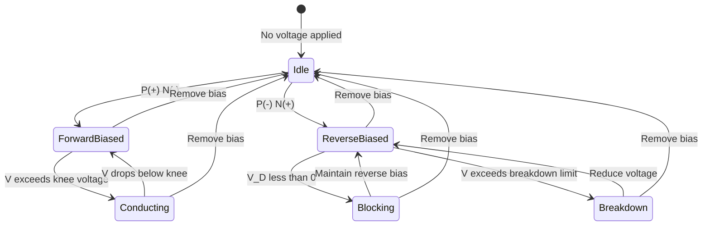

# Semiconductors & Diodes

Physics of semiconductor materials and p-n junction devices.

## Definition

Semiconductors are materials with electrical conductivity between conductors and insulators. Their conductivity can be controlled by doping, temperature, and electric fields. Diodes are semiconductor devices that allow current to flow primarily in one direction.

## Band Theory

- **Valence band**: energy band occupied by valence electrons bound to atoms
- **Conduction band**: energy band consisting of free electrons that are highly mobile and responsible for electrical conductivity. These free electrons originate from the valence band when energized/excited (receive energy).
- **Band gap ($E_g$)**: energy difference between valence and conduction bands

| Material | Band Gap Characteristic | Conductivity |
|---|---|---|
| Insulator | Large band gap | Electrons cannot easily jump to conduction band; very low conductivity |
| Semiconductor | Moderate band gap | Some electrons can be excited to conduction band; conductivity between insulator and conductor |
| Conductor | Overlapping or very small gap | Free electrons readily available; high conductivity |

## Intrinsic vs Extrinsic Semiconductors

**Intrinsic Semiconductors**
- Pure Si or Ge
- Equal electron-hole pairs
- Conductivity depends on temperature

**Extrinsic Semiconductors**
- Created by **doping** — adding impurity atoms to improve conductivity
- Have two charge carriers: (1) electrons, (2) holes

### Doping

**N-Type Semiconductor**
- Add element with **five valence electrons** into Si crystallite structure
- Donor atoms: antimony (Sb), arsenic (As), phosphorus (P)
- Electrons are **majority** charge carriers; holes are minority carriers

**P-Type Semiconductor**
- Add element with **three valence electrons** into Si crystallite structure
- Acceptor atoms: boron (B), gallium (Ga), indium (In)
- Holes are **majority** charge carriers; electrons are minority carriers

Both holes and electrons drive current.

### Charge Carriers: Holes and Electrons

A hole is the "opposite" of an electron. Unlike an electron which has negative charge, holes have positive charge equal in magnitude but opposite in polarity. Holes are not physical particles; they are the **absence of an electron** in an atom. Holes can move from atom to atom in semiconducting materials as electrons leave their positions.

- Holes move from **positive to negative** in the direction of conventional current flow
- Electrons move from **negative to positive**

## P-N Junction

A diode is created by joining p-type and n-type material.

### Formation of Depletion Region

At the instant the two materials are joined:
1. Electrons from the n-region which have reached the conduction band are free to **diffuse** across the junction and combine with holes
2. The combination results in a lack of carriers in the region near the junction — the **Depletion Region**
3. Filling a hole makes a negative ion and leaves behind a positive ion on the n-side
4. A **space charge** builds up, creating a depletion region which inhibits any further electron transfer unless it is helped by putting a forward bias on the junction

### Biasing

| Bias Condition | Connection | Depletion Region | Diode State | Current |
|---|---|---|---|---|
| No bias | — | Natural width | — | None |
| Forward bias ($V_D > 0$) | p-region to positive terminal, n-region to negative terminal | Reduced | ON | Flows |
| Reverse bias ($V_D < 0$) | p-region to negative terminal, n-region to positive terminal | Widened | OFF | Minimal (leakage) |

### Knee Voltage (Cut-in Voltage)

Minimum voltage at which the forward-biased diode starts conducting current. Also known as cut-in voltage, offset, threshold, or firing potential.

| Semiconductor | Knee Voltage ($V_\gamma$) |
|---|---|
| Germanium (Ge) | 0.3 V |
| Silicon (Si) | 0.7 V |
| Gallium Arsenide (GaAs) | 1.5 V |

Circuit must be supplied with knee voltage (or more) for current to conduct.

### Temperature Effects on Diode Characteristics

When temperature increases:
1. Thermal energy of electrons and holes within the silicon crystal increases
2. Easier for charge carriers to overcome the potential barrier at the p-n junction
3. The knee of the I-V curve shifts to the left — diode turns on at a **lower forward voltage**

## Diode I-V Characteristic

### Ideal Diode Equation

$$I = I_0\left(e^{qV/kT} - 1\right)$$

Where:
- $I$ = diode current
- $I_0$ = reverse saturation current
- $q$ = electron charge
- $V$ = applied voltage
- $k$ = Boltzmann constant
- $T$ = temperature (K)

### Breakdown

- **Zener breakdown**: occurs at low reverse voltages due to tunneling
- **Avalanche breakdown**: occurs at high reverse voltages due to carrier multiplication

## Diode Circuit Configurations

### DC Analysis

**Series — Forward Bias (ON)**
- Replace Si diode with 0.7 V voltage source (knee voltage)
- Apply KVR: $E - V_R - V_D = 0$
- $I_D = I_R = V_R / R$

**Series — Reverse Bias (OFF)**
- Replace diode with open circuit
- $I_D = I_R = 0$ A
- $V_D = E - V_R = E$ (open circuit can have any voltage, current is always 0)

**Parallel Configuration**
- Voltage across parallel branches is the same
- Diode acts as **voltage limiter** — potential difference limited to knee voltage

**Multiple Diodes in Parallel**
- The diode with lowest knee voltage turns ON first and maintains its voltage
- Other diodes never reach their required knee voltage and remain OFF
- Example: Ge (0.3 V) and Si (0.7 V) in parallel → Ge conducts, Si stays OFF

### AC Applications

**Half-Wave Rectifier**
- Process of removing one-half the input signal to establish a DC level
- Positive cycle: $V_O = V_m - V_D$ (current flows)
- Negative cycle: $V_O = 0$ (no current)
- Average DC value: $V_{DC} = 0.318(V_m - V_D)$

**Clippers**
- Clip off a portion of the input signal
- Output taken across diode
- Can limit positive or negative portions depending on configuration

**Clampers**
- Shift DC level of input signal (not covered in detail in L34)

### Capacitor in Semiconductor Circuits

A capacitor placed in series can **block DC current** from flowing through a path. When used for this purpose, it is called a **blocking capacitor**.

## Key Formulas

| Formula | Description |
|---------|-------------|
|$I = I_0(e^{qV/kT} - 1)$ | Diode equation |
|$n_i = \sqrt{N_c N_v}e^{-E_g/2kT}$ | Intrinsic carrier concentration |
|$\sigma = q(n\mu_n + p\mu_p)$ | Conductivity |
|$V_{bi} = \frac{kT}{q}\ln\left(\frac{N_A N_D}{n_i^2}\right)$ | Built-in potential |
|$W = \sqrt{\frac{2\varepsilon_s V_{bi}}{q}\left(\frac{1}{N_A} + \frac{1}{N_D}\right)}$ | Depletion width |
|$V_{DC} = 0.318(V_m - V_D)$ | Half-wave rectifier average DC output |
|$E - V_R - V_D = 0$ | KVR for series diode circuit (forward bias) |

## Related Concepts

- [[Transistors & Biasing]] — semiconductor devices built on p-n junctions
- [[Operational Amplifiers]] — circuits using semiconductor devices
- [[Atomic Physics]] — electron energy levels, band structure

## Course Links

- [[FAD1022 - Basic Physics II]] — main course page
- [[FAD1022 L34-L38 — Semiconductors & Op-Amps]] — lecture source
- [[Zainal Abidin (ZAA)]] — lecturer