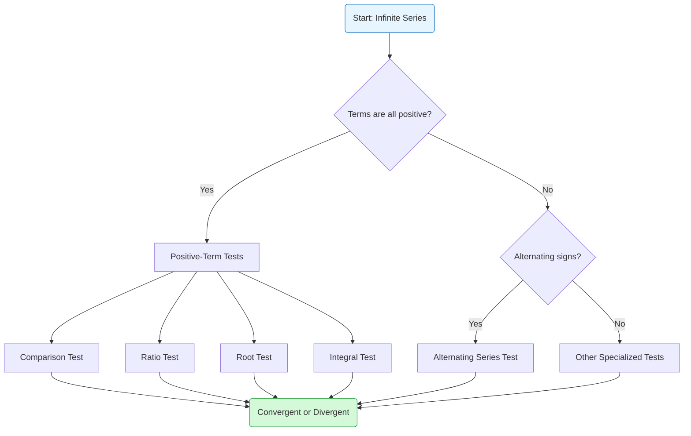
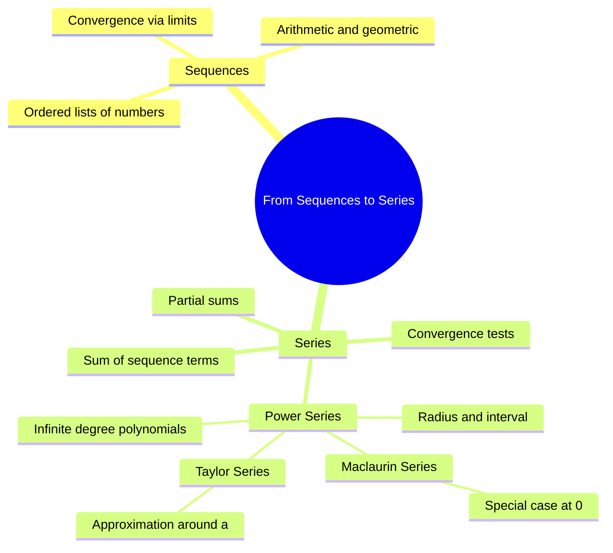

# Series

A **series** is the sum of the terms of a sequence.

## Definition

If $a_1, a_2, a_3, \ldots, a_n, \ldots$ is a **sequence**, then:

$$a_1 + a_2 + a_3 + \cdots + a_n + \cdots$$

is called a **series**.

> [!note] Key Distinction
> - **Sequence**: $a_1, a_2, a_3, \ldots$ (list of terms)
> - **Series**: $a_1 + a_2 + a_3 + \ldots$ (sum of terms)

---

## Types of Series

### Finite Series

A series with a finite number of terms.

$$S_n = a_1 + a_2 + a_3 + \cdots + a_n = \sum_{k=1}^{n} a_k$$

This is also called a **partial sum** of an infinite series.

### Infinite Series

A series with infinitely many terms.

$$S = a_1 + a_2 + a_3 + \cdots = \sum_{k=1}^{\infty} a_k$$

---

## Summation Notation

The **sigma notation** $\Sigma$ provides a compact way to write series.

### Basic Notation

$$\sum_{k=1}^{n} a_k = a_1 + a_2 + a_3 + \cdots + a_n$$

| Component | Meaning |
|-----------|---------|
| $\Sigma$ | Summation symbol (Greek letter sigma) |
| $k=1$ | Lower limit (starting index) |
| $n$ | Upper limit (ending index) |
| $a_k$ | General term |
| $k$ | Index of summation |

### Examples

| Series | Sigma Notation |
|--------|----------------|
| $1 + 2 + 3 + \cdots + n$ | $\displaystyle\sum_{k=1}^{n} k$ |
| $1 + 4 + 9 + 16 + \cdots + 100$ | $\displaystyle\sum_{k=1}^{10} k^2$ |
| $a_1 + a_2 + a_3 + \cdots$ | $\displaystyle\sum_{k=1}^{\infty} a_k$ |

---

## Standard Summation Formulas

### Constant Series

$$\sum_{k=1}^{n} c = nc \quad \text{(where $c$ is a constant)}$$

### Arithmetic Series

$$\sum_{k=1}^{n} k = \frac{n(n+1)}{2}$$

$$\sum_{k=1}^{n} k^2 = \frac{n(n+1)(2n+1)}{6}$$

$$\sum_{k=1}^{n} k^3 = \left[\frac{n(n+1)}{2}\right]^2$$

### Geometric Series

$$\sum_{k=0}^{n} r^k = \frac{1-r^{n+1}}{1-r} \quad \text{(for $r \neq 1$)}$$

For infinite geometric series with $|r| < 1$:

$$\sum_{k=0}^{\infty} r^k = \frac{1}{1-r}$$

---

## Convergence of Series

### Convergent Series

An infinite series $\sum_{k=1}^{\infty} a_k$ is **convergent** if the sequence of partial sums converges to a finite limit.

$$S = \lim_{n \to \infty} S_n = \sum_{k=1}^{\infty} a_k$$

### Divergent Series

If the sequence of partial sums does not approach a finite limit, the series is **divergent**.

---

## Convergence Tests Flowchart

The following flowchart outlines the common convergence tests used to determine whether an infinite series converges or diverges:

---

## Related Concepts

- [[Sequences]] — the underlying ordered list
- [[Binomial Expansion]] — expansion of $(a+b)^n$ as a series
- [[Power Series — Taylor & Maclaurin]] — function representations as series
- [[FAD1014 L21 — Introduction to Series]] — lecture source

---

## Concept Map

