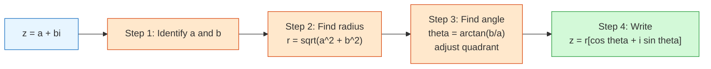

# FAC1004 L01 — Complex Numbers

Introduction to complex numbers: definition, arithmetic operations, polar form, and basic properties.

## Key Concepts

- **Complex Numbers** — definition of $i = \sqrt{-1}$, standard form $z = a + bi$
- **Imaginary Unit** — powers of $i$ cycle every 4: $i^0 = 1$, $i^1 = i$, $i^2 = -1$, $i^3 = -i$, $i^4 = 1$
- **Arithmetic Operations** — addition, subtraction, multiplication, division of complex numbers
- **Complex Conjugate** — $\overline{z} = a - bi$ and its reflection on the [[Argand Diagram]]
- **Modulus** — $|z| = \sqrt{a^2 + b^2}$
- **Roots of Complex Numbers** — finding square roots of complex numbers by equating real and imaginary parts
- **Polar Form** — $z = r[\cos\theta + i\sin\theta]$ where $r = |z|$ and $\theta = \arg(z)$
- **Principal Argument** — $-\pi < \theta \leq \pi$
- **Polar Multiplication & Division** — $z_1 z_2 = r_1 r_2[\cos(\theta_1 + \theta_2) + i\sin(\theta_1 + \theta_2)]$ and $\frac{z_1}{z_2} = \frac{r_1}{r_2}[\cos(\theta_1 - \theta_2) + i\sin(\theta_1 - \theta_2)]$

## Introduction: Solving Quadratic Equations with Negative Discriminant

The lecture begins by motivating complex numbers through quadratic equations that have no real solutions.

- $x^2 = -16$ has no real solution; introducing $i$ gives $x = \pm 4i$
- Example: Find the discriminant for $x^2 - 2x + 17 = 0$
  - Using $x = \frac{-b \pm \sqrt{b^2 - 4ac}}{2a}$
  - Discriminant $b^2 - 4ac = 4 - 68 = -64 < 0$, so complex roots exist

## Definition of Complex Numbers

A **complex number** is defined as $z = a + ib$ where:
- $a$ is the **real part**: $\text{Re}(z) = a$
- $b$ is the **imaginary part**: $\text{Im}(z) = b$
- $i$ is the imaginary unit with $i^2 = -1$

### Number System Hierarchy (Lecture Venn Diagram)
$$\mathbb{N} \subset \mathbb{Z} \subset \mathbb{Q} \subset \mathbb{R} \subset \mathbb{C}$$

| $z = a + ib$ | $2 + 3i$ | $-1 - i\pi$ | $10i$ | $3$ | $0$ |
|---|---|---|---|---|---|
| $\text{Re}(z)$ | $2$ | $-1$ | $0$ | $3$ | $0$ |
| $\text{Im}(z)$ | $3$ | $-\pi$ | $10$ | $0$ | $0$ |

### Example
For $z = 6 - 3i$:
- $\text{Re}(z) = 6$
- $\text{Im}(z) = -3$

### Argand Diagram
The lecture presents the **Argand diagram** (complex plane):
- Horizontal axis: **Real axis**
- Vertical axis: **Imaginary axis**
- A complex number $z = a + ib$ is plotted at point $(a, b)$
- The **complex conjugate** $\overline{z} = a - ib$ is the reflection of $z$ across the real axis
- The angle $\theta$ from the positive real axis to the line joining the origin to $z$ is the **argument**

## Arithmetic of Imaginary Numbers

### Powers of $i$

| $i^0$ | $i^1$ | $i^2$ | $i^3$ |
|:---:|:---:|:---:|:---:|
| $1$ | $i$ | $-1$ | $-i$ |

| $i^4$ | $i^5$ | $i^6$ | $i^7$ |
|:---:|:---:|:---:|:---:|
| $1$ | $i$ | $-1$ | $-i$ |

The cycle repeats every 4 powers.

### Examples: Express in the form $a + ib$

**i)** $2i^3 - 3i^2 + 5i$

**ii)** $3i^5 - i^4 + 7i^3$

**iii)** $\frac{5}{i} + \frac{2}{i^3} - \frac{20}{i^{18}}$

*(Student Version — worked solutions to be completed in class)*

## Algebraic Operations of Complex Numbers

Given $z_1 = 2 + 4i$ and $z_2 = 1 - 3i$:

**i) Subtraction:**
$$z_1 - z_2 = (2 + 4i) - (1 - 3i)$$

**ii) Multiplication:**
$$z_1 z_2 = (2 + 4i)(1 - 3i)$$

**iii) Division:**
$$\frac{z_1}{z_2} = \frac{2 + 4i}{1 - 3i}$$

*(Student Version — worked solutions to be completed in class)*

### General Formulas
- **Addition/Subtraction:** $(a + bi) \pm (c + di) = (a \pm c) + (b \pm d)i$
- **Multiplication:** $(a + bi)(c + di) = (ac - bd) + (ad + bc)i$
- **Division:** Multiply numerator and denominator by the conjugate of the denominator

## Roots of Complex Numbers

**Example:** Find the square root of $z = 5 + 12i$

Let $z_1 = a + bi$ such that $(z_1)^2 = 5 + 12i$.

Equate real and imaginary parts to solve for $a$ and $b$.

*(Student Version — worked solution to be completed in class)*

## Polar Form

The polar form of a complex number is:
$$z = r[\cos\theta + i\sin\theta]$$

### Conversion Procedure (4 Steps)



Given $z = a + bi$:
1. **Identify** $a$ and $b$
2. **Find the radius:** $r = \sqrt{a^2 + b^2}$
3. **Find the angle:** $\theta = \tan^{-1}\left(\frac{b}{a}\right)$
   - **Note:** $-\pi < \theta \leq \pi$ (Principal Argument)
4. **Write:** $z = r[\cos\theta + i\sin\theta]$

### Examples
- Write $z = -4 + 4i$ in polar form
- Write $z = \sqrt{3} - i$ in polar form

*(Student Version — worked solutions to be completed in class)*

## Multiplication and Division in Polar Form

For $z_1 = r_1[\cos\theta_1 + i\sin\theta_1]$ and $z_2 = r_2[\cos\theta_2 + i\sin\theta_2]$:

### Multiplication Rule
$$z_1 z_2 = r_1 r_2[\cos(\theta_1 + \theta_2) + i\sin(\theta_1 + \theta_2)]$$

*Derivation shown in lecture via expansion and application of cosine/sine addition formulas.*

### Division Rule
$$\frac{z_1}{z_2} = \frac{r_1}{r_2}[\cos(\theta_1 - \theta_2) + i\sin(\theta_1 - \theta_2)]$$

### Example
Find the product and division for:
- $z_1 = -1 + i$
- $z_2 = \sqrt{3} + i$

*(Student Version — worked solutions to be completed in class)*

```mermaid
mindmap
  root((Complex Numbers))
    Standard Form z = a + bi
      Real part Re(z) = a
      Imaginary part Im(z) = b
    Argand Diagram
      Real axis horizontal
      Imaginary axis vertical
      Modulus |z| = sqrt(a^2 + b^2)
      Argument theta
    Operations
      Addition/Subtraction
      Multiplication
      Division via conjugate
    Polar Form
      z = r[cos theta + i sin theta]
      Conversion 4 steps
      Multiplication: multiply r add theta
      Division: divide r subtract theta
    Powers of i
      Cycle every 4
      i^2 = -1
```

## Summary

This lecture introduces the fundamental concept of complex numbers as an extension of real numbers. Students learn to:
1. Identify real and imaginary parts of complex numbers
2. Simplify powers of $i$ and express imaginary expressions in $a + bi$ form
3. Perform basic arithmetic operations on complex numbers
4. Find complex roots by equating real and imaginary parts
5. Convert between Cartesian and polar representations
6. Multiply and divide complex numbers in polar form

## Related

- [[FAC1004 - Advanced Mathematics II (Computing)]] — main course page
- [[Complex Numbers]] — concept page
- [[FAC1004 L02 — Euler's Formula]] — next lecture
- [[FAC1004 L5-L6 — Functions of Complex Numbers (n-th Roots)]] — advanced complex functions

## Source File

`LECTURE_NOTES_2526/L01 - Complex Number Student Version.pdf`
