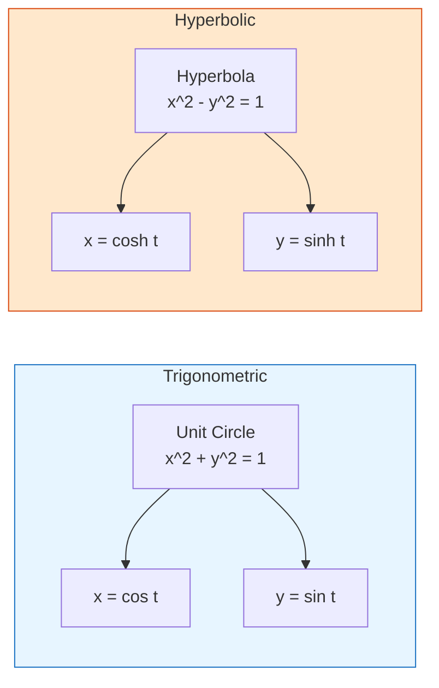
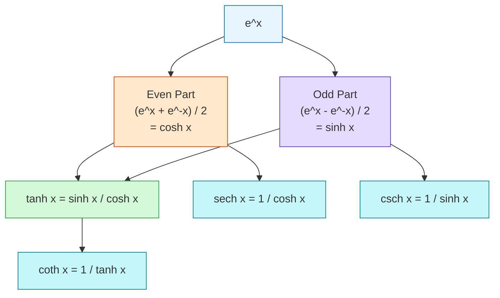
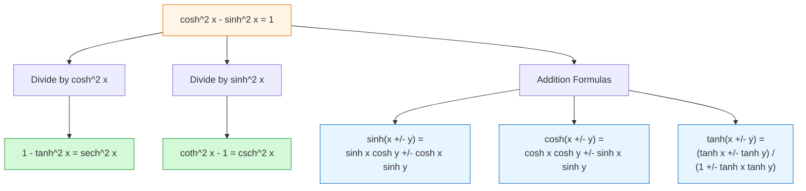

# FAC1004 L17 — Hyperbolic Functions

## Learning Outcomes

1. To understand hyperbolic functions.
2. To understand basic hyperbolic identities.

---

## Motivation: From Trigonometry to Hyperbolics

In trigonometry, for any angle $t$, the intersection of the terminal side and the unit circle has coordinates:
- $x = \cos t$
- $y = \sin t$

Hyperbolic functions are analogs defined using the **hyperbola** instead of the unit circle. They arise as combinations of the exponential functions $e^x$ and $e^{-x}$.

---

## Even and Odd Decomposition of $e^x$

Any function $f(x)$ can be expressed as the sum of an **even function** and an **odd function**:

$$f(x) = \underbrace{\frac{f(x) + f(-x)}{2}}_{\text{even}} + \underbrace{\frac{f(x) - f(-x)}{2}}_{\text{odd}}$$

Applying this to $f(x) = e^x$:

$$e^x = \underbrace{\frac{e^x + e^{-x}}{2}}_{\text{hyperbolic cosine}} + \underbrace{\frac{e^x - e^{-x}}{2}}_{\text{hyperbolic sine}}$$

This decomposition is the foundation of all hyperbolic functions.

---

## Definitions

### Hyperbolic Sine ($\sinh x$)

$$\sinh x = \frac{e^x - e^{-x}}{2} = \frac{1}{2}e^x - \frac{1}{2}e^{-x}$$

- **Domain:** $(-\infty, \infty)$
- **Range:** $(-\infty, \infty)$
- **Parity:** Odd function ($\sinh(-x) = -\sinh x$)
- **Graph:** Passes through the origin, increasing monotonically. Can be visualized as the difference of $y = \frac{1}{2}e^x$ and $y = \frac{1}{2}e^{-x}$.

### Hyperbolic Cosine ($\cosh x$)

$$\cosh x = \frac{e^x + e^{-x}}{2} = \frac{1}{2}e^x + \frac{1}{2}e^{-x}$$

- **Domain:** $(-\infty, \infty)$
- **Range:** $[1, \infty)$
- **Parity:** Even function ($\cosh(-x) = \cosh x$)
- **Graph:** U-shaped curve with minimum at $(0, 1)$. Can be visualized as the sum of $y = \frac{1}{2}e^x$ and $y = \frac{1}{2}e^{-x}$.

### Hyperbolic Tangent ($\tanh x$)

$$\tanh x = \frac{\sinh x}{\cosh x} = \frac{e^x - e^{-x}}{e^x + e^{-x}}$$

- **Domain:** $(-\infty, \infty)$
- **Range:** $(-1, 1)$
- **Parity:** Odd function
- **Horizontal Asymptotes:** $y = -1$ and $y = 1$
- **Graph:** S-shaped curve passing through the origin, bounded between the asymptotes.

### Reciprocal Hyperbolic Functions

By analogy with trigonometric functions:

| Function | Definition | Exponential Form |
|---|---|---|
| Hyperbolic cosecant | $\operatorname{cosech} x = \dfrac{1}{\sinh x}$ | $\dfrac{2}{e^x - e^{-x}}$ |
| Hyperbolic secant | $\operatorname{sech} x = \dfrac{1}{\cosh x}$ | $\dfrac{2}{e^x + e^{-x}}$ |
| Hyperbolic cotangent | $\coth x = \dfrac{1}{\tanh x}$ | $\dfrac{e^x + e^{-x}}{e^x - e^{-x}}$ |

> **Note:** $\operatorname{cosech} x$ is also commonly written as $\operatorname{csch} x$.

---

## Fundamental Hyperbolic Identities

### Pythagorean-Type Identities

$$\cosh^2 x - \sinh^2 x = 1$$

Dividing by $\cosh^2 x$ and $\sinh^2 x$ respectively:

$$1 - \tanh^2 x = \operatorname{sech}^2 x$$
$$\coth^2 x - 1 = \operatorname{cosech}^2 x$$

### Addition Formulas

$$\sinh(x \pm y) = \sinh x \cosh y \pm \cosh x \sinh y$$
$$\cosh(x \pm y) = \cosh x \cosh y \pm \sinh x \sinh y$$
$$\tanh(x \pm y) = \frac{\tanh x \pm \tanh y}{1 \pm \tanh x \tanh y}$$

### Double Angle Formulas

$$\sinh 2x = 2\sinh x \cosh x$$
$$\cosh 2x = \cosh^2 x + \sinh^2 x$$

### Half-Angle (Power-Reduction) Formulas

From $\cosh 2x = 2\cosh^2 x - 1$ and $\cosh 2x = 2\sinh^2 x + 1$:

$$\cosh^2 x = \frac{\cosh 2x + 1}{2}$$
$$\sinh^2 x = \frac{\cosh 2x - 1}{2}$$

---

## Summary

This lecture introduces hyperbolic functions as combinations of exponential functions. The key takeaways are:

- Hyperbolic functions are built from $e^x$ and $e^{-x}$ via even/odd decomposition.
- $\sinh x$ is odd and unbounded; $\cosh x$ is even with minimum value 1; $\tanh x$ is bounded between $-1$ and $1$.
- The fundamental identity $\cosh^2 x - \sinh^2 x = 1$ mirrors the trigonometric identity $\cos^2 x + \sin^2 x = 1$, but with a crucial sign difference.
- Basic identities (addition, double-angle, Pythagorean-type) are essential tools for manipulating hyperbolic expressions.

---

## Related

- [[FAC1004 - Advanced Mathematics II (Computing)]] — main course page
- [[Hyperbolic Functions]] — concept page
- [[FAC1004 L15-L16 — Derivatives of Inverse Trig Functions]] — previous lecture
- [[FAC1004 L18 — Hyperbolic Functions (Derivatives & Integrals)]] — next lecture

## Source File

`LECTURE_NOTES_2526/L17 Hyperbolic Function - full.pdf`
