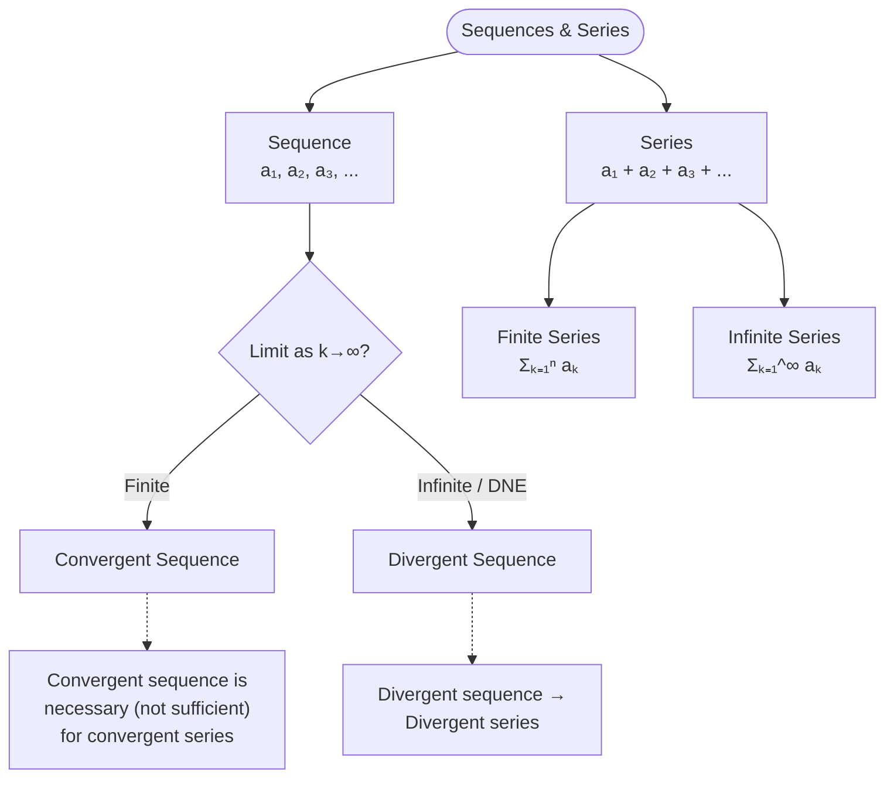

# L21: Introduction to Series

Lecture notes covering convergent and divergent sequences, and an introduction to series.

## Summary

This lecture introduces the fundamental concepts of **sequences** and **series**. We explore the difference between convergent and divergent sequences based on their limits, and define what constitutes a series versus a sequence.

---

## Sequence & Series

### Convergent & Divergent Sequences

Two types of sequences are discussed in this lecture.

#### Example 1: Divergent Sequence

Consider the sequence:
$$1, 3, 5, 7, \ldots$$

It is clear that the value of each successive term gets larger and larger.

- The $k$th term is $a_k = 2k - 1$
- As $k$ increases to infinity (i.e., $k \to \infty$), the value of $a_k$ cannot be determined

$$\lim_{k \to \infty} [a_k] = \lim_{k \to \infty} [2k - 1] = \infty$$

> [!warning] Divergent Sequence
> Since the limit does not approach a finite value, the sequence is said to be **divergent**.

#### Example 2: Convergent Sequence

Consider the sequence:
$$1.1, 1.01, 1.001, 1.0001, \ldots, 1 + \left(\frac{1}{10}\right)^k, \ldots$$

- The $k$th term is $a_k = 1 + \left(\frac{1}{10}\right)^k$
- As $k \to \infty$, $1 + \left(\frac{1}{10}\right)^k \to 1$

$$\lim_{k \to \infty} [a_k] = \lim_{k \to \infty} \left[1 + \left(\frac{1}{10}\right)^k\right] = 1$$

> [!success] Convergent Sequence
> Therefore, this sequence **converges to unity** (converges to 1).

#### General Definition

> [!important] Formal Definition
> In general, if the $k$th term of a sequence is $a_k$ and $\lim_{k \to \infty}[a_k]$ exists (i.e., approaches a finite value), the sequence is said to be **convergent**.

---

## Series

> [!note] What is a Series?
> A **series** is simply when the terms of a sequence are added:
> - $a_1, a_2, a_3, \ldots, a_n$ is a **sequence**
> - $a_1 + a_2 + a_3 + \ldots + a_n$ is a **series**

### Types of Series

| Type | Description | Notation |
|------|-------------|----------|
| **Finite Series** | Sum of finite number of terms | $\sum_{k=1}^{n} a_k$ |
| **Infinite Series** | Sum of infinitely many terms | $\sum_{k=1}^{\infty} a_k$ |

### Summation Notation

The **summation notation** is $\Sigma$ (called **sigma**).

#### Examples

| Series | Sigma Notation |
|--------|----------------|
| $a_1 + a_2 + \ldots + a_n$ | $\displaystyle\sum_{k=1}^{n} a_k$ |
| $a_1 + a_2 + \ldots$ (infinite) | $\displaystyle\sum_{k=1}^{\infty} a_k$ |

### Standard Formulas

$$\sum_{k=1}^{n} c = nc \quad \text{(where $c$ is a constant)}$$

---

## Example Problems

### Problem 1: Expressing Series Using Sigma Notation

**Express the following series using sigma notation:**

$$3 + 5 + 7 + 9 + 11$$

**Solution:**

This is an arithmetic sequence with first term 3 and common difference 2.

$$\sum_{k=1}^{5} (2k + 1)$$

---

### Problem 2: Finding Limits of Sequences

**Determine whether the sequence converges or diverges:**

$$a_k = \frac{1}{k}$$

**Solution:**

$$\lim_{k \to \infty} \frac{1}{k} = 0$$

Since the limit exists and equals 0, the sequence **converges to 0**.

---

## Links

- [[Sequences]] — concept page (convergent and divergent sequences)
- [[Series]] — concept page (finite and infinite series)
- [[Binomial Expansion]] — related series topic
- [[Power Series — Taylor & Maclaurin]] — advanced series topics
- [[FAD1014 - Mathematics II]] — course page
