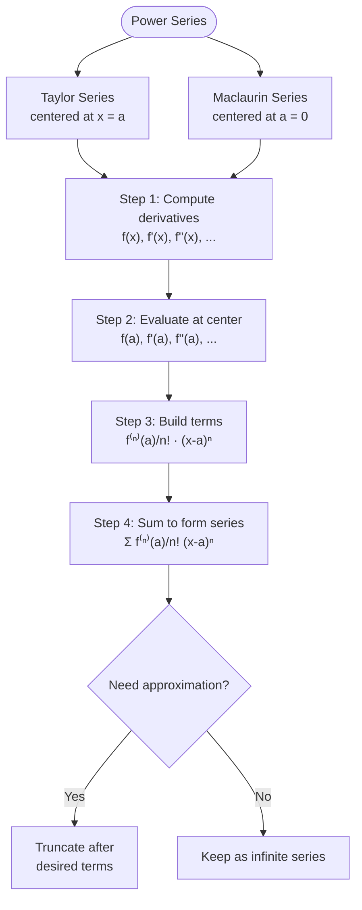

# L25-L26: Power Series, Taylor & Maclaurin

Lecture on power series, Taylor series and Maclaurin series for function approximation. Delivered by En. Hisham Safuan Mohamad Sukri.

## Learning Outcomes

1. Explain that a Taylor series is an infinite series used to simplify complex functions for easier calculation of approximation.
2. Calculate the first nonzero terms of any Maclaurin series by finding successive derivatives ($f', f'', f''', f''''$).
3. Recognize patterns in the coefficients (factorials in denominator and alternating signs in transcendental functions).
4. Derive the series for functions such as $y = e^{x^2}$ or $y = \cos x^3$ by applying algebra to standard Maclaurin or Taylor series.
5. Understand the center of the series (value of $a$) is the "anchor point" where the approximation is most accurate.
6. Calculate the approximation of a specific value and compare with the calculated value from a calculator.

## Power Series

A **power series** is an infinite series whose terms contain powers of a variable $x$. It acts like an "infinite polynomial", expressed in the form:

$$\sum_{n=0}^{\infty} c_n (x-a)^n = c_0 + c_1(x-a) + c_2(x-a)^2 + \cdots$$

where $x$ is a variable, $c_n$ are coefficients and $a$ is the center.

This is used to represent, approximate and define functions, converging within a specific radius $R$ from the center $a$.

## Taylor Series

A **Taylor series** is an infinite series that represents a smooth function as a polynomial, approximating it near a specific point using the function's derivatives.

Taylor series expansion of $f(x)$ about center $x = a$:

$$f(x) = f(a) + f'(a)(x-a) + \frac{f''(a)}{2!}(x-a)^2 + \frac{f'''(a)}{3!}(x-a)^3 + \cdots$$

$$f(x) = \sum_{n=0}^{\infty} \frac{f^{(n)}(a)}{n!}(x-a)^n$$

### Example 1
Find the first four terms of Taylor series for $f(x) = \sin x$ about $x = \frac{\pi}{4}$. Hence, approximate the value of $\sin 48^{\circ}$.

### Example 2
Use the first three nonzero terms of a Taylor series for $g(x) = \sqrt{x}$ about $x = 4$, to approximate $\sqrt{5}$, correct to two decimal places.

## Maclaurin Series

A **Maclaurin series** is from the Taylor series in the region near $x = 0$. It provides a polynomial approximation of functions like $\sin x$, $e^x$ and $\ln(1+x)$ using their derivatives at $x = 0$. It is a special case of Taylor series, called **"Taylor at zero"**.

$$f(x) = f(0) + f'(0)x + \frac{f''(0)}{2!}x^2 + \frac{f'''(0)}{3!}x^3 + \cdots$$

$$f(x) = \sum_{n=0}^{\infty} \frac{f^{(n)}(0)}{n!}x^n$$

### Example 3
Find the Maclaurin series for the following functions:
a) $f(x) = e^x$
b) $g(x) = \sin x$
c) $k(x) = \ln(1+x)$

Approximate each of the functions when $x = 0.01$ up to three terms.

### Example 4
a) Determine the first three nonzero terms of Maclaurin series for $f(x) = x^4 e^{-3x^2}$.
b) Prove the identity $\sin^2 x + \cos^2 x = 1$ by Maclaurin series.

### Example 5
Find the three nonzero terms of Maclaurin series of the following functions:
a) $f(x) = (\sin 3x^2)e^{2x}$
b) $g(x) = \sin 2x \cos \frac{1}{x}$ *(Note: $\cos(1/x)$ is undefined at $x=0$; likely a lecture typo for $\cos x$ or similar)*
c) $k(x) = \ln(3 - 2x - x^2)$

### Example 6
Determine the first four nonzero terms of Maclaurin series of the following integrals:
a) $\displaystyle\int \frac{\sin x}{x}\,dx$
b) $\displaystyle\int \frac{e^x}{x}\,dx$

## Key Takeaways

- The **center** $a$ of a Taylor series is the "anchor point" where the approximation is most accurate.
- A **Maclaurin series** is simply a Taylor series centered at $a = 0$ ("Taylor at zero").
- Successive differentiation at the center generates the coefficients.
- Standard series can be manipulated algebraically (substitution, multiplication) to obtain series for related functions.
- Power series can be integrated term-by-term to approximate integrals that have no elementary closed form.

## Links
- [[Power Series — Taylor & Maclaurin]] — concept page
- [[FAD1014 Tutorial 12 — Taylor & Maclaurin Series]]
- [[FAD1014 - Mathematics II]] — course
- [[En Hisham Safuan Mohamad Sukri]] — lecturer
