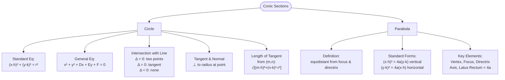

# L27-L28: Geometry I — Circle & Parabola

Lecture notes covering the geometry of circles and parabolas, including equations, intersections, tangents, normals, and key properties.

## Learning Outcomes

1. Determine the equation of a circle.
2. Determine the centre and radius of a circle.
3. Find points of intersection of two circles, and of a circle and a line.
4. Find the equations of tangent and normal lines to a circle.
5. Find the length of a tangent from a point to a circle.
6. Determine the equation of a parabola given its vertex and focus.
7. Determine the vertex, focus, and equation of a parabola by completing the square.

---

## Circle

### Definition
A circle is the curve consisting of all points $P$ in a plane that are equidistant from a fixed point (the **centre**). The **radius** is the fixed distance from the centre to the curve.

If the distance between $P(x,y)$ and centre $C(h,k)$ is constant and equal to $r$:
$$CP = r \implies \sqrt{(x-h)^2 + (y-k)^2} = r$$
$$(CP)^2 = (x-h)^2 + (y-k)^2 = r^2$$

### Standard Equation
For a circle with centre $(h,k)$ and radius $r$:
$$(x-h)^2 + (y-k)^2 = r^2$$

Special case (centre at origin):
$$x^2 + y^2 = r^2$$

### General Equation
Expanding the standard equation:
$$(x-h)^2 + (y-k)^2 = r^2$$
$$\implies x^2 - 2hx + h^2 + y^2 - 2ky + k^2 = r^2$$
$$\implies x^2 - 2hx + y^2 - 2ky + (h^2 + k^2 - r^2) = 0$$

Let $C = h^2 + k^2 - r^2$. Then:
$$x^2 - 2hx + y^2 - 2ky + C = 0 \quad ; \quad C = h^2 + k^2 - r^2$$

**Radius formula**:
$$r = \sqrt{h^2 + k^2 - C}$$

### Intersection of Circle and Straight Line
The intersection points are found by solving simultaneous equations.

| Condition | Roots | Geometric Meaning |
|---|---|---|
| Two distinct real roots | $\Delta > 0$ | Line intersects circle at two points $P$ and $Q$ |
| One repeated real root | $\Delta = 0$ | Line is tangent to the circle at $P$ |
| No real roots | $\Delta < 0$ | Line does not intersect the circle |

### Tangent and Normal to a Circle
- The **tangent** at a point on a circle is perpendicular to the radius at that point.
- The **normal** at a point is perpendicular to the tangent (and thus passes through the centre).

### Length of Tangent from an External Point
For external point $T(m,n)$, tangent point $S$, and centre $C(h,k)$:
$$ST = \sqrt{(CT)^2 - (CS)^2}$$
$$ST = \sqrt{(m-h)^2 + (n-k)^2 - r^2}$$

### Examples from Lecture

**Example 1**: Find the equation of circle with
a) centre $(2,-3)$ and radius $5$
b) centre origin and radius $2$

**Example 2**: Find the centre and radius of the circle
a) $x^2 + y^2 + 4x - 6y - 23 = 0$
b) $x^2 + y^2 + 5x - 6y - 5 = 0$
c) $2x^2 + 2y^2 - 8x + 6y + 5 = 0$

**Example 3**: Find the equation of circle with centre $(-1,2)$ which touches the line $4x - 3y = 10$.

**Example 4**:
1. Find the equation of circle passing through $A(1,8)$, $B(-6,1)$, $C(-2,-1)$.
2. Find the equation of circle passing through $A(1,3)$ and $B(-1,-1)$ with diameter on $x + 2y = 1$.

**Example 5**: Determine the point of intersections of $x^2 + y^2 = 4$ and $x^2 + y^2 - 2x + 4y + 4 = 0$.

**Example 6**:
1. Find intersection of line $4x - 3y + 1 = 0$ with circle $x^2 + y^2 - 4x - 6y - 12 = 0$.
2. Determine $k$ if $x^2 + y^2 - 2x + 6y + k = 0$ touches $3x + 4y = 16$. Find point of contact.
3. Show $3y - 4x - 42 = 0$ does not intersect $x^2 + y^2 + 4x - 6y - 9 = 0$. Find shortest distance.

**Example 7**:
1. Find equation of tangent to $x^2 + y^2 + 6x + y - 7 = 0$ at $P(-1,3)$.
2. Find equation of normal to $x^2 + y^2 - 4x + 4y - 2 = 0$ at $P(5,-3)$.

**Example 8**: Find lengths of tangents from:
a) $(3,5)$ to $x^2 + y^2 + 2x - 4y - 4 = 0$
b) $(5,-1)$ to $x^2 + y^2 - x - 6 = 0$
c) $(2,-3)$ to $2x^2 + 2y^2 - 3x + y + 1 = 0$

---

## Parabola

### Definition
A parabola is the curve consisting of all points $P$ in a plane that are equidistant from a fixed point (the **focus**) and a fixed line (the **directrix**).

### Derivation
When vertex is at origin, focus $F(0,a)$, directrix $y = -a$:
$$\sqrt{x^2 + (y-a)^2} = y + a$$
$$x^2 + (y-a)^2 = (y+a)^2$$
$$x^2 = 4ay$$

When vertex is at $(h,k)$, focus $F(h, k+a)$, directrix $y = k-a$:
$$\sqrt{(x-h)^2 + (y-(k+a))^2} = |y-(k-a)|$$
$$(x-h)^2 = 4a(y-k)$$

### Important Terms
- **Focus**: fixed point, $a$ units from vertex on the axis
- **Directrix**: fixed line perpendicular to axis, $a$ units from vertex
- **Axis**: line through focus and vertex, perpendicular to directrix
- **Vertex**: point of intersection between parabola and axis; midpoint of focus and directrix
- **Latus rectum**: chord through the focus parallel to the directrix

For $x^2 = 4ay$, when $y = a$, points are $(\pm 2a, a)$.
**Length of latus rectum**:
$$\sqrt{(2a - (-2a))^2 + (a-a)^2} = 4a$$

### Standard Equations

| Orientation | Equation | Vertex | Focus | Directrix | Shape |
|---|---|---|---|---|---|
| Vertical | $(x-h)^2 = 4a(y-k); a>0$ | $(h,k)$ | $(h, k+a)$ | $y = k-a$ | Opens upward |
| Vertical | $(x-h)^2 = 4a(y-k); a<0$ | $(h,k)$ | $(h, k-a)$ | $y = k+a$ | Opens downward |
| Horizontal | $(y-k)^2 = 4a(x-h); a>0$ | $(h,k)$ | $(h+a, k)$ | $x = h-a$ | Opens to the right |
| Horizontal | $(y-k)^2 = 4a(x-h); a<0$ | $(h,k)$ | $(h-a, k)$ | $x = h+a$ | Opens to the left |

### Examples from Lecture

**Example 9**: Find equations of parabola with:
a) Vertex $(0,0)$, Focus $(2,0)$
b) Vertex $(0,0)$, Focus $(0,-2)$
c) Vertex $(3,2)$, Focus $(4,2)$
d) Vertex $(-4,3)$, Focus $(-4,1)$
Then sketch.

**Example 10**: Find focus, vertex, directrix:
a) $x^2 = 16y$
b) $y^2 = -2x$
c) $(x+4)^2 = -20y - 20$
d) $y^2 + 6y + 1 + 4x = 0$
Then sketch.

**Example 11**: Determine equation of parabola with axis parallel to $y$-axis, vertex at $(2,-1)$, passing through $(3,1)$.

## Links
- [[Geometry - Circle]] — concept page
- [[Geometry - Parabola]] — concept page
- [[FAD1014 Tutorial 13 - Circle, Parabola, Ellipse]]
- [[L31-L32 Hyperbola]]
- [[FAD1014 - Mathematics II]] — course
