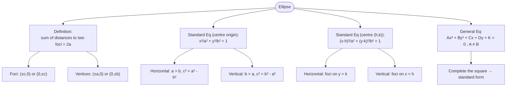

# L29-L30: Geometry II — Ellipse

Lecture notes covering the definition, derivation, standard equations, and properties of ellipses, including horizontal and vertical orientations, latus rectum, general equation, and worked examples.

## Learning Outcomes

1. Define an ellipse in terms of foci and constant sum of distances.
2. Derive the standard equation of an ellipse.
3. Identify vertices, foci, major/minor axes, and latus rectum.
4. Sketch ellipses given standard or general form equations.
5. Find the equation of an ellipse given geometric information.
6. Convert between standard and general forms by completing the square.

---

## Definition

An **ellipse** is the curve consisting of all points $P(x,y)$ in a plane such that the **sum of distances from $P$ to two fixed points (the foci)** is a constant.

- **Foci** ($F_1$, $F_2$): the two fixed points.
- **Major axis**: the straight line passing through the two foci.
- **Centre**: the midpoint of the line segment joining $F_1$ and $F_2$.
- **Minor axis**: the straight line passing through the centre, perpendicular to the major axis.

If $d_1 = PF_1$ and $d_2 = PF_2$, then:
$$d_1 + d_2 = 2a$$

---

## Derivation of the Standard Equation

Place the centre at the origin with foci at $(-c,0)$ and $(c,0)$.

$$\sqrt{(x+c)^2 + y^2} + \sqrt{(x-c)^2 + y^2} = 2a$$

Isolate one radical and square both sides:
$$\sqrt{(x+c)^2 + y^2} = 2a - \sqrt{(x-c)^2 + y^2}$$
$$(x+c)^2 + y^2 = 4a^2 - 4a\sqrt{(x-c)^2 + y^2} + (x-c)^2 + y^2$$

Simplify:
$$4a\sqrt{(x-c)^2 + y^2} = 4a^2 - 4cx$$
$$\sqrt{(x-c)^2 + y^2} = a - \frac{c}{a}x$$

Square again:
$$(x-c)^2 + y^2 = \left(a - \frac{c}{a}x\right)^2 = a^2 - 2cx + \frac{c^2}{a^2}x^2$$

Expand and collect terms:
$$x^2 - 2cx + c^2 + y^2 = a^2 - 2cx + \frac{c^2}{a^2}x^2$$
$$x^2 + y^2 + c^2 = a^2 + \frac{c^2}{a^2}x^2$$
$$\left(1 - \frac{c^2}{a^2}\right)x^2 + y^2 = a^2 - c^2$$
$$\frac{a^2 - c^2}{a^2}x^2 + y^2 = a^2 - c^2$$

Divide by $a^2 - c^2$:
$$\frac{x^2}{a^2} + \frac{y^2}{a^2 - c^2} = 1$$

Since $b^2 = a^2 - c^2$ (by the Pythagorean theorem, from the right triangle with vertices at $(0,0)$, $(c,0)$, $(0,b)$):

$$\boxed{\frac{x^2}{a^2} + \frac{y^2}{b^2} = 1}$$

---

## Intercepts

From $\frac{x^2}{a^2} + \frac{y^2}{b^2} = 1$:

- **$x$-intercepts** ($y=0$): $x = \pm a$
- **$y$-intercepts** ($x=0$): $y = \pm b$

The intercepts on the **major axis** are called the **vertices** of the ellipse.

---

## Latus Rectum

The **latus rectum** is the chord passing through a focus and perpendicular to the major axis.

For a horizontal ellipse, substituting $x = c$ into the standard equation:
$$\frac{c^2}{a^2} + \frac{y^2}{b^2} = 1 \implies y^2 = b^2\left(1 - \frac{c^2}{a^2}\right) = b^2 \cdot \frac{b^2}{a^2} = \frac{b^4}{a^2}$$
$$y = \pm \frac{b^2}{a}$$

So the endpoints are $\left(c, \pm \frac{b^2}{a}\right)$ and $\left(-c, \pm \frac{b^2}{a}\right)$.

**Length of latus rectum**:
$$\boxed{\frac{2b^2}{a}}$$

---

## Standard Equations (Centre at Origin)

### Horizontal Oriented Ellipse
$$\frac{x^2}{a^2} + \frac{y^2}{b^2} = 1 \quad ; \quad a > b$$

| Feature | Value |
|---|---|
| Relationship | $a^2 - b^2 = c^2$ |
| Major axis length | $2a$ |
| Minor axis length | $2b$ |
| Vertices | $(\pm a, 0)$ |
| Foci | $(\pm c, 0)$ |
| Latus rectum length | $\frac{2b^2}{a}$ (vertical) |

### Vertical Oriented Ellipse
$$\frac{x^2}{a^2} + \frac{y^2}{b^2} = 1 \quad ; \quad b > a$$

| Feature | Value |
|---|---|
| Relationship | $b^2 - a^2 = c^2$ |
| Major axis length | $2b$ |
| Minor axis length | $2a$ |
| Vertices | $(0, \pm b)$ |
| Foci | $(0, \pm c)$ |
| Latus rectum length | $\frac{2a^2}{b}$ (horizontal) |

---

## Standard Equation (Centre at $(h,k)$)

$$\boxed{\frac{(x-h)^2}{a^2} + \frac{(y-k)^2}{b^2} = 1}$$

- **Horizontal oriented**: $a > b$, foci lie on the horizontal line $y = k$.
- **Vertical oriented**: $b > a$, foci lie on the vertical line $x = h$.

---

## General Equation of an Ellipse

Expanding the standard equation with centre $(h,k)$:

$$b^2(x-h)^2 + a^2(y-k)^2 = a^2b^2$$

$$b^2x^2 - 2hb^2x + a^2y^2 - 2ka^2y + (a^2k^2 + b^2h^2 - a^2b^2) = 0$$

This takes the form:
$$\boxed{Ax^2 + By^2 + Cx + Dy + K = 0 \quad ; \quad A \neq B}$$

where $A$ and $B$ have the **same sign**.

---

## Examples from Lecture

### Example 1.0
Sketch each of the following ellipses and find:
a) vertices b) foci c) length of major and minor axis

i. $\frac{x^2}{9} + \frac{y^2}{4} = 1$

ii. $\frac{x^2}{25} + \frac{y^2}{9} = 1$

iii. $\frac{x^2}{3} + \frac{y^2}{5} = 1$

iv. $9x^2 + y^2 = 9$

v. $11x^2 + 5y^2 = 55$

### Example 2.0
Find an equation of the ellipse with the following information, then graph the equation.

a) Centre at origin, one focus at $(3,0)$ and a vertex at $(-4,0)$.

b) Centre at origin, one focus at $(0,2)$ and vertices at $(0, \pm 3)$.

### Example 3.0
Find the equation of the ellipses with the following foci and vertices:

a) Foci at $(4, 2 \pm \sqrt{5})$ and vertices at $(4,5)$ and $(4,-1)$.

b) Foci at $(-3 \pm \sqrt{7}, 2)$ and vertices at $(-7,2)$ and $(1,2)$.

### Example 4.0
Find the equation of the ellipse with centre $(2,-3)$, one focus at $(3,-3)$ and one vertex at $(5,-3)$. Graph the equation.

### Example 6.0
Show that the following equations represent ellipses and find their centres, foci, and vertices. Hence, sketch the graph.

a) $16x^2 + 4y^2 - 64x - 40y + 100 = 0$

b) $4x^2 + 9y^2 - 24x + 36y + 36 = 0$

c) $4x^2 + y^2 - 8x + 4y + 4 = 0$

d) $9x^2 + 16y^2 - 36x + 64y - 44 = 0$

e) $y^2 + 9x^2 + 18x + 6y = 0$

---

## Links
- [[Geometry - Ellipse]] — concept page
- [[FAD1014 L27-L28 — Geometry I (Circle & Parabola)]] — previous geometry lecture
- [[L31-L32 Hyperbola]] — next geometry lecture
- [[FAD1014 - Mathematics II]] — course
