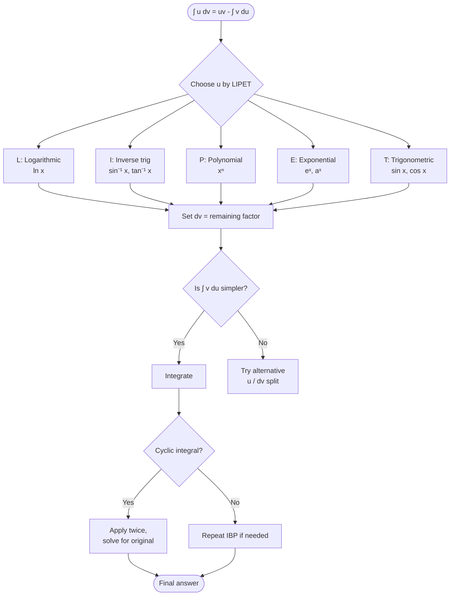

# L5-L6: Integration by Parts

Lecture notes covering integration by parts (Section 3.1), derived from the product rule for differentiation and applied to products of functions that cannot be integrated by basic rules or substitution alone.

## Derivation of the Formula

Starting from the **product rule** for differentiation:

$$\frac{d}{dx}(uv) = u\frac{dv}{dx} + v\frac{du}{dx}$$

Multiplying through by $dx$:

$$d(uv) = u\,dv + v\,du$$

Rearranging and integrating both sides:

$$\int u\,dv = \int d(uv) - \int v\,du$$

This gives the **integration by parts formula**:

$$\boxed{\int u\,dv = uv - \int v\,du}$$

In alternative notation, for $\int f(x)g(x)\,dx$, choose one factor $f(x) = u$ and the remaining factor $g(x)\,dx = dv$.

## Guidelines for Choosing $u$ and $dv$

To obtain a simpler integral, the choice of $u$ and $dv$ must satisfy:

1. $dx$ should be part of $dv$.
2. $dv$ should be readily integrated.
3. $u$ becomes simpler when differentiated (ideally to zero).
4. The resulting $\int v\,du$ should be simpler than $\int u\,dv$.

## LIPET Rule for Choosing $u$

When applying integration by parts, choose $u$ in this order of preference:

1. **L**ogarithmic functions ($\ln x$)
2. **I**nverse trigonometric functions ($\sin^{-1} x$, $\tan^{-1} x$, etc.)
3. **P**olynomial / **A**lgebraic functions ($x^n$)
4. **E**xponential functions ($e^x$, $e^{ax}$)
5. **T**rigonometric functions ($\sin x$, $\cos x$, etc.)

> **Note:** Some texts use the acronym **LIATE**, which places Trigonometric before Exponential. This course uses **LIPET**.

---

## Worked Examples

### Example 3.1.1 — Polynomial × Cosine
$$\int x\cos x\,dx$$

Using LIPET: $u = x$ (polynomial), $dv = \cos x\,dx$.

$$\begin{aligned}
u &= x & dv &= \cos x\,dx \\
du &= dx & v &= \sin x
\end{aligned}$$

$$\int x\cos x\,dx = x\sin x - \int \sin x\,dx = x\sin x + \cos x + C$$

### Example 3.1.2 — Polynomial × Sine
$$\int x\sin x\,dx$$

Using LIPET: $u = x$, $dv = \sin x\,dx$.

$$\begin{aligned}
u &= x & dv &= \sin x\,dx \\
du &= dx & v &= -\cos x
\end{aligned}$$

$$\int x\sin x\,dx = -x\cos x - \int (-\cos x)\,dx = -x\cos x + \sin x + C$$

> **Warning — Wrong Choice:** If we instead chose $u = \sin x$ and $dv = x\,dx$, we get $v = x^2/2$ and the new integral $\int \frac{x^2}{2}\cos x\,dx$ is *more* complicated. Choose wisely.

### Example 3.1.3 — Logarithmic Function
$$\int \ln x\,dx$$

Using LIPET: $u = \ln x$ (logarithmic), $dv = dx$.

$$\begin{aligned}
u &= \ln x & dv &= dx \\
du &= \frac{1}{x}\,dx & v &= x
\end{aligned}$$

$$\int \ln x\,dx = x\ln x - \int x\cdot\frac{1}{x}\,dx = x\ln x - x + C$$

### Example 3.1.4 — Repeated Integration by Parts
$$\int x^2 e^x\,dx$$

**First application:** $u = x^2$, $dv = e^x\,dx$
$$\begin{aligned}
u &= x^2 & dv &= e^x\,dx \\
du &= 2x\,dx & v &= e^x
\end{aligned}$$

$$\int x^2 e^x\,dx = x^2 e^x - \int 2x e^x\,dx$$

**Second application** on $\int x e^x\,dx$: $u = x$, $dv = e^x\,dx$
$$\begin{aligned}
u &= x & dv &= e^x\,dx \\
du &= dx & v &= e^x
\end{aligned}$$

$$\int x e^x\,dx = x e^x - \int e^x\,dx = x e^x - e^x$$

Combining:
$$\int x^2 e^x\,dx = x^2 e^x - 2\left(x e^x - e^x\right) + C = x^2 e^x - 2x e^x + 2e^x + C$$

### Example 3.1.5 — Cyclic Integral (Solving for the Unknown Integral)
$$\int e^x \cos x\,dx$$

**First application:** $u = e^x$, $dv = \cos x\,dx$ (LIPET: Exponential before Trig)
$$\begin{aligned}
u &= e^x & dv &= \cos x\,dx \\
du &= e^x\,dx & v &= \sin x
\end{aligned}$$

$$\int e^x \cos x\,dx = e^x \sin x - \int e^x \sin x\,dx$$

**Second application** on $\int e^x \sin x\,dx$: $u = e^x$, $dv = \sin x\,dx$
$$\begin{aligned}
u &= e^x & dv &= \sin x\,dx \\
du &= e^x\,dx & v &= -\cos x
\end{aligned}$$

$$\int e^x \sin x\,dx = -e^x \cos x + \int e^x \cos x\,dx$$

Substituting back:
$$\int e^x \cos x\,dx = e^x \sin x - \left(-e^x \cos x + \int e^x \cos x\,dx\right)$$
$$\int e^x \cos x\,dx = e^x \sin x + e^x \cos x - \int e^x \cos x\,dx$$

Bring the original integral to the left side:
$$2\int e^x \cos x\,dx = e^x \sin x + e^x \cos x$$

$$\boxed{\int e^x \cos x\,dx = \frac{e^x \sin x + e^x \cos x}{2} + C}$$

> **Key insight:** This works when both factors integrate and differentiate indefinitely (exponentials and trigonometrics).

### Example 3.1.6 — Polynomial × Secant Squared
$$\int x\sec^2 x\,dx$$

Using LIPET: $u = x$, $dv = \sec^2 x\,dx$.
$$\begin{aligned}
u &= x & dv &= \sec^2 x\,dx \\
du &= dx & v &= \tan x
\end{aligned}$$

$$\int x\sec^2 x\,dx = x\tan x - \int \tan x\,dx$$

For $\int \tan x\,dx$, rewrite as $\int \frac{\sin x}{\cos x}\,dx$ and use substitution $u = \cos x$, $du = -\sin x\,dx$:
$$\int \tan x\,dx = -\ln|\cos x| = \ln|\sec x|$$

$$\int x\sec^2 x\,dx = x\tan x + \ln|\cos x| + C$$

### Example 3.1.7 — Polynomial × Exponential
$$\int x e^x\,dx$$

Using LIPET: $u = x$, $dv = e^x\,dx$.
$$\begin{aligned}
u &= x & dv &= e^x\,dx \\
du &= dx & v &= e^x
\end{aligned}$$

$$\int x e^x\,dx = x e^x - \int e^x\,dx = x e^x - e^x + C$$

> **Warning — Wrong Choice:** Choosing $u = e^x$ and $dv = x\,dx$ leads to $v = x^2/2$ and a more complicated integral $\int \frac{x^2}{2}e^x\,dx$.

### Example 3.1.8 — Polynomial × Logarithm
$$\int x^2 \ln x\,dx$$

Using LIPET: $u = \ln x$ (logarithmic), $dv = x^2\,dx$.
$$\begin{aligned}
u &= \ln x & dv &= x^2\,dx \\
du &= \frac{1}{x}\,dx & v &= \frac{x^3}{3}
\end{aligned}$$

$$\int x^2 \ln x\,dx = \frac{x^3}{3}\ln x - \int \frac{x^3}{3}\cdot\frac{1}{x}\,dx = \frac{x^3}{3}\ln x - \frac{1}{3}\int x^2\,dx$$

$$= \frac{x^3}{3}\ln x - \frac{x^3}{9} + C$$

### Example 3.1.9 — Inverse Trigonometric
$$\int \sin^{-1} x\,dx$$

Using LIPET: $u = \sin^{-1} x$, $dv = dx$.
$$\begin{aligned}
u &= \sin^{-1} x & dv &= dx \\
\frac{du}{dx} &= \frac{1}{\sqrt{1-x^2}} & v &= x
\end{aligned}$$

$$\int \sin^{-1} x\,dx = x\sin^{-1} x - \int \frac{x}{\sqrt{1-x^2}}\,dx$$

For the remaining integral, use substitution $u = 1-x^2$, $du = -2x\,dx$:
$$\int \frac{x}{\sqrt{1-x^2}}\,dx = -\frac{1}{2}\int u^{-1/2}\,du = -\sqrt{u} = -\sqrt{1-x^2}$$

$$\int \sin^{-1} x\,dx = x\sin^{-1} x + \sqrt{1-x^2} + C$$

### Example 3.1.10 — Repeated Integration with Composite Exponential
$$\int x^2 e^{3x}\,dx$$

**First application:** $u = x^2$, $dv = e^{3x}\,dx$
$$\begin{aligned}
u &= x^2 & dv &= e^{3x}\,dx \\
du &= 2x\,dx & v &= \frac{1}{3}e^{3x}
\end{aligned}$$

$$\int x^2 e^{3x}\,dx = \frac{x^2 e^{3x}}{3} - \frac{2}{3}\int x e^{3x}\,dx$$

**Second application** on $\int x e^{3x}\,dx$: $u = x$, $dv = e^{3x}\,dx$
$$\begin{aligned}
u &= x & dv &= e^{3x}\,dx \\
du &= dx & v &= \frac{1}{3}e^{3x}
\end{aligned}$$

$$\int x e^{3x}\,dx = \frac{x e^{3x}}{3} - \frac{1}{3}\int e^{3x}\,dx = \frac{x e^{3x}}{3} - \frac{e^{3x}}{9}$$

Combining:
$$\int x^2 e^{3x}\,dx = \frac{x^2 e^{3x}}{3} - \frac{2}{3}\left(\frac{x e^{3x}}{3} - \frac{e^{3x}}{9}\right) + C$$

### Example 3.1.11 — Cyclic Integral with Consistency Requirement
$$\int e^x \sin x\,dx$$

**Incorrect approach (inconsistent choices):** If we first choose $u = \sin x$ (Level 1), then on the next step choose $u = e^x$ (Level 2) inconsistently, the original integral cancels out and we get $0 = 0$.

**Correct approach — consistent selections:**

*Method A:* Choose $u = \sin x$ consistently.
- Level 1: $u = \sin x$, $dv = e^x\,dx$ → $du = \cos x\,dx$, $v = e^x$
- Level 2: $u = \cos x$, $dv = e^x\,dx$ → $du = -\sin x\,dx$, $v = e^x$

$$\int e^x \sin x\,dx = e^x \sin x - \left[e^x \cos x + \int e^x \sin x\,dx\right]$$
$$2\int e^x \sin x\,dx = e^x \sin x - e^x \cos x$$
$$\boxed{\int e^x \sin x\,dx = \frac{e^x \sin x - e^x \cos x}{2} + C}$$

*Method B:* Choose $u = e^x$ consistently.
- Level 1: $u = e^x$, $dv = \sin x\,dx$ → $du = e^x\,dx$, $v = -\cos x$
- Level 2: $u = e^x$, $dv = \cos x\,dx$ → $du = e^x\,dx$, $v = \sin x$

This yields the equivalent result:
$$\int e^x \sin x\,dx = \frac{-e^x \cos x + e^x \sin x}{2} + C$$

> **Critical rule:** For cyclic integrals, you **must** be consistent in selecting which part is $u$ and which is $dv$ across both applications.

## Summary

- Integration by parts reverses the product rule: $\int u\,dv = uv - \int v\,du$.
- Choose $u$ by LIPET: Logs → Inverse trig → Polynomial → Exponential → Trig.
- Some integrals require **repeated application** (e.g., $\int x^2 e^x dx$).
- **Cyclic integrals** (e.g., $\int e^x \cos x dx$, $\int e^x \sin x dx$) require two applications and solving for the original integral; consistency in $u/dv$ selection is essential.

## Links
- [[Integration Techniques]] — concept page
- [[FAD1014 Tutorial 2 — Integration by Parts]]
- [[FAD1014 - Mathematics II]] — course
