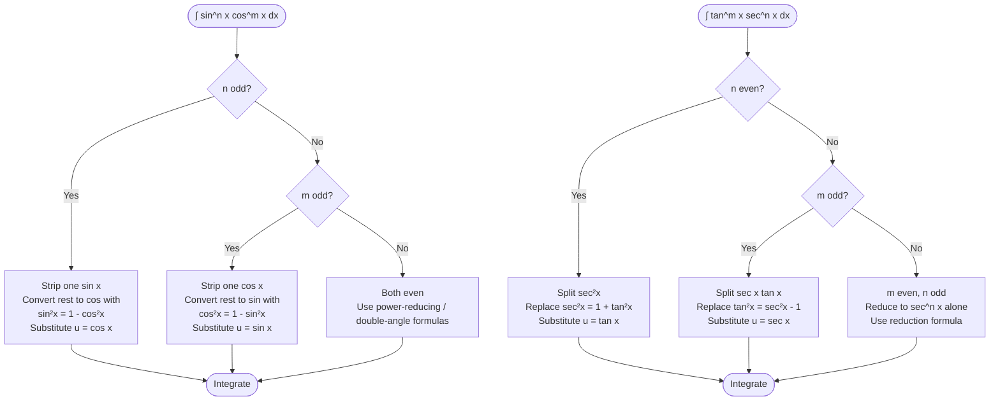

# L7-L8: Trigonometric Integrals

Lecture notes covering techniques for integrating powers and products of trigonometric functions. The overarching goal is to **rewrite the integrand into a form that can be integrated** using standard rules, substitution, or integration by parts.

## Rewriting Tools: Trigonometric Identities

### Reciprocal & Quotient Identities
- $\sin x = \frac{1}{\csc x}$, $\csc x = \frac{1}{\sin x}$
- $\cos x = \frac{1}{\sec x}$, $\sec x = \frac{1}{\cos x}$
- $\tan x = \frac{1}{\cot x} = \frac{\sin x}{\cos x}$
- $\cot x = \frac{1}{\tan x} = \frac{\cos x}{\sin x}$

### Pythagorean Identities
- $\sin^2 x + \cos^2 x = 1$
- $1 + \tan^2 x = \sec^2 x$
- $1 + \cot^2 x = \csc^2 x$

### Double-Angle Formulas
- $\sin 2x = 2\sin x \cos x$
- $\cos 2x = \cos^2 x - \sin^2 x = 2\cos^2 x - 1 = 1 - 2\sin^2 x$
- $\tan 2x = \frac{2\tan x}{1 - \tan^2 x}$

### Power-Reducing (Half-Angle) Formulas
- $\sin^2 u = \frac{1 - \cos(2u)}{2}$
- $\cos^2 u = \frac{1 + \cos(2u)}{2}$
- $\tan^2 u = \frac{1 - \cos(2u)}{1 + \cos(2u)}$

## General Guidelines for $\int \sin^n x \cos^m x\,dx$

| Case | Strategy |
|------|----------|
| **$n$ odd** | Strip one $\sin x$, convert remaining even sines to cosines using $\sin^2 x = 1 - \cos^2 x$, then substitute $u = \cos x$. |
| **$m$ odd** | Strip one $\cos x$, convert remaining even cosines to sines using $\cos^2 x = 1 - \sin^2 x$, then substitute $u = \sin x$. |
| **Both odd** | Use either of the above strategies. |
| **Both even** | Use power-reducing / double-angle formulas to reduce to integrable terms. Count zero as even. |

### Examples

**Example 1 — Odd power of sine**
$$\int \sin^3 x\,dx = \int (1 - \cos^2 x)\sin x\,dx \xrightarrow{u=\cos x} -\cos x + \frac{1}{3}\cos^3 x + C$$

**Example 2 — Odd power of cosine**
$$\int \sin^4 x \cos^5 x\,dx = \int \sin^4 x (1 - \sin^2 x)^2 \cos x\,dx \xrightarrow{u=\sin x} \frac{1}{5}\sin^5 x - \frac{2}{7}\sin^7 x + \frac{1}{9}\sin^9 x + C$$

**Example 3 — Both even (repeated power-reducing)**
$$\int \sin^4 x\,dx = \int\left(\frac{1 - \cos 2x}{2}\right)^2 dx = \frac{1}{4}\left[\frac{3}{2}x - \sin 2x + \frac{1}{8}\sin 4x\right] + C$$

**Example 4 — Mixed even powers**
$$\int \sin^2 x \cos^4 x\,dx = \frac{1}{8}\left[\frac{1}{2}x - \frac{1}{8}\sin 4x + \frac{1}{6}\sin^3 2x\right] + C$$

## Integrating Powers of Tangent and Secant

### Powers of Tangent
Basic result:
$$\int \tan x\,dx = \ln|\sec x| + C$$

For $\int \tan^m x\,dx$ with $m > 1$:
1. Strip $\tan^2 x$: $\int \tan^{m-2} x \,\tan^2 x\,dx$
2. Replace $\tan^2 x = \sec^2 x - 1$
3. Use substitution $u = \tan x$, $du = \sec^2 x\,dx$ on the term containing $\sec^2 x$

**Example 5**
$$\int \tan^5 x\,dx = \frac{\tan^4 x}{4} - \frac{\tan^2 x}{2} + \ln|\sec x| + C$$

**Example 6**
$$\int \tan^4 x\,dx = \frac{\tan^3 x}{3} - \tan x + x + C$$

### Powers of Secant
Basic result:
$$\int \sec x\,dx = \ln|\sec x + \tan x| + C, \qquad \int \sec^2 x\,dx = \tan x + C$$

**Even powers:**
- Factor out $\sec^2 x$: $\int \sec^m x\,dx = \int \sec^2 x \cdot \sec^{m-2} x\,dx$
- Replace $\sec^2 x = 1 + \tan^2 x$
- Substitute $u = \tan x$

**Example 7**
$$\int \sec^4 x\,dx = \int (\tan^2 x + 1)\sec^2 x\,dx = \frac{\tan^3 x}{3} + \tan x + C$$

**Odd powers ($m \ge 3$):**
Use the **reduction formula** (or integration by parts):
$$\int \sec^n x\,dx = \frac{\sec^{n-2} x \tan x}{n-1} + \frac{n-2}{n-1}\int \sec^{n-2} x\,dx$$

**Example 8 — Integration by parts for $\int \sec^3 x\,dx$**
$$\int \sec^3 x\,dx = \frac{1}{2}\sec x \tan x + \frac{1}{2}\ln|\sec x + \tan x| + C$$

**Example 9 — Reduction formula for $\int \sec^5 x\,dx$**
$$\int \sec^5 x\,dx = \frac{1}{4}\sec^3 x \tan x + \frac{3}{8}\sec x \tan x + \frac{3}{8}\ln|\sec x + \tan x| + C$$

## Integrating Products $\int \tan^m x \sec^n x\,dx$

| Case | Strategy |
|------|----------|
| **$n$ even** | Split off $\sec^2 x$, replace remaining $\sec^2 x$ with $1 + \tan^2 x$, substitute $u = \tan x$. |
| **$m$ odd** | Split off $\sec x \tan x$, replace $\tan^2 x$ with $\sec^2 x - 1$, substitute $u = \sec x$. |
| **$m$ even, $n$ odd** | Reduce to powers of $\sec x$ alone using $\tan^2 x = \sec^2 x - 1$, then use secant procedures (often integration by parts or reduction). |

**Example 10 — $n$ even**
$$\int \tan^2 x \sec^4 x\,dx = \int (\tan^4 x + \tan^2 x)\sec^2 x\,dx = \frac{\tan^5 x}{5} + \frac{\tan^3 x}{3} + C$$

**Example 11 — $m$ odd**
$$\int \tan^3 x \sec^3 x\,dx = \int (\sec^4 x - \sec^2 x)(\sec x \tan x)\,dx = \frac{\sec^5 x}{5} - \frac{\sec^3 x}{3} + C$$

**Example 12 — $m$ even, $n$ odd**
$$\int \tan^2 x \sec x\,dx = \int (\sec^3 x - \sec x)\,dx = \frac{1}{2}\sec x \tan x - \frac{1}{2}\ln|\sec x + \tan x| + C$$

## Product-to-Sum Formulas

Used for integrals of the form $\int \sin mx \cos nx\,dx$, $\int \sin mx \sin nx\,dx$, $\int \cos mx \cos nx\,dx$.

- $\sin A \cos B = \frac{1}{2}\big[\sin(A-B) + \sin(A+B)\big]$
- $\sin A \sin B = \frac{1}{2}\big[\cos(A-B) - \cos(A+B)\big]$
- $\cos A \cos B = \frac{1}{2}\big[\cos(A-B) + \cos(A+B)\big]$

**Example 13**
$$\int \sin 2x \cos 3x\,dx = \frac{1}{2}\int\big[-\sin x + \sin 5x\big]\,dx = \frac{1}{2}\cos x - \frac{1}{10}\cos 5x + C$$

**Example 14**
$$\int \sin 2x \sin 3x\,dx = \frac{1}{2}\int\big[\cos x - \cos 5x\big]\,dx = \frac{1}{2}\sin x - \frac{1}{10}\sin 5x + C$$

**Example 15**
$$\int \cos 2x \cos 3x\,dx = \frac{1}{2}\int\big[\cos x + \cos 5x\big]\,dx = \frac{1}{2}\sin x + \frac{1}{10}\sin 5x + C$$

## Miscellaneous Algebraic Manipulations

**Example 16 — Conjugate multiplication**
$$\int \frac{dx}{\cos x - 1} = \int \frac{\cos x + 1}{\cos^2 x - 1}\,dx = -\int\left(\frac{\cos x}{\sin^2 x} + \csc^2 x\right)dx = \csc x + \cot x + C$$

**Example 17 — Simplifying before integrating**
$$\int \frac{1 - \tan^2 x}{\sec^2 x}\,dx = \int (\cos^2 x - \sin^2 x)\,dx = \int \cos 2x\,dx = \frac{1}{2}\sin 2x + C$$

**Example 18 — Substitution + power-reducing**
$$\int \cos^2(\sin x)\cos x\,dx \xrightarrow{u=\sin x} \int \cos^2 u\,du = \frac{1}{2}u + \frac{1}{4}\sin 2u + C = \frac{1}{2}\sin x + \frac{1}{4}\sin(2\sin x) + C$$

## Links
- [[Integration Techniques]] — concept page
- [[FAD1014 Tutorial 3 — Trigonometric Integrals]]
- [[FAD1014 - Mathematics II]] — course
