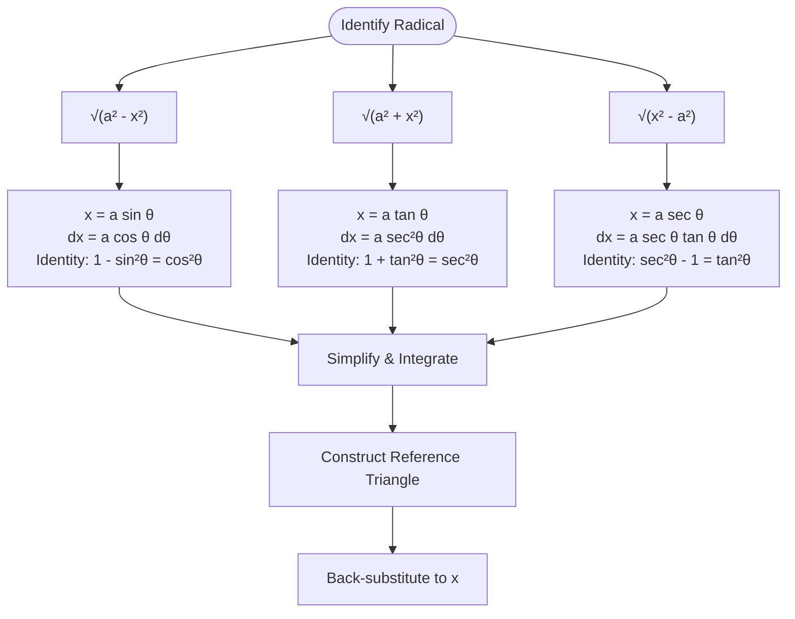

# FAD1014 L9-L10 — Trigonometric Substitution, Partial Fractions & Definite Integrals

Lecture notes for Week 5 covering three integration techniques: trigonometric substitution (5.1), integration by partial fractions (5.2), and definite integrals (5.3–5.4).

---

## 5.1 Integration by Trigonometric Substitution

### Motivation
Integrals containing radicals of the form $\sqrt{a^2 - x^2}$, $\sqrt{a^2 + x^2}$, or $\sqrt{x^2 - a^2}$ (where $a > 0$) cannot be handled by simple $u$-substitution. Trigonometric substitution uses Pythagorean identities to eliminate the square root.

> **Key distinction:** In ordinary $u$-substitution, the new variable is a function of the old one. In trig substitution, the old variable is a function of the new one.

### Standard Substitutions Table

| Expression | Substitution | Domain Restriction | Identity Used |
|------------|--------------|-------------------|---------------|
| $\sqrt{a^2 - x^2}$ | $x = a\sin\theta$ | $-\frac{\pi}{2} \le \theta \le \frac{\pi}{2}$ | $1 - \sin^2\theta = \cos^2\theta$ |
| $\sqrt{a^2 + x^2}$ | $x = a\tan\theta$ | $-\frac{\pi}{2} < \theta < \frac{\pi}{2}$ | $1 + \tan^2\theta = \sec^2\theta$ |
| $\sqrt{x^2 - a^2}$ | $x = a\sec\theta$ | $0 \le \theta < \frac{\pi}{2}$ or $\pi \le \theta < \frac{3\pi}{2}$ | $\sec^2\theta - 1 = \tan^2\theta$ |

### Reference Triangles
- **$\sqrt{a^2 - x^2}$**: Opp $= x$, Hyp $= a$, Adj $= \sqrt{a^2-x^2}$
- **$\sqrt{a^2 + x^2}$**: Opp $= x$, Adj $= a$, Hyp $= \sqrt{a^2+x^2}$
- **$\sqrt{x^2 - a^2}$**: Adj $= a$, Hyp $= x$, Opp $= \sqrt{x^2-a^2}$

### General Procedure
1. Identify which radical form matches the integrand.
2. Make the appropriate substitution and find $dx$.
3. Simplify the radical using the corresponding identity.
4. Evaluate the resulting trigonometric integral.
5. **Construct a right triangle** to convert back to the original variable $x$.

### Worked Examples

#### Example 5.1.1 — $\sqrt{a^2-x^2}$ form
$$\int \frac{\sqrt{4-x^2}}{2}\,dx$$

Let $x = 2\sin\theta$, $dx = 2\cos\theta\,d\theta$.
$$\begin{aligned}
\int \frac{\sqrt{4-x^2}}{2}\,dx &= \int \frac{2\cos\theta}{2} \cdot 2\cos\theta\,d\theta = 2\int\cos^2\theta\,d\theta \\
&= 2\int\frac{1+\cos 2\theta}{2}\,d\theta = \int d\theta + \int\cos 2\theta\,d\theta \\
&= \theta + \frac{1}{2}\sin 2\theta + c = \theta + \sin\theta\cos\theta + c \\
&= \sin^{-1}\!\left(\frac{x}{2}\right) + \frac{x}{2}\cdot\frac{\sqrt{4-x^2}}{2} + c
\end{aligned}$$

#### Example 5.1.2 — $\sqrt{a^2-x^2}$ form
$$\int \frac{1}{x^2\sqrt{16-x^2}}\,dx$$

Let $x = 4\sin\theta$, $dx = 4\cos\theta\,d\theta$.
$$= -\frac{1}{16}\cot\theta + c = -\frac{1}{16}\cdot\frac{\sqrt{16-x^2}}{x} + c$$

#### Example 5.1.3 — $\sqrt{x^2-a^2}$ form
$$\int \frac{\sqrt{x^2-9}}{x}\,dx$$

Let $x = 3\sec\theta$, $dx = 3\sec\theta\tan\theta\,d\theta$.
$$\begin{aligned}
&= \int \frac{3\tan\theta}{3\sec\theta}\cdot 3\sec\theta\tan\theta\,d\theta = 3\int\tan^2\theta\,d\theta \\
&= 3\int(\sec^2\theta - 1)\,d\theta = 3\tan\theta - 3\theta + c \\
&= \sqrt{x^2-9} - 3\sec^{-1}\!\left(\frac{x}{3}\right) + c
\end{aligned}$$

#### Example 5.1.4 — $\sqrt{a^2+x^2}$ form
$$\int \frac{dx}{x\sqrt{4x^2+9}}$$

Let $x = \frac{3}{2}\tan\theta$, $dx = \frac{3}{2}\sec^2\theta\,d\theta$.
$$\begin{aligned}
&= \frac{1}{3}\int\csc\theta\,d\theta = \frac{1}{3}\ln|\csc\theta - \cot\theta| + c \\
&= \frac{1}{3}\ln\!\left(\frac{\sqrt{4x^2+9}-3}{2x}\right) + c
\end{aligned}$$

#### Example 5.1.5 — When a simpler method exists
$$\int \frac{x}{\sqrt{x^2+4}}\,dx$$

Although trig substitution $x = 2\tan\theta$ is possible, a direct $u$-substitution $u = x^2+4$ is simpler:
$$= \frac{1}{2}\int\frac{du}{\sqrt{u}} = \sqrt{u} + C = \sqrt{x^2+4} + C$$

> **Lesson:** Even when trigonometric substitutions are possible, they may not give the easiest solution. Always look for a simpler method first.

#### Example 5.1.8 — Completing the square first
$$\int \frac{x}{\sqrt{3-2x-x^2}}\,dx$$

Complete the square: $3-2x-x^2 = 4 - (x+1)^2$.
Let $u = x+1$, then $x = u-1$ and $dx = du$:
$$\int \frac{u-1}{\sqrt{4-u^2}}\,du$$

Now substitute $u = 2\sin\theta$, $du = 2\cos\theta\,d\theta$:
$$\begin{aligned}
&= \int\frac{2\sin\theta - 1}{2\cos\theta}\cdot 2\cos\theta\,d\theta = \int(2\sin\theta - 1)\,d\theta \\
&= -2\cos\theta - \theta + C = -\sqrt{4-u^2} - \sin^{-1}\!\left(\frac{u}{2}\right) + C \\
&= -\sqrt{3-2x-x^2} - \sin^{-1}\!\left(\frac{x+1}{2}\right) + C
\end{aligned}$$

---

## 5.2 Integration using Partial Fractions

Partial fractions decompose rational functions into simpler terms that are easier to integrate.

### Decomposition Templates

| Denominator Factor | Partial Fraction Term(s) |
|--------------------|--------------------------|
| $ax + b$ | $\dfrac{A}{ax+b}$ |
| $(ax+b)^k$ | $\dfrac{A_1}{ax+b} + \dfrac{A_2}{(ax+b)^2} + \cdots + \dfrac{A_k}{(ax+b)^k}$ |
| $ax^2+bx+c$ (irreducible) | $\dfrac{Ax+B}{ax^2+bx+c}$ |
| $(ax^2+bx+c)^k$ | $\dfrac{A_1x+B_1}{ax^2+bx+c} + \cdots + \dfrac{A_kx+B_k}{(ax^2+bx+c)^k}$ |

### Worked Examples

#### Example 5.2.1 — $u$-substitution shortcut
$$\int \frac{2x-1}{x^2-x-6}\,dx$$

The numerator is the derivative of the denominator. Let $u = x^2-x-6$, $du = (2x-1)\,dx$:
$$= \int\frac{du}{u} = \ln|x^2-x-6| + c$$

#### Example 5.2.1 (Partial Fractions)
$$\int \frac{3x+11}{x^2-x-6}\,dx = \int \frac{3x+11}{(x-3)(x+2)}\,dx$$

Decompose: $\dfrac{3x+11}{(x-3)(x+2)} = \dfrac{A}{x-3} + \dfrac{B}{x+2}$

Cover-up method:
- $x = -2$: $5 = -5B \Rightarrow B = -1$
- $x = 3$: $20 = 5A \Rightarrow A = 4$

$$= \int\left(\frac{4}{x-3} - \frac{1}{x+2}\right)dx = 4\ln|x-3| - \ln|x+2| + c$$

#### Example 5.2.2 — Cancel common factors first
$$\int \frac{x+2}{x(x+2)^2}\,dx$$

Cancel the common factor $(x+2)$:
$$= \int\frac{1}{x(x+2)}\,dx = \int\left(\frac{1}{2x} - \frac{1}{2(x+2)}\right)dx = \frac{1}{2}\ln|x| - \frac{1}{2}\ln|x+2| + c$$

---

## 5.3–5.4 Definite Integrals

### Definition
If $f$ is defined on $[a,b]$, the definite integral is:
$$\int_a^b f(x)\,dx = \lim_{n\to\infty}\sum_{i=1}^{n} f(x_i)\Delta x$$
where $\Delta x = \frac{b-a}{n}$ and $x_i$ is any value in the $i$-th subinterval.

Unlike indefinite integrals (which yield a family of functions), a definite integral evaluates to a **number**.

### Fundamental Theorem of Calculus
Let $f$ be continuous on $[a,b]$.
1. If $A(x) = \int_a^x f(t)\,dt$, then $A'(x) = f(x)$.
2. If $F$ is any antiderivative of $f$ on $[a,b]$, then:
$$\int_a^b f(x)\,dx = F(b) - F(a) = \bigl[F(x)\bigr]_a^b$$

> **Note:** There is no constant $c$ in a definite integral; the result is always a numerical value.

### Basic Rules
- $\displaystyle\int_a^a f(x)\,dx = 0$
- $\displaystyle\int_a^b f(x)\,dx = -\int_b^a f(x)\,dx$
- $\displaystyle\int_a^b k\,dx = k(b-a)$
- $\displaystyle\int_a^b kf(x)\,dx = k\int_a^b f(x)\,dx$
- $\displaystyle\int_a^b f(x)\,dx + \int_b^c f(x)\,dx = \int_a^c f(x)\,dx$  (for $a < b < c$)
- $\displaystyle\int_a^b \{f(x) \pm g(x)\}\,dx = \int_a^b f(x)\,dx \pm \int_a^b g(x)\,dx$

### Substitution for Definite Integrals
When performing substitution, **remember to change the limits** to match the new variable.

**Example:**
$$\int_0^1 2x(x^2+3)^{1/2}\,dx$$
Let $u = x^2+3$, $du = 2x\,dx$. When $x=0$, $u=3$; when $x=1$, $u=4$.
$$= \int_3^4 u^{1/2}\,du = \left[\frac{2}{3}u^{3/2}\right]_3^4$$

---

## Links
- [[Integration Techniques]] — concept page
- [[FAD1014 Tutorial 4 — Trigonometric Substitution]]
- [[FAD1014 Tutorial 5 — Area Enclosed by Curves]]
- [[FAD1014 - Mathematics II]] — course
