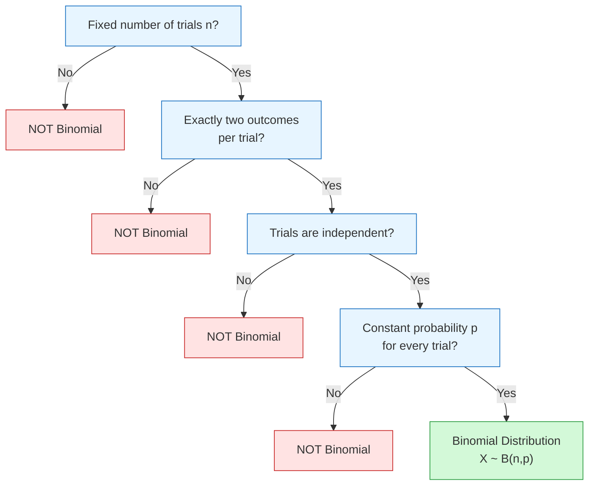
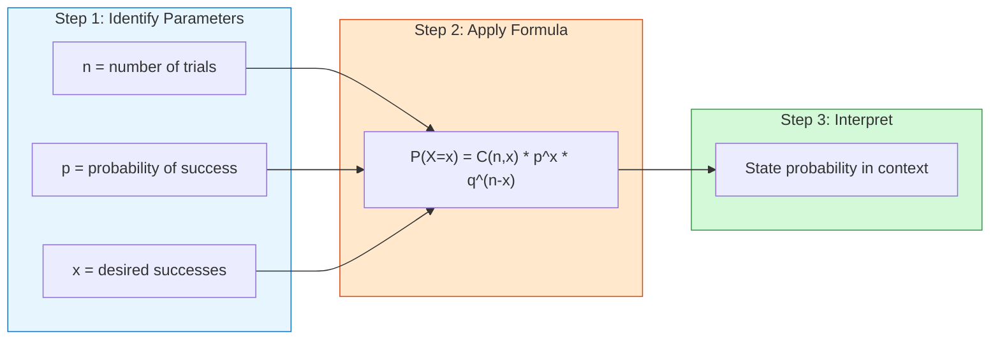

# FAD1015 L13 — Binomial Distribution

Lecture 13 of FAD1015 Mathematics III covering the binomial distribution as a discrete probability distribution. Source: `(L13) FAD 1015 - Week 7_1 Binomial - std.pdf` (34 slides).

## Learning Objectives

- Identify the binomial setting/characteristics
- Apply the binomial probability formula
- Use the binomial distribution table (cumulative probabilities)
- Calculate the mean and standard deviation of a binomial distribution

---

## 1. The Binomial Setting

The binomial distribution applies to probability problems that have **only two outcomes** or can be reduced to two outcomes.

**Natural two-outcome situations:**
- Baby born: male or female
- Coin tossed: head or tail
- Basketball game: win or lose

**Situations reducible to two outcomes:**
- Medical treatment: effective or ineffective
- Blood pressure: normal or abnormal
- Multiple choice question: correct or incorrect

---

## 2. Four Characteristics of a Binomial Experiment

A binomial experiment must satisfy **all four** conditions:

1. **Fixed number of trials** — $n$ identical trials
2. **Two possible outcomes** — each trial is either **success** or **failure**
   - $P(\text{success}) = p$
   - $P(\text{failure}) = 1 - p = q$
3. **Independent trials**
4. **Constant probability** — the probability of success/failure remains the same for every trial

**The binomial random variable $X$** is defined as:
$$X = \text{number of successes observed when an experiment or trial is performed}$$

The probability distribution of $X$ is called **the binomial probability distribution**.

### Checking for Binomial Distribution — Examples

| Scenario | Fixed $n$ | 2 Outcomes | Independent | Constant $p$ | Binomial? |
|----------|-----------|------------|-------------|--------------|-----------|
| Throwing dart till bullseye | No | Yes | Yes | Yes | **No** |
| Playing two football matches | Yes | No (win/draw/lose) | Yes | Yes | **No** |
| Playing two tennis games | Yes | Yes | No | Yes | **No** |
| Throw dice + toss coin for 6 and head | Yes | Yes | Yes | No | **No** |
| Throwing dice three times to get a 6 | Yes | Yes | Yes | Yes | **Yes** |

---

## 3. The Binomial Probability Formula

If $X \sim \text{Bin}(n, p)$, then:

$$P(X = x) = \binom{n}{x} p^x (1-p)^{n-x} = \frac{n!}{x!(n-x)!} \times p^x \times q^{n-x}$$

Where:
- $n$ = total number of trials
- $p$ = probability of success
- $q = 1-p$ = probability of failure
- $x$ = number of successes in $n$ trials
- $n-x$ = number of failures in $n$ trials

Recall:
$$^nC_r = \binom{n}{r} = \frac{n!}{r!(n-r)!}$$

---

## 4. Worked Examples — Using the Formula

### Example 1: Exactly One Defective

**Problem:** Ten percent of all iPhones manufactured by Apple are defective. A quality control inspector randomly selects five iPhones from the production line. Is this a binomial experiment? What is the probability that exactly one of these iPhones is defective?

**Solution:**
- Let $X$ = number of defects in 5 trials
- $X \sim B(5, 0.1)$
- Verify conditions: fixed $n=5$ ✓, 2 outcomes ✓, independent ✓, constant $p=0.1$ ✓
- $P(X = 1) = \binom{5}{1}(0.1)^1(0.9)^4 = 0.32805$

### Example 2: Multiple Probability Questions (Same Scenario)

Using $X \sim B(5, 0.1)$:

1. **Exactly three defective:**
   $$P(X = 3) = \binom{5}{3}(0.1)^3(0.9)^2 = 0.0081$$

2. **More than one defective:**
   $$P(X > 1) = P(X=2) + P(X=3) + P(X=4) + P(X=5) = 0.08146$$

3. **Less than two defective:**
   $$P(X < 2) = P(X=1) + P(X=0) = 0.9185$$

4. **At least one defective:**
   $$P(X \geq 1) = 0.40951$$

5. **At most two defective:**
   $$P(X \leq 2) = P(X=2) + P(X=1) + P(X=0) = 0.99144$$

---

## 5. The Binomial Distribution Table

The provided binomial distribution table gives **cumulative probabilities** of the form:

$$P(X \geq r) = P(X=r) + P(X=r+1) + \dots + P(X=n)$$

The table lists $P(X \geq r)$ for common values of $n$ (number of trials) and $p$ (probability of success), with $r$ = number of successes.

**Important:** The table shows cumulative probabilities $P(X \geq r)$, not individual probabilities $P(X = r)$.

### Example 3: Using the Binomial Table ($p \leq 0.5$)

**Problem:** Same iPhone scenario ($n=5, p=0.1$). Use the table to find:

1. $P(\text{exactly one})$ → read $P(X \geq 1)$ from table
2. $P(\text{exactly three})$ → $P(X \geq 3) - P(X \geq 4)$
3. $P(\text{more than one})$ → $P(X \geq 2)$
4. $P(\text{less than two})$ → $1 - P(X \geq 2)$
5. $P(\text{at least one})$ → $P(X \geq 1)$
6. $P(\text{at most two})$ → $1 - P(X \geq 3)$

### Example 5: Using the Binomial Table When $p > 0.5$

**Problem:** Eighty percent of iPhones are defective. Inspector selects ten iPhones ($n=10, p=0.8$).

**Trick — Flip success and failure:**

| Success ($p=0.8$) $X$ | Failure ($p=0.2$) $Y$ |
|:---:|:---:|
| 0 | 10 |
| 1 | 9 |
| 2 | 8 |
| 3 | 7 |
| 4 | 6 |
| 5 | 5 |
| 6 | 4 |
| 7 | 3 |
| 8 | 2 |
| 9 | 1 |
| 10 | 0 |

If $X \sim B(10, 0.8)$, then $Y \sim B(10, 0.2)$ where $Y = 10 - X$.

Questions:
1. At most 3 defective → $P(X \leq 3) = P(Y \geq 7)$
2. More than 5 defective → $P(X > 5) = P(Y < 5) = 1 - P(Y \geq 5)$
3. Less than 3 defective → $P(X < 3) = P(Y > 7) = P(Y \geq 8)$
4. At least 7 defective → $P(X \geq 7) = P(Y \leq 3) = 1 - P(Y \geq 4)$
5. More than 1 but less than 5 → $P(1 < X < 5) = P(5 < Y < 9) = P(Y \geq 6) - P(Y \geq 9)$
6. Exactly 6 defective → $P(X = 6) = P(Y = 4) = P(Y \geq 4) - P(Y \geq 5)$

---

## 6. Reading the Table — Key Rules

From the NOTES slide:

| Probability Wanted | How to Read from Table |
|--------------------|------------------------|
| $P(X \geq x)$ | Read straight from table |
| $P(X \leq x)$ | $1 - P(X \geq x+1)$ |
| $P(X < x)$ | $1 - P(X \geq x)$ |
| $P(X = x)$ | $P(X \geq x) - P(X \geq x+1)$ |
| $P(X > x)$ | $P(X \geq x+1)$ |

---

## 7. Mean and Standard Deviation

For $X \sim \text{Bin}(n, p)$:

- **Mean:** $\mu = np$
- **Variance:** $\sigma^2 = npq$
- **Standard Deviation:** $\sigma = \sqrt{npq}$

### Example 6: Mean, Variance and Standard Deviation

**Problem:** An egg supplier sends a daily shipment of 500 eggs. Previous records show 4% arrive damaged. Let $X$ be the number of damaged eggs. Find the mean and standard deviation.

**Solution:**
- $X \sim B(500, 0.04)$
- $\mu = np = 500 \times 0.04 = 20$
- $\sigma = \sqrt{npq} = \sqrt{500 \times 0.04 \times 0.96} = 4.38178$

---

## 8. Binomial Distribution in Real Life

1. **Medical professionals** use it to model the probability that a certain number of patients will experience side effects from new medications.
2. **Banks** use it to model the probability that a certain number of credit card transactions are fraudulent.
3. **Flood control systems** use it to model the probability that rivers overflow a certain number of times each year due to excessive rain.
4. **Retail stores** use it to model the probability that they receive a certain number of shopping returns each week.

---

## Related Topics

- [[Probability Distributions]] — overview of discrete and continuous distributions
- [[FAD1015 L14 — Poisson Distribution]] — next discrete distribution
- [[FAD1015 L15-L16 — Normal Distribution & Approximation]] — continuous distribution including normal approximation to binomial
- [[FAD1015 - Mathematics III]] — course page

## Key Equations

$$P(X = x) = \binom{n}{x} p^x q^{n-x}$$

$$\mu = np, \quad \sigma^2 = npq, \quad \sigma = \sqrt{npq}$$
