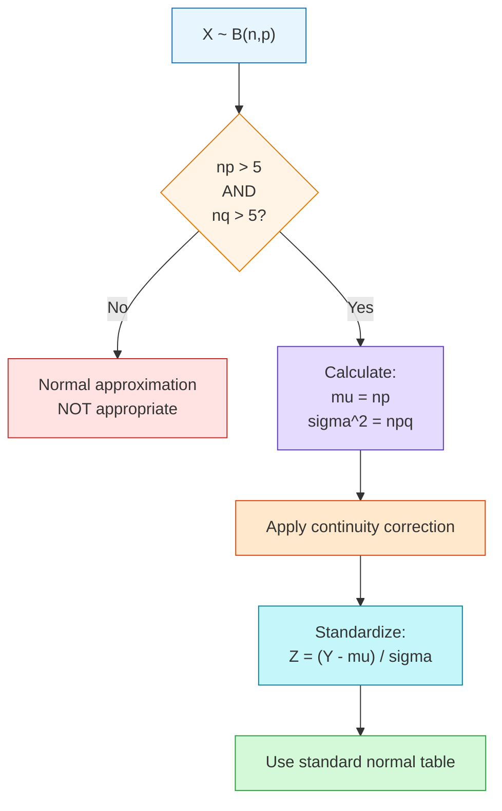
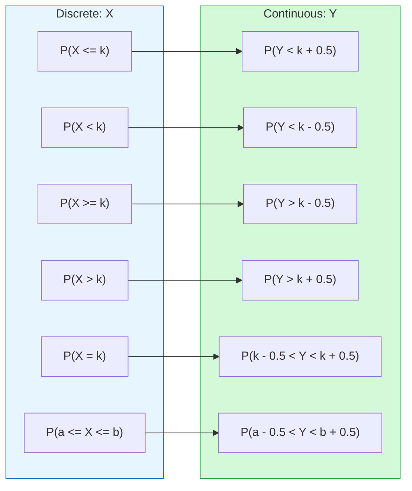

# FAD1015 L15-L16 — Normal Distribution & Approximation

Lectures 15-16 covering the normal (Gaussian) distribution, the most important continuous distribution in statistics. Source file: `(L15 L16) FAD 1015 -Week 8 Normal Distribution and Approximation_ (1).pdf`

## Summary

Comprehensive coverage of the normal distribution: properties, standard normal, z-scores, probability calculations using tables, and normal approximation to binomial with continuity correction. Includes foundational concepts (population vs sample, parameter vs statistic) and numerous worked examples.

## Key Concepts

- [[Probability Distributions]] — Normal distribution
- Normal (Gaussian) Distribution — bell-shaped curve
- Standard Normal Distribution — Z ~ N(0, 1)
- Z-Score — standardization: Z = (X - μ)/σ
- Normal Approximation to Binomial
- Continuity Correction
- Central Limit Theorem (introduced)

## Lecture Coverage

### 1. Foundations: Population vs Sample & Parameter vs Statistic

**Population:** The whole set of items that are of interest.
**Sample:** Some subset of the population intended to represent the population.

**Parameter:** A number that describes the data from a population.
**Statistic:** A number that describes the data from a sample.

| Measure | Population Parameter | Sample Statistic |
|---------|---------------------|------------------|
| Mean | μ | X̄ |
| Variance | σ² | s² |
| Standard Deviation | σ | s |

### 2. Continuous Probability Distribution Recap

- Distribution of a continuous random variable (e.g., heights, weights, amount of milk)
- Total probability of all intervals = 1
- Probability in any interval lies in range [0, 1]
- Represented by a **density curve**

### 3. Normal Distribution Properties

- **Bell-shaped**, symmetric about mean
- **Unimodal** (single peak)
- **Mean = Median = Mode**
- Asymptotic to x-axis
- Defined by mean (μ) and standard deviation (σ)
- Changing μ shifts the curve left/right
- Changing σ changes the spread (larger σ = wider/flatter)

### 4. Probability Density Function

$$f(x) = \frac{1}{\sigma\sqrt{2\pi}} \exp\left(\frac{-(x-\mu)^2}{2\sigma^2}\right), \quad -\infty < x < +\infty$$

Notation: X ~ N(μ, σ²)

The total area under the normal curve = 1.

### 5. Empirical Rule (68-95-99.7 Rule)

- About **68%** of data falls between μ − σ and μ + σ
- About **95%** of data falls between μ − 2σ and μ + 2σ
- About **99.7%** of data falls between μ − 3σ and μ + 3σ

More precisely:
- Area between μ ± σ: 0.6827
- Area between μ ± 2σ: 0.9545
- Area between μ ± 3σ: 0.9973

### 6. Standard Normal Distribution

The normal distribution with μ = 0 and σ = 1 is called the **standard normal distribution**.

**Standardization:** Any X ~ N(μ, σ²) can be transformed to Z ~ N(0, 1) using:

$$Z = \frac{X - \mu}{\sigma}$$

Z-values (Z scores) represent the distance between a selected value X and the population mean μ, divided by the population standard deviation σ.

**Symmetry properties:**
- P(Z < 0) = P(Z > 0) = 0.5
- P(Z < −z) = P(Z > z)
- P(Z > −z) = 1 − P(Z > z)

### 7. Using the Normal Distribution Table

The standard normal table gives P(Z > z) — the area in the right tail.

To find probabilities:
- P(Z > a): read directly from table
- P(Z < a) = 1 − P(Z > a)
- P(a < Z < b) = P(Z > a) − P(Z > b)
- P(|Z| < a) = 1 − 2·P(Z > a)

### 8. Probability Calculations (General Normal)

For X ~ N(μ, σ²):
1. Standardize: Z = (X − μ)/σ
2. Use standard normal table to find probability
3. Interpret result

**Types of problems:**
- Find P(X > a), P(X < a), P(a < X < b)
- Find the value of *a* given P(X < a) = p
- Find μ or σ given other information

### 9. Normal Approximation to Binomial

For X ~ B(n, p), when **np > 5** and **nq > 5** (where q = 1 − p):

X can be approximated by Y ~ N(μ, σ²) where:
- μ = np
- σ² = npq
- **σ = √(npq)**

The shape of the binomial distribution needs to be similar to the normal distribution. The normal distribution works best when p is close to 0.5 and n is large.

> **Common error:** Accidentally forgetting to square root the variance to get the standard deviation — needed in probability calculations.

### 10. Continuity Correction

Approximating the binomial (discrete) using the normal (continuous) requires a **continuity correction**.

In the discrete distribution, each probability is represented by a rectangle. When working out probabilities, we want to include whole rectangles.

| Discrete | Continuous Equivalent |
|----------|----------------------|
| P(X ≤ k) | P(Y < k + 0.5) |
| P(X < k) | P(Y < k − 0.5) |
| P(X ≥ k) | P(Y > k − 0.5) |
| P(X > k) | P(Y > k + 0.5) |
| P(X = k) | P(k − 0.5 < Y < k + 0.5) |
| P(a ≤ X ≤ b) | P(a − 0.5 < Y < b + 0.5) |

### 11. Central Limit Theorem (Brief)

For non-normal distributions, as the sample size increases, the distribution of the sample means becomes approximately Normal. If the sample size is large enough, the distribution looks normally distributed.

## Worked Examples from Lecture

### Example 1: Empirical Rule
Test scores of 500 students: X ~ N(70, 5²)
- P(65 < X < 75) = P(μ − σ < X < μ + σ) ≈ 68%
- P(70 < X < 80) = P(μ < X < μ + 2σ) ≈ 34% + 13.5% = 47.5%

### Example 2: Standard Normal Probabilities
If Z ~ N(0,1), find:
- P(Z > 2.43)
- P(Z < −2.35)
- P(Z > −1.28)
- P(0.5 < Z < 1.23)
- P(−1.75 < Z < −1.25)

### Example 3: General Normal Probabilities
If X ~ N(300, 25), find:
- P(X > 305)
- P(X < 291)
- P(286 < X < 312)

### Example 4: Finding Parameters
The lifetimes of car tyres are N(7500, σ²). Find σ if 5% last less than 6000 km.

### Example 5: Normal Approximation
X ~ B(20, 0.4). Use normal approximation to estimate P(X ≤ 6).

Check: np = 8 > 5, nq = 12 > 5 ✓
μ = 8, σ² = 4.8, σ = √4.8 ≈ 2.19
P(X ≤ 6) ≈ P(Y < 6.5) = P(Z < (6.5−8)/2.19)

### Example 6: Continuity Correction Practice
X ~ B(500, 0.5). Use normal approximation for:
- P(X < 260) → P(Y < 259.5)
- P(X ≤ 250) → P(Y < 250.5)
- P(X > 255) → P(Y > 255.5)
- P(X ≥ 235) → P(Y > 234.5)
- P(X = 260) → P(259.5 < Y < 260.5)

## Exercises

The lecture includes extensive exercises (14 sets) covering:
- Basic probability calculations
- Finding cutoff values
- Finding μ and σ from percentiles
- Normal approximation with continuity correction

## Related Topics

- [[FAD1015 L13 — Binomial Distribution]] — discrete to continuous approximation
- [[FAD1015 L14 — Poisson Distribution]] — another discrete distribution
- [[FAD1015 Tutorial 7 — Normal Distribution]] — practice problems
- [[FAD1015 Final 2023-2024]] — exam applications

## Related Course Page

- [[FAD1015 - Mathematics III]]
