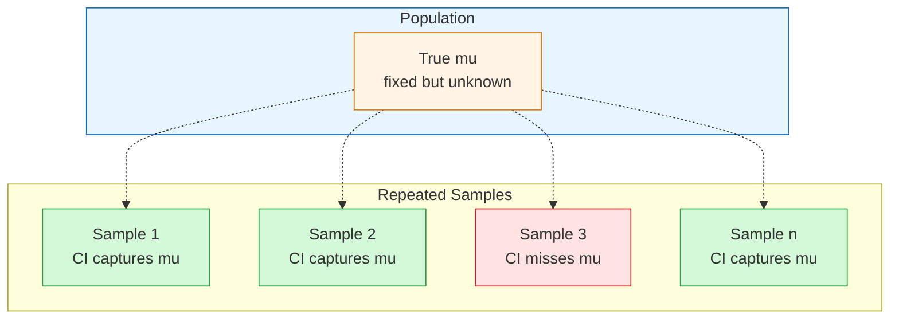
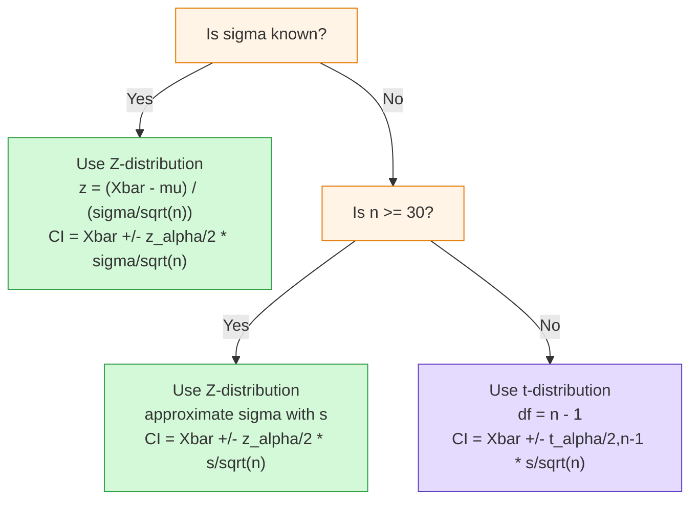

# FAD1015 L21-L22 — Estimation of Population Mean

Lectures 21-22 (Week 12) covering point estimation and interval estimation (confidence intervals) for the population mean. Source file: `(L21 L22) FAD 1015 -Week 12 Estimation of the Population Mean_.pdf`

## Learning Outcomes

- Define point estimate
- Define the confidence interval (CI)
- Find the CI when $\sigma$ is known and when $\sigma$ is unknown
- Construct and interpret the CI for the population mean, $\mu$

## 1. Statistical Inference Flashback

Statistical inference uses sample **statistics** (e.g. $\bar{x}$, $s$) to draw conclusions about population **parameters** (e.g. $\mu$, $\sigma$).

There are two main types of statistical inference:

1. **Estimation** — estimating the value of a population parameter
   - *Example*: A consumer wants to estimate the average price of similar homes before putting her home on the market.
2. **Hypothesis Testing** — making a decision about a population parameter
   - *Example*: A manufacturer wants to know if a new type of steel is more resistant to high temperatures than an old type.

## 2. Point Estimation

A **point estimate** of a population parameter is a single value of a statistic used to estimate the parameter.

Common point estimators:
- **Sample mean** $\bar{x}$ estimates population mean $\mu$
- **Sample variance** $s^2$ estimates population variance $\sigma^2$
- **Sample proportion** $\hat{p}$ estimates population proportion $p$

## 3. Interval Estimation (Confidence Intervals)

An **interval estimate** is defined by two numbers between which a population parameter is said to lie.

A **confidence interval (CI)** is an interval estimate with a specified level of confidence.

### Structure

$$\mu = \text{point estimate} \pm \text{margin of error}$$

The margin of error is based on the spread of the sampling distribution of the point estimator.

- **Lower Confidence Limit (LCL)**
- **Upper Confidence Limit (UCL)**
- **Width of the confidence interval** = UCL − LCL

### Confidence Level

The confidence level is denoted by $(1 - \alpha)100\%$.

| Confidence Level | $1 - \alpha$ | $\alpha$ |
|------------------|-------------|----------|
| 90% | 0.90 | 0.10 |
| 95% | 0.95 | 0.05 |
| 99% | 0.99 | 0.01 |

### Interpreting Confidence Intervals

From a simulation of 20 studies (each with $n = 100$), the 95% confidence intervals for mean vitamin D show that approximately 95% of the constructed intervals capture the true population mean.

> **Correct interpretation**: "We are 95% confident that the true mean lies in [a, b]."
>
> **Incorrect interpretation**: "There is a 95% probability that $\mu$ is in [a, b]."

## 4. Confidence Interval When $\sigma$ is Known

When the population standard deviation $\sigma$ is known, the $(1-\alpha)100\%$ confidence interval for $\mu$ is:

$$\bar{x} \pm z_{\alpha/2} \cdot \frac{\sigma}{\sqrt{n}}$$

or equivalently:

$$\bar{x} - z_{\alpha/2}\left(\frac{\sigma}{\sqrt{n}}\right) \le \mu \le \bar{x} + z_{\alpha/2}\left(\frac{\sigma}{\sqrt{n}}\right)$$

### Common Critical Values ($z_{\alpha/2}$)

| Confidence Level | $z_{\alpha/2}$ |
|------------------|---------------|
| 90% | 1.645 |
| 95% | 1.96 |
| 99% | 2.576 |

### Assumptions
- Population is normally distributed
- If the population is not normal, use a large sample ($n \ge 30$) by the **Central Limit Theorem**

> **Note**: In practice, $\sigma$ is rarely known. This case is mainly theoretical or used when historical data provides a reliable $\sigma$.

### Example 1 — Circuit Resistance ($\sigma$ Known)

A sample of 11 circuits from a large normal population has a mean resistance of 2.20 ohms. We know from past testing that the population standard deviation is 0.35 ohms.

i) Determine a 95% confidence interval for the true mean resistance.
ii) Determine a 99% confidence interval for the true mean resistance.
iii) From the confidence intervals in (i) and (ii), what can you observe?

*Observation*: Higher confidence level produces a wider interval.

### Factors Affecting the Width of a Confidence Interval

The width depends on:
- The value of $z_{\alpha/2}$ (confidence level)
- The sample size $n$

Higher confidence → wider interval. Larger $n$ → narrower interval.

## 5. Central Limit Theorem Review

For a large sample size ($n \ge 30$), the sampling distribution of the sample mean is approximately normal, regardless of the shape of the population distribution.

The mean and standard deviation of the sampling distribution of $\bar{x}$:

$$\mu_{\bar{x}} = \mu \quad \text{and} \quad \sigma_{\bar{x}} = \frac{\sigma}{\sqrt{n}}$$

Special cases:
- If the population is fairly symmetric, the sampling distribution is approximately normal for samples as small as $n = 5$.
- If the population is normally distributed, the sampling distribution of the mean is normally distributed **regardless of the sample size**.

### Example 2 — Tea Boxes (Large Sample, $n = 200$)

For a sample of 200 tea boxes, the average weight is 101.0 grams with a standard deviation of 2.78 grams. Determine a 99% confidence interval for the population mean.

*(Since $n = 200 \ge 30$, the CLT applies. With large $n$, $z$ is used even if $\sigma$ is approximated by $s$.)*

## 6. Confidence Interval When $\sigma$ is Unknown

When $\sigma$ is unknown (the more common scenario), we substitute the **sample standard deviation $s$**. This introduces extra uncertainty since $s$ varies from sample to sample.

Hence, we use the **Student's $t$-distribution**.

### Formula

The $(1-\alpha)100\%$ confidence interval for $\mu$ is:

$$\bar{x} \pm t_{\alpha/2,\, n-1} \cdot \frac{s}{\sqrt{n}}$$

or equivalently:

$$\bar{x} - t_{\alpha/2,\, n-1}\left(\frac{s}{\sqrt{n}}\right) \le \mu \le \bar{x} + t_{\alpha/2,\, n-1}\left(\frac{s}{\sqrt{n}}\right)$$

### Assumptions
- The population is normally distributed
- If the population is not normal, use a large sample ($n \ge 30$) by the Central Limit Theorem

### Student's $t$-Distribution

- Bell-shaped and symmetric, but has **fatter tails** than the standard normal distribution
- The value of $t$ is obtained from the $t$-distribution table for $n-1$ degrees of freedom (d.f.)
- As $n$ increases, $t \to z$ (the $t$-distribution approaches the standard normal)
- Standard Normal = $t$ with $df = \infty$

### How to Read the $t$-Table

- Rows: degrees of freedom $\nu = n - 1$
- Columns: upper-tail probability $\alpha$
- For a 95% CI with $n = 25$ ($df = 24$), use $\alpha = 0.025$ column → $t = 2.064$

### Example 3 — Random Sample ($\sigma$ Unknown)

A random sample of $n = 25$ with $\bar{x} = 50$ and $s = 8$. Form a 95% confidence interval for $\mu$.

- $df = 24$
- $t_{0.025, 24} = 2.064$
- $CI = 50 \pm 2.064 \times \frac{8}{\sqrt{25}} = 50 \pm 3.30$
- $95\%\, CI = (46.70,\; 53.30)$

## 7. Summary: $z$ vs $t$

| Condition | Distribution | Formula |
|-----------|-------------|---------|
| $\sigma$ known, normal population (or $n \ge 30$) | $z$ (standard normal) | $\bar{x} \pm z_{\alpha/2} \frac{\sigma}{\sqrt{n}}$ |
| $\sigma$ unknown, normal population (or $n \ge 30$) | $t$ (Student's $t$, $df = n-1$) | $\bar{x} \pm t_{\alpha/2, n-1} \frac{s}{\sqrt{n}}$ |

Standardized forms:

$$Z = \frac{\bar{X} - \mu}{\sigma/\sqrt{n}} \sim N(0,1) \quad \text{and} \quad t = \frac{\bar{X} - \mu}{S/\sqrt{n}} \sim t_{n-1}$$

Sample standard deviation:

$$S = \sqrt{\frac{\sum_{i=1}^{n}(x_i - \bar{x})^2}{n-1}}$$

## 8. Lecture Exercises

### Exercise 1 — Fuel Efficiency ($\sigma$ Known, Large $n$)
Jerry kept careful records of the fuel efficiency of his car. After the first 100 times he filled up the tank, he found the mean was 23.4 miles per gallon (mpg) with a **population** standard deviation of 0.9 mpg. Compute the 95% confidence interval for his mpg.

### Exercise 2 — Manufacturing Wages (Large $n$, $s$ Given)
According to a survey, workers in manufacturing industries earned an average of RM 499 per week in December 1992. Assume that this mean is based on a random sample of 1000 workers and that the standard deviation of weekly earnings for this sample is RM 75. Find a 99% confidence interval for the mean weekly earnings of all workers employed in manufacturing industries in December 1992.

### Exercise 3 — Basketball Coaches ($\sigma$ Unknown, Small $n$)
According to a survey, the mean base salary of national women's basketball coaches is RM 44961. Assume that this survey is based on a random sample of 20 head coaches. Further assume that the current base salaries of all such coaches have an approximate normal distribution, and the sample standard deviation is RM 6255. Determine a 99% confidence interval for the population mean.

### Exercise 4 — Normally Distributed Population ($\sigma$ Unknown)
A sample of size 15 drawn from a normally distributed population has a sample mean of 35 and a sample standard deviation of 14. Construct a 95% confidence interval for the population mean and interpret.

### Exercise 5 — University GPA ($\sigma$ Unknown)
A random sample of 12 students from University XYZ yields a mean GPA of 2.71 with a sample standard deviation of 0.51. Construct a 90% confidence interval for the mean GPA of all students at the university. Assume that the numerical population of GPAs from which the sample is taken has a normal distribution.

### Exercise 6 — Steel Yield Point ($\sigma$ Known)
The yield point of a particular type of mild steel-reinforcing bar is known to be normally distributed with $\sigma = 100$. The composition of the bar has been slightly modified, but the modification is not believed to have affected either the normality or the value of $\sigma$. Assuming this to be the case, if a sample of 25 modified bars resulted in a sample average yield point of 8439 lb, compute a 90% CI for the true average yield point of the modified bar.

## Related Topics

- [[FAD1015 L20 — Sampling Distribution of the Mean]] — prerequisite: CLT and sampling distributions
- [[FAD1015 L23-L24 — Hypothesis Testing About the Mean]] — the other branch of statistical inference
- [[FAD1015 Tutorial 10 — Estimation of Population Mean]] — practice problems

## Related Course Page

- [[FAD1015 - Mathematics III]]
