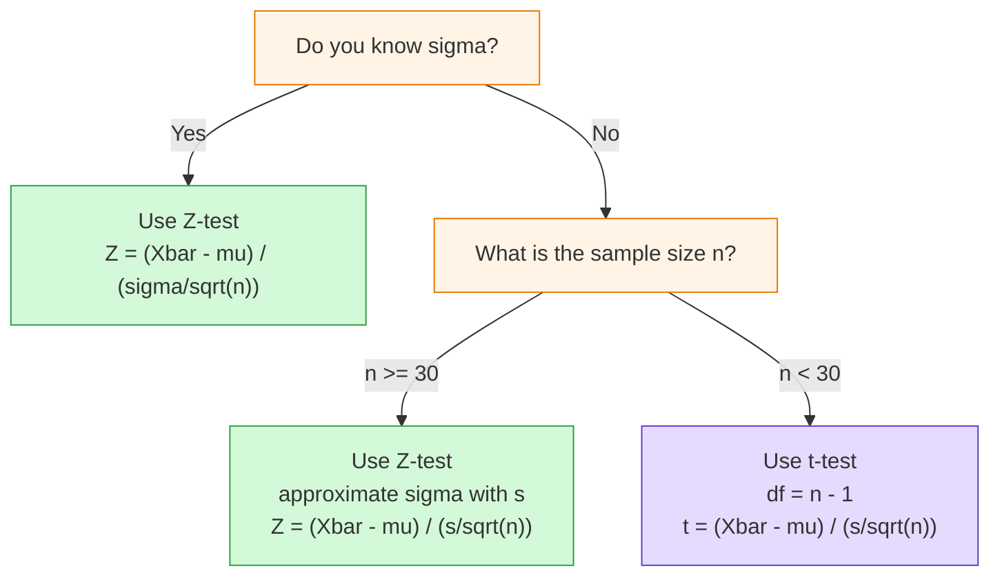
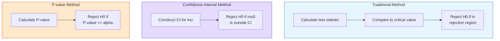

# FAD1015 L23-L24 — Hypothesis Testing About the Mean

Lectures 23–24 introducing hypothesis testing methodology for the population mean using a one-sample test. Source file: `(L23 L24) FAD 1015 -Week 14  Hypothesis Testing About the Mean_.pdf`

## Summary

Comprehensive introduction to hypothesis testing for a single population mean: null and alternative hypotheses, significance level, test statistics (Z and t), three decision approaches (traditional/critical-value, confidence-interval, and P-value), and the six-step testing procedure.

## Key Concepts

- [[Hypothesis Testing]] — statistical decision making about a population parameter
- [[Null Hypothesis]] (H₀) — statement assumed true until evidence contradicts it
- [[Alternative Hypothesis]] (H₁ or Hₐ) — research claim; true if H₀ is false
- [[Significance Level]] (α) — measure of confidence in rejecting H₀; commonly 0.10, 0.05, 0.01
- [[Test Statistic]] — Z (large sample) or t (small sample, σ unknown)
- [[P-value]] — observed level of significance; smallest α for which H₀ can be rejected
- [[Critical Value]] / [[Rejection Region]] — region where H₀ is rejected
- [[Confidence Interval Method]] — alternative approach using interval estimation

---

## 1. Hypothesis Testing Framework

### 1.1 Definitions

**Hypothesis**
A claim or statement made about a population parameter that we want to test. The statement may or may not be true.

**Null Hypothesis (H₀)**
A statement or claim about a population parameter that is **assumed to be true until it is declared false**.
- Usually contains equality (=, ≤, or ≥)
- Denoted H₀ (pronounced “H-null”, “H-zero”, or “H-nought”)

**Alternative Hypothesis (H₁ or Hₐ)**
A claim about a population parameter that **will be true if the null hypothesis is false**.
- Represents the research hypothesis
- Can be two-tailed (≠), left-tailed (<), or right-tailed (>)

### 1.2 Types of Tests

| Test Type | Null Hypothesis | Alternative Hypothesis |
|-----------|-----------------|------------------------|
| Two-tailed | H₀: μ = μ₀ | H₁: μ ≠ μ₀ |
| Left-tailed | H₀: μ ≥ μ₀ | H₁: μ < μ₀ |
| Right-tailed | H₀: μ ≤ μ₀ | H₁: μ > μ₀ |

> **Note:** In practice H₀ is often written with equality only (μ = μ₀) regardless of tail direction.

### 1.3 Significance Level (α)

The **level of significance** is a measure of how confident you can be about rejecting the null hypothesis.
- Also called the **alpha level**
- Common values: **0.10, 0.05, 0.01**
- The **most common value** is **α = 0.05**
- α specifies the size of the **rejection region** (critical region)

---

## 2. Test Statistic Selection

The choice of test statistic depends on whether the population standard deviation σ is known and on sample size:

### 2.1 Large Sample (n ≥ 30)

When the sample is large, the sampling distribution of the sample mean is approximately normal by the Central Limit Theorem.

**σ known:**
$$Z = \frac{\bar{X} - \mu}{\sigma / \sqrt{n}} \sim N(0,1)$$

**σ unknown:**
$$Z = \frac{\bar{X} - \mu}{s / \sqrt{n}} \sim N(0,1)$$

### 2.2 Small Sample (n < 30)

When the sample is small and σ is unknown, use the **t-distribution** (requires approximate normality of the population).

**σ unknown:**
$$T = \frac{\bar{x} - \mu_0}{s / \sqrt{n}} \sim t_{n-1}$$

---

## 3. Three Approaches to Hypothesis Testing

The lecture presents three methods for making the decision:

1. **Traditional method** — critical value / rejection region
2. **Confidence Interval method**
3. **P-value method**

---

## 4. Steps for Hypothesis Testing

1. **State** the null hypothesis and alternative hypothesis
2. **Select** a level of significance (α)
3. **Identify** the test statistic
4. **Identify** the rejection region / critical region
5. **Make** a decision
6. **Conclusion**

---

## 5. Decision Rules

### 5.1 Traditional (Critical-Value) Approach

Compare the calculated test statistic to the critical value(s):
- Test statistic falls in the **rejection region** → **Reject H₀**
- Test statistic falls in the **non-rejection region** → **Do not reject H₀**

### 5.2 P-Value Approach

The **P-value** is also called the **observed level of significance**. It is the **smallest value of α for which H₀ can be rejected**.

- **P-value ≤ α** → **Reject H₀**
- **P-value > α** → **Do not reject H₀**

> The P-value is the smallest level of significance that would lead to the rejection of the null hypothesis H₀ with the given data.

### 5.3 Confidence Interval Approach

Construct a confidence interval for μ. If the hypothesized value μ₀ falls **outside** the interval, reject H₀. If it falls **inside**, do not reject H₀.

---

## 6. Worked Examples

### Example 1 — Two-Tailed Z-Test (Large Sample, σ Unknown)
The processors of XYZ Ketchup indicate on the label that the bottle contains 16 ounces of ketchup. A sample of 36 bottles from last hour’s production revealed a mean weight of 16.12 ounces per bottle and a standard deviation of 0.5 ounces. At the 0.05 significance level, is the process out of control? That is, can we conclude that the mean amount per bottle is **different from 16 ounces**?

**Solution outline:**
- H₀: μ = 16 vs H₁: μ ≠ 16
- α = 0.05 (two-tailed)
- n = 36 ≥ 30, σ unknown → use Z with s
- $Z = \frac{16.12 - 16}{0.5 / \sqrt{36}} = \frac{0.12}{0.0833} = 1.44$
- Critical values: ±1.96
- Decision: |1.44| < 1.96 → **Do not reject H₀**
- Conclusion: At the 5% significance level, there is not enough evidence to conclude that the mean amount per bottle differs from 16 ounces.

---

### Example 2 — Right-Tailed Z-Test (Large Sample, σ Unknown)
A phone industry manager thinks that customers’ monthly cell phone bills have increased, and now average **more than RM 52** per month. The company wishes to test this claim. Suppose a sample of 64 customers is randomly selected with a mean RM 53.1 and standard deviation RM10. Test the manager’s claim at 10% level of significance.

**Solution outline:**
- H₀: μ ≤ 52 vs H₁: μ > 52
- α = 0.10 (right-tailed)
- n = 64 ≥ 30, σ unknown → use Z with s
- $Z = \frac{53.1 - 52}{10 / \sqrt{64}} = \frac{1.1}{1.25} = 0.88$
- Critical value: 1.28
- Decision: 0.88 < 1.28 → **Do not reject H₀**
- Conclusion: At the 10% significance level, there is not enough evidence to support the manager’s claim that the average monthly bill exceeds RM 52.

---

### Example 3 — Left-Tailed Z-Test (Large Sample, σ Known)
A quality control engineer finds that a sample of 100 light bulbs had an average life-time of 470 hours. Assuming a population standard deviation of σ = 25 hours, test whether the population mean is 480 hours vs. the alternative hypothesis μ < 480 at a significance level of α = 0.05.

**Solution outline:**
- H₀: μ = 480 vs H₁: μ < 480
- α = 0.05 (left-tailed)
- n = 100 ≥ 30, σ known → use Z
- $Z = \frac{470 - 480}{25 / \sqrt{100}} = \frac{-10}{2.5} = -4.0$
- Critical value: −1.645
- Decision: −4.0 < −1.645 → **Reject H₀**
- Conclusion: At the 5% significance level, there is sufficient evidence to conclude that the mean lifetime of the light bulbs is less than 480 hours.

---

### Example 4 — Two-Tailed t-Test (Small Sample, σ Unknown)
The mean cost of a hotel room in KL is said to be RM168 per night. A random sample of 25 hotels resulted in $\bar{X}$ = RM172.50 and S = 15.40. Test at the α = 0.05 level. (A stem-and-leaf display and a normal probability plot indicate the data are approximately normally distributed.)

**Solution outline:**
- H₀: μ = 168 vs H₁: μ ≠ 168
- α = 0.05 (two-tailed)
- n = 25 < 30, σ unknown → use t with df = 24
- $t = \frac{172.50 - 168}{15.40 / \sqrt{25}} = \frac{4.50}{3.08} = 1.46$
- Critical values: ±2.064
- Decision: |1.46| < 2.064 → **Do not reject H₀**
- Conclusion: At the 5% significance level, there is not enough evidence to conclude that the mean cost of a hotel room in KL differs from RM168.

> This example is also used to illustrate the **Confidence Interval Approach**.

---

### Example 5 — P-Value Approach (Same Data as Example 2)
A phone industry manager thinks that customers’ monthly cell phone bills have increased, and now average more than RM 52 per month. The company wishes to test this claim. Suppose a sample of 64 customers is randomly selected with a mean RM 53.1 and standard deviation RM10. Test the manager’s claim at 10% level of significance using the **p-value approach**.

**Solution outline:**
- H₀: μ ≤ 52 vs H₁: μ > 52
- α = 0.10
- Test statistic: Z = 0.88 (as in Example 2)
- P-value = P(Z > 0.88) = 1 − 0.8106 = **0.1894**
- Decision: 0.1894 > 0.10 → **Do not reject H₀**
- Conclusion: At the 10% significance level, there is not enough evidence to support the manager’s claim.

---

### Example 6 — P-Value Approach (Same Data as Example 1)
The processors of XYZ Ketchup indicate on the label that the bottle contains 16 ounces of ketchup. A sample of 36 bottles from last hour’s production revealed a mean weight of 16.12 ounces per bottle and a standard deviation of 0.5 ounces. At the 0.05 significance level, is the process out of control? That is, can we conclude that the mean amount per bottle is different from 16 ounces? Use the **p-value approach**.

**Solution outline:**
- H₀: μ = 16 vs H₁: μ ≠ 16
- α = 0.05
- Test statistic: Z = 1.44 (as in Example 1)
- P-value = 2 × P(Z > 1.44) = 2 × (1 − 0.9251) = **0.1498**
- Decision: 0.1498 > 0.05 → **Do not reject H₀**
- Conclusion: At the 5% significance level, there is not enough evidence to conclude that the mean amount differs from 16 ounces.

---

## 7. Exercises

### Exercise 1
Effy’s Discount Store chain issues its own credit card. Bobby, the credit manager, wants to find out if the mean monthly unpaid balance is **more than RM400**. The level of significance is set at 0.05. A random check of 172 unpaid balances revealed the sample mean to be RM407 and the sample standard deviation to be RM38. Should Bobby conclude that the population mean is greater than RM400?

### Exercise 2
The manager of a large factory believes that the average hourly wage of the employees is **below RM 9.78** per hour. A sample of 40 employees has a mean hourly wage of RM9.60. The variance of all salaries is RM 2.20. Assume the variable is normally distributed. At α = 0.10, is there enough evidence to support the manager’s claim?

### Exercise 3
The mean height of all female college basketball players is 69.5 inches. A random sample of 25 such players produced a mean height of 70.2 inches with a variance of 4.41 inches. Assuming that the heights of all female college basketball players are normally distributed, test at the 1% significance level if their mean height is **different from 69.5 inches**.

### Exercise 4
The current rate for producing 5 amp fuses at Ah Seng Electric Co. is 250 per hour. A new machine has been purchased and installed that, according to the supplier, will **increase** the production rate. A sample of 10 randomly selected hours from last month revealed the mean hourly production on the new machine was 256 units, with a sample standard deviation of 6 per hour. At the 0.05 significance level can Ah Seng conclude that the new machine is faster?

### Exercise 5
We have a sample of 106 body temperatures having a mean of 98.20°F. Assume that the sample is a simple random sample and that the population standard deviation σ is known to be 0.62°F. Use a 0.05 significance level to test the common belief that the mean body temperature of healthy adults is **equal to 98.6°F**.

- i) Traditional method (critical value / rejection region)
- ii) Confidence Interval method
- iii) P-value method

---

## Related Topics

- [[FAD1015 L21-L22 — Estimation of Population Mean]] — related inference; confidence intervals
- [[FAD1015 L25-L26 — Hypothesis Testing in R]] — computational implementation
- [[FAD1015 Tutorial 11 — Hypothesis Testing About the Mean]] — practice problems

## Related Course Page

- [[FAD1015 - Mathematics III]]
