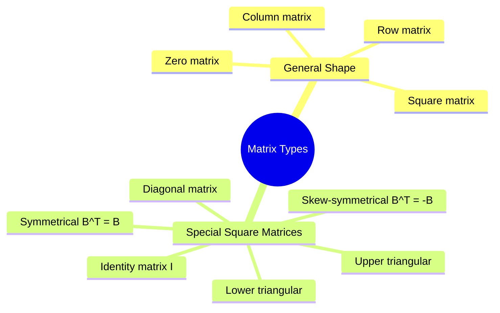
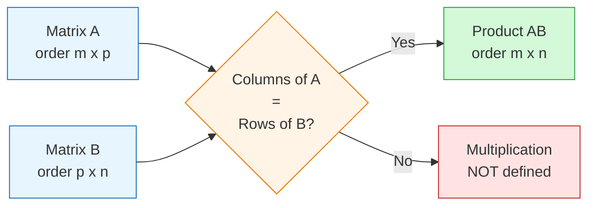

# FAD1015 L27-L28 — Matrices (Types, Operations & Determinants)

Lectures 27–28 introducing matrix algebra: types of matrices, basic operations, transpose, and determinants. Source file: `(L27L28) - WEEK 16_MATRICES.pdf`

## Summary

Introduction to matrices: definitions, special types, fundamental operations (addition, subtraction, scalar multiplication, matrix multiplication), transpose, and determinants of $2 \times 2$ and $3 \times 3$ matrices including minors, cofactors, and determinant properties.

## Key Concepts

- [[Matrices]] — Matrix algebra fundamentals
- [[Determinant]] — Scalar value associated with a square matrix

---

## L27 — Matrices

### 1. Definition of a Matrix

A **matrix** is a rectangular array of real numbers enclosed by a pair of brackets.

- Each matrix has its own **size** or **order**
- The size is determined by the number of **rows** and **columns**
- If a matrix $A$ has $m$ rows and $n$ columns, then $A$ is called an $m \times n$ matrix (read as "$m$ by $n$")

A general matrix of size $m \times n$ may be denoted by:

$$A = \begin{bmatrix} a_{11} & a_{12} & \cdots & a_{1n} \\ a_{21} & a_{22} & \cdots & a_{2n} \\ \vdots & \vdots & \ddots & \vdots \\ a_{m1} & a_{m2} & \cdots & a_{mn} \end{bmatrix}$$

where $a_{ij}$ refers to the element in the $i$-th row and $j$-th column.

**Leading entry, $P_i$** — the first non-zero element from the left of the $i$-th row.

**Leading diagonal** — diagonal elements $a_{11}, a_{22}, \ldots, a_{mm}$ of the matrix.

### 2. Types of Matrices

| Type | Definition | Notation / Example |
|------|------------|-------------------|
| **Row matrix** | A matrix with only one row | $(2 \quad 5 \quad 1)$ |
| **Column matrix** | A matrix with only one column | $\begin{pmatrix} 1 \\ 0 \\ 6 \end{pmatrix}$ |
| **Square matrix** | Equal number of rows and columns ($m = n$) | $n \times n$ |
| **Zero matrix** | All elements are zero | $0$ |
| **Diagonal matrix** | Square matrix where all non-diagonal elements are zero | $\text{diag}(d_1, \ldots, d_n)$ |
| **Identity matrix, $I_m$** | Square matrix with 1s on the principal diagonal and 0s elsewhere | $I_n$ |
| **Upper triangular matrix** | Square matrix where all entries under the diagonal elements are zero | |
| **Lower triangular matrix** | Square matrix where all entries above the diagonal elements are zero | |
| **Symmetrical matrix** | Square matrix with $a_{ij} = a_{ji}$ for all $i, j$; i.e., $B^T = B$ | |
| **Skew-symmetrical matrix** | Square matrix where $B^T = -B$ and $b_{ii} = 0$ | |

### 3. Operations on Matrices

#### Addition and Subtraction
If $A = (a_{ij})$ and $B = (b_{ij})$ are two matrices of the **same size**, then $A + B$ is the resulting matrix with $(a + b)_{ij} = a_{ij} + b_{ij}$. The difference $A - B$ is obtained by subtracting corresponding elements.

**Properties:**
1. $A + B = B + A$ → Commutative Property
2. $A + (B + C) = (A + B) + C$ → Associative Property
3. $A + 0 = 0 + A = A$
4. $A + (-A) = 0 = (-A) + A$

#### Scalar Multiplication
The product of a scalar $k$ and a matrix $A$, written $kA$, is the matrix obtained by multiplying each element of $A$ by $k$.

$$(kA)_{ij} = k \cdot a_{ij}$$

**Properties:**
1. $k(A + B) = kA + kB$
2. $(k_1 + k_2)A = k_1A + k_2A$
3. $k_1(k_2A) = k_2(k_1A) = (k_1k_2)A$

#### Matrix Multiplication
The product of a row matrix $(a \quad b)$ and a column matrix $\begin{pmatrix} c \\ d \end{pmatrix}$ is defined by:

$$(a \quad b) \begin{pmatrix} c \\ d \end{pmatrix} = ac + bd$$

For two matrices $A$ and $B$, the principle **'row into column'** is used to obtain the product $AB$.

Multiplication between two matrices $A$ and $B$, $AB$, can only be done if the number of columns of $A$ **must equal** the number of rows of $B$.

If $A$ is a matrix of order $m \times p$ and $B$ a matrix of order $p \times n$, then $AB$ is a matrix of order $m \times n$.

$$(AB)_{ij} = \sum_{k=1}^{p} a_{ik} \cdot b_{kj}$$

**Properties of Multiplication:**
1. $A(B + C) = AB + AC$
2. If $A$ is a zero matrix of order $m \times n$, $B$ is of order $n \times p$, then $AB = 0$
3. $AB \neq BA$ (matrix multiplication is **not commutative**)
4. If $A$ is a square matrix and $I$ is an identity matrix of the same order, then $AI = IA = A$
5. Let $A$ be a square matrix of order $n \times n$, then $A^2 = AA$. In general, $A^m = A \cdot A \cdot \ldots \cdot A$ ($m$ times)
6. The law of exponents is valid: $A^p A^q = A^{p+q}$, $(A^p)^q = A^{pq}$ for $p > 0, q > 0$
7. Let $I$ be an identity matrix, then $I = I^2 = I^3 = \cdots = I^n$

#### Transpose of a Matrix
Let $A$ be an $m \times n$ matrix, the **transpose** of $A$ written as $A^T$, is an $n \times m$ matrix obtained by interchanging the rows and columns of $A$.

$$(A^T)_{ij} = a_{ji}$$

**Properties of Transpose:**
1. $(kA)^T = kA^T$, $k$ a scalar
2. $(A^T)^T = A$
3. $(A \pm B)^T = A^T \pm B^T$
4. $(AB)^T = B^T A^T$

---

## L28 — Determinant of Matrices

### 1. Determinant of a $2 \times 2$ Matrix

Let $A = \begin{pmatrix} a_{11} & a_{12} \\ a_{21} & a_{22} \end{pmatrix}$ then:

$$|A| = \begin{vmatrix} a_{11} & a_{12} \\ a_{21} & a_{22} \end{vmatrix} = a_{11}a_{22} - a_{12}a_{21}$$

### 2. Minor and Cofactor

If $A$ is a square matrix of order $3 \times 3$, the **minor** of $a_{ij}$, denoted by $M_{ij}$, is the determinant of the $2 \times 2$ matrix obtained by deleting the $i$-th row and $j$-th column.

The **cofactor** of $a_{ij}$ is denoted by $C_{ij}$ and:

$$C_{ij} = (-1)^{i+j} M_{ij}$$

> **Note:** For a $3 \times 3$ matrix, the sign of the cofactors are:
> $$\begin{pmatrix} + & - & + \\ - & + & - \\ + & - & + \end{pmatrix}$$

### 3. Determinant of a $3 \times 3$ Matrix

#### Diagonal Expansion (for checking)
For checking purposes, the determinant of $3 \times 3$ matrix $A$ can be evaluated by diagonal expansion:

$$|A| = P_1 + P_2 + P_3 - P_4 - P_5 - P_6$$
$$= a_{11}a_{22}a_{33} + a_{12}a_{23}a_{31} + a_{13}a_{21}a_{32} - a_{13}a_{22}a_{31} - a_{11}a_{23}a_{32} - a_{12}a_{21}a_{33}$$

#### Cofactor Expansion
The determinant of a $3 \times 3$ matrix $A$ is the product of $a_{ij}$ and $C_{ij}$ of one of the row or column of $A$.

Based on $i$-th row:

$$|A| = a_{i1}C_{i1} + a_{i2}C_{i2} + a_{i3}C_{i3} = \sum_{j=1}^{3} a_{ij}C_{ij}$$

Based on $j$-th column:

$$|A| = a_{1j}C_{1j} + a_{2j}C_{2j} + a_{3j}C_{3j} = \sum_{i=1}^{3} a_{ij}C_{ij}$$

### 4. Properties of Determinants

1. If $A$ is an $n \times n$ matrix and $k$ is a scalar, then $|kA| = k^n |A|$
2. If $A$ and $B$ are two square matrices, then $|AB| = |A||B|$
3. The determinants of matrix $A$ and its transpose $A^T$ are equal: $|A| = |A^T|$
4. If two rows or columns are interchanged, the sign of the determinant is changed
5. The value of the determinant is unchanged by interchanging rows and columns
6. If any two rows or columns are identical, then the value of the determinant is zero
7. If $A$ is a triangular matrix, then the determinant of $A$ is the product of the elements on the leading diagonal

---

## Related Topics

- [[FAD1015 L29-L30 — Matrices (Inverse & Systems of Equations)]] — extends matrix algebra to matrix inverses and solving linear systems
- [[FAD1015 Tutorial 1-6 — Counting & Probability Fundamentals]] — may include matrix problems

## Related Course Page

- [[FAD1015 - Mathematics III]]
