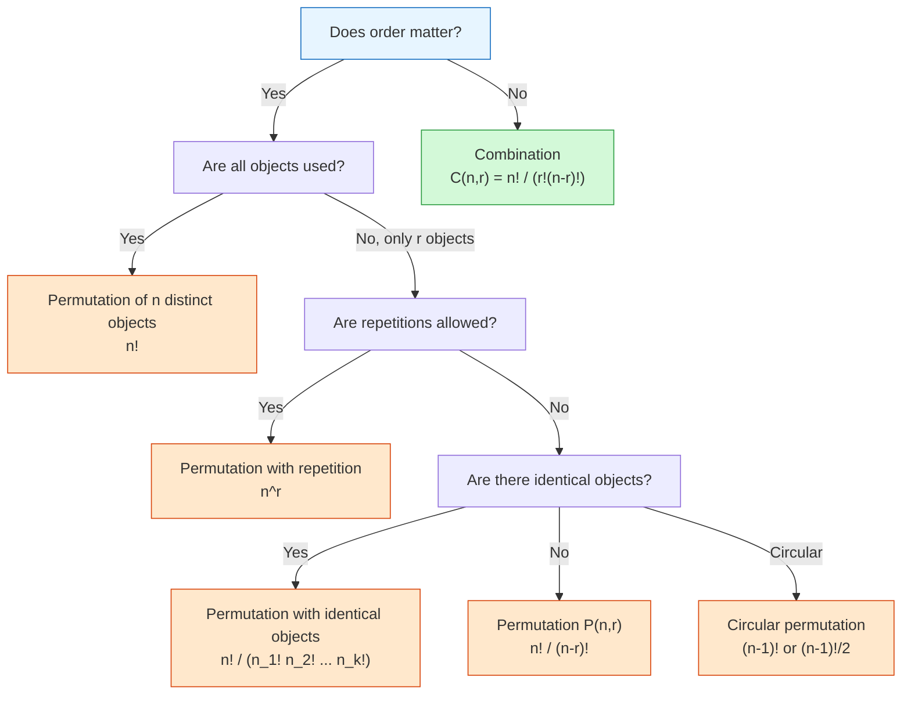
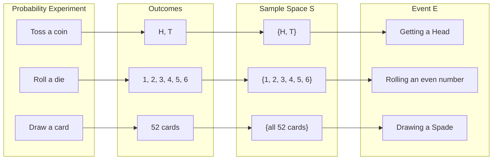

# FAD1015 Week 1 — Counting Rules & Permutation

Week 1 lecture covering fundamental counting principles, permutations, combinations, and basic probability. The lecture is divided into two parts: **LEC 1** focuses on counting rules, while **LEC 2** introduces probability concepts.

## Summary

- **Multiplication Rule** for sequential choices across multiple categories
- **Permutations** — ordered arrangements of distinct objects, with repetition, with identical objects, with restrictions, and in a circle
- **Combinations** — unordered selections where order does not matter
- **Theoretical Probability** — $P(E) = n(E)/n(S)$, sample spaces, events, and outcomes
- **Compound Events** — intersection ($A \cap B$) and union ($A \cup B$), addition rule

## LEC 1: Counting Rules

### 1. Multiplication Rules

A simple method of finding the number of ways using the multiplication rule.

> If there are $n, m, p, r, s$ ways to choose distinct objects of category 1, 2, 3, 4 and 5 respectively, then the number of ways to choose one object from each category is:
> $$n \times m \times p \times r \times s$$

**Example 1:** How many ways are there to choose a book and a magazine from 6 different books and 7 different magazines?

$$6 \times 7 = 42 \text{ ways}$$

**Example 2:** How many ways can a customer choose a meal comprising rice, a vegetable, a main dish and a dessert from a choice of 2 types of rice, 5 kinds of vegetable, 8 different main dishes and 3 kinds of dessert?

$$2 \times 5 \times 8 \times 3 = 240 \text{ ways}$$

---

### 2. Permutation

Permutation is the **arrangement of some or all distinct objects that considers the order of the objects**.

For example, the arrangement $AB$ is different from $BA$ (i.e. $BA \neq AB$).

#### 2.1 Permutations of $n$ Distinct Objects

The number of permutations of arranging $n$ distinct objects is given by:

$$n! = n \times (n-1) \times (n-2) \times \cdots \times 2 \times 1$$

> **Note:** $!$ is called the factorial operator and $\boxed{0! = 1}$.

**Example:** The permutations of two digits from $A, B, C$ are:
$$AB, BA, BC, CB, AC, CA \quad \Rightarrow \quad 3! = 6 \text{ ways}$$

#### 2.2 Permutations of $r$ from $n$ Distinct Objects

The number of permutations of arranging $r$ out of $n$ distinct objects is given by:

$$P(n,r) = {}_n P_r = \frac{n!}{(n-r)!}$$

**Example 5** (from lecture): *[Standard arrangement problem using $P(n,r)$]*

**Exercise 3:** A four-digit PIN is selected. How many different PINs are possible if:
- (i) repetition is allowed? $\quad 10^4 = 10\,000$
- (ii) repetition is not allowed? $\quad P(10,4) = \frac{10!}{6!} = 10 \times 9 \times 8 \times 7 = 5040$

#### 2.3 Permutations with Repetition Allowed

When repetitions are allowed, the number of arrangements of $r$ objects chosen from $n$ distinct objects is:

$$n^r$$

#### 2.4 Permutations with Identical Objects

When arranging $n$ objects where there are $n_1$ identical objects of type 1, $n_2$ identical objects of type 2, ..., $n_k$ identical objects of type $k$:

$$\frac{n!}{n_1! \times n_2! \times \cdots \times n_k!}$$

**Example 6:** How many ways are there to arrange all letters from the word:
- (a) **PROBABILITY** — $\frac{11!}{2! \times 2!}$ (two B's, two I's)
- (b) **STATISTICS** — $\frac{10!}{3! \times 3! \times 2!}$ (three S's, three T's, two I's)

#### 2.5 Arrangements with Restrictions

**Example 7:** Naura has 11 different CDs: 6 pop, 3 jazz, 2 classical. How many arrangements of all 11 CDs on a shelf are there if the jazz CDs are all next to each other?

Treat the 3 jazz CDs as one block/unit. Then we arrange: 6 pop + 1 jazz block + 2 classical = 9 units
$$9! \times 3!$$
(The $3!$ accounts for arrangements within the jazz block.)

**Example 8:** Four-digit numbers are formed from $\{1, 2, 3, 4, 5, 6\}$. How many arrangements:
- (a) are greater than 2000? $\quad 5 \times 6 \times 6 \times 6 = 1080$ (first digit can be 2–6)
- (b) are even? $\quad 6 \times 6 \times 6 \times 3 = 648$ (last digit must be 2, 4, or 6)
- (c) do not start with 5? $\quad 5 \times 6 \times 6 \times 6 = 1080$

**Example 9:** Five girls and seven boys sit in a row. How many arrangements:
- (a) no specific preference? $\quad 12!$
- (b) all girls must sit next to each other? $\quad 8! \times 5!$ (treat 5 girls as one block, giving 8 units)

**Example 10:** Eight members stand in a line, but Nayla and Dura refuse to stand next to each other.

Total arrangements: $8!$
Arrangements where Nayla and Dura ARE together: $7! \times 2!$

$$\text{Valid arrangements} = 8! - 7! \times 2! = 40\,320 - 10\,080 = 30\,240$$

#### 2.6 Permutation in a Circle

For circular arrangements, rotations of the same arrangement are considered identical.

The number of permutations of arranging $n$ different objects in a circle:
- Where **clockwise and anticlockwise are considered different**: $(n-1)!$
- Where **clockwise and anticlockwise are considered the same** (e.g. a ring, necklace): $\frac{(n-1)!}{2}$

**Example 11:** In how many ways can a group of 6 people sit at a round table?
$$(6-1)! = 5! = 120$$

**Example 12:** In how many ways can 10 different coloured beads be arranged to form a ring?
$$\frac{(10-1)!}{2} = \frac{9!}{2} = 181\,440$$
(Flip the ring and it's the same arrangement.)

**Example 13:** How many arrangements of the letters from **SCIENCE** around a circle?

SCIENCE has 7 letters with two C's identical.
Linear arrangements: $\frac{7!}{2!}$
Circular arrangements (clockwise/anticlockwise different): $\frac{7!}{2! \times 7} = \frac{6!}{2!} = 360$

---

### 3. Combination

Combination is the **selection of objects where order does not matter**.

The number of combinations of choosing $r$ objects from $n$ distinct objects is:

$$C(n,r) = {}_n C_r = \binom{n}{r} = \frac{n!}{r!(n-r)!}$$

**Example 15:** A team of two is chosen from 1 male and 2 female students. In how many ways?

$$C(3,2) = \frac{3!}{2!1!} = 3 \text{ ways}$$

**Example 16:** A team of three is chosen from 6 male and 8 female students. How many ways if there must be **more female than male**? Hence find the probability.

Cases with more female than male:
- 0 male, 3 female: $C(6,0) \times C(8,3) = 1 \times 56 = 56$
- 1 male, 2 female: $C(6,1) \times C(8,2) = 6 \times 28 = 168$
- 2 male, 1 female: NOT valid (not more female)

Total valid: $56 + 168 = 224$
Total possible teams: $C(14,3) = 364$

$$P(\text{more female than male}) = \frac{224}{364} = \frac{8}{13}$$

---

### 4. Permutation vs Combination

| Permutation | Combination |
|-------------|-------------|
| Order **matters** | Order **does not matter** |
| Arrangement of objects | Selection of objects |
| $P(n,r) = \frac{n!}{(n-r)!}$ | $C(n,r) = \frac{n!}{r!(n-r)!}$ |
| $AB \neq BA$ | $AB = BA$ |
| PIN codes, race positions, seating arrangements | Committees, teams, lottery numbers |

---

## LEC 2: Probability

### 1. Experiment, Sample Space, Event and Outcome

- **Probability experiment**: A process that involves chance which gives several possible results known as **outcomes**.
- **Outcome**: A result of a trial of an experiment.
- **Sample space ($S$)**: The set of all possible outcomes of a probability experiment.
- **Event**: A set consisting of one or more outcomes of a probability experiment.

**Example 17:** Find the sample space of:
- (a) Two coins are tossed: $S = \{HH, HT, TH, TT\}$
- (b) Tossing a coin and rolling a die: $S = \{(H,1), (H,2), \dots, (H,6), (T,1), \dots, (T,6)\}$
- (c) Taking a driving test: $S = \{\text{Pass}, \text{Fail}\}$

**Example 18:** Two fair dice are tossed. List outcomes of:
- (a) Both even numbers: $\{(2,2), (2,4), (2,6), (4,2), (4,4), (4,6), (6,2), (6,4), (6,6)\}$
- (b) Both the same number: $\{(1,1), (2,2), (3,3), (4,4), (5,5), (6,6)\}$

---

### 2. Theoretical Probability

For any event $E$ in sample space $S$:

$$P(E) = \frac{n(E)}{n(S)} = \frac{\text{number of outcomes resulting in event } E}{\text{number of outcomes in sample space } S}$$

**Properties:**
- A probability of $0$ indicates the event is **impossible**.
- A probability of $1$ (or 100%) indicates the event is **certain**.
- All other events have probability between $0$ and $1$.

**Example 19:** A box contains 20 cards numbered 1 to 20. A card is picked at random.
- (a) $P(\text{multiple of 5}) = \frac{4}{20} = \frac{1}{5}$
- (b) $P(\text{not a multiple of 5}) = 1 - \frac{1}{5} = \frac{4}{5}$
- (c) $P(\text{higher than 7}) = \frac{13}{20}$

---

### 3. Playing Cards

An ordinary pack consists of **52 cards**, split equally into four suits:

| Colour | Suits |
|--------|-------|
| Red | Diamonds ($\diamondsuit$), Hearts ($\heartsuit$) |
| Black | Clubs ($\clubsuit$), Spades ($\spadesuit$) |

Each suit has 13 cards: Ace, 2, 3, 4, 5, 6, 7, 8, 9, 10, Jack, Queen, King.

The Jack, Queen and King of any suit are called **picture cards**.

**Example 20:** A card is dealt from a well-shuffled pack of 52.
- (a)(i) $P(\text{5 of clubs}) = \frac{1}{52}$
- (a)(ii) $P(\text{5 of clubs or any diamond}) = \frac{1}{52} + \frac{13}{52} = \frac{14}{52} = \frac{7}{26}$
- (b) First card is 7 of spades. $P(\text{second card is black suit}) = \frac{25}{51}$

---

### 4. Two-way Table

**Example 21:**

| | Male | Female | Total |
|--|------|--------|-------|
| Pass | 57 | 62 | 119 |
| Fail | 12 | 19 | 31 |
| Total | 69 | 81 | 150 |

- (a) $P(\text{failed}) = \frac{31}{150}$
- (b) $P(\text{female and passed}) = \frac{62}{150} = \frac{31}{75}$
- (c) $P(\text{failed } | \text{ male}) = \frac{12}{69} = \frac{4}{23}$

---

### 5. Probability Using Counting Methods

**Example 22:** The letters of **MATRICULATION** are arranged at random in a line.
- (a) Total arrangements: $\frac{13!}{2!}$ (two I's are identical)
- (b)(i) $P(\text{both T's are together}) = \frac{12!}{2!} \div \frac{13!}{2!} = \frac{12!}{13!} = \frac{1}{13}$
- (b)(ii) $P(\text{both T's are separated}) = 1 - \frac{1}{13} = \frac{12}{13}$
- (c) $P(\text{all vowels together})$: treat 6 vowels (A, I, I, A, I, O) as one block. 8 units total. Vowels within block: $\frac{6!}{3!2!}$. Total valid: $8! \times \frac{6!}{3!2!}$

**Example 23:** A committee of 5 is chosen from 6 boys and 4 girls.
- (a) $P(\text{3 boys and 2 girls}) = \frac{C(6,3) \times C(4,2)}{C(10,5)}$
- (b) $P(\text{more boys than girls}) = \frac{C(6,4)C(4,1) + C(6,5)}{C(10,5)}$
- (c) $P(\text{3 boys and 2 girls, but girl X refuses to serve with boy Y})$:
  Total valid committees minus those containing both X and Y.

---

### 6. Probability of Compound Events

For two events $A$ and $B$ in the sample space:

- **Intersection** ($A \cap B$): both $A$ and $B$ occur
  $$P(A \text{ and } B) = P(A \cap B)$$

- **Union** ($A \cup B$): at least one of $A$ or $B$ occurs
  $$P(A \text{ or } B) = P(A \cup B)$$

#### Addition Rule for Combined Events

$$P(A \cup B) = P(A) + P(B) - P(A \cap B)$$

If $A$ and $B$ are **mutually exclusive** (cannot occur together), then $P(A \cap B) = 0$ and:

$$P(A \cup B) = P(A) + P(B)$$

**Example 24:** A number is selected from the first 250 positive integers. What is the probability that it is exactly divisible by 2 or 7?

$$P(2 \text{ or } 7) = P(2) + P(7) - P(14) = \frac{125}{250} + \frac{35}{250} - \frac{17}{250} = \frac{143}{250}$$

**Example 25:** A fair die is rolled once. Find the probability of getting:
- (a) an even number: $\frac{3}{6} = \frac{1}{2}$
- (b) a number less than 5: $\frac{4}{6} = \frac{2}{3}$
- (c) divisible by 2: $\frac{3}{6} = \frac{1}{2}$
- (d) not divisible by 2: $1 - \frac{1}{2} = \frac{1}{2}$
- (e) an even number or a number less than 5:
  $$P(\text{even} \cup <5) = P(\text{even}) + P(<5) - P(\text{even and } <5) = \frac{3}{6} + \frac{4}{6} - \frac{2}{6} = \frac{5}{6}$$
  (The overlap is $\{2, 4\}$.)

---

## Related Topics

- [[FAD1015 Week 2 — Mutually Exclusive & Conditional Probability]] — conditional probability and independence
- [[FAD1015 Week 3 — Independent Events & Bayes' Theorem]] — Bayes' theorem and total probability
- [[FAD1015 Tutorial 1-6 — Counting & Probability Fundamentals]] — practice problems

## Related Course Page

- [[FAD1015 - Mathematics III]]
