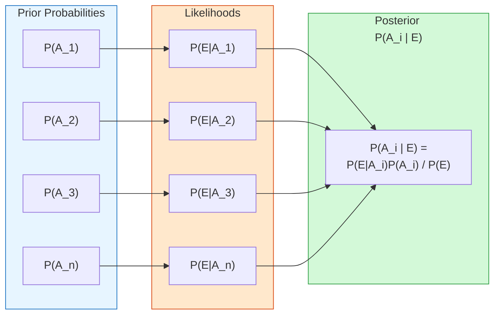
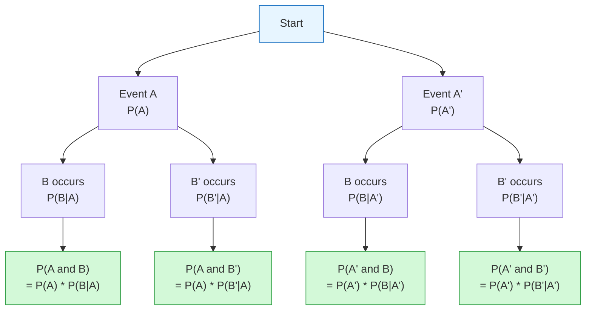

# FAD1015 Week 3 — Independent Events & Bayes' Theorem

Week 3 lecture covering statistical independence and Bayesian reasoning. Source file: `FAD1015 Week 3 Indep-Bayes.pdf`

## Overview

This lecture is divided into two parts:
- **LEC 5: Independent Events** — definitions, multiplication rules, and problem solving.
- **LEC 6: Bayes' Theorem** — total probability, Bayes' formula, tree diagrams, and applications.

## LEC 5: Independent Events

### Definition

For independent events $A$ and $B$, the first event, say A, does not affect the outcome or occurrence of the second event, say B, in a way the probability is changed.

Recall from the definition of conditional probability,
$$P(A|B) = \frac{P(A \cap B)}{P(B)}, \text{ we note that}$$
$$P(A \text{ and } B) = P(A) \times P(B|A)$$

If $A$ and $B$ are independent events, then
$$P(B|A) = P(B)$$
$$P(A|B) = P(A)$$

### Multiplication Rule for Independent Events

This give the multiplication rule for independent events
$$P(A \text{ and } B) = P(A) \times P(B)$$
In set notation
$$P(A \cap B) = P(A) \times P(B)$$

The rule can be extended to $n$ independent events $A_1, A_2, A_3, \dots, A_n$, as follows:
$$P(A_1 \text{ and } A_2 \text{ and } A_3 \text{ and } \dots \text{ and } A_n) = P(A_1) \times P(A_2) \times P(A_3) \times \dots \times P(A_n)$$

### Worked Examples

**Example 8**
A fair coin is toss and a dice is thrown. Find the probability of getting a head and a number less than 5.

**Example 9**
It is known that the probabilities three contestants Adra, Badri and Christopher will be able to compete in next round of a singing competition are 0.3, 0.45 and 0.55 respectively. Assuming all the three events are independent, find the probability that
(a) all three will be able to compete in the next round,
(b) only Adra will be able to compete in the next round,
(c) only one will be compete in the next round.

**Example 10**
The events $A$ and $B$ are such that $P(A) = 0.35$, $P(B) = 0.55$. Find $P(A \cup B)$ if
(a) $A$ and $B$ are mutually exclusive events,
(b) $A$ and $B$ are independent events.

**Example 11**
In a box there are 5 red balls, 7 green balls and 3 black balls. One ball is chosen at random, the colour is noted and the ball is returned back into the box. A second ball is then taken. Find the probability of getting
(a) both balls are red,
(b) a red and green ball,
(c) balls of the same colour,
(d) balls of different colour.

**Example 12**
Let $A$ and $B$ be events with $P(A) = 0.2$, $P(B) = 0.15$ and $P(A \cup B) = 0.35$.
(a) Determine if $A$ and $B$ are independent events,
(b) Determine if $A$ and $B$ are mutually exclusive events,
(c) Find $P(A|B')$,
(d) Find $P(A|B)$ if any.

**Example 13**
The probability that a certain type of machine will break down in the first month of operation is 0.1. Three machines of this type are installed at the same time. The performances of the three machines are independent. Find the probability that at the end of the first month
(a) all three machines have broken down,
(b) just one machine has broken down,
(c) at least one machine is working.

**Example 14**
Data about employment for males and females in chosen area shown in the table.

| | Unemployed | Employed |
|---|---|---|
| Male | 206 | 412 |
| Female | 358 | 305 |

A person from this area is chosen at random. Let $M$ be the event that the person is male and $E$ be the event the person is employed.
(a) Find $P(M)$.
(b) Find $P(M \text{ and } E)$.
(c) Are $M$ and $E$ independent events? Justify your answer.
(d) Given that the person chosen is unemployed, find the probability that the person is female.

**Example 15**
Some students are answering multiple choice questions. In each question, there are four choices.
(a) Sara does not know the answer to a particular question, so she guesses. What is the probability that Sara guesses the correct answer?
(b) Yazid guesses the answers to two of the multiple choice questions. Find the probability that
    (i) both answers are correct,
    (ii) exactly one answers is correct.
(c) Elina guesses the answers to three of the multiple choice questions. Find the probability that
    (i) all three are incorrect,
    (ii) exactly two answers are correct,
    (iii) at least two answers are correct.
(d) Zaid guesses the answers to four multiple choice questions. Find the probability that all his answers are correct.

> [!summary] Independent Events — Summary
> Events $A$ and $B$ are independent:
> $$P(A \text{ and } B) = P(A) \times P(B)$$
> In set notation $P(A \cap B) = P(A) \times P(B)$
> $$P(B|A) = P(B)$$
> $$P(A|B) = P(A)$$

## LEC 6: Bayes' Theorem

### Total Probability

The total probability of event $A$ is given by
$$P(A) = P(A \cap B) + P(A \cap B')$$

For a general partition $A_1, A_2, A_3, \dots, A_n$ of the sample space (mutually exclusive and exhaustive events), let $E$ be an event. Then,
$$P(E) = P(A_1 \cap E) + P(A_2 \cap E) + P(A_3 \cap E) + \dots + P(A_n \cap E)$$
or equivalently
$$P(E) = P(E|A_1)P(A_1) + P(E|A_2)P(A_2) + P(E|A_3)P(A_3) + \dots + P(E|A_n)P(A_n)$$

### Bayes' Theorem

Let $A_1, A_2, A_3, \dots, A_n$ are mutually exclusive events with $P(A_i \cap A_j) = 0$, $i \neq j$ and $P(A_1 \cup A_2 \cup A_3 \cup \dots \cup A_n) = 1$.

Let $E$ be an event. Then,
$$P(E) = P(A_1 \cap E) + P(A_2 \cap E) + P(A_3 \cap E) + \dots + P(A_n \cap E)$$

The conditional probability $P(A_i|E)$ for $i = 1, 2, \dots n$ is given by
$$P(A_i|E) = \frac{P(A_i \cap E)}{P(E)} = \frac{P(A_i \cap E)}{P(A_1 \cap E) + P(A_2 \cap E) + P(A_3 \cap E) + \dots + P(A_n \cap E)}$$

Recall that $P(A_i \cap E) = P(A_i) \times P(E|A_i)$ for $i = 1, 2, \dots n$.

Thus,
$$P(A_i|E) = \frac{P(E|A_i) P(A_i)}{P(E|A_1)P(A_1) + P(E|A_2)P(A_2) + P(E|A_3)P(A_3) + \dots + P(E|A_n)P(A_n)}$$

Bayes' theorem is a formula which allows one to find the probability that an event occurred as the result of a particular previous event.

### Tree Diagram

For two events $A$ and $B$, each with two outcomes, a tree diagram can be used to visualise the multi-stage probabilities:

- $P(A \text{ and } B) = P(A) \times P(B|A)$
- $P(A \text{ and } B') = P(A) \times P(B'|A)$
- $P(A' \text{ and } B) = P(A') \times P(B|A')$
- $P(A' \text{ and } B') = P(A') \times P(B'|A')$

The sum of all path probabilities equals 1:
$$[P(A) \times P(B|A)] + [P(A) \times P(B'|A)] + [P(A') \times P(B|A')] + [P(A') \times P(B'|A')] = 1$$

### Worked Examples

**Example 16**
Each day I go to class by route $A$ or route $B$. The probability that I choose route $A$ is $\frac{1}{4}$. The probability that I am late for class if I go via route $A$ is $\frac{2}{3}$ and the probability that I am late if I go via route $B$ is $\frac{1}{3}$.
(a) Find the probability that I am late for class.
(b) Given that I am late for class, find the probability that I went via route $B$.

**Example 17**
A company has 3 factories $A$, $B$ and $C$ producing chargers for cellular phones. Factory $A$, $B$ and $C$ contributes 50%, 30% and 20% of the chargers produced respectively. It is known that the percentage of defective charges produced by factories $A$, $B$ and $C$ are 10%, 5% and 3% respectively. A chargers is chosen at random for inspection before shipment, find the probability that it is defective. What is the probability that it is from factory $A$ if it is defective?

**Example 18**
A customer either goes to either three shops $A$, $B$ and $C$ for his groceries. It is known that the probability that he goes to shop $A$, $B$ and $C$ for his groceries is 0.2, 0.5, and 0.3 respectively. If he goes to shop $A$, $B$ and $C$ the probability that he buys fresh fruits is 0.4, 0.2 and 0.6 respectively. What is the probability that
(a) the customer will buy fresh fruits?
(b) he will shop at $C$, if it is known that he buys fresh fruits?

**Example 19**
In a large batch of flower seeds, 70% have been treated to improve germination. The treated seeds have a probability of 0.8 germinating, whereas the untreated seeds have a probability of 0.3 of germinating.
A seed is selected at random from the batch.
(a) Find the probability that the seed will germinate.
(b) Find the probability that the seed has been treated, given that it has germinated.

**Example 20**
When a particular firm needs to hire a taxi, the receptionist calls one of three firms, $X$, $Y$ and $Z$. 40% of the calls are to $X$, 50% are to $Y$ and 10% are to $Z$. 9% of the taxis hired from $X$ are late, 6% of those hired from $Y$ are late and 20% of those hired from $Z$ are late. Find the probability that the next taxi hired
(a) will be from $X$ and will not arrive late,
(b) will arrive late,
(c) is from $X$, given that it arrives late.

## Related Topics

- [[Counting & Probability]] — Core probability framework
- [[Bayes' Theorem]] — Standalone theorem note
- [[FAD1015 Week 2 — Mutually Exclusive & Conditional Probability]] — prerequisite
- [[FAD1015 Tutorial 1-6 — Counting & Probability Fundamentals]] — practice problems

## Related Course Page

- [[FAD1015 - Mathematics III]]
