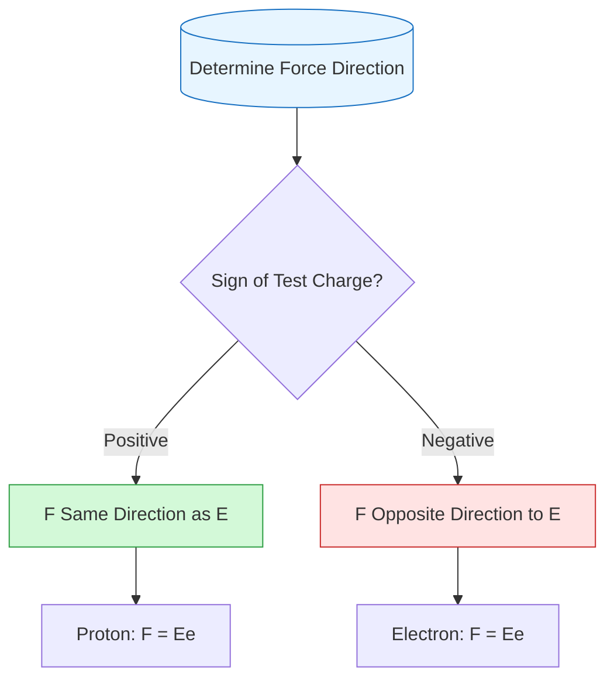
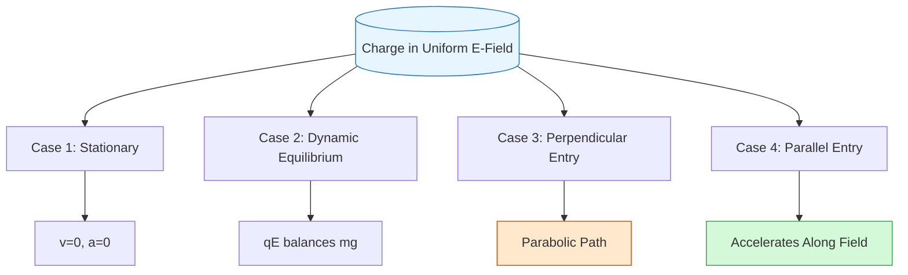

# FAD1022 L1-L3 — Electrostatics

Lecture series covering the fundamentals of electrostatics, from Coulomb's law to electric field calculations.

## Lecture Files

- L1 — Electrostatics (Part 1)
- L2 — Electrostatics (Part 2)
- L3 — Electrostatics (Part 3)

## L2 — Electrostatics (Part 2)

> **Areas of focus:** Electric Field Lines and Patterns, Electric Field Strength, Problem Solving

### 2.1 Electric Field

An **electric field** is a region of space around an isolated charge where an electric force is experienced if a test charge is placed in that region.

- When a charge or charged object enters an electric field, a force is exerted on the charge.
- The electric field around charges can be represented by drawing a series of lines called **electric field lines**.
- The **direction** of the electric field is **tangent** to the electric field line at each point.

**Michael Faraday** introduced electric field lines with two key ideas:
- The electric field vector is **tangential** to the electric field lines at each point.
- The strength of the electric field is proportional to the **number of field lines** passing through a unit area perpendicular to the lines.

### 2.2 Electric Field Lines

- $\vec{E}$ is tangent to the electric field line — no two lines can cross because $\vec{E}$ is unique at each point.
- The magnitude $|\vec{E}|$ is proportional to the **density** of the lines.

#### Electric Field Patterns Around Charges

| Configuration | Pattern |
|--------------|---------|
| Single positive charge ($+q$) | Lines point radially **outward** |
| Single negative charge ($-q$) | Lines point radially **inward** |
| Two equal opposite charges ($+q$ and $-q$) | Curved lines from positive to negative; number leaving positive equals number terminating at negative |
| Two equal positive charges ($+q$ and $+q$) | Lines bulge out indicating repulsion; **neutral point** $X$ exists where resultant $\vec{E} = 0$ |
| Two opposite unequal charges ($+2q$ and $-q$) | Number of lines is proportional to magnitude of charge (twice as many leave $+2q$ as terminate at $-q$) |
| Two opposite charged parallel metal plates | Perpendicular to plates; parallel and equally spaced in central region → **uniform** field (except near edges) |

#### Properties of Electric Field Lines

1. The field lines indicate the **direction** of the electric field (tangent to the field line at any point).
2. The magnitude of the electric field is proportional to the number of lines crossing unit area perpendicular to the lines. **The closer the lines, the stronger the field.**
3. Electric field lines **start on positive charges** and **end on negative charges**, and the number starting or ending is proportional to the magnitude of the charge.
4. The field lines **never cross** because the electric field does not have two values at the same point.

#### Direction of $\vec{F}$ and $\vec{E}$ on a Charge

| Charge | Direction of $\vec{E}$ | Direction of $\vec{F}$ on test charge |
|--------|----------------------|-----------------------------------|
| Positive isolated point charge | Radially outward | Same as $\vec{E}$ (radially outward) |
| Negative isolated point charge | Radially inward | Opposite to $\vec{E}$ (radially inward) |

> [!note]
> In the calculation of magnitude $E$, substitute the **magnitude of the charge only**.

**Summary of force direction:**
- The direction of electric force $\vec{F}$ on a **positive** charge $Q$ is the **same** as the direction of the field line.
- The direction of electric force $\vec{F}$ on a **negative** charge $Q$ is **opposite** to the direction of the field line.

**Examples:**
- **Electron:** $\vec{F}$ is opposite to $\vec{E}$, with $F = Ee$
- **Proton:** $\vec{F}$ is in the same direction as $\vec{E}$, with $F = Ee$
- **Alpha particle** ($^4_2\text{He}$): $\vec{F}$ is in the same direction as $\vec{E}$, with $F = E \times 2e$

### 2.3 Electric Field Strength

The **electric field strength** at a point is defined as the electric force per unit positive test charge that acts at that point in the same direction as the force:

$$
E = \frac{F}{q_0}
$$

Where:
- $E$: magnitude of the electric field strength
- $F$: magnitude of the electric force
- $q_0$: magnitude of test charge

- It is a **vector** quantity.
- Units: $\text{N C}^{-1}$ or $\text{V m}^{-1}$
- The **direction** of the electric field strength depends on the **sign** of the isolated charge.

#### Derivation for a Point Charge

From Coulomb's law:
$$
F = \frac{Qq}{4\pi\varepsilon_0 r^2}
$$

Force per unit charge:
$$
E = \frac{F}{q} = \frac{Q}{4\pi\varepsilon_0 r^2}
$$

Let $k = \frac{1}{4\pi\varepsilon_0} = 9.0 \times 10^9 \text{ N m}^2 \text{ C}^{-2}$

Electric field strength at a distance $r$ from a point charge $Q$:
$$
\boxed{E = \frac{kQ}{r^2}}
$$

### Problem Solving Examples

**Example 1:** Calculate the electric field strength at point A, 2.0 cm from a point charge $q_1 = 5.0\ \mu\text{C}$.

**Example 2:** Calculate the electric field strength at point A, 2.0 cm from a point charge $q_1 = -5.0\ \mu\text{C}$.

**Example 3:** Two point charges, $q_1 = 1.0\ \text{C}$ and $q_2 = -4.0\ \text{C}$, are placed 2.0 cm and 3.0 cm from point A respectively.
- (a) Find the magnitude and direction of the electric field intensity at point A.
- (b) Find the resultant electric force exerted on $q_0 = 4.0\ \text{C}$ placed at point A.

**Example 4 (2D):** Two point charges, $q_1 = -1.0\ \text{C}$ and $q_2 = -4.0\ \text{C}$, are separated by 4.0 cm. Find the magnitude and direction of the electric field intensity at point A, 3.0 cm from charge $q_1$.

**Example 5:** Three charges are placed on three corners of a square (side 30.0 cm): $q_1 = 8.00\ \mu\text{C}$, $q_2 = -5.00\ \mu\text{C}$, $q_3 = -4.00\ \mu\text{C}$.
- (a) Calculate the electric field strength at point A (fourth corner).
- (b) What would be the force on a $6.00\ \mu\text{C}$ charge placed at point A?

**Example 6:** Two point charges, $q_1 = +16\ \mu\text{C}$ and $q_2 = +4.0\ \mu\text{C}$, are separated by 3.0 m. Find the position on the line between the charges where the net electric field is zero.

**Example 7:** A diagram shows three negative point charges ($-q$, $-q$, $-2q$) and one positive point charge ($+4q$) with some electric field lines drawn. Identify the three things wrong with the drawing.

### Exercises

1. Determine:
   - (a) The electric field strength at point X at a distance 20 cm from a charge $Q = +6\ \mu\text{C}$. ($1.35 \times 10^6\ \text{N C}^{-1}$)
   - (b) The electric force on $q = -0.20\ \mu\text{C}$ placed at point X. ($0.27\ \text{N}$ towards $Q$)

2. Two point charges, $q_1 = +2.0\ \text{C}$ and $q_2 = -3.0\ \text{C}$, are separated by 40 cm.
   - (a) Resultant electric field strength at midpoint X. ($1.13 \times 10^{12}\ \text{N C}^{-1}$ towards $q_2$)
   - (b) Electric force on $q = 0.50\ \mu\text{C}$ placed at X. ($5.7 \times 10^5\ \text{N}$)

3. Four point charges fixed to the corners of a rectangle: $+q$, $-q$, $+q$, $+q$. Find the net electric field at the center C. ($0$)

### L2 Learning Outcomes

- State the electric field strength formula: $E = \dfrac{kQ}{r^2}$
- Apply the formula to solve problems on a system of point charges

---

## L3 — Charge in a Uniform Electric Field

### Parallel Plates & Uniform Field
Two broad-area plates charged uniformly (one positive, one negative) and placed parallel and near each other produce a uniform electric field in the central column, provided the plate area is large and the plate separation is small compared to the plate length. The field at the plate edges is non-uniform due to the **edge effect**.

### Cases of Charge Motion

**Case 1 — Stationary charge:** A charge at rest between the plates ($v=0, a=0$).

**Case 2 — Dynamic equilibrium:** A charge moves horizontally at constant velocity in a straight line. The upward electrostatic force balances the downward weight:
$$F_E = W \quad \Rightarrow \quad qE = mg$$

**Case 3 — Charge moving perpendicularly to the field:**
An electron with charge $q_0$ enters the uniform field with initial velocity $v_0$ perpendicular to $\vec{E}$. The only force acting is the electrostatic force $F_E = qE$, causing a vertical acceleration:
$$a_y = \frac{q_0 E}{m}$$
The horizontal component of velocity remains unchanged ($v_x = v_0$), so the trajectory is a **parabolic curve**.
- Time to traverse the plates: $t = \dfrac{x}{v_0}$
- Vertical velocity on exit: $v_y = \dfrac{q_0 E x}{m v_0}$
- Resultant velocity after emerging: $v = \sqrt{v_x^2 + v_y^2}$
- Direction of velocity (angle to horizontal): $\theta = \tan^{-1}\!\left(\dfrac{v_y}{v_x}\right)$
- Vertical displacement: $s_y = -\dfrac{1}{2} a_y t^2$  (taking downward as negative)

**Case 4 — Charge moving parallel to the field:**
- **4(a) Positive charge:** Moves with initial velocity $v_0$ towards the negative plate. Acceleration $a = \dfrac{qE}{m}$ is in the **same direction** as $\vec{E}$; speed increases.
- **4(b) Negative charge:** Moves with initial velocity $v_0$ towards the positive plate. Acceleration $a = \dfrac{qE}{m}$ is in the **opposite direction** to $\vec{E}$; speed increases.

### L3 Worked Examples
1. **Proton perpendicular entry:** $E = 1.0 \times 10^4\ \text{N C}^{-1}$, $v = 1.0 \times 10^6\ \text{m s}^{-1}$, find magnitude and direction of velocity after $10\ \text{s}$.
2. **Electron between plates:** $u_0 = 1.5 \times 10^7\ \text{m s}^{-1}$, plates $60\ \text{mm}$ long and $20\ \text{mm}$ apart, $E = 4.0 \times 10^3\ \text{V m}^{-1}$. Sketch path, find acceleration, velocity components on exit, and deflection angle.
3. **Electron in cathode-ray tube:** $E = 2.3 \times 10^4\ \text{N C}^{-1}$, plate length $4.0\ \text{cm}$, $v = 3.7 \times 10^7\ \text{m s}^{-1}$. Find exit velocity and direction.
4. **Electron released from rest parallel to field:** $E = 3.0\ \text{kV m}^{-1}$. Find acceleration, direction, and speed after $3.0\ \text{s}$.

### L3 Learning Outcomes

- Describe the behaviour of a charged particle in a uniform electric field for stationary, equilibrium, perpendicular, and parallel cases
- Apply kinematic equations combined with $F = qE$ to solve deflection and acceleration problems

## Key Concepts

- [[Electrostatics]] — electric charge, conservation of charge, quantization
- Coulomb's Law — force between point charges
- Electric Field — field due to point charges, continuous charge distributions
- Electric Field Lines — visualization, properties, and patterns for various charge configurations
- Electric Field Strength — $E = F/q_0 = kQ/r^2$, units $\text{N C}^{-1}$ or $\text{V m}^{-1}$
- Uniform Electric Field — between parallel charged plates; edge effect
- Neutral Point — location where resultant electric field is zero
- Electric Dipole — dipole moment, field of a dipole
- Conductors and Insulators — behavior in electric fields
- Gauss's Law — electric flux, applications to symmetric charge distributions
- Charge in Uniform Electric Field — stationary, equilibrium, perpendicular (parabolic), and parallel (linear acceleration) cases
- Deflection of Charged Particles — cathode-ray tube principles

## Diagrams

### Electric Field Force Direction

### Charge Motion in Uniform Electric Field

## Summary

This module introduces the fundamental principles of electrostatics. Students learn to calculate electric forces using Coulomb's law, determine electric fields for various charge distributions, and apply Gauss's law to symmetric systems. L2 focuses specifically on **electric field lines and patterns**, the **properties of electric field lines**, and **electric field strength** calculations using $E = kQ/r^2$. Students practice vector addition of electric fields from multiple point charges in 1D and 2D configurations, and learn to identify neutral points and uniform fields between parallel plates. L3 extends these ideas to the **dynamics of charged particles in uniform electric fields**, covering equilibrium conditions ($qE = mg$), parabolic trajectories for perpendicular entry, linear acceleration for parallel entry, and practical applications such as the cathode-ray tube.

## Lecturer

[[Nik Nur Atiqah]] — PASUM Physics Lecturer

## Related

- [[FAD1022 - Basic Physics II]] — main course page
- [[Capacitors & Dielectrics]] — next module builds on electrostatics concepts
- [[Electric Field]] — concept page for L2 material
