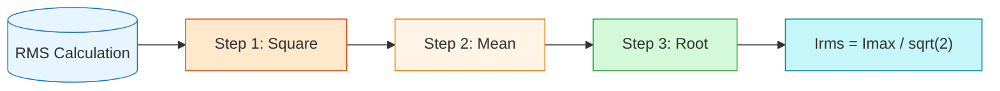
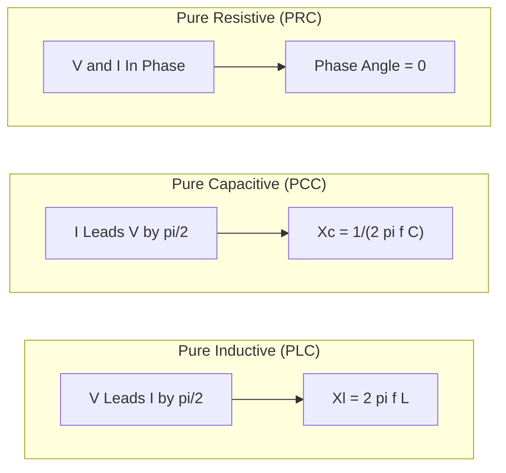

# FAD1022 L14-L16 — AC Analysis

Introduction to alternating current (AC) circuits, phasor representation, and reactance concepts.

## Lecture Files

- L14 — Alternating Current
- L15 — Phasor Diagram
- L16 — Concepts of Reactance

## L14 — Alternating Current

### Learning Objectives
- Explain the concepts of alternating current (AC) voltage and current.
- Describe the sinusoidal nature and mathematical representation for current and voltage in AC.
- Calculate the average value and root mean square (RMS) value of an AC signal given its waveform or equation.

### AC vs DC
- **Direct Current (DC):** flows in only one direction. Current flows from +ve to −ve terminal; electron flow is from −ve to +ve terminal. The brightness of a lamp bulb is **constant**.
- **Alternating Current (AC):** reverses its direction periodically and changes its magnitude with time. Current and electron flow alternate direction. The brightness of a lamp bulb **flickers**.

> [!note] Why AC instead of DC?
> AC won the "War of Currents" (Tesla vs Edison, late 1800s) because it is more efficient for long-distance power transmission. In a DC-only world:
> - Power lines would lose too much energy due to resistance.
> - Every home would need massive power plants nearby.
> - Transformers wouldn't work — no voltage conversion for efficient transmission.

### AC Signal — Sinusoidal Current & Voltage

The general equations to represent AC current and voltage:

$$I(t) = I_0 \sin(\omega t)$$

$$V(t) = V_0 \sin(\omega t)$$

Where:
- $I(t)$ : instantaneous current
- $V(t)$ : instantaneous voltage
- $I_0$ : current peak (maximum current)
- $V_0$ : voltage peak (maximum voltage)
- $\omega$ : angular frequency (rad/s)
- $t$ : time (s)

> [!note] The sinusoidal AC can also be expressed in the form of a **cosine** graph.

**Angular frequency relation:**

$$\omega = \frac{2\pi}{T} = 2\pi f$$

- $T$ : period (time taken to complete one cycle) in seconds
- $f$ : frequency (number of complete cycles in 1 second) in Hz

**Example 1 — Writing the equation for AC current:**
- From graph: $I_0 = 4\ \text{A}$, $T = 12\ \text{s}$
- $\omega = \frac{2\pi}{12} = \frac{\pi}{6}\ \text{rad/s}$
- Equation: $I(t) = 4\sin\left(\frac{\pi}{6}t\right)$

**Example 2 — Writing the equation for AC voltage:**
- From graph: $V_0 = 15\ \text{V}$, $T = 0.1\ \text{s}$
- $\omega = \frac{2\pi}{0.1} = 62.83\ \text{rad/s}$
- Equation: $V(t) = 15\sin(62.83t)$

### Average Value & RMS Value

**Average Value:**
The average value of a sinusoidal AC signal over a **full cycle is zero**, because the positive and negative halves cancel out. However, power is still delivered.

**Root Mean Square (RMS) Value:**
RMS is a way to find the "effective" value of something that changes over time. For AC, it gives the equivalent DC value that would deliver the same power.

**The RMS process (S → M → R):**
1. **S**quare all the values (make everything positive)
2. **M**ean (average) those squared values
3. Take the **R**oot (square root) of that average

For a sinusoidal current $I(t) = I_{\max}\sin(\omega t)$:

$$I_{\text{rms}} = \frac{I_{\max}}{\sqrt{2}} = 0.707\, I_{\max}$$

$$V_{\text{rms}} = \frac{V_{\max}}{\sqrt{2}}$$

> [!tip] RMS is the AC equivalent of DC power. Your home power supply is **230V RMS**; the actual peak voltage is **325V**! Electric bill calculations use RMS values, not peak values.

**Power in AC circuits:**

$$P = V_{\text{rms}} I_{\text{rms}}$$

**Example:** A 100W light bulb operates at 230V RMS.
- $I_{\text{rms}} = \frac{P}{V_{\text{rms}}} = \frac{100}{230} \approx 0.435\ \text{A}$
- $I_{\max} = I_{\text{rms}} \times \sqrt{2} = 0.435 \times \sqrt{2} \approx 0.615\ \text{A}$

### Practice Questions

**Question 1**
AC Current is expressed by $I(t) = 52\sin(38\pi t)$, where $t$ is in seconds. Calculate:
- (a) amplitude of the current
- (b) RMS value of the current
- (c) period of the cycle
- (d) frequency
- (e) current at $t = 10\ \text{ms}$ and $t = 35\ \text{ms}$

**Question 2**
A series circuit consisting of a resistor $R = 150\ \Omega$ is connected to an AC voltage source of $V(t) = 250\sin(\omega t)$. Calculate the RMS and maximum current through the resistor.

**Past Year 2023/2024 — (b)**
The current in an AC circuit is given as $I(t) = 2.5\sin(100\pi t)$. Determine:
- (i) the RMS current
- (ii) the current when $t = 20\ \text{ms}$

## L15 — Phasor Diagram

### Learning Objectives
- Define phase differences, phase angle, lead and lag in AC circuits.
- Understand phasor diagrams and their usefulness in AC circuit analysis.

### Recap
- AC current and voltage: $I(t) = I_0 \sin \omega t$, $V(t) = V_0 \sin \omega t$
- Sinusoidal AC can also be expressed as a cosine graph.

### Phasor Diagram
- A **phasor diagram** is a vector that rotates **anticlockwise** to represent an AC signal.
- It shows sinusoidally varying quantities (alternating current and voltage).
- It determines the **phase angle** — the phase difference between current and voltage in an AC circuit.
- General sinusoidal form: $A(t) = A_m \sin(\omega t + \phi)$
- The phasor rotates anticlockwise at angular velocity $\omega$ from the positive x-axis.
- The vertical projection of the rotating phasor traces the sinusoidal waveform in the time domain.

### Phase Angle ($\phi$)
- Symbol: $\phi$ (phi)
- Accounts for the shift when the sine wave does not start at $t = 0$.
- **Left shift (lead):** $I(t) = I_0 \sin(\omega t + \phi)$ → positive $\phi$
- **Right shift (lag):** $I(t) = I_0 \sin(\omega t - \phi)$ → negative $\phi$
- Summary:
  - In-phase: $A(t) = A_m \sin(\omega t)$, $\phi = 0^\circ$
  - Positive phase (lead): $A(t) = A_m \sin(\omega t + \phi)$
  - Negative phase (lag): $A(t) = A_m \sin(\omega t - \phi)$

### Leading & Lagging
- **Leading:** A signal reaches its peak or zero-crossing earlier than the reference.
- **Lagging:** A signal reaches its peak or zero-crossing later than the reference.
- The phase angle is the magnitude of the lead or lag.

**Example 1 — Voltage leads current by $\frac{\pi}{2}$:**
- $V(t) = V_0 \sin\left(\omega t + \frac{\pi}{2}\right)$
- $I(t) = I_0 \sin(\omega t)$
- At $t=0$, the V phasor points at $90^\circ$ and the I phasor at $0^\circ$.

**Example 2 — Current leads voltage by $\frac{\pi}{2}$:**
- $I(t) = I_0 \sin(\omega t)$
- $V(t) = V_0 \sin\left(\omega t - \frac{\pi}{2}\right)$
- At $t=0$, the I phasor points at $0^\circ$ and the V phasor at $-90^\circ$ ($270^\circ$).

### Past Year Question (2022/2023)
- Sketch sinusoidal waves from a given phasor diagram at $t=0$ and state which signal leads.
- (i) V leads I by $\frac{\pi}{2}$.
- (ii) I leads V by $\frac{\pi}{4}$.

## L16 — Concepts of Reactance

Lecture 16 covers the behavior of resistors, capacitors, and inductors in AC circuits, phase relationships between voltage and current, and the calculation of reactance.

### Learning Objectives

1. Explain the behavior of resistors, capacitors, and inductors in AC circuits.
2. Understand phase relationships between voltage and current in:
   - Pure resistive circuit (PRC)
   - Pure capacitive circuit (PCC)
   - Pure inductive circuit (PLC)
3. Calculate reactance for inductors and capacitors.

### Impedance, $Z$

Impedance is the quantity that measures the opposition of a circuit to AC flow.

$$Z = \frac{V_{\text{rms}}}{I_{\text{rms}}} = \frac{V_0}{I_0}$$

- It is a **scalar quantity** and its unit is **ohm ($\Omega$)**.
- In a DC circuit, impedance behaves like resistance.

### 01 — Pure Resistive Circuit (PRC)

A pure resistor means that there is **no capacitance and self-inductance** effect in the AC circuit.

**Phase relationship:**
- $I = I_0 \sin(\omega t)$
- $V_R = V_0 \sin(\omega t) = V$
- The phase difference between $V$ and $I$ is $\Delta\phi = \omega t - \omega t = 0$
- In a pure resistor, the **current $I$ is always in phase with the voltage $V$**.

**Impedance in a pure resistor:**
$$Z = \frac{V_{\text{rms}}}{I_{\text{rms}}} = \frac{V_0}{I_0} = R$$

### 02 — Pure Capacitive Circuit (PCC)

A pure capacitor means that there is **no resistance and self-inductance** effect in the AC circuit.

**Phase relationship:**
- $V_C = V = V_0 \sin(\omega t)$
- $I = I_0 \sin\left(\omega t + \frac{\pi}{2}\right)$ or $I = I_0 \cos(\omega t)$
- The phase difference: $\Delta\phi = \omega t - \left(\omega t + \frac{\pi}{2}\right) = -\frac{\pi}{2}$ rad
- In a pure capacitive circuit:
  - The **voltage $V$ lags behind** the **current $I$ by $\pi/2$ radians**.
  - The **current $I$ leads** the **voltage $V$ by $\pi/2$ radians**.

**Capacitive Reactance, $X_C$:**
Capacitive reactance is the opposition of a capacitor to the alternating current flow.

$$X_C = \frac{1}{2\pi f C} = \frac{V_{\text{rms}}}{I_{\text{rms}}} = \frac{V_0}{I_0}$$

- $X_C$ is known as **capacitive reactance**.
- $f$: frequency of AC source; $C$: capacitance of the capacitor.
- Capacitive reactance is a **scalar quantity** with unit **ohm ($\Omega$)**.
- $X_C \propto \frac{1}{f}$ — capacitive reactance is inversely proportional to frequency.

### 03 — Pure Inductive Circuit (PLC)

A pure inductor means that there is **no resistance and capacitance** effect in the AC circuit.

**Phase relationship:**
- $V = V_0 \cos(\omega t)$ or $V = V_0 \sin\left(\omega t + \frac{\pi}{2}\right)$
- $I = I_0 \sin(\omega t)$
- The phase difference: $\Delta\phi = \left(\omega t + \frac{\pi}{2}\right) - \omega t = \frac{\pi}{2}$ rad
- In a pure inductive circuit:
  - The **voltage $V$ leads** the **current $I$ by $\pi/2$ radians**.
  - The **current $I$ lags behind** the **voltage $V$ by $\pi/2$ radians**.

**Inductive Reactance, $X_L$:**
Inductive reactance is the opposition of an inductor to the alternating current flow.

$$X_L = 2\pi f L = \frac{V_{\text{rms}}}{I_{\text{rms}}} = \frac{V_0}{I_0}$$

- $X_L$ is known as **inductive reactance**.
- $f$: frequency of AC source; $L$: self-inductance of the inductor.
- Inductive reactance is a **scalar quantity** with unit **ohm ($\Omega$)**.
- $X_L \propto f$ — inductive reactance is directly proportional to frequency.

### CIVIL Mnemonic

A memory aid for remembering which quantity leads in capacitor and inductor circuits:

- **C** (Capacitor): **I** leads **V**
- **L** (Inductor): **V** leads **I** (or **I** lags **V**)

### Past Year Questions

**Past Year 23/24 — A5**
A capacitor with capacitive reactance $X_C = 69.2\ \Omega$ is connected to an AC voltage source $V(t) = 200 \sin(120\pi t)$. Calculate the value of capacitance. *(3 marks)*

**Past Year 23/24 — (c)**
The value of inductive reactance in an AC circuit at frequency $30\ \text{Hz}$ is $X_L = 1.5\ \Omega$.
- (i) Calculate the value of new $X_L$ if frequency is increased to $90\ \text{Hz}$.
- (ii) Explain the change in the value of $X_L$ for a frequency of $90\ \text{Hz}$ and state the relationship between frequency and $X_L$. *(6 marks)*

**Past Year 22/23 — A4**
An inductor has a reactance of $150\ \Omega$ in a $60\ \text{Hz}$ AC circuit. Calculate the inductance of the inductor. *(3 marks)*

## Key Concepts

- [[AC Circuits]] — AC vs DC, sinusoidal waveforms
- Alternating Current — instantaneous, average, and RMS values
- AC Voltage and Current — phase relationships
- Phasors — rotating vectors representing AC quantities
- Phasor Diagrams — graphical analysis of AC circuits
- Impedance — complex resistance in AC circuits
- Reactance — capacitive ($X_C$) and inductive ($X_L$) reactance
- Frequency Dependence — how reactance varies with frequency
- Pure Circuits — PRC, PCC, and PLC

## Diagrams

### RMS Calculation Process

### Phase Relationships in Pure AC Circuits

## Summary

This module introduces AC circuit analysis using phasor methods. Students learn to represent sinusoidal voltages and currents as rotating vectors, calculate RMS values, and understand the frequency-dependent behavior of capacitors and inductors through reactance concepts. Phasor diagrams provide a visual tool for analyzing AC circuit relationships. Lecture 15 covers phasor diagrams, phase angle, and lead/lag concepts. Lecture 16 develops the concepts of resistance, reactance, and impedance in pure R, C, and L circuits, including the CIVIL mnemonic for phase relationships.

## Lecturer

[[Nurul Izzati (NIA)]] — PASUM Physics Lecturer

## Related

- [[FAD1022 - Basic Physics II]] — main course page
- [[FAD1022 L17-L21 — AC Series Circuits]] — continuation of AC circuit analysis
- [[Capacitors & Dielectrics]] — prerequisite for capacitive reactance
- [[Inductance & Transformers]] — prerequisite for inductive reactance