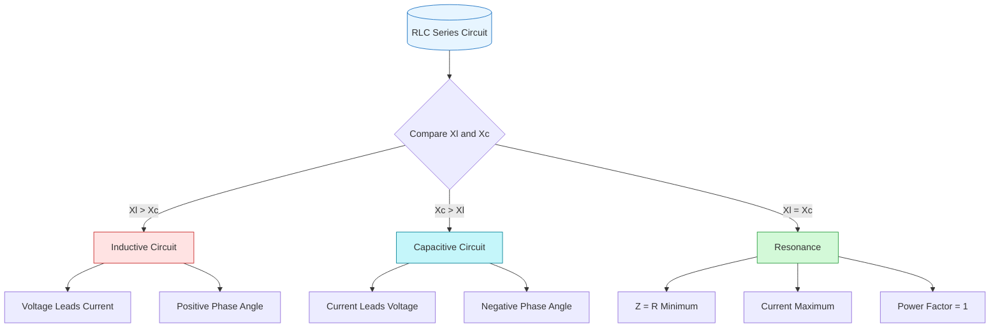
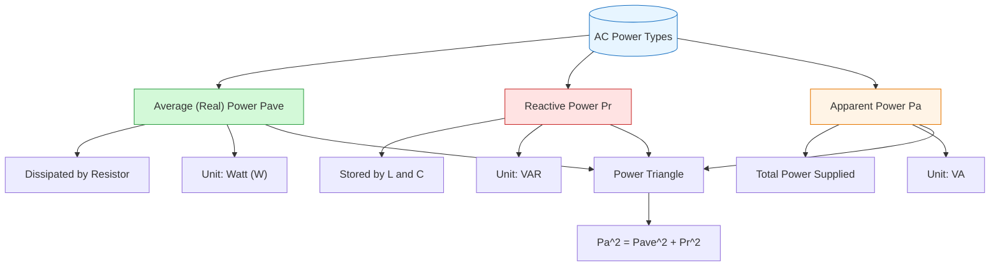

# FAD1022 L17-L21 — AC Series Circuits

Comprehensive coverage of AC series circuits including RL, RC, RLC configurations, resonance, and power analysis.

## Lecture Files

- Lecture 17 — RL Series Circuit
- Lecture 18 — RC Series Circuit
- Lecture 19 — RLC Series Circuit
- Lecture 20 — RLC Series Resonance
- Lecture 21 — Power and Power Factor

## Lecture 17 — RL Series Circuit

### Learning Outcomes
1. Understand the impedance of an RL series AC circuit and its phase relationship.
2. Analyze voltage, current, and power in RL series AC circuits using phasors.

### Key Principles

**Current**
- Current is the same through all series components: $I_T = I_R = I_L$
- The current across the resistor and inductor are in the **same phase**.

**Voltage**
- Resistor voltage $V_R$ is in phase with current.
- Inductor voltage $V_L$ leads current by $90^\circ$.
- Total voltage (phasor sum): $V_T = \sqrt{V_R^2 + V_L^2}$

**Impedance**
- RL series impedance: $Z = \sqrt{R^2 + X_L^2}$
- Inductive reactance: $X_L = 2\pi f L = \omega L$

**Phase Angle**
- Phase angle by which voltage leads current:
  $$\theta = \tan^{-1}\left(\frac{V_L}{V_R}\right) = \tan^{-1}\left(\frac{X_L}{R}\right)$$
- In an RL series circuit, **voltage leads current by $\theta$**, and $\theta$ is positive.

**Phasor Diagram**
- Take current $I_T$ as the reference phasor (horizontal).
- $V_R$ is drawn in phase with $I_T$.
- $V_L$ is drawn $90^\circ$ ahead (vertical).
- $V_T$ is the vector sum of $V_R$ and $V_L$.
- The impedance triangle follows the same geometry: $R$ (horizontal), $X_L$ (vertical), $Z$ (hypotenuse).

### Examples & Problems
- **Example 1:** A $100\,\Omega$ resistor connected to a $125\,\text{mH}$ inductor, supplied by $120\,\text{V}$, $60\,\text{Hz}$ AC. Find impedance, phase angle, rms current, and rms voltage across the inductor.
- **Example 2:** An RL circuit supplied by $80\,\text{V}$, $60\,\text{Hz}$ across a $5\,\Omega$ resistor and $12\,\text{mH}$ inductor. Draw the phasor diagram and calculate impedance, phase angle, rms current, and rms voltage across the inductor.
- **Question 1:** A coil with $10\,\Omega$ resistance and unknown inductance connected to $5.0\,\text{V}_{rms}$. At $50\,\text{Hz}$, $I_{rms}=1.0\,\text{A}$; at $100\,\text{Hz}$, $I_{rms}=0.625\,\text{A}$. Determine inductance and phase angles at both frequencies.
- **Question 2:** A $50.0\,\Omega$ resistor and $0.1\,\text{H}$ inductor with source $V(t)=50\sin(\omega t)\,\text{V}$ at $\omega=1000\,\text{rad/s}$. Calculate impedance, peak current, voltage across each component, phase angle, identify the leading signal, and sketch the phasor diagram.
- **Question 3:** A $2.0\,\text{H}$ inductor in series with a $50\,\Omega$ resistor and $240\,\text{V}$, $50\,\text{Hz}$ supply. Calculate inductive reactance and rms current.

### Conceptual Notes
- Resolving RL in a series AC circuit is **not** equivalent to DC resistance addition because $R$ and $X_L$ are $90^\circ$ out of phase. They must be combined using phasor (vector) addition.
- Pure inductive circuits consume zero average power ($P_{avg}=0$); in an RL series circuit, average power is dissipated only in the resistor.

## Lecture 18 — RC Series Circuit

### Overview
Resistor-capacitor series AC circuit analysis using phasor diagrams. Current, voltage, impedance, and phase relationships.

### Key Relationships

| Quantity | Formula / Relationship |
|----------|------------------------|
| Current | $I_T = I_R = I_C$ (same in series) |
| Voltage | $V_T = \sqrt{V_R^2 + V_C^2}$ |
| Impedance | $Z = \sqrt{R^2 + X_C^2}$ where $X_C = \frac{1}{\omega C} = \frac{1}{2\pi f C}$ |
| Phase angle | $\theta = \tan^{-1}\left(\frac{-X_C}{R}\right) = \tan^{-1}\left(\frac{V_C}{V_R}\right)$ — **current leads voltage**, θ is **negative** |

### Phasor Diagram Notes

- **Resistor (PRC)**: $V_R$ in phase with $I_R$
- **Capacitor (PCC)**: $V_C$ **lags** $I_C$ by 90°
- Combined: total current $I_T$ leads total voltage $V_T$ by phase angle θ
- **CIVIL mnemonic**: In a **C**apacitor, **I** leads **V**; in an **I**nductor, **V** leads **I**

### Worked Examples

**Example 1**
A 100 Ω resistor is connected to a 15 μF capacitor and supplied by 120 V, 60 Hz AC source.
- $X_C = \frac{1}{2\pi(60)(15\times10^{-6})} \approx 176.84\ \Omega$
- $Z = \sqrt{100^2 + 176.84^2} \approx 203.2\ \Omega$
- $\theta = \tan^{-1}\left(\frac{-176.84}{100}\right) \approx -60.5°$
- $I_{rms} = \frac{120}{203.2} \approx 0.59\ \text{A}$
- $V_R = I_{rms}R \approx 59.1\ \text{V}$
- $V_C = I_{rms}X_C \approx 104.5\ \text{V}$

**Example 2**
Phase angle of a series RC circuit is -72.56°. Resistance is 100 Ω and frequency is 50 Hz.
- $\tan(72.56°) = \frac{X_C}{R} \Rightarrow X_C = 100 \times 3.199 \approx 320\ \Omega$
- $C = \frac{1}{2\pi(50)(320)} \approx 9.95\ \mu\text{F}$
- $Z = \sqrt{100^2 + 320^2} \approx 335\ \Omega$

**Question 1**
An alternating current with angular frequency $1\times10^4$ rad/s flows through a 10 kΩ resistor and a 0.10 μF capacitor in series. RMS voltage across the resistor is 20 V.
- $X_C = \frac{1}{(1\times10^4)(0.10\times10^{-6})} = 1000\ \Omega$
- $I_{rms} = \frac{20}{10000} = 2\ \text{mA}$
- $V_{C(rms)} = (2\times10^{-3})(1000) = 2\ \text{V}$

### Lecture Images

- `Lecture 18 RC Series-01.png` — RL revision (voltage & impedance triangles)
- `Lecture 18 RC Series-02.png` — Title slide
- `Lecture 18 RC Series-03.png` — Phasor PRC and PCC
- `Lecture 18 RC Series-04.png` — Combined phasor (CIVIL)
- `Lecture 18 RC Series-05.png` — Current relationship ($I_T = I_R = I_C$)
- `Lecture 18 RC Series-06.png` — Voltage phasor and triangle
- `Lecture 18 RC Series-07.png` — Impedance phasor and triangle
- `Lecture 18 RC Series-08.png` — Combined current and voltage (current leads)
- `Lecture 18 RC Series-09.png` — Phase angle formulas
- `Lecture 18 RC Series-10.png` — Example 1
- `Lecture 18 RC Series-11.png` — Example 2
- `Lecture 18 RC Series-12.png` — Question 1
- `Lecture 18 RC Series-13.png` — Exit ticket QR code

## Key Concepts

- [[AC Circuits]] — series circuit analysis
- RL Series Circuit — impedance, phase angle, voltage relationships
- RC Series Circuit — impedance, phase angle, voltage relationships
- RLC Series Circuit — combined impedance, resonance condition
- Resonance — resonant frequency, bandwidth, quality factor (Q)
- AC Power — instantaneous, average, apparent, real, and reactive power
- Power Factor — cos(φ), power factor correction
- Impedance Triangle — relationship between resistance and reactance
- Power Triangle — relationship between real, reactive, and apparent power

## Lecture 20 — RLC Series Resonance

### Revision of RLC Series Circuit

An RLC series circuit can be either **inductive** or **capacitive** depending on the relative magnitudes of reactances:

| Circuit Type | Condition | Phasor Behaviour | Phase Angle |
|---|---|---|---|
| **Inductive** | $V_L > V_C$ or $X_L > X_C$ | Voltage leads current by $\theta$ | $\theta = \tan^{-1}\left(\frac{V_L - V_C}{V_R}\right)$, positive |
| **Capacitive** | $V_C > V_L$ or $X_C > X_L$ | Current leads voltage by $\theta$ | $\theta = \tan^{-1}\left(\frac{V_C - V_L}{V_R}\right)$, negative |

Total voltage: $V_T = \sqrt{V_R^2 + (V_L - V_C)^2}$

### Condition for Resonance: $X_L = X_C$

By adjusting the frequency, the inductive reactance $X_L$ and capacitive reactance $X_C$ can be made equal. This special frequency is called the **resonance frequency**, $f_0$.

At resonance:
- Impedance is **minimum**: $Z = \sqrt{R^2 + (X_L - X_C)^2} = R$
- Current is **maximum**: $I_{rms} = \frac{V_{rms}}{R}$
- The circuit behaves as a **purely resistive** circuit
- Phase angle is **0°** (voltage and current are in phase)
- Power factor = 1 (unity)

### Resonance Frequency Derivation

Starting from $X_L = X_C$:

$$2\pi f_0 L = \frac{1}{2\pi f_0 C}$$

$$(2\pi f_0 L)(2\pi f_0 C) = 1$$

$$4\pi^2 f_0^2 LC = 1$$

$$f_0 = \frac{1}{2\pi\sqrt{LC}} \text{ Hz}$$

### Impedance vs Frequency Behaviour

As supply frequency increases from zero to very high values:
- Impedance **initially decreases**
- Reaches a **minimum at resonance** ($Z = R$)
- Then **increases** again

### Worked Examples

**Example 1** — A series RLC circuit is connected to a 220 V, 60 Hz AC generator. Given $X_C = 53.1\,\Omega$, $X_L = 113\,\Omega$, $R = 25\,\Omega$.
- (i) Current of the circuit
- (ii) Current if driven at resonance frequency
- (iii) Resonance frequency

**Example 2** — Given $R = 150.0\,\Omega$, $L = 20.0\,\text{mH}$, $V_{rms} = 20.0\,\text{V}$, $\omega = 5000\,\text{rad s}^{-1}$. Determine the capacitance for which the current is at maximum (resonance condition).

### Practice Questions

1. **Question 1** — Resonance frequency $f_0 = 70.25\,\text{Hz}$, $R = 300\,\Omega$, $L = 0.8\,\text{H}$. Find capacitance and rms current at resonance when driven by $90\,\text{V}_{rms}$.
2. **Question 2 (Mid Sem 25/25)** — $R = 100\,\Omega$, $L = 0.15\,\text{H}$, $C = 100\,\mu\text{F}$, $240\,\text{V}$, $100\,\text{Hz}$. Calculate impedance.
3. **Question 3 (Final Exam)** — $R = 75\,\Omega$, $X_C = 90\,\Omega$, $X_L = 165\,\Omega$, $120\,\text{V}$, $60\,\text{Hz}$. Calculate current.
4. **Question 4** — Reactances equal at 1000 Hz. Find ratio $X_C / X_L$ at 100 Hz.
5. **Question 5** — $R = 50\,\Omega$, $C = 10.0\,\mu\text{F}$, $L = 0.1\,\text{H}$, $V(t) = 50\sin(1000t)\,\text{V}$. Find impedance, peak current, voltages across components, phase angle, and identify leading signal.
6. **Question 6 (Midsem 24/25)** — As frequency increases from zero to very high, how does impedance behave? *(Answer: decreases → minimum at resonance → increases)*
7. **Question 7 (Midsem 24/25)** — $100\,\text{V}$ AC source, series RLC at resonance with $R = 50\,\Omega$, $C = 100\,\mu\text{F}$, $L = 0.5\,\text{H}$. Calculate maximum current and resonance frequency.
8. **Question A6 (Final Exam 24/25)** — Determine capacitor required in series with $L = 2.0\,\text{H}$ to ensure current is in phase with $240\,\text{V}$, $50\,\text{Hz}$ supply.
9. **Question B5 (a) (Final Exam 24/25)** — Describe two conditions for an RLC circuit to achieve power factor of one. *(Answer: $X_L = X_C$, and therefore $Z = R$ and $\phi = 0°$)*
10. **Question B5 (b) (Final Exam 24/25)** — $R = 100\,\Omega$, $C = 20\,\mu\text{F}$, $L = 0.2\,\text{H}$. $V_L = 50\,\text{V}$, $V_C = 200\,\text{V}$. Determine operating frequency.

## Lecture 19 — RLC Series Circuit

An RLC series circuit consists of a resistor ($R$), inductor ($L$), and capacitor ($C$) connected in series with an AC voltage source. The analysis combines the phasor relationships from pure resistive, inductive, and capacitive circuits.

### Circuit Characteristics

In a series RLC circuit:
- **Current is the same** through all components: $I_T = I_R = I_L = I_C$
- The current is in phase with $V_R$, lags $V_L$ by $90°$, and leads $V_C$ by $90°$

### Phasor Analysis

The total voltage is the phasor sum of individual voltages:

$$\vec{V}_T = \vec{V}_R + \vec{V}_L + \vec{V}_C$$

Since $V_L$ and $V_C$ are $180°$ out of phase, they partially cancel each other.

### Two Cases: Inductive vs Capacitive Dominance

The circuit behavior depends on the relative magnitudes of $X_L$ and $X_C$:

#### Case 1: More Inductive ($X_L > X_C$ or $V_L > V_C$)

When inductive reactance dominates:

**Voltage:**
$$V_T = \sqrt{V_R^2 + (V_L - V_C)^2}$$
$$\theta = \tan^{-1}\left(\frac{V_L - V_C}{V_R}\right)$$

**Impedance:**
$$Z = \sqrt{R^2 + (X_L - X_C)^2}$$
$$\theta = \tan^{-1}\left(\frac{X_L - X_C}{R}\right)$$

- **Voltage leads current** by $\theta$
- $\theta$ is **positive**
- Circuit behaves like an RL circuit

#### Case 2: More Capacitive ($X_C > X_L$ or $V_C > V_L$)

When capacitive reactance dominates:

**Voltage:**
$$V_T = \sqrt{V_R^2 + (V_C - V_L)^2}$$
$$\theta = \tan^{-1}\left(\frac{V_C - V_L}{V_R}\right)$$

**Impedance:**
$$Z = \sqrt{R^2 + (X_C - X_L)^2}$$
$$\theta = \tan^{-1}\left(\frac{X_C - X_L}{R}\right)$$

- **Current leads voltage** by $\theta$
- $\theta$ is **negative**
- Circuit behaves like an RC circuit

### Key Relationships Summary

| Quantity | Formula |
|----------|---------|
| Total Voltage | $V_T = \sqrt{V_R^2 + (V_L - V_C)^2}$ |
| Impedance | $Z = \sqrt{R^2 + (X_L - X_C)^2}$ |
| Phase Angle | $\theta = \tan^{-1}\left(\frac{X_L - X_C}{R}\right)$ |
| Net Reactance | $X = X_L - X_C$ |

### Examples

**Example 1:** An RLC series circuit is connected to 220 V, 60 Hz. Given $C = 34 \mu$F and $L = 0.3$ H. Calculate impedance and phase angle. Determine which signal lags.

**Example 2:** A resistor, capacitor, and inductor are connected in series with $V_R = 4.0$ V, $V_C = 8.0$ V, and $V_L = 5.0$ V. Calculate the power supply voltage and phase angle.

### Practice Problems

**Question 1:** An RLC circuit has $C = 2.5 \mu$F, $L = 0.6$ H, $R = 400.0 \Omega$, supplied by 12.0 Vrms. Sketch graphs of $R$, $X_C$, $X_L$, and $Z$ vs frequency.

**Question 2:** A series RLC circuit has $R = 425 \Omega$, $C = 3.50 \mu$F, $L = 1.25$ H, connected to 150 V at 60 Hz. Determine impedance and sketch the phasor diagram.

**Question 3:** An RLC series circuit has $R = 50.0 \Omega$, $C = 10.0 \mu$F, $L = 0.1$ H, with $V(t) = 50 \sin(1000t)$ V. Calculate impedance, peak current, voltages across each component, and phase angle.

**Mid-Semester Question 17 (25/25):** $R = 100 \Omega$, $L = 0.15$ H, $C = 100 \mu$F, 240 V, 100 Hz. Calculate impedance. *(Answer: D. 127.03 $\Omega$)*

**Final Exam B5(b) — 4 marks:** $R = 75 \Omega$, $X_C = 90 \Omega$, $X_L = 165 \Omega$, 120 V, 60 Hz. Calculate current across the circuit.

### Lecture Images

- `Lecture 19 RLC Series-01.png` — RL revision (phase angle triangles)
- `Lecture 19 RLC Series-02.png` — RC revision (phase angle triangles)
- `Lecture 19 RLC Series-03.png` — Comparison table (PRC, PLC, PCC, RL, RC)
- `Lecture 19 RLC Series-04.png` — Title slide: Lecture 18 / Lecture 19 RLC Series Circuit
- `Lecture 19 RLC Series-05.png` — Phasor PRC + PLC + PCC = RLC (CIVIL)
- `Lecture 19 RLC Series-06.png` — Combined phasor diagram (current and voltage)
- `Lecture 19 RLC Series-07.png` — Current relationship ($I_T = I_R = I_L = I_C$)
- `Lecture 19 RLC Series-08.png` — RLC series circuit: More Inductive / More Capacitive
- `Lecture 19 RLC Series-09.png` — MORE INDUCTIVE title
- `Lecture 19 RLC Series-10.png` — Voltage phasor ($V_L > V_C$): $V_T = \sqrt{V_R^2 + (V_L-V_C)^2}$
- `Lecture 19 RLC Series-11.png` — Impedance phasor ($X_L > X_C$): $Z = \sqrt{R^2 + (X_L-X_C)^2}$
- `Lecture 19 RLC Series-12.png` — MORE CAPACITIVE title
- `Lecture 19 RLC Series-13.png` — Voltage phasor ($V_C > V_L$): $V_T = \sqrt{V_R^2 + (V_C-V_L)^2}$
- `Lecture 19 RLC Series-14.png` — Impedance phasor ($X_C > X_L$): $Z = \sqrt{R^2 + (X_C-X_L)^2}$
- `Lecture 19 RLC Series-15.png` — Combined current and voltage phasors (inductive vs capacitive)
- `Lecture 19 RLC Series-16.png` — Example 1 (RLC, 220 V, 60 Hz, C=34 μF, L=0.3 H)
- `Lecture 19 RLC Series-17.png` — Example 2 (VR=4 V, VC=8 V, VL=5 V)
- `Lecture 19 RLC Series-18.png` — Question 1 (sketch R, XC, XL, Z vs frequency)
- `Lecture 19 RLC Series-19.png` — Question 2 (R=425 Ω, C=3.50 μF, L=1.25 H, 150 V, 60 Hz)
- `Lecture 19 RLC Series-20.png` — Question 3 (R=50 Ω, C=10 μF, L=0.1 H, V(t)=50sin(1000t))
- `Lecture 19 RLC Series-21.png` — Mid Sem Q17 (R=100 Ω, L=0.15 H, C=100 μF, 240 V, 100 Hz)
- `Lecture 19 RLC Series-22.png` — Final Exam B5(b) (R=75 Ω, XC=90 Ω, XL=165 Ω, 120 V, 60 Hz)
- `Lecture 19 RLC Series-23.png` — Exit ticket QR code

## Lecture 21 — Power and Power Factor

### What is Power Factor?

**Power Factor (PF)** is defined as the ratio of average (real) power to apparent power:

$$\text{Power Factor} = \frac{\text{Average Power (W)}}{\text{Apparent Power (VA)}}$$

**Analogy — Root Beer:**
- **Rootbeer** = Average power (W) — useful, does work
- **Foam** = Reactive power (VAr) — useless
- **Pay by the glass** = Apparent power (VA) = Average Power + Reactive Power
- A high power factor means little foam — you get what you pay for.

### Three Types of Power

| Power Type | Symbol | Unit | Dissipated By |
|------------|--------|------|---------------|
| Average (Real) Power | $P_{ave}$ | W | Resistor only |
| Reactive Power | $P_R$ or $Q$ | VAr | Inductor / Capacitor |
| Apparent Power | $P_A$ or $S$ | VA | Impedance $Z$ |

### Circuit Analysis

**Circuit 1: Pure Resistive Circuit (PRC)**
- Voltage and current in phase.
- Instantaneous power is always positive: $P = VI$.
- All power is average power: $P_{ave} = V_{rms}I_{rms}$.

**Circuit 2: Pure Capacitive Circuit (PCC)**
- Current leads voltage by $90^\circ$.
- Average power $P_{ave} = 0$ W (energy stored and returned each cycle).
- Consumes **reactive power**: $P_r = I_{rms}^2 X_C$.

**Circuit 3: Pure Inductive Circuit (PLC)**
- Current lags voltage by $90^\circ$.
- Average power $P_{ave} = 0$ W (energy stored and returned each cycle).
- Consumes **reactive power**: $P_r = I_{rms}^2 X_L$.

**Circuit 4: RL Circuit**
- Average power (by R): $P_{ave} = I_{rms}^2 R$
- Reactive power (by L): $P_R = I_{rms}^2 X_L$
- Apparent power (by Z): $P_A = I_{rms}^2 Z = \sqrt{P_{ave}^2 + P_R^2}$
- Example: $R=50\,\Omega$, $L=150\,$mH, $230\,$V, $60\,$Hz → $PF = 0.66$.

**Circuit 5: RC Circuit**
- Average power (by R): $P_{ave} = I_{rms}^2 R$
- Reactive power (by C): $P_R = I_{rms}^2 X_C$
- Apparent power (by Z): $P_A = I_{rms}^2 Z = \sqrt{P_{ave}^2 + P_R^2}$
- Example: $R=50\,\Omega$, $C=50\,\mu$F, $230\,$V, $60\,$Hz → $PF = 0.69$.

**Circuit 6: RLC Circuit**
- Average power (by R): $P_{ave} = I_{rms}^2 R$
- Reactive power (by L & C): $P_R = I_{rms}^2 (X_L - X_C)$
- Apparent power (by Z): $P_A = I_{rms}^2 Z \approx \sqrt{P_{ave}^2 + P_R^2}$
- Example: $R=50\,\Omega$, $L=150\,$mH, $C=50\,\mu$F, $230\,$V, $60\,$Hz → $PF = 0.998$.
- Adding a capacitor **increases the power factor** (power factor correction).

### Key Relationships

- **Power Factor and Phase Angle:**
  $$\text{Power Factor} = \cos\phi = \frac{P_{ave}}{P_A}$$

- **Power Factor and Impedance:**
  $$\text{Power Factor} = \frac{R}{Z}$$

- **Power Triangle:**
  $$P_A^2 = P_{ave}^2 + P_R^2$$

### Worked Examples

**Example 1 (RL Circuit)**
A $30\,\Omega$ resistor and $80\,$mH inductor are connected to a $120\,$V, $50\,$Hz source.
Calculate: (i) power factor, (ii) phase constant.

**Example 2 (RL Circuit)**
An RL series circuit with a $63\,$mH inductor and $248.0\,\Omega$ resistor is connected to a source with peak voltage $240.0\,$V at $200.0\,$Hz. Calculate:
(a) inductive reactance, (b) impedance, (c) power factor, (d) rms voltage, (e) average power.

### Tutorial & Past Year Questions

- **Past Years June 2023 A5:** The reactance of an inductor and a capacitor are equal at $1000\,$Hz. Calculate the ratio of the capacitive reactance to the inductive reactance at $100\,$Hz.
- **Final Exam 24/25 A6:** Determine the value of capacitor required in series with a $2.0\,$H inductance to ensure the current is in phase with a $240\,$V, $50\,$Hz supply voltage.
- **Final Exam 24/25 B5(a):** Describe two conditions required for an RLC circuit to achieve a power factor of one.
- **Final Exam 24/25 B5(b):** A series RLC circuit with a $100\,\Omega$ resistor, $20\,\mu$F capacitor, and $0.2\,$H inductor is connected to an AC power source of unknown frequency. The rms voltages measured across the inductor and capacitor are $50\,$V and $200\,$V, respectively. Determine the operating frequency of the circuit.
- **Question 1 (Tutorial):** A resistor with $R=300\,\Omega$ and an inductor are connected in series across an AC source that has voltage amplitude $500\,$V. The rate at which electrical energy is dissipated in the resistor is $216\,$W. Calculate the impedance, amplitude of the voltage across the inductor, and power factor.
- **Question 2 (Tutorial):** An L-R-C series circuit is connected to a $120\,$Hz AC source that has $V_{rms}=80.0\,$V. The circuit has a resistance of $75.0\,\Omega$ and an impedance at this frequency of $105\,\Omega$. What average power is delivered to the circuit by the source?
- **Mid Semester 24/25 Q18:** A $200\,\Omega$ resistor, a $300\,$mH inductor, and a $200\,\mu$F capacitor are connected in series to a $120\,$V, $50\,$Hz AC source. Calculate the power factor of the circuit.
- **Mid Semester 24/25 Q20:** A power plant supplies electricity at $230\,$V, $50\,$Hz to an industrial load consisting of a $10\,$kW resistive heating element and a $5\,$kVAR inductive motor load. Calculate the phase angle of the system.
- **Final Exam 24/25 B5(c):** A series RLC circuit is connected to an alternating rms voltage source of $230\,$V. The circuit has a power factor of $0.85$ and an average power consumption of $800\,$W. Calculate the impedance and resistance of the circuit.
- **Final Exam Supplementary 24/25 B5(c):** An RC circuit is connected to an alternating current source of $120\,$V, $50\,$Hz. In this circuit, the resistance is $150\,\Omega$, which is equal to its capacitive reactance. Calculate the apparent power of the circuit.

## Diagrams

### RLC Circuit Behavior Decision Tree

### AC Power Relationships

## Summary

This module provides in-depth analysis of AC series circuits. Students analyze RL, RC, and RLC circuits using phasor methods, calculate impedance and phase angles, and understand series resonance. Power concepts including power factor and its importance in electrical systems are emphasized. Lecture 21 specifically covers the distinction between average, reactive, and apparent power, the power triangle, and the use of power factor as a measure of electrical efficiency.

## Lecturer

[[Mohd Fahmi Azman (MFA)]] — PASUM Physics Lecturer

## Related

- [[FAD1022 - Basic Physics II]] — main course page
- [[FAD1022 L14-L16 — AC Analysis]] — prerequisite AC fundamentals
- [[Inductance & Transformers]] — inductive circuit concepts
- [[Capacitors & Dielectrics]] — capacitive circuit concepts