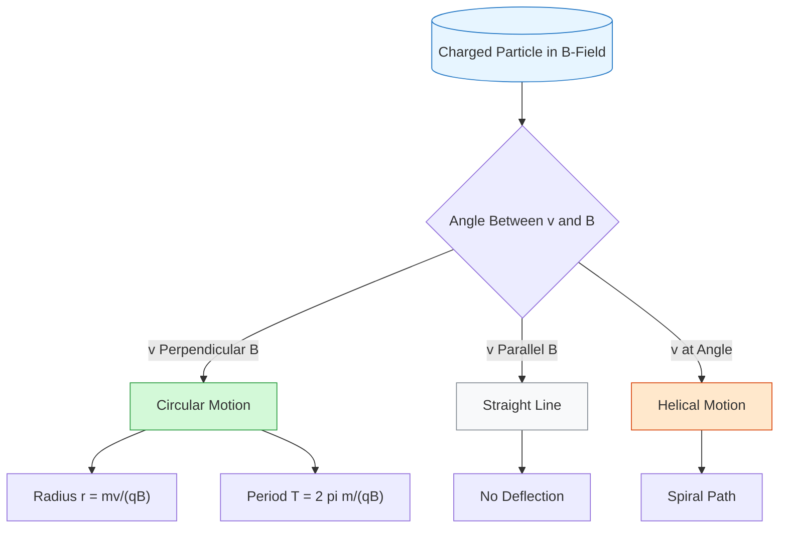
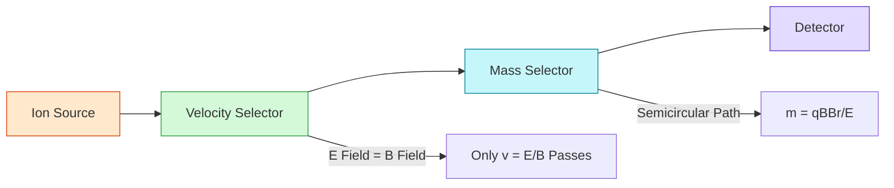

# FAD1022 L22-L26 — Magnetism

Lecture series on magnetic fields, magnetic forces, and Ampere's law.

## Lecture Files

- Lecture 22 — Magnetic Field (Subtopic 1)
- Lecture 23 — Force and Motion of Charge in Magnetic Field
- Lecture 24 — Magnetic Force between Two Parallel Wires
- Lecture 25-26 — Ampere's Law and Torque

---

## L22 — Magnetic Field (Subtopic 1)

**Lecturer:** [[Aisyah Hartini Jahidin (AHJ)]] — PASUM 2025/2026

**Learning Outcome:** Students will be able to determine the **direction** and **calculate** the magnetic field created by a current-carrying wire.

### 1. How Current Affects Magnetic Field

- **No current:** Compass aligns with Earth's magnetic field.
- **Current ON:** Compass needle deflects; magnetic fields form circular loops around the wire.

### 2. Right Hand Grip Rule (RHR)

Used to determine the direction of magnetic field $\vec{B}$ around a current-carrying conductor:

1. **Thumb** → Direction of conventional current $I$ (flows from $+$ to $-$)
2. **Curled fingers** → Direction of magnetic field $\vec{B}$
3. The direction of $\vec{B}$ at any point is **tangent** to the field line.

**Alternative uses of RHR:**
- Determine the direction of current when given the magnetic field.
- Determine the pole (N/S) of a solenoid or coil. Your thumb indicates the direction of $\vec{B}$ inside the solenoid (thumb points to North pole).

### 3. 2D Vector Notation for 3rd Axis

| Symbol | Meaning |
|--------|---------|
| $\odot$ | Out of the page (arrow tip coming toward you) |
| $\otimes$ | Into the page (arrow tail moving away) |

These symbols apply to current $I$, magnetic field $\vec{B}$, force $\vec{F}$, and velocity $\vec{v}$.

**Direction relationships:**
- $I$ out of page → $\vec{B}$ is **counter-clockwise**
- $I$ into page → $\vec{B}$ is **clockwise**

### 4. Magnetic Field Formulas

| Geometry | Formula | Notes |
|----------|---------|-------|
| Long straight wire | $B = \dfrac{\mu_0 I}{2\pi r}$ | $r$ = perpendicular distance from wire |
| Circular loop (centre) | $B = \dfrac{\mu_0 N I}{2r}$ | $N = 1$ by default if not given; **no $\pi$** in this formula |
| Long solenoid (centre) | $B = \dfrac{\mu_0 N I}{L} = \mu_0 n I$ | $n = N/L$ = turns per unit length; valid when $L \gg r$ |

**Constants & Units:**
- Permeability of free space: $\mu_0 = 4\pi \times 10^{-7} \; \text{T}\cdot\text{m}\cdot\text{A}^{-1}$
- Unit of $B$: Tesla (T), where $1\,\text{T} = 1\,\dfrac{\text{N}}{\text{A}\cdot\text{m}}$
- Gauss: $1\,\text{G} = 10^{-4}\,\text{T}$ (frequently used since Tesla is large)

**Key dependencies:**
- For a straight wire: $B \propto \dfrac{1}{r}$ — field decreases with distance.
- For a circular loop: $B$ increases if $N$ increases or $r$ decreases.
- For a solenoid: external field near the centre is very small ($\approx 0$); field inside is nearly uniform and parallel to the axis.

### 5. Superposition of Magnetic Fields

For multiple current-carrying wires, the net magnetic field at a point is the vector sum of the fields from each wire.

**Problem-solving steps:**
1. Sketch the situation.
2. Use RHR to determine the direction of $\vec{B}$ from each wire at the specific point.
3. Calculate the magnitude of each $B$.
4. Calculate the resultant: **add** if same direction, **subtract** if opposite directions.

### 6. Worked Examples (L22)

**Example 1 — Long straight wire**
> A long straight wire carries $I = 12\,\text{A}$ directed toward the west. Calculate the magnitude and direction of the magnetic field at a point located $10\,\text{cm}$ directly south of the wire.

**Example 2 — Circular coil**
> A circular coil of radius $15.0\,\text{cm}$ carries current in the counter-clockwise direction. The current produces $B = 21.0\,\mu\text{T}$ at the centre. Determine (a) the current, and (b) the direction of $\vec{B}$ outside the coil.

**Example 3 — Solenoid**
> Find the field inside a $2.00\,\text{m}$ long solenoid that has $2000$ loops and carries a $1600\,\text{A}$ current.

**Example 4 — Two parallel wires (outside)**
> Two infinitely long wires carry $I_1 = 5\,\text{A}$ and $I_2 = 9\,\text{A}$, separated by $d = 2.0\,\text{mm}$. Both currents flow out of the page. Point P is located $2.5\,\text{mm}$ above wire $I_1$. Determine the magnitude and direction of the resultant magnetic field at P.

**Example 5 — Two parallel wires (midway)**
> Two long straight parallel wires carry $I_1 = 3\,\text{A}$ and $I_2 = 5\,\text{A}$ both out of the page, separated by $d = 20\,\text{cm}$. Determine $\vec{B}$ (a) at the midpoint, and (b) at point P located $20\,\text{cm}$ above the wire carrying $5\,\text{A}$.

**Example 6 — Perpendicular wires**
> Two long thin wires carry currents perpendicular to each other ($I_1 = 20\,\text{A}$, $I_2 = 12\,\text{A}$). Determine the magnitude and direction of $\vec{B}$ at point Q.

**Example 7 — Two concentric coils**
> Flat coil P ($r = 15\,\text{cm}$, $N = 10$, clockwise) produces a magnetic field. Earth's magnetic flux density is $2 \times 10^{-5}\,\text{T}$. (a) Find direction of $\vec{B}$ inside P. (b) Find $I$ to match Earth's field. (c) Coil Q ($r = 10\,\text{cm}$, $N = 8$, $I = 1\,\text{A}$) is placed concentrically. Adjust $I$ in P so that resultant $\vec{B}$ at the centre is zero.

---

## L23 — Force and Motion of Charge in Magnetic Field

**Lecturer**: Dr Aisyah Hartini Jahidin (AHJ)

### Learning Outcomes
1. Determine the **direction** and **calculate** the magnetic force exerted by a magnetic field on a moving charge.
2. Apply the concept of $\vec{B}$ and $\vec{E}$ fields — mass spectrometer.

### Magnetic Force on a Moving Charged Particle
- **Lorentz force** (for $E = 0$):
  $$\vec{F}_B = q\vec{v} \times \vec{B}$$
- **Magnitude**:
  $$|F_B| = |q|vB\sin\theta$$
  where $\theta$ is the angle between $\vec{v}$ and $\vec{B}$.
- **Maximum force**: when $v \perp B$ ($\theta = 90°$)
- **Zero force**: when $v = 0$ (stationary charge) **or** $v \parallel B$ ($\theta = 0°$)
- **No magnetic force on a stationary charge** in a magnetic field.

### Motion of the Charge
| Condition | Motion |
|-----------|--------|
| $v \perp B$ | Circular motion |
| $v \parallel B$ | Straight line (no deflection) |
| $v$ at an angle to $B$ | Helical (spiral) motion |
| In $B$ and $E$ fields with $v = E/B$ | Straight line (velocity selector) |

### How to Determine the Direction of Magnetic Force
- The force $\vec{F}$ is **perpendicular** to the plane formed by $\vec{v}$ and $\vec{B}$.
- Methods: **Right Hand Rule (RHR)**, **Right Hand Curl Rule**, or **Left Hand Rule (LHR)** / Fleming's Left Hand Rule.

#### Positive Charge ($+q$)
- **RHR**: fingers point in direction of $\vec{v}$, curl toward $\vec{B}$, thumb points in direction of $\vec{F}$.
- **LHR**: thumb = $\vec{F}$, first finger = $\vec{B}$, second finger = $\vec{v}$.

#### Negative Charge ($-q$)
Two methods:
1. **Swap notation**: Based on the $+q$ direction, swap the roles of $\vec{v}$ and $\vec{B}$ when applying RHR or LHR.
2. **Reverse force**: Apply RHR as for $+q$, then reverse the direction of $\vec{F}$. The direction of $\vec{v}$ and $\vec{B}$ remain unchanged.
   - Force on $-q$ = opposite of force on $+q$.

### Motion of Charged Particle in a Uniform Magnetic Field
- In a uniform magnetic field, a charged particle moves in a **circular path** when $v \perp B$.
- Magnetic force provides **centripetal force**:
  $$F_B = F_C \quad \Rightarrow \quad qvB = \frac{mv^2}{r}$$
- **Radius of motion**:
  $$r = \frac{mv}{qB}$$
- **Velocity from radius**:
  $$v = \frac{rqB}{m}$$
- **Period of circular motion**:
  $$T = \frac{2\pi r}{v} = \frac{2\pi m}{qB}$$
  - **Period does NOT depend on velocity**.
- **Angular frequency**:
  $$\omega = \frac{2\pi}{T} = \frac{qB}{m}$$
- Assumptions: constant velocity, uniform magnetic field.

### Motion in Combined Electric and Magnetic Fields

#### 1. Velocity Selector
- A positively charged particle enters a region with both $\vec{E}$ and $\vec{B}$ fields.
- Electric force $F_E = qE$ and magnetic force $F_B = qvB$ act in **opposite directions**.
- For **no deflection**, forces must balance:
  $$F_E = F_B \quad \Rightarrow \quad qE = qvB$$
  $$v = \frac{E}{B}$$
- Only particles with this exact velocity pass through the selector slit.

#### 2. Mass Selector (Mass Spectrometer)
- Ions are separated according to their mass as they travel through the mass selector.
- In the second magnetic field $B'$, the ion follows a semicircular path of radius $r$.
- Newton's law: $F_B = F_C$
  $$qvB' = \frac{mv^2}{r}$$
- Solving for mass $m$:
  $$m = \frac{qB'r}{v}$$
- Substituting $v = E/B$ from the velocity selector:
  $$m = \frac{qB'B^2r}{E}$$
  *(Note: if the same field $B$ is used in both regions, $m = \frac{qrB^2}{E}$)*
- Ions entering the second magnetic field retain the same speed selected in the first stage.

### Examples Covered (L23)
1. **Direction exercises**: Determine the direction of magnetic force on protons and electrons in various $B_{\text{out}}$ and $B_{\text{in}}$ configurations.
2. **Example 1**: An electron moves towards the $+y$-axis with speed $5.1 \times 10^6$ m/s and experiences a force of $2.8 \times 10^{-12}$ N in the $+z$-direction. Determine $\vec{B}$.
3. **Example 2**: A positively charged particle ($q = 9 \times 10^{-6}$ C, $m = 6 \times 10^{-6}$ kg) moves with speed 300 m/s in a circular path of radius $r = 15$ m within uniform $B$ directed along $-z$-axis. Determine $B$.
4. **Example 3**: A proton ($q = 1.6 \times 10^{-19}$ C, $m = 1.67 \times 10^{-27}$ kg) with speed $2.0 \times 10^4$ m/s enters a semicircular region of uniform $B = 5.0 \times 10^{-5}$ T. Calculate the distance from injection point to where the proton strikes the chamber wall ($2r$).

## L24 — Magnetic Force between Two Parallel Wires

**Lecturer:** [[Aisyah Hartini Jahidin (AHJ)]] — PASUM 2025/2026

### Learning Outcomes
1. Determine the **attractive or repulsive** force between two current-carrying wires.
2. **Calculate** the force between two current-carrying wires.

### Direction of Force

| Current Direction | Interaction | Mnemonic |
|-------------------|-------------|----------|
| Same direction | **Attract** | "Flow together, go together" |
| Opposite direction | **Repel** | "Flow apart, go apart" |

**Sketching the force:**
- The magnetic field produced by one wire exerts a force on the other wire.
- Use the Right Hand Grip Rule to find the field direction from one wire, then determine the force direction on the second wire.

### Magnitude of the Force

For two parallel wires separated by distance $d$, carrying currents $I_1$ and $I_2$, each of length $L$:

$$F_{21} = F_{12} = \frac{\mu_0 I_1 I_2 L}{2\pi d}$$

- The magnitudes of the two forces are **equal** (Newton's third law pair).
- $\mu_0 = 4\pi \times 10^{-7}\;\text{T}\cdot\text{m}\cdot\text{A}^{-1}$
- $d$ = perpendicular distance between the wires (sometimes denoted $r$)

**Force per unit length** (omit $L$):

$$f = \frac{F}{L} = \frac{\mu_0 I_1 I_2}{2\pi d}$$

### Problem-Solving Approach
1. Sketch the arrangement (top view or front view).
2. Use the Right Hand Grip Rule to determine the magnetic field direction produced by one wire at the location of the other.
3. Determine the force direction on the target wire.
4. Calculate magnitudes using the formula.
5. For multiple wires, find the vector sum (add/subtract based on directions).

### Worked Examples (L24)

**Example 1 — Three wires in line (top view)**
> Wires $I_1$, $I_2$, and $I_3$ are arranged in a straight line. $I_1$ and $I_2$ carry current out of the page; $I_3$ carries current into the page. Sketch the forces acting on $I_1$ due to $I_2$ ($F_{21}$) and due to $I_3$ ($F_{31}$), and determine the resultant force direction.

**Example 2 — Three wires in line (front view)**
> Wires $I_1$ (up), $I_2$ (down), and $I_3$ (up) are arranged side by side. Sketch the directions of the forces on $I_1$ due to $I_2$ and $I_3$.

**Example 3 — Three wires in equilateral triangle**
> Wires $I_1$ (into page), $I_2$ (out of page), and $I_3$ (out of page) are placed at the vertices of an equilateral triangle. Sketch the magnetic forces acting on wire $I_3$ due to $I_1$ and $I_2$.

**Example 4 — Force magnitude**
> Given $I_1 = 1.5\,\text{A}$ and $I_2 = 2.3\,\text{A}$. The distance between the two wires is $d = 2\,\text{cm}$ and the length of each wire is $L = 8\,\text{cm}$. Calculate the magnetic force between the wires.

**Example 5 — Resultant force per unit length (three wires in line)**
> Three parallel straight wires P, Q, and R are separated from one another. P carries $20\,\text{A}$ downward, Q carries $60\,\text{A}$ upward, and R carries $10\,\text{A}$ upward. The separation between P and Q is $2\,\text{cm}$, and between Q and R is $2\,\text{cm}$.  
> (i) Redraw the diagram (top view) and indicate the direction of the magnetic force on wire P due to wires Q and R.  
> (ii) Calculate the resultant force per unit length on wire P.

**Example 6 — Resultant force in triangular arrangement**
> Three long parallel wires are separated by $0.10\,\text{m}$ from one another in an equilateral triangle configuration. Wire P ($5\,\text{A}$, out of page), wire Q ($10\,\text{A}$, into page), and wire R ($20\,\text{A}$, into page). Ignore gravitational force.  
> (a) Sketch the magnetic forces acting on wire P.  
> (b) Calculate the magnitude of the resultant magnetic force **per unit length** on wire P.  
> (c) Determine the direction of the resultant force per unit length on wire P.

## L25-26 — Ampere's Law and Torque

**Lecturer:** [[Aisyah Hartini Jahidin (AHJ)]] — PASUM 2025/2026

**Learning Outcomes:**
1. Derive the magnetic field equation from **Ampere's law**.
2. Understand the concept of **torque** on a current-carrying loop in a magnetic field.

---

### 4. Ampere's Law

Ampere's law relates the magnetic field around a closed loop to the electric current passing through the loop.

**Integral form:**
$$\oint \vec{B} \cdot d\vec{l} = \mu_0 I_{enc}$$

where $I_{enc}$ is the total current enclosed by the Amperian loop.

**How to use Ampere's Law:**
1. **Choose a closed path** symmetric to the magnetic field → this makes $B$ constant along the path.
2. **Ensure $\vec{B}$ is parallel to $d\vec{l}$** → $\vec{B} \cdot d\vec{l} = B\,dl$ (if perpendicular, the dot product is zero).
3. **Count only the enclosed current** inside the Amperian loop:
   $$I_{enc} = \frac{A_{\text{chosen}}}{A_{\text{actual}}} I_{\text{actual}}$$

**Applications:**

| Geometry | Condition | Formula |
|----------|-----------|---------|
| Long straight wire (surface) | $r = R$ | $B = \dfrac{\mu_0 I}{2\pi R}$ |
| Outside conducting wire | $r > R$ | $B = \dfrac{\mu_0 I}{2\pi r}$ |
| Inside conducting wire | $r < R$ | $B = \dfrac{\mu_0 I r}{2\pi R^2}$ |

For the **inside** case, the enclosed current is proportional to the area ratio: $I_{enc} = \dfrac{\pi r^2}{\pi R^2} I$.

**Long Solenoid:**
A solenoid consists of a long conducting wire with many closely packed loops. For an ideal solenoid:
- Field outside is approximately **zero**.
- Field inside is **uniform** and parallel to the axis.

Using a rectangular Amperian loop:
$$B = \mu_0 n I = \frac{\mu_0 N I}{L}$$

where $n = N/L$ is the number of turns per unit length.

---

### 5. Torque on a Current Loop

A magnetic field exerts forces on the sides of a current loop, producing a **torque** that tends to rotate the loop.

**Torque formula:**
$$\tau = N I A B \sin\theta$$

- $N$ = number of loops (turns)
- $I$ = current (A)
- $A$ = area of coil
- $B$ = magnetic field strength (T)
- $\theta$ = angle between $\vec{B}$ and the **normal vector** $\vec{A}$ to the coil plane

**True for any shape** of planar loop.

**Direction of rotation:**
- Use **Fleming's rule** or **right-hand grip rule**: fingers → current, thumb → normal vector $\vec{A}$.
- Torque acts to **align $\vec{A}$ with $\vec{B}$**.

**Maximum torque:** $\sin 90^\circ = 1$ → plane of coil is **parallel** to $\vec{B}$ (or $\vec{B}$ is perpendicular to $\vec{A}$).

**Minimum (zero) torque:** $\sin 0^\circ = 0$ → plane of coil is **perpendicular** to $\vec{B}$ (or $\vec{B}$ is parallel to $\vec{A}$).

**DC Motors:**
A current loop with DC does **not** continuously rotate in a uniform magnetic field; it oscillates back and forth by about $90^\circ$. Therefore, DC motors require a **split-ring commutator** to reverse the current direction every half-rotation and allow for full continuous rotation.

---

### Worked Examples (L25-26)

**Example 1 — Magnetic field of a cylinder wire**
> A cylinder wire with radius $R = 2.0\,\text{mm}$ carries $I = 50\,\text{mA}$. Calculate $B$:
> (a) at the surface,
> (b) outside at $5.0\,\text{mm}$ above the surface,
> (c) inside at $0.4\,\text{mm}$ below the surface.

**Example 2 — Maximum torque on a square loop**
> Calculate the maximum torque on a $200$-turn square loop of wire $18.0\,\text{cm}$ on a side that carries $50\,\text{A}$ in a $1.6\,\text{T}$ field. Also find the torque when $\theta = 10.8^\circ$.

**Example 3 — Torque on a circular coil**
> A circular coil of diameter $1.0\,\text{m}$ and $100$ turns, carrying $80\,\text{mA}$, is placed in a uniform $4\,\text{T}$ field. Determine the magnitude of torque acting on the coil (angle between $\vec{A}$ and $\vec{B}$ is $60^\circ$).

**Check Your Understanding:**
1. The torque on a planar current loop does **not** depend on the **shape of the loop**.
2. The torque of a conductor is maximum when the **plane of the loop is parallel to the field**.

---

## Key Concepts

- [[Magnetism]] — magnetic fields, poles, field lines
- Magnetic Field (B) — definition, units (Tesla)
- Lorentz Force — force on moving charges in magnetic fields
- Charged Particle Motion — circular motion in uniform B-field
- Velocity Selector — crossed E and B fields
- Mass Spectrometer — applications of magnetic force
- Force between Current-Carrying Wires — parallel conductors
- Ampere's Law — relating current to magnetic field
- Solenoids and Toroids — magnetic field calculations
- Torque on Current Loops — magnetic moment, motors

## Diagrams

### Charged Particle Motion in Magnetic Field

### Mass Spectrometer Process

## Summary

This module explores magnetic phenomena and their relationship to electric currents. Students learn how moving charges experience forces in magnetic fields, calculate magnetic fields using Ampere's law for symmetric current distributions, and understand the torque on current loops. Applications such as mass spectrometers and electric motors are discussed.

## Lecturer

[[Aisyah Hartini Jahidin (AHJ)]] — PASUM Physics Lecturer

## Related

- [[FAD1022 - Basic Physics II]] — main course page
- [[Inductance & Transformers]] — builds on magnetic field concepts
- [[Electrostatics]] — electric force analogues