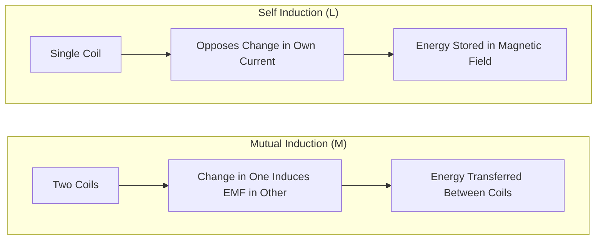
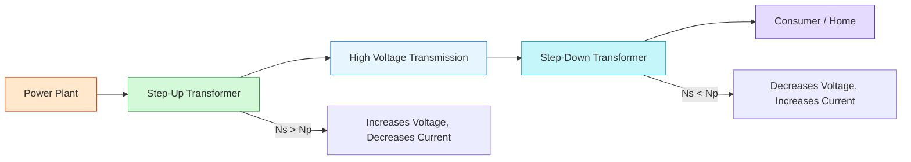

# FAD1022 L31-L33 — Inductance & Transformers

Lecture series on electromagnetic induction, self-inductance, mutual inductance, and transformer principles.

## Lecture Files

- L31 — Self Inductance and Energy
- L32-L33 — Mutual Induction and Transformer
- Quick Quiz 2026
- Revision — Faraday and Lenz Law

## L31 — Self Inductance and Energy (22 pages)

### 20.21 Inductors

- **Inductors** consist of a conductor wound into a coil. Another common name is a **"choke"**.
- When current flows through an inductor, **energy is stored temporarily in a magnetic field** in the coil.
- When the current changes, the time-varying magnetic field induces a **voltage** in the conductor (Faraday's law of electromagnetic induction), which **opposes the change in current** that created it.
- An inductor is characterized by its **inductance** $L$, defined as the ratio of voltage to the rate of change of current.
- **SI unit:** Henry (H)
- **Typical range:** $1\ \mu\text{H}$ to $1\ \text{H}$

### 20.22 Self-Inductance

- **Self-inductance** occurs when the changing magnetic flux through a circuit arises from the circuit itself.
- The sequence: $\Delta I \rightarrow \Delta B \rightarrow \Delta\Phi \rightarrow \mathcal{E}_{ind}$
- For a solenoid: $B = \mu_0 n I = \mu_0 \left(\frac{N}{\ell}\right) I$
- **Self-induced emf (back emf):**
  $$\mathcal{E} = -L \frac{dI}{dt}$$
- **Inductance of a solenoid:**
  $$L = \frac{\mu_0 N^2 A}{\ell}$$
  where $N$ = number of turns, $A$ = cross-sectional area, $\ell$ = length, and $\mu_0 = 1.2567 \times 10^{-6}\ \text{H/m}$ (permeability of free space).
- **Alternative definition:**
  $$L = \frac{N\Phi_B}{I}$$
- By **Lenz's law**, the direction of the self-induced emf opposes the changing current:
  - When $I$ is **increasing**, induced emf is in the **opposite** direction.
  - When $I$ is **decreasing**, induced emf is in the **same** direction.
- The self-induced emf is also known as the **back emf**.

#### L31 Exercises

| Exercise | Problem | Answer |
|----------|---------|--------|
| 2 | Current in $25\ \text{mH}$ inductor changes from $12\ \text{A}$ to $27\ \text{A}$ in $125\ \text{ms}$. Find magnitude and direction of induced emf. | $3\ \text{V}$; opposes increase |
| 3 | $50\ \text{cm}$ air-filled solenoid, diameter $10\ \text{cm}$, $700$ turns. Calculate self-inductance. | $L = 9.67\ \text{mH}$ |
| 4 | $300\ \text{mH}$ inductor, power $20\ \text{W}$, current $3.5\ \text{A}$. Determine $dI/dt$. | $19\ \text{A/s}$ |

### 20.3 Energy Stored in an Inductor

- The emf induced by an inductor prevents a battery from establishing an instantaneous current.
- The battery must do work to produce a current; this work is stored as **energy in the inductor's magnetic field**.
- **Energy stored:**
  $$E = U = \frac{1}{2} L I^2$$

#### Capacitor–Inductor Analogies

| Property | Capacitor | Inductor |
|----------|-----------|----------|
| Depends on geometry | $C = \frac{\varepsilon_0 A}{d}$ | $L = \frac{\mu_0 N^2 A}{\ell}$ |
| Energy stored | $U = \frac{1}{2} C V^2$ | $U = \frac{1}{2} L I^2$ |
| Defining relation | $C = \frac{Q}{V}$ | $L = \frac{N\Phi}{I}$ |

#### L31 Exercise

| Exercise | Problem | Answer |
|----------|---------|--------|
| 5 | $300$ turns solenoid, length $25.0\ \text{cm}$, area $4.0\ \text{cm}^2$, current $0.5\ \text{mA}$. Determine energy stored. | $2.26 \times 10^{-11}\ \text{J}$ |

---

## L32-L33 — Mutual Inductance & Transformer

### Learning Outcomes

- Explain and calculate mutual inductance
- Explain transformers
- Calculate voltage and current in step-up and step-down transformers

---

### Mutual Inductance

**Definition:** Mutual inductance, $M$, is the property whereby an e.m.f. is induced in a circuit by a change of magnetic flux due to current changing in an adjacent circuit.

- A changing current in the primary coil creates a changing magnetic flux through the secondary coil, which leads to an induced emf in the secondary coil.
- The induced emf in the secondary coil is proportional to the time rate of change of the current in the primary coil.

**Process chain:**
1. Current in 1st coil changes
2. Magnetic field in 1st coil changes
3. Magnetic flux in 2nd coil changes
4. Induced EMF in 2nd coil
5. Induced current in 2nd coil

#### Mutual Inductance Formulas

The current $i_1$ in coil 1 creates a magnetic field. Some magnetic field lines pass through coil 2, causing magnetic flux $\Phi_{21}$:

$$M_{21} = \frac{N_2 \Phi_{21}}{i_1}$$

If $i_1$ varies with time, the emf induced in coil 2:

$$\varepsilon_2 = \frac{N_2 d\Phi_{21}}{dt} = M_{21} \frac{di_1}{dt}$$

Similarly, if current $i_2$ in coil 2 varies with time:

$$\varepsilon_1 = \frac{N_1 d\Phi_{12}}{dt} = M_{12} \frac{di_2}{dt}$$

**Reciprocity:** $M_{12} = M_{21} = M$

Therefore:

$$\varepsilon_1 = M \frac{di_2}{dt} \quad \text{and} \quad \varepsilon_2 = M \frac{di_1}{dt}$$

$$M = \frac{N_2 \Phi_2}{I_1} = \frac{N_1 \Phi_1}{I_2}$$

#### Derivation (Extra Note)

For two coaxial solenoids with common cross-sectional area $A$ and length $l$:

- Magnetic field produced by primary coil: $B = \frac{\mu_0 N_p I}{l}$
- Rate of change: $\frac{dB}{dt} = \frac{\mu_0 N_p}{l_p} \frac{dI}{dt}$
- Induced emf in secondary: $\varepsilon_s = N_s A_s \frac{dB}{dt} = \frac{\mu_0 N_p N_s A_s}{l_p} \frac{dI_p}{dt}$

Therefore the mutual inductance for coaxial solenoids:

$$M = \frac{\mu_0 N_p N_s A}{l}$$

where $A$ is the cross-sectional area.

> **Key point:** As circuit separation distance increases, mutual inductance decreases because flux linking the circuit decreases.

#### Self Induction vs Mutual Induction

| Aspect | Self Induction, $L$ | Mutual Induction, $M$ |
|---|---|---|
| Definition | Property of a coil to oppose change in current flowing through itself | Property of two coils to induce EMF in one coil due to change in current in the other |
| Dependence | Geometry of the coil and core material | Geometry of both coils, their distance, and orientation |
| Units | Henry (H) | Henry (H) |
| Energy | Stores energy in magnetic field | Transfers energy between coils via magnetic field |
| Cause | Change in current in same coil | Change in current in neighboring coil |
| Interaction | Single coil | Two or more coils |
| Application | Inductors, chokes, tuning circuits | Transformers, wireless charging, inductive coupling |

---

### Transformers

**Definition:** A transformer is a four-terminal device capable of transforming an alternating current (AC) input voltage into a relatively higher or lower AC output voltage.

- A transformer usually consists of two closely coupled coils designed to transfer energy between winding circuits.
- A typical transformer has two or more coils sharing a common **laminated iron core**.
- **Primary coil** (containing $N_p$ turns): connected to input AC source, driven by external alternating-current source.
- **Secondary coil** (containing $N_s$ turns): voltage is induced by the varying magnetic field produced by the primary coil.

#### Transformer Construction

- An AC transformer consists of two coils of wire wound around a **core of soft iron**.
- The side connected to the input AC voltage source is the **primary** ($N_p$ turns).
- The other side, the **secondary**, is connected to a resistor/load ($N_s$ turns).
- The core is used to **increase the magnetic flux** and provide a medium for flux to pass from one coil to the other.
- The **rate of change of flux is the same for both coils**:

$$\frac{d\Phi_1}{dt} = \frac{d\Phi_2}{dt}$$

#### Step-Up and Step-Down Transformers

From Faraday's law applied to both coils:

$$V_s = -N_s \frac{d\Phi}{dt} \quad \text{and} \quad V_p = -N_p \frac{d\Phi}{dt}$$

Dividing gives the transformer equation:

$$\frac{V_s}{V_p} = \frac{N_s}{N_p}$$

- **Step-up transformer:** $N_s > N_p$ → increases voltage
- **Step-down transformer:** $N_s < N_p$ → decreases voltage

Assuming an ideal transformer (energy losses = zero), power conservation gives:

$$\frac{I_s}{I_p} = \frac{V_p}{V_s} = \frac{N_p}{N_s}$$

> A transformer that steps up the voltage simultaneously steps down the current, and a transformer that steps down the voltage steps up the current.

#### Real-World Energy Losses

Transformers are not 100% efficient. Major losses include:

1. **Copper Loss:** Heat generated by resistance of wire coils. $P = I^2R$
   - Fix: Use thick, low-resistance copper wire.

2. **Hysteresis Loss:** Energy wasted as heat during reversal of magnetization.
   - Fix: Use "soft" magnetic materials like Silicon Steel.

3. **Flux Leakage:** Not all magnetic field lines reach the secondary coil.
   - Fix: Wrap coils on top of each other.

4. **Eddy Current Loss:** Time-varying magnetic field produces eddy currents in the iron core. Since the core has resistance, heat is produced.
   - Fix: Use **laminated iron core** to minimize energy loss.

#### Power Transmission Application

Transformers are used to transfer power from power plants to homes.

- Since power lost in transmission lines is $P = I^2R$, the way to reduce power loss is to **step up voltage** (lowering current) at the place of production, then **step it down** (raising current) where it is used.
- High-voltage transmission dramatically reduces $I^2R$ losses.

---

### Exercises from Lecture

**Exercise 1:** Two coils. Current in first coil increased from 0 to 10 A in 25 μs, producing average emf of −24 V in second coil.
- a) Mutual inductance: $M = 6 \times 10^{-5}$ H
- b) If current decreases from 20 A to 0 in 4.0 μs: Emf = 300 V

**Exercise 2:** Two coaxial coils, 100 turns each, $A = 5.0 \times 10^{-4}$ m², $l = 8.0$ cm.
- a) Mutual inductance: $M = 7.85 \times 10^{-5}$ H
- b) Current changes from 4.0 A to zero in 0.16 s: ε = 1.96 mV

**Exercise 3:** $N_1 = 50$, $N_2 = 75$, $I_2 = 3.0$ A, flux through coil 1 = 2.4 Wb.
- Mutual inductance: $M = 40$ H

**Exercise 4:** Primary input 120 V, secondary current 0.10 A, 60.0 W delivered.
- a) Secondary voltage: 600 V
- b) If primary has 20 turns, secondary has 100 turns.

**Exercise 5:** $N_p = 250$, $N_s = 1500$, $V_p = 170 \sin \omega t$.
- RMS voltage across secondary: 721.25 V

**Exercise 6:** Generator produces 100 A at 4 kV, stepped up to $2.40 \times 10^5$ V. Line resistance 30.0 Ω.
- a) Percentage power lost: 0.021%
- b) If voltage not stepped up: 75% lost

---

## Key Concepts

- [[Inductance & Transformers]] — electromagnetic induction principles
- Faraday's Law — induced EMF from changing magnetic flux
- Lenz's Law — direction of induced current
- Self-Inductance — inductor behavior, inductance calculation
- Inductor Energy Storage — energy in magnetic fields
- Mutual Inductance — coupled circuits, mutual inductance coefficient
- Transformers — principle of operation, turns ratio
- Step-up and Step-down Transformers — voltage transformation
- Transformer Efficiency — ideal vs real transformers, energy losses
- Applications — power transmission, wireless charging, isolation

## Diagrams

### Self Induction vs Mutual Induction

### Transformer Power Transmission

## Summary

This module covers electromagnetic induction and its applications. Students learn Faraday's and Lenz's laws, analyze self-inductance in single coils and mutual inductance between coupled circuits. Transformer operation, including voltage transformation, energy losses, and power transmission applications, is covered with emphasis on the turns ratio relationship and real-world efficiency considerations.

## Lecturer

[[Amirul Hakimi Bin Baderus (AHB)]] — PASUM Physics Lecturer

## Related

- [[FAD1022 - Basic Physics II]] — main course page
- [[Magnetism]] — prerequisite magnetic field concepts
- [[AC Circuits]] — inductors in AC circuits
- [[FAD1022 L17-L21 — AC Series Circuits]] — inductive reactance
