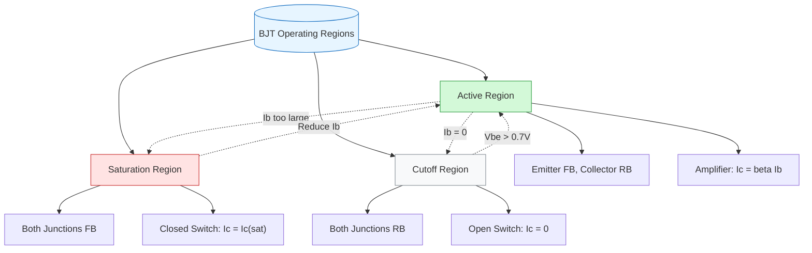
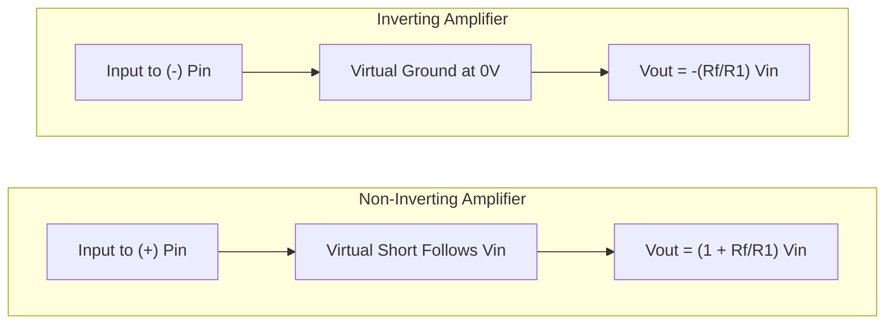

# FAD1022 L34-L38 — Semiconductors & Op-Amps

Comprehensive coverage of semiconductor physics, diode operation, transistor biasing, and operational amplifier configurations.

## Lecture Files

- Lecture 34 — Semiconductor Theory and Materials For Diode
- Lecture 35 — Transistor (Fixed & Emitter Stabilized Bias)
- Lecture 36 — Transistor (Voltage Divider Bias)
- Lecture 37 — Op-Amp (Inverting)
- Lecture 38 — Op-Amp (Non-inverting)

## Lecture 34 — Semiconductor Theory and Materials For Diode

### Semiconductor Materials

Semiconductors are a special class of elements with conductivity between that of a good conductor and an insulator. Their conductivity can be controlled in ways impossible for conductors.

#### Energy Bands

- **Conduction band**: energy band consisting of free electrons. These free electrons originate from the valence band when energized/excited (receive energy). They are highly mobile and responsible for electrical conductivity.
- **Insulator**: large band gap — electrons cannot easily jump to conduction band.
- **Semiconductor**: moderate band gap — some electrons can be excited to conduction band.
- **Conductor**: overlapping or very small gap — free electrons readily available.

#### Doping the Intrinsic Semiconductor

Adding impurity atoms to a semiconductor material to improve conductivity, producing **extrinsic semiconductors**.

**N-Type**
- Add element with five valence electrons into Si crystallite structure
- Examples: antimony (Sb), arsenic (As), phosphorus (P)
- Electrons are **majority** charge carriers; holes are minority carriers

**P-Type**
- Add element with three valence electrons into Si crystallite structure
- Examples: boron (B), gallium (Ga), indium (In)
- Holes are **majority** charge carriers; electrons are minority carriers

Both holes and electrons drive current.

#### Charge Carriers: Holes and Electrons

A hole is the "opposite" of an electron. Unlike an electron which has negative charge, holes have positive charge equal in magnitude but opposite in polarity. Holes are not physical particles; they are the **absence of an electron** in an atom. Holes move from positive to negative, whereas electrons move from negative to positive.

### Diode

A solid-state device created by joining p-type and n-type material.

#### P-N Junction Formation

At the instant the two materials are joined:
1. Electrons from the n-region diffuse across the junction and combine with holes
2. Combination results in a lack of carriers near the junction — the **Depletion Region**
3. Filling a hole makes a negative ion and leaves behind a positive ion on the n-side
4. A space charge builds up, creating a depletion region which inhibits further electron transfer unless helped by applying a forward bias

#### Biasing

Three possibilities:

| Bias Condition | Connection | Diode State |
|---|---|---|
| No bias | — | — |
| Reverse bias ($V_D < 0$) | p-region to negative terminal, n-region to positive terminal | OFF |
| Forward bias ($V_D > 0$) | p-region to positive terminal, n-region to negative terminal | ON |

#### Knee Voltage (Cut-in Voltage)

Minimum voltage at which the forward-biased diode starts conducting current.

| Semiconductor | Knee Voltage (V) |
|---|---|
| Ge | 0.3 |
| Si | 0.7 |
| GaAs | 1.5 |

Circuit must be supplied with knee voltage (or more) for current to conduct. Also referred to as offset, threshold, or firing potential ($V_D$).

#### Temperature Effects on Knee Curve

When temperature increases:
1. Thermal energy of electrons and holes within the silicon crystal increases
2. Easier for charge carriers to overcome the potential barrier at the p-n junction
3. The knee of the curve shifts to the left — diode turns on at a lower forward voltage

### Diode Circuit Configurations

#### DC Series Configuration

**Forward bias (ON state):**
- Replace Si diode with 0.7 V source (knee voltage)
- Apply Kirchhoff's voltage rule: $E - V_R - V_D = 0$

**Reverse bias (OFF state):**
- Replace diode with open circuit
- $I_D = I_R = 0$ A
- $V_R = I_R R = 0$
- $V_D = E - V_R = E$

#### Parallel Configuration

Voltage for parallel connection is always the same. When diode is in forward bias, it acts as a **voltage limiter** — potential difference across parallel connection is limited to knee voltage (0.7 V for Si).

#### Multiple Diodes in Parallel

When two diodes of different materials are in parallel (e.g., Si and Ge):
- The diode with lower knee voltage turns ON first and maintains its voltage
- The other diode never reaches its required knee voltage and remains OFF
- Example: Ge (0.3 V) turns ON; Si (0.7 V) remains OFF

### Diode with AC Inputs

#### Half-Wave Rectifier

Process of removing one-half the input signal to establish a DC level.

**Positive cycle:** current flows clockwise; $V_m - V_D - V_O = 0$ → $V_O = V_m - V_D$
**Negative cycle:** no current flows; $V_O = 0$

Average DC value: $V_{DC} = 0.318(V_m - V_D)$

#### Clippers

Clippers have the ability to "clip" off a portion of the input signal.
- Output taken across diode
- Can limit positive or negative portions depending on configuration

#### AC Equivalent Visualization

During positive cycle: visualize as +ve DC power supply with current clockwise
During negative cycle: visualize as +ve DC power supply with current clockwise (but opposite polarity)

### Capacitor in Semiconductor Circuits

By introducing capacitor at certain position in the circuit, we can **block DC current** from flowing through one of the resistors. When used for this purpose, it is known as a **blocking capacitor**.

### Topics Not Covered in L34

- Full-wave rectification
- Load line (operation line)
- Clampen
- Filter
- Zener diode
- Avalanche breakdown

## Lecture 35 — Transistor (Fixed & Emitter Stabilized Bias)

### Introduction to Bipolar Junction Transistor (BJT)

- **BJT** = Bipolar Junction Transistor, a three-terminal semiconductor device (emitter, base, collector).
- **NPN:** Current flows from collector terminal to emitter terminal. Base is P-type sandwiched between N-type emitter and collector.
- **PNP:** Current flows from emitter terminal to collector terminal. Base is N-type sandwiched between P-type emitter and collector.
- **Base acts as a gate** controlling the flow of current.
- This lecture focuses **ONLY on NPN transistors** in the **common-emitter configuration**.

### Transistor as Amplifier

- A transistor amplifies the **amplitude** of the input signal.
- The transistor **does not change the frequency** of the signal.
- The desired output preserves the same ripple waveform as the input, only scaled in amplitude.
- Two criteria must be fulfilled for the transistor to conduct:
  1. Small current must flow into the Base.
  2. Voltage between Base and Emitter, $V_{BE}$, must be **more than 0.7 V** (for silicon-based transistors).

### Why Biasing?

- Relying on the input signal alone to provide base current and voltage is **not reliable** for amplifier applications; the current may fluctuate.
- For use as a **switch**, direct input control may be acceptable.
- For use as an **amplifier**, if the signal is too small the transistor may fail to turn "ON" properly.
- **Biasing** introduces fixed DC current and voltage to the base, establishing a stable operating point so the transistor remains in the active region regardless of how small the AC input signal is.

### Fundamental Current and Gain Relationships

**KCL (Kirchhoff's Current Law):**
$$I_E = I_B + I_C$$

**Current Gain (Beta, β):**
$$\beta = \frac{I_C}{I_B} \quad \Rightarrow \quad I_C = \beta I_B$$
- Beta is the factor by which current is amplified.
- For a device with $\beta = 100$, the collector current is 100× the base current.
- In transistor specification sheets, beta is referred to as $h_{FE}$ (for AC) or $h_{fe}$ (for DC).
- **Beta is temperature-dependent**, which causes Q-point instability.

**Alpha (α):**
$$\alpha = \frac{I_C}{I_E}$$
- Ratio of collector current to emitter current.

**Emitter Current in terms of Base Current:**
$$I_E = I_B(\beta + 1)$$

### Transistor Operating Regions

| Region | Emitter Junction | Collector Junction | Behavior | Key Formula |
|--------|-----------------|-------------------|----------|-------------|
| **Active (Linear)** | Forward biased | Reverse biased | Amplifier | $I_C = \beta I_B$ |
| **Saturation** | Forward biased | Forward biased | Closed switch | $I_{C(sat)}$ (max current) |
| **Cutoff** | Open / Reverse | Open / Reverse | Open switch | $I_C = 0$, $I_B = 0$ |

- **Active region:** The transistor acts best as an amplifier. $I_C$ is controlled by $I_B$.
- **Saturation region:** Collector and emitter behave as if shorted. $I_C$ reaches maximum and is no longer controlled by $I_B$.
- **Cutoff region:** Collector and base are effectively open. All currents ($I_C$, $I_B$, $I_E$) are approximately zero.

### 1. Fixed-Bias Circuit

**Circuit:** Base resistor $R_B$ connects $V_{CC}$ to the base. Collector resistor $R_C$ connects $V_{CC}$ to the collector. Emitter is grounded. AC input couples through $C_1$ to the base; AC output couples through $C_2$ from the collector.

**Base-Emitter Loop Equation:**
$$V_{CC} - I_B R_B - V_{BE} = 0$$
$$I_B = \frac{V_{CC} - V_{BE}}{R_B}$$

**Collector-Emitter Loop Equation:**
$$V_{CC} - I_C R_C - V_{CE} = 0$$
$$V_{CE} = V_{CC} - I_C R_C$$

**Saturation Current:**
$$I_{C(sat)} = \frac{V_{CC}}{R_C}$$

**Q-Point Instability:**
Since $I_C = \beta I_B$ and $I_B$ is fixed by $R_B$, the collector current is directly proportional to $\beta$. If $\beta$ changes (e.g., due to temperature), $I_C$ changes by the same proportion, causing the Q-point to shift dramatically.

**Lecture Example:** $V_{CC} = 12\,V$, $R_B = 240\,k\Omega$, $R_C = 2.2\,k\Omega$, $\beta = 50$
- $I_B = \frac{12 - 0.7}{240\,k\Omega} = 47.08\,\mu A$
- $I_C = (50)(47.08\,\mu A) = 2.35\,mA$
- $V_{CE} = 12 - (2.35\,mA)(2.2\,k\Omega) = 6.83\,V$
- $I_{C(sat)} = \frac{12}{2.2\,k\Omega} = 5.45\,mA$
- If $\beta$ changes to 100: $I_C = 4.708\,mA$ (nearly 100% increase)

### 2. Emitter-Stabilized Bias

**Circuit:** Adds an emitter resistor $R_E$ between the emitter and ground. This provides **improved stability** over fixed-bias because $R_E$ introduces negative feedback against $\beta$ variations.

**Base-Emitter Loop Equation:**
$$V_{CC} - I_B R_B - V_{BE} - I_E R_E = 0$$
Substituting $I_E = I_B(\beta + 1)$:
$$I_B = \frac{V_{CC} - V_{BE}}{R_B + (\beta + 1)R_E}$$

**Collector-Emitter Loop Equation:**
$$V_{CC} - I_C R_C - V_{CE} - I_E R_E = 0$$
Using the approximation $I_E \approx I_C$ (valid when $\beta \gg 1$):
$$V_{CE} = V_{CC} - I_C(R_C + R_E)$$

**Saturation Current:**
$$I_{C(sat)} = \frac{V_{CC}}{R_C + R_E}$$

**Other Related Equations:**
- $V_E = I_E R_E$
- $V_C = V_{CE} + V_E = V_{CC} - I_C R_C$
- $V_B = V_{BE} + V_E = V_{CC} - I_B R_B$

**Stability Mechanism:**
The term $(\beta + 1)R_E$ appears in the denominator of the $I_B$ equation. As $\beta$ increases, the denominator increases, causing $I_B$ to decrease. This partially compensates for the $\beta$ increase, keeping $I_C$ more stable than in fixed-bias.

A useful design approximation for strong stability is when $(\beta + 1)R_E \gg R_B$ (commonly $(\beta + 1)R_E \geq 10 R_B$). Under this condition:
$$I_C \approx \frac{V_{CC} - V_{BE}}{R_E}$$
making $I_C$ largely **independent of $\beta$**.

**Lecture Example 1:** $V_{CC} = 20\,V$, $R_B = 430\,k\Omega$, $R_C = 2\,k\Omega$, $R_E = 1\,k\Omega$, $\beta = 50$
- $I_B = \frac{20 - 0.7}{430\,k\Omega + (51)(1\,k\Omega)} = \frac{19.3}{481\,k\Omega} = 40.1\,\mu A$
- $I_C = (50)(40.1\,\mu A) = 2.01\,mA$
- $V_{CE} = 20 - (2.01\,mA)(2\,k\Omega + 1\,k\Omega) = 13.97\,V$

**Lecture Example 2 (same circuit, $\beta = 100$):**
- $I_B = \frac{19.3}{430\,k\Omega + (101)(1\,k\Omega)} = \frac{19.3}{531\,k\Omega} = 36.3\,\mu A$
- $I_C = (100)(36.3\,\mu A) = 3.63\,mA$
- $V_{CE} = 20 - (3.63\,mA)(3\,k\Omega) = 9.11\,V$

### Fixed-Bias vs Emitter-Stabilized Comparison

| Configuration | $\beta = 50$ ($I_C$) | $\beta = 100$ ($I_C$) | Change |
|---------------|----------------------|------------------------|--------|
| Emitter-Stabilized ($R_E = 1\,k\Omega$) | 2.01 mA | 3.63 mA | **+80.59%** |
| Fixed-Bias (no $R_E$) | 2.24 mA | 4.49 mA | **+100%** |

**Conclusion:** Adding $R_E$ reduces the sensitivity of $I_C$ to $\beta$ variations, providing better Q-point stability. $I_C$ for fixed-bias changes 100% when $\beta$ doubles, whereas emitter-stabilized shows only ~80.6% change for the same $\beta$ swing.

## Lecture 36 — Transistor (Voltage Divider Bias)

### Circuit Overview

The voltage divider bias configuration adds a resistive voltage divider ($R_{B1}$, $R_{B2}$) to the base network to provide a stable base voltage $V_B$ and base-emitter voltage $V_{BE}$. This gives more control and thermal stability than fixed-bias or emitter-stabilized bias.

### Approximate vs Exact Analysis

There are two ways to analyze the voltage divider bias loop:
1. **Exact analysis** — uses Thevenin equivalent ($V_{TH}$, $R_{TH}$)
2. **Approximate analysis** — simpler, but only valid under a specific condition

This lecture focuses **only on approximate analysis**.

### Approximation Condition

For the approximate method to be valid with high accuracy:

$$\beta R_E \geq 10 R_{B2}$$

Equivalently, this can be written as $R_{TH} \leq 0.1\beta R_E$ (where $R_{TH} = R_{B1} \parallel R_{B2}$).

> **Key stability insight:** In the approximate analysis, the formula to determine $I_B$ **does not depend on $\beta$**. This makes the voltage divider bias far more stable against transistor parameter variations than fixed-bias or emitter-stabilized bias.

### Approximate Analysis Procedure

| Step | Formula | Description |
|------|---------|-------------|
| 1 | $V_B = \frac{R_{B2} V_{CC}}{R_{B1} + R_{B2}}$ | Base voltage from divider rule |
| 2 | $V_E = V_B - V_{BE}$ | Emitter voltage |
| 3 | $I_E = \frac{V_E}{R_E}$ | Emitter current |
| 4 | $I_C \cong I_E$ | Collector current (approx.) |
| 5 | $V_{CE} = V_{CC} - I_C(R_C + R_E)$ | Collector-emitter voltage |

### Worked Example

**Given:** $V_{CC} = 22\,V$, $R_{B1} = 39\,k\Omega$, $R_{B2} = 3.9\,k\Omega$, $R_C = 10\,k\Omega$, $R_E = 1.5\,k\Omega$, $\beta = 140$

**Step 1 — Check condition:**
$$\beta R_E = (140)(1.5\,k\Omega) = 210\,k\Omega$$
$$10 R_{B2} = 10(3.9\,k\Omega) = 39\,k\Omega$$
$$210\,k\Omega \geq 39\,k\Omega \quad \text{(satisfied)}$$

**Step 2 — Calculate $V_B$:**
$$V_B = \frac{(3.9\,k\Omega)(22\,V)}{39\,k\Omega + 3.9\,k\Omega} = 2\,V$$

**Step 3 — Calculate $V_E$:**
$$V_E = V_B - V_{BE} = 2\,V - 0.7\,V = 1.3\,V$$

**Step 4 — Calculate $I_C$:**
$$I_C \cong I_E = \frac{V_E}{R_E} = \frac{1.3\,V}{1.5\,k\Omega} = 0.867\,mA$$

**Step 5 — Calculate $V_{CE}$:**
$$V_{CE} = V_{CC} - I_C(R_C + R_E) = 22\,V - (0.867\,mA)(11.5\,k\Omega) = 12.03\,V$$

**Output:** $I_C = 0.867\,mA$, $V_{CE} = 12.03\,V$

### Bias Type Comparison

| Quantity | Fixed Bias | Emitter-Stabilized | Voltage Divider (Approx.) |
|----------|-----------|-------------------|--------------------------|
| $I_B$ | $\frac{V_{CC} - V_{BE}}{R_B}$ | $\frac{V_{CC} - V_{BE}}{R_B + (\beta+1)R_E}$ | Depends on divider (not directly calculated) |
| $I_C$ | $\beta I_B$ | $\beta I_B$ | $\cong I_E = \frac{V_B - V_{BE}}{R_E}$ |
| $V_{CE}$ | $V_{CC} - I_C R_C$ | $V_{CC} - I_C(R_C + R_E)$ | $V_{CC} - I_C(R_C + R_E)$ |

## Lecture 37 — Op-Amp (Inverting)

### Introduction to Op-Amps
- An op-amp is a **high-gain voltage amplifier** integrated into a single IC, composed of many transistors, diodes, and resistors.
- It amplifies weak electric signals (both DC and AC).
- The name "operational amplifier" reflects its ability to perform mathematical operations: summation, subtraction, integration, differentiation, and division.

### Symbol & Power Supply
- **Inverting Input (-)**: Output is 180° out of phase (inverted) with respect to the input.
- **Non-Inverting Input (+)**: Output is in phase (0° phase shift) with the input.
- **Vcc**: Positive power supply terminal.
- **Vee**: Negative power supply terminal.
- Simplified diagrams often omit power supply pins, but they are always present.

### Two Golden Rules
1. **No current flows into the input pins** — the op-amp has extremely high input impedance (ideally infinite). In practice, a negligible amount of current may flow.
2. **The output voltage adjusts to bring the input pins to the same voltage** — the voltage difference between $V_{in(+)}$ and $V_{in(-)}$ becomes zero. This rule applies **only when there is feedback**.

### Feedback
- **Feedback** is the process of taking a portion of the output signal and feeding it back to the input.
- **Negative Feedback**: Output is fed back to the **inverting (-)** input. This is used in linear amplifier configurations.
- **Positive Feedback**: Output is fed back to the **non-inverting (+)** input.

### Inverting Amplifier
- The input signal is applied to the **inverting input** through an input resistor $R_1$, while the **non-inverting input is grounded**.
- **Virtual Ground**: Because the non-inverting input is at 0 V and Rule 2 forces both inputs to the same potential, the inverting input node is also at **0 V** — this point is called virtual ground.
- Since no current enters the op-amp input (Rule 1), the current through $R_1$ equals the current through the feedback resistor $R_f$:
  $$I = \frac{V_{in}}{R_1} = -\frac{V_{out}}{R_f}$$
- Rearranging gives the inverting amplifier output:
  $$V_{out} = -\frac{R_f}{R_1} V_{in}$$

### Characteristics
- Amplifies the input signal.
- Inverts the output with respect to the input (applies to both AC and DC signals).

### Worked Example
Given an inverting amplifier with $R_1 = 100 \text{ k}\Omega$ and $R_f = 500 \text{ k}\Omega$, find the input voltage required to produce $V_{out} = -10 \text{ V}$.

$$V_{out} = -\frac{R_f}{R_1} V_{in}$$

$$-10 = -\frac{500}{100} V_{in}$$

$$V_{in} = 2 \text{ V}$$

## Lecture 38 — Op-Amp (Non-inverting)

**Lecturer:** [[Zainal Abidin (ZAA)]]

### Revision: Voltage Division in Series Circuits
The lecture begins by revisiting series resistor circuits. For resistors in series with a voltage source, the voltage across each resistor is proportional to its resistance. This concept is essential for analyzing the non-inverting amplifier's feedback network.

### Non-Inverting Amplifier Configuration
When the input signal is connected to the **non-inverting (+)** input pin of the op-amp, the circuit is called a **non-inverting amplifier**. The output is amplified and remains in phase with the input (not inverted).

**Circuit operation:**
- The input (e.g., a battery, sensor, or microphone) is applied to the non-inverting (+) pin.
- Negative feedback is provided from the output to the inverting (-) pin through a feedback resistor $R_f$.
- A resistor $R_1$ connects the inverting (-) pin to ground.

**Analysis using ideal op-amp rules:**
1. **Virtual Short (Rule 2):** The voltage at the inverting (-) pin equals the voltage at the non-inverting (+) pin. If $V_{in}$ is applied to (+), then the voltage at (-) is also $V_{in}$.
2. **No Input Current:** No current flows into the op-amp inputs. Therefore, the current flowing through $R_1$ to ground must be the same current flowing through $R_f$ from the output.

The voltage across $R_1$ is $V_{in}$ (since the inverting pin is at $V_{in}$ and the other end is grounded). The current through $R_1$ is:
$$I = \frac{V_{in}}{R_1}$$

Since the same current flows through $R_f$, the voltage across $R_f$ is:
$$V_{R_f} = I \cdot R_f = V_{in} \cdot \frac{R_f}{R_1}$$

The output voltage is the sum of the voltage at the inverting pin and the voltage across $R_f$:
$$V_{out} = V_{in} + V_{R_f} = V_{in} + V_{in}\frac{R_f}{R_1} = V_{in}\left(1 + \frac{R_f}{R_1}\right) = \left(\frac{R_1 + R_f}{R_1}\right)V_{in}$$

### Characteristics
1. **Amplifies** the input signal (DC or AC).
2. Will **NOT invert** the output signal — the output remains in phase with the input.

### Example
Determine the output voltage of a non-inverting amplifier for $V_1 = 2\text{ V}$, $R_1 = 100\text{ kΩ}$, and $R_f = 500\text{ kΩ}$:

$$V_{out} = \left(\frac{100\text{ kΩ} + 500\text{ kΩ}}{100\text{ kΩ}}\right)(2\text{ V}) = 6 \times 2\text{ V} = \mathbf{+12\text{ V}}$$

The positive result confirms the output is **not inverted**.

### Comparison: Inverting vs Non-Inverting Amplifier
Using the same resistor values ($R_1 = 100\text{ kΩ}$, $R_f = 500\text{ kΩ}$) and input ($V_1 = 2\text{ V}$):

| Configuration | Gain Formula | Output |
|---------------|--------------|--------|
| **Inverting** | $V_{out} = -\frac{R_f}{R_1}V_{in}$ | $-10\text{ V}$ (inverted) |
| **Non-inverting** | $V_{out} = \left(\frac{R_1 + R_f}{R_1}\right)V_{in}$ | $+12\text{ V}$ (non-inverted) |

Both configurations amplify the signal, but the inverting amplifier produces a negative (inverted) output while the non-inverting amplifier produces a positive (non-inverted) output.

## Key Concepts

- [[Semiconductors & Diodes]] — band theory, doping, p-n junction
- [[Transistors & Biasing]] — BJT operation, biasing circuits
- [[Operational Amplifiers]] — ideal op-amp characteristics
- Semiconductor Theory — energy bands, intrinsic vs extrinsic
- Doping — n-type and p-type semiconductors
- P-N Junction — depletion region, forward and reverse bias
- Diodes — I-V characteristics, applications
- Bipolar Junction Transistors (BJT) — NPN and PNP structures
- Biasing Circuits — fixed bias, emitter-stabilized, voltage divider
- DC Analysis — Q-point stabilization
- Operational Amplifiers — differential inputs, high gain
- Inverting Amplifier — virtual ground, gain calculation
- Non-inverting Amplifier — gain formula, buffer applications

## Diagrams

### BJT Operating Regions

### Inverting vs Non-Inverting Op-Amp

## Summary

This module bridges physics and electronics, covering semiconductor device operation. Students learn the physics of p-n junctions, analyze transistor biasing circuits for stable operation, and understand op-amp configurations. Practical circuit analysis skills are developed for both DC biasing and AC signal amplification.

## Lecturer

[[Zainal Abidin (ZAA)]] — PASUM Physics Lecturer

## Related

- [[FAD1022 - Basic Physics II]] — main course page
- [[AC Circuits]] — circuit analysis foundation
- [[Electrostatics]] — electric field concepts in depletion regions
