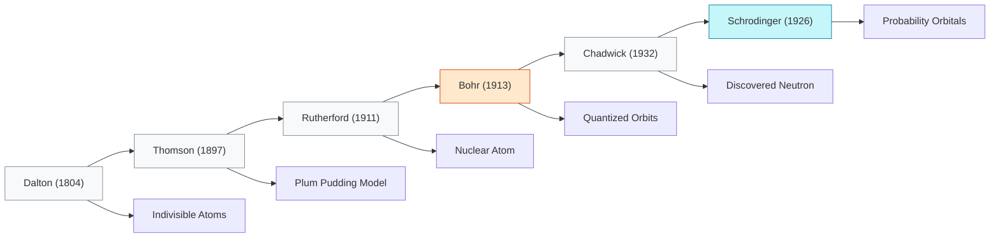
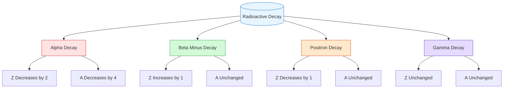

# FAD1022 L39-L42 — Atomic & Nuclear Physics

Lecture series on atomic structure, nuclear physics, radioactivity, and nuclear waste management.

## Lecture Files

- Lecture 39 (Part 1) — Atomic Physics
- Lecture 40 — Binding Energy
- Lecture 41 — Radioactivity
- Lecture 42 — Waste Management

## Lecture 39 — Atomic Physics (Introduction)

### Overview
Lecture 39 introduces atomic physics through the historical evolution of atomic models, with emphasis on Bohr's model of the hydrogen atom, energy levels, atomic spectra, and an introduction to lasers as a practical application.

### 1. Evolution of Atomic Models

The lecture traces the development of atomic theory:
- **Dalton (1804–1904)** — Proposed that elements consist of indivisible, identical atoms that combine in whole-number ratios.
- **J.J. Thomson** — Discovered the electron; proposed the "plum pudding" model where atoms contain negative particles embedded in a positive sphere.
- **Ernest Rutherford (1911)** — Gold foil experiment proved mass is concentrated in a tiny, dense, positively charged nucleus.
- **Niels Bohr (1913)** — Introduced quantized planetary orbits; electrons move in fixed energy levels with "quantum leaps."
- **James Chadwick (1932)** — Identified the neutron, explaining isotopes and additional nuclear mass.
- **Erwin Schrödinger (1926)** — Wave model replaced fixed orbits with orbitals—probability zones representing electron location.

| Feature | Bohr Model (1913) | Schrödinger Model (1926) |
|---------|-------------------|--------------------------|
| Concept | Electrons in fixed circular orbits | Electrons in probability clouds (orbitals) |
| Electron Nature | Pure particle | Wave-particle duality |
| Certainty | Exact path and velocity known | Uncertainty Principle—only probability known |
| Trajectory | 2D paths (like planets) | 3D mathematical wave functions ($\psi$) |

### 2. Bohr's Model of the Hydrogen Atom

Niels Bohr introduced a model to **understand the line spectrum of hydrogen**. Using the simplest atom (hydrogen), Bohr developed a structural model to explain atomic stability.

**Bohr's General Postulates:**
1. Electrons move only in certain **circular orbits**, called stationary states or energy levels. When orbiting in these allowed orbits, the electron does **not radiate energy**.
2. The only allowed orbits are those with a **discrete set of quantum numbers** $n$ for which the angular momentum is quantized:
   $$mvr = n\frac{h}{2\pi} = n\hbar$$
3. Emission or absorption of electromagnetic radiation occurs **only when an electron transitions** from one allowed orbit to another. The frequency of emitted radiation is:
   $$hf = E_i - E_f$$

### 3. Angular Momentum Quantization

In Bohr's model, the angular momentum $L$ of the electron in the $n$-th orbit is:
$$L = n\frac{h}{2\pi} = n\hbar$$

where $\hbar = \frac{h}{2\pi} \approx 1.06 \times 10^{-34} \text{ J}\cdot\text{s}$ is the reduced Planck constant.

- The quantum number $n$ determines the orbit and energy level.
- Since $L = mvr$ for circular motion, the quantization condition becomes $L_n = r_n m v_n = n\hbar$.

### 4. Orbital Radius

The electron moves in a circular orbit of radius $r$ with speed $v$, experiencing centripetal acceleration $a = v^2/r$ due to the Coulomb electrostatic force $F = \frac{ke^2}{r^2}$.

From Newton's second law ($F = ma$):
$$\frac{e^2}{4\pi\varepsilon_0 r^2} = \frac{mv^2}{r}$$

Combining with Bohr's second postulate and eliminating $v$ yields:
$$r_n = \left(\frac{\varepsilon_0 h^2}{\pi m e^2}\right) n^2 \quad n = 1, 2, 3, \ldots$$

Substituting known values ($\varepsilon_0 = 8.85 \times 10^{-12}$, $h = 6.63 \times 10^{-34}$, $m = 9.1 \times 10^{-31}$, $e = 1.61 \times 10^{-19}$):
$$\boxed{r_n = (5.29 \times 10^{-11} \text{ m})\, n^2}$$

**Example (Second excited state, $n=3$):**
- $L = 3\hbar = 3.16 \times 10^{-34} \text{ kg}\cdot\text{m}^2\cdot\text{s}^{-1}$
- $r_3 = 4.76 \times 10^{-10} \text{ m}$
- $v = 7.79 \times 10^5 \text{ m/s}$

### 5. Energy Levels

The total energy of the hydrogen atom is the sum of kinetic and potential energy:
$$E = K + U = \frac{1}{2}mv^2 - \frac{ke^2}{r}$$

Using $K = \frac{ke^2}{2r}$ (from force balance), the total energy simplifies to:
$$E = -\frac{ke^2}{2r}$$

Substituting $r_n$ gives the quantized energy levels:
$$E_n = -\left(\frac{2\pi^2 m k^2 e^4}{h^2}\right)\frac{1}{n^2}$$

This simplifies to the practical formula:
$$\boxed{E_n = -(13.6 \text{ eV})\frac{1}{n^2} \quad n = 1, 2, 3, \ldots}$$

**Hydrogen Energy Level Table:**
| Energy Level $n$ | State | Energy $E$ |
|------------------|-------|------------|
| $n=1$ | Ground state | $-13.6$ eV |
| $n=2$ | 1st excited state | $-3.4$ eV |
| $n=3$ | 2nd excited state | $-1.51$ eV |
| $n=4$ | 3rd excited state | $-0.85$ eV |

**Ionization Energy:** The minimum energy required to remove an electron from the ground state to infinity ($n=1 \rightarrow n=\infty$):
$$\Delta E = E_\infty - E_1 = 0 - (-13.6) = 13.6 \text{ eV}$$

### 6. Atomic Transitions and Spectral Series

When electrons transition between energy levels, photons are emitted or absorbed.

**Excitation:** Electron jumps from ground state to a higher energy state; must absorb energy.

**De-excitation (Emission):**
- **Lyman Series:** Electron falls from $n=2,3,4,5$ to ground state ($n=1$). Emits **ultraviolet (UV)** light. Requires high excitation energy.
- **Balmer Series:** Electron falls from $n=3,4,5$ to 1st excited state ($n=2$). Emits **visible light**. Requires medium excitation energy.
- **Paschen Series:** Electron falls from $n=4,5$ to 2nd excited state ($n=3$). Emits **infrared (IR)** light. Requires lower excitation energy.

The photon energy/wavelength is determined by:
$$\Delta E = hf = E_i - E_f$$

**Example:** An electron drops from an unknown level $n$ to ground state, emitting a photon with energy $2.089 \times 10^{-18}$ J.
- Convert to eV: $13.056$ eV (using $1 \text{ eV} = 1.6 \times 10^{-19}$ J)
- Using $E_{\text{light}} = -13.6\left(\frac{1}{n^2} - 1\right) = 13.056$ eV
- Solving yields $n \approx 5$
- Frequency: $f = \frac{2.089 \times 10^{-18}}{6.63 \times 10^{-34}} \approx 3.15 \times 10^{15}$ Hz

### 7. Photon Emission and Atomic Spectra

**Definition:** The spectrum of electromagnetic radiation emitted by an electron during transitions between different energy levels (higher to lower energy state).

Three types of spectra:
- **Continuous Spectrum:** Contains all wavelengths; emitted by a hot, dense light source.
- **Emission Spectrum:** Shows colored lines of light emitted by glowing gas (isolated emission lines).
- **Absorption Spectrum:** Shows dark lines or gaps after light passes through a gas.

When an electron transitions between energy levels, it emits light of a **specific wavelength** determined by the energy gap.

### 8. Application: Lasers

**LASER** = **L**ight **A**mplification by **S**timulated **E**mission of **R**adiation

Lasers produce light that is **intense, travels in one direction, and has a single, pure color**.

**Characteristics:**
- Monochromatic
- Highly coherent
- Highly directional
- Can be sharply focused

**Three Quantum Processes:**
1. **Stimulated Absorption:** An electron absorbs a photon and excites to a higher energy state.
2. **Spontaneous Emission:** An excited electron emits a photon while falling to a lower energy state. The excited-state lifetime is short ($\sim 10^{-8}$ s). The emitted photon's color depends on the energy gap.
3. **Stimulated Emission:** An incident photon stimulates an excited electron to emit a second, identical photon. The two photons have identical energy, are **in phase**, and travel in the same direction. This creates a **chain reaction** (light amplification), producing a burst of coherent, monochromatic photons.

**Laser Systems:**

| Active Medium | Wavelength (nm) | Type |
|---------------|-----------------|------|
| Helium-Cadmium | 441.6 | Continuous |
| Argon (Ar) | 476.5, 488.0, 514.5 | Continuous |
| Helium-Neon (He-Ne) | 632.8 | Continuous |
| Carbon dioxide (CO$_2$) | 10600 | Continuous |
| Dye laser | 300–1000 | Continuous or pulsed |
| Ruby | 694.3 | Pulsed |
| Nd-YAG | 1064 | Continuous or pulsed |

**Applications:**
- **Medicine:** Surgery (tumor destruction, cauterization), kidney stone pulverization, LASIK eye surgery (cornea reshaping).
- **Industry:** Welding, drilling, cutting metal plates, precision alignment.

### Key Takeaways
- Bohr's model quantizes angular momentum and energy, explaining hydrogen's line spectrum.
- Orbital radius scales as $r_n \propto n^2$; energy scales as $E_n \propto -1/n^2$.
- Spectral series (Lyman, Balmer, Paschen) correspond to transitions ending at $n=1, 2, 3$ respectively.
- Lasers exploit stimulated emission to produce coherent, monochromatic light with applications across medicine and industry.

## Lecture 40 — Binding Energy

### 40.1 Nuclear Structure

- **Nucleus**: central core of an atom, positively charged, contains protons and neutrons
- **Nucleon**: collective term for protons and neutrons
- **Nuclide**: specific type of atom characterized by its number of protons ($Z$) and neutrons ($N$)
- Notation: $^A_Z X$ where $A$ = mass number, $Z$ = atomic number, $N = A - Z$
- **Nuclear radius**: $R = R_0 A^{1/3}$ where $R_0 = 1.2 \times 10^{-15}\ \text{m} = 1.2\ \text{fm}$
- **Nuclear volume**: $V = \frac{4}{3}\pi R^3 = \frac{4}{3}\pi A R_0^3$
- Nuclear density is approximately constant at $\rho \approx 2.3 \times 10^{17}\ \text{kg/m}^3$

**Subatomic particle masses (from lecture):**

| Particle | Mass (kg) | Charge | Atomic mass (u) |
|----------|-----------|--------|-----------------|
| Proton | $1.67262 \times 10^{-27}$ | $+e\ (1.602 \times 10^{-19}\ \text{C})$ | $1.00728$ |
| Neutron | $1.67492 \times 10^{-27}$ | $0$ | $1.00867$ |
| Electron | $9.10938 \times 10^{-31}$ | $-e\ (1.602 \times 10^{-19}\ \text{C})$ | $0.000549$ |

- **Isotopes**: nuclides with same $Z$ but different $A$ (same protons, different neutrons)
  - Examples: Hydrogen ($^1_1\text{H}$, $^2_1\text{H}$, $^3_1\text{H}$); Oxygen ($^{16}_8\text{O}$, $^{17}_8\text{O}$, $^{18}_8\text{O}$)

### 40.2 Mass-Energy Equivalent

- From Einstein's theory of relativity: $E = mc^2$
- **Atomic mass unit (u)**: defined as $\frac{1}{12}$ the mass of a neutral carbon-12 atom
  - $1\ \text{u} = 1.6606 \times 10^{-27}\ \text{kg} \approx 1.66 \times 10^{-27}\ \text{kg}$
- Energy equivalent of 1 u:
  - $E = (1.66 \times 10^{-27})(3.00 \times 10^8)^2 = 1.49 \times 10^{-10}\ \text{J}$
  - $E = \frac{1.49 \times 10^{-10}}{1.60 \times 10^{-19}} = 931.5\ \text{MeV}$
  - **$1\ \text{u} = 931.5\ \text{MeV}/c^2$** or equivalently **$c^2 = 931.5\ \text{MeV/u}$**
- Unit conversions:
  - $1\ \text{eV} = 1.602 \times 10^{-19}\ \text{J}$
  - $1\ \text{MeV} = 10^6\ \text{eV} = 1.602 \times 10^{-13}\ \text{J}$

### 40.3 Mass Defect and Binding Energy

- **Mass defect ($\Delta m$)**: the mass difference between the total mass of constituent nucleons and the actual mass of the nucleus
  - $\Delta m = Zm_p + Nm_n - m_N$
  - The nucleus mass $m_N$ is always less than the sum of its constituent nucleons
- **Binding energy ($E_B$)**: energy required to break the nucleus into its constituent particles (or energy released when nucleons combine to form a nucleus)
  - $E_B = (\Delta m)c^2 = [Zm_p + Nm_n - m_N]c^2$
  - Using $c^2 = 931.5\ \text{MeV/u}$: $E_B = \Delta m \times 931.5\ \text{MeV/u}$

**Worked examples from lecture:**
- **Lithium-7** ($^7_3\text{Li}$): $\Delta m = 0.04052\ \text{u}$, $E_B = 37.74\ \text{MeV}$
- **Chlorine-35** ($^{35}_{17}\text{Cl}$): $\Delta m = 57.9955 \times 10^{-27}\ \text{kg}$, $E_B = 5.22 \times 10^{-9}\ \text{J}$
- **Carbon-12** ($^{12}_6\text{C}$): $\Delta m = 0.098946\ \text{u}$, $E_B = 92.168\ \text{MeV}$, BE/A = $7.70\ \text{MeV/nucleon}$

### Nucleus Stability and Binding Energy Curve

- **Binding energy per nucleon**: $\frac{E_B}{A}$ — measure of nuclear stability
  - Higher BE per nucleon → more energy required to remove a nucleon → more stable nucleus
- Stability factors:
  - Atoms become unstable when $Z > 83$, $N > 126$, or $N/Z > \sim 1.5$
  - Repulsive Coulomb force between protons competes with attractive nuclear force

**Binding energy curve regions:**

1. **Steep Rise (Light Nuclei, $A < 50$)**: $E_B/A$ increases rapidly. Small nuclei are relatively unstable and undergo **nuclear fusion** to climb toward higher binding energy.
2. **Peak of Stability (Iron Group, $A \approx 56$)**: Maximum at **Fe-56** with $E_B/A \approx 8.8\ \text{MeV}$. The most stable nucleus in the universe — neither fusion nor fission occurs naturally here.
3. **Gradual Decline ($A > 62$)**: Curve slopes downward as short-range strong nuclear force struggles to compete with long-range electrostatic repulsion between many protons.
4. **Radioactive Zone ($A > 200$, e.g., Uranium-235)**: $E_B/A$ drops to $\sim 7.5$–$8.0\ \text{MeV}$. These nuclei are unstable and undergo **nuclear fission** or radioactive decay, splitting into smaller, more stable fragments.

**Comparative stability (lecture examples):**
- Carbon-12: BE/A = $7.4287\ \text{MeV/nucleon}$
- Uranium-235: BE/A = $7.3951\ \text{MeV/nucleon}$
- Carbon-12 is more stable than Uranium-235; Carbon-12 is more stable than Carbon-14

## Key Concepts

- [[Atomic Physics]] — atomic structure, electron shells, spectra
- [[Nuclear Physics]] — nuclear composition, forces, stability
- Bohr Model — quantized orbits, energy levels
- Atomic Spectra — emission and absorption lines
- Nuclear Composition — protons, neutrons, nucleons
- Mass Defect — difference between nuclear mass and constituents
- Binding Energy — energy holding nucleus together
- Binding Energy per Nucleon — nuclear stability curve
- Radioactivity — alpha, beta, gamma decay
- Half-Life — radioactive decay calculations
- Nuclear Reactions — fission and fusion
- Waste Management — radioactive waste handling and disposal

## Lecture 41 — Radioactivity

### 41.1 Radioactive Decay

**Definition:** Radioactivity (or radioactive decay) is a process where an unstable nucleus spontaneously decays or breaks down, emitting particles and rays to form a more stable nucleus.

**Historical Context:**
- Accidentally discovered in 1897 by Henri Becquerel — a uranium compound emitted radiation that affected photographic plates and ionized gas.
- Later, Becquerel, Marie Curie, and Rutherford discovered three different types of radioactivity.

**Types of Radioactive Decay (Transmutation Process):**

| Decay Mode | Particle Emitted | Change in Z | Change in A | Condition |
|------------|------------------|-------------|-------------|-----------|
| Alpha ($\alpha$) | Helium nucleus ($^{4}_{2}\text{He}$) | Z decreases by 2 | A decreases by 4 | Nucleus too heavy |
| Beta minus ($\beta^{-}$) | Electron ($^{0}_{-1}e$) | Z increases by 1 | A unchanged | Too many neutrons |
| Positron ($\beta^{+}$) | Positron ($^{0}_{+1}e$) | Z decreases by 1 | A unchanged | Too many protons |
| Gamma ($\gamma$) | High-energy photon | Z unchanged | A unchanged | Nucleus in excited state |

**Alpha Decay:**
- A radioactive process in which an alpha particle (identical to a helium nucleus: 2 protons + 2 neutrons) is emitted.
- Mass number decreases by 4, atomic number decreases by 2.
- Example: $^{238}_{92}\text{U} \rightarrow ^{234}_{90}\text{Th} + ^{4}_{2}\text{He}$
- Decay only occurs when $\Delta m$ or $Q$ is positive.

**Beta Decay:**
- A radioactive process in which a beta particle is emitted. Mass number remains the same.
- **Electron emission ($\beta^{-}$):** atomic number increases by 1. Occurs when unstable nucleus has too many neutrons.
  - Example: $^{14}_{6}\text{C} \rightarrow ^{14}_{7}\text{N} + ^{0}_{-1}e$
- **Positron emission ($\beta^{+}$):** atomic number decreases by 1. Occurs when unstable nucleus has too many protons.
  - Example: $^{18}_{9}\text{F} \rightarrow ^{18}_{8}\text{O} + ^{0}_{+1}e$

**Gamma Decay:**
- Gamma ray = high-energy photon.
- Occurs because the energy state of the nucleus is too high, causing instability.
- The nucleus decays to a lower energy state by emitting a gamma photon ($\gamma$).
- Example: $^{12}_{6}\text{C}^{*} \rightarrow ^{12}_{6}\text{C} + \gamma$
- Nuclide does not change; mass number $A$ and atomic number $Z$ remain the same.

**Example — Combined Decay:**
Nuclide $^{234}_{78}\text{X}$ undergoes 4 $\alpha$ decays and 3 $\beta^{-}$ decays. Find $A$ and $Z$ of the daughter nuclide $Y$.

- After 4 $\alpha$ decays: $A = 234 - 4(4) = 218$, $Z = 78 - 4(2) = 70$
- After 3 $\beta^{-}$ decays: $A = 218$, $Z = 70 + 3 = 73$
- Result: $^{218}_{73}\text{Y}$

### Decay Law, Activity, and Half-Life

**Decay Law:**
The rate of decay of a radioactive sample is directly proportional to the number of radioactive nuclei $N$:

$$-\frac{dN}{dt} \propto N \quad \Rightarrow \quad \frac{dN}{dt} = -\lambda N$$

where $\lambda$ is the **decay constant** (probability per unit time that a nucleus will decay).

**Activity ($A$):**
The rate of decay, also called activity:

$$A = \lambda N = -\frac{dN}{dt}$$

- Initial activity: $A_0 = \lambda N_0$
- Activity also decays exponentially: $A = A_0 e^{-\lambda t}$

**Units of Activity:**
- **Becquerel (Bq)** — SI unit: $1\ \text{Bq} = 1\ \text{decay s}^{-1}$
- **Curie (Ci)** — $1\ \text{Ci} = 3.70 \times 10^{10}\ \text{Bq} = 3.70 \times 10^{10}\ \text{decays s}^{-1}$

**Decay Equation:**
Integrating the decay law:

$$N(t) = N_0 e^{-\lambda t}$$

**Half-Life ($T_{1/2}$):**
The time required for half of the unstable nuclei in a sample to decay:

$$T_{1/2} = \frac{\ln 2}{\lambda} = \frac{0.693}{\lambda}$$

**Example — Sodium-22 Half-Life:**
For $^{22}_{11}\text{Na}$ with $T_{1/2} = 15$ hours:
- Decay constant: $\lambda = \frac{0.693}{15} = 0.0462\ \text{hr}^{-1}$
- Time for 60% to decay (40% remaining): $0.4N_0 = N_0 e^{-\lambda t} \Rightarrow t = 19.83$ hours
- Activity at that time: $A = \lambda(0.4N_0) = 0.0185\ N_0$ per hour

**Example — Carbon-14 Activity:**
Activity of $^{14}\text{C}$ in 1.0 kg of carbon from a living organism ($T_{1/2} = 5730$ years):
- Number of nuclei: $N_0 = \frac{6.022 \times 10^{23}}{14} \times 1000 = 4.30 \times 10^{25}$ atoms
- Decay constant: $\lambda = 3.833 \times 10^{-12}\ \text{s}^{-1}$
- Initial activity: $A_0 = \lambda N_0 = 1.65 \times 10^{14}\ \text{decay s}^{-1}$

### 41.2 Nuclear Reaction

**Definition:** A physical process in which there is a change in the identity of an atomic nucleus. Occurs whenever a nucleus gains, loses, or changes one of its nucleons.

**Conservation Laws:**
1. **Conservation of charge (Z):** Total atomic number is conserved.
2. **Conservation of mass number (A):** Total nucleon number is conserved.
3. **Conservation of energy:** Total energy is conserved.

**Reaction Energy (Q-value):**
The energy released or absorbed in a nuclear reaction:

$$\Delta m = \sum m_{\text{before}} - \sum m_{\text{after}}$$
$$Q = (\Delta m)c^2$$

- If $\Delta m > 0$ or $Q > 0$: **exothermic (exoergic)** — energy is released as kinetic energy of products.
- If $\Delta m < 0$ or $Q < 0$: **endothermic (endoergic)** — energy must be absorbed for the reaction to occur.

Energy is released as kinetic energy of emitted particles, kinetic energy of the daughter nucleus, and gamma-ray photon energy.

**Example — Energy in Alpha Decay:**
$^{226}_{88}\text{Ra} \rightarrow ^{222}_{86}\text{Rn} + ^{4}_{2}\text{He} + Q$
- Mass difference: $\Delta m = 226.02540 - (222.01757 + 4.00260) = 0.00523$ u
- $Q = 0.00523 \times 931.5 = 4.95$ MeV ($= 7.81 \times 10^{-13}$ J)

**Example — Energy in Beta Decay:**
$^{234}_{90}\text{Th} \rightarrow ^{234}_{91}\text{X} + ^{0}_{-1}e + Q$
- Mass difference: $\Delta m = 234.0441 - (234.0433 + 0.000548) = 0.000251$ u
- $Q = 0.000251 \times 931.5 = 0.234$ MeV

## Lecture 42 — Nuclear Waste Management

Lecturer: [[Hafizul Mat]]

### 42.1 Nuclear Fission and Nuclear Fusion

**Nuclear Fusion**
- Process in which small nuclei combine (fuse) to form larger nuclei with the release of energy
- The energy released is called **thermonuclear energy**
- Examples of fusion reactions:
  - $^{2}_{1}\text{H} + {}^{2}_{1}\text{H} \rightarrow {}^{3}_{2}\text{He} + {}^{1}_{0}\text{n} + \text{Energy}$
  - $^{2}_{1}\text{H} + {}^{3}_{1}\text{H} \rightarrow {}^{4}_{2}\text{He} + {}^{1}_{0}\text{n} + \text{Energy}$
  - $^{1}_{1}\text{H} + {}^{2}_{1}\text{H} \rightarrow {}^{3}_{2}\text{He} + \gamma$

**Relation to Binding Energy**
- When two light nuclei combine to form a heavier nucleus, the product has a higher $E_B/A$ (binding energy per nucleon) than the reactants
- The increase in total binding energy equals the energy released
- $\text{Energy released} = (\text{Total } E_B \text{ of product}) - (\text{Total } E_B \text{ of reactants})$

**Conditions for Fusion**
- Requires very high temperature (~$10^8$ K) to overcome Coulomb repulsion between positively charged nuclei
- Known as a **thermonuclear reaction**
- Occurs naturally in the Sun via the **proton-proton cycle**

**Example — Fusion Energy Calculation**
Two deuterons fuse to form a triton and a proton:
$$^{2}_{1}\text{H} + {}^{2}_{1}\text{H} \rightarrow {}^{3}_{1}\text{H} + {}^{1}_{1}\text{H}$$

Given: $m_{\text{deuterium}} = 2.0141\,\text{u}$, $m_{\text{tritium}} = 3.0160\,\text{u}$, $m_{\text{hydrogen}} = 1.0078\,\text{u}$

$$\Delta m = (2.0141 + 2.0141) - (3.0160 + 1.0078) = 0.0044\,\text{u}$$
$$E = \Delta m c^2 = 0.0044 \times 931.5 = 4.1\,\text{MeV}$$

**Nuclear Fission**
- A heavy nucleus splits into two lighter nuclei with the release of energy
- Energy is released because the fission products have a greater average binding energy per nucleon ($E_B/A$) than the parent nucleus
- The bigger nucleus has lower $E_B/A$; nucleons are at a higher energy state
- The smaller product nuclei have higher $E_B/A$; nucleons are at a lower energy state

**Fission Example — Uranium-235**
$$^{1}_{0}\text{n} + {}^{235}_{92}\text{U} \rightarrow {}^{236}_{92}\text{U}^* \rightarrow {}^{91}_{36}\text{Kr} + {}^{142}_{56}\text{Ba} + 3{}^{1}_{0}\text{n} + Q$$

Another possible reaction:
$$^{1}_{0}\text{n} + {}^{235}_{92}\text{U} \rightarrow {}^{236}_{92}\text{U} \rightarrow {}^{85}_{35}\text{Br} + {}^{148}_{57}\text{La} + 3{}^{1}_{0}\text{n} + Q$$

**Example — Fission Energy Calculation**
Calculate energy released in:
$$^{235}_{92}\text{U} + {}^{1}_{0}\text{n} \rightarrow {}^{85}_{35}\text{Br} + {}^{148}_{57}\text{La} + 3{}^{1}_{0}\text{n} + Q$$

Given masses:
- $m_n = 1.00867\,\text{u}$
- $m_{^{85}\text{Br}} = 84.91179\,\text{u}$
- $m_{^{148}\text{La}} = 147.91718\,\text{u}$
- $m_{^{235}\text{U}} = 235.04392\,\text{u}$

$$\Delta m = (m_{\text{U}} + m_n) - (m_{\text{Br}} + m_{\text{La}} + 3m_n) = 236.05259 - 235.85498 = 0.19761\,\text{u}$$
$$Q = \Delta m c^2 = 0.19761 \times 931.5 = 184.074\,\text{MeV}$$

**Chain Reaction**
- Free neutrons produced by fission can hit other nuclei, emitting more neutrons and repeating the reaction
- An uncontrolled chain reaction releases huge energy in a short time and requires a **critical mass** of starting material

### 42.3 Carbon Dating

**Radioactive Dating Principles**
- Scientists determine ages of rocks and fossils using radioactive isotopes and their half-lives
- The amount of radioactive isotope and daughter nuclei are measured to calculate the number of half-lives or age

**Carbon-14 Dating**
- Carbon-14 half-life: $t_{1/2} = 5,730$ years
- Used to estimate ages of plant and animal remains up to ~50,000 years
- While alive, organisms maintain the same C-14 ratio through photosynthesis/food chain
- Once dead, C-14 decreases as C-12 increases over time

**Uranium Dating**
- Some rocks are dated using radioactive uranium isotopes that have decayed into lead
- The ratio of uranium isotopes to daughter nuclei estimates the rock's age

**Example — Ötzi the Iceman**
- Discovered in 1991 in the Alps
- Remaining C-14 activity ≈ 53% of living organism
- Decay constant: $\lambda = \frac{\ln 2}{5730} = 1.21 \times 10^{-4}\,\text{yr}^{-1}$
- Age: $t = 5247$ years

**Example — Dead Sea Scrolls**
- C-14 activity ≈ 78% of expected in living organism
- Age: approximately 2040–2050 years

**Key Facts**
- C-14 dating cannot be used for dinosaur fossils (extinct ~65 million years ago, far beyond 50,000-year limit)
- For sedimentary fossils, scientists use **radiometric dating** on volcanic ash layers above and below the fossil
- **Suess Effect**: Burning fossil fuels releases "old" carbon with no C-14, diluting atmospheric C-14
- **Bomb Spike**: Nuclear weapons testing in the 1950s–60s nearly doubled atmospheric C-14

### 42.4 Radioactive Waste Management

**Definition**
- Waste containing radioactive material, usually byproducts of nuclear power generation or medical procedures
- Requires careful handling, storage, and disposal

**Classification of Radioactive Waste**
| Type | Description | Examples |
|------|-------------|----------|
| Low-Level Waste (LLW) | Low radioactivity | Clothing, filters |
| Intermediate-Level Waste (ILW) | Moderate radioactivity | Resins, chemical sludges |
| High-Level Waste (HLW) | Highly radioactive | Used nuclear fuel |

**Methods of Waste Management**
1. **Storage** — Temporary containment in shielded facilities, allowing for decay over time or awaiting final disposal
   - Example: *Sellafield, UK* — one of the largest nuclear waste storage sites; stores HLW in stainless steel tanks
2. **Disposal** — Long-term disposal by burying radioactive waste deep underground in stable rock formations
   - Example: *Onkalo Repository, Finland* — world's first deep geological repository for spent nuclear fuel; located in stable bedrock ~400–450 m deep
3. **Recycling** — Treating spent nuclear fuel to separate out materials that can be reused in new fuel
   - Example: *La Hague Plant, France* — reprocesses spent fuel from France and other countries

**Safety and Environmental Concerns**
- Long-term monitoring of disposal sites is essential
- Potential risks of leakage or contamination must be managed
- Public awareness and international cooperation are key

## Diagrams

### Evolution of Atomic Models

### Radioactive Decay Types

## Summary

This module transitions from classical to modern physics, examining atomic and nuclear phenomena. Students learn the Bohr model of the atom, calculate binding energies from mass defects, understand radioactive decay processes and half-life calculations, and become aware of nuclear waste management issues. The module connects microscopic nuclear physics to macroscopic energy applications.

## Lecturer

[[Hafizul Mat]] — PASUM Physics Lecturer

## Related

- [[FAD1022 - Basic Physics II]] — main course page
- [[Modern Physics — Wave-Particle Duality]] — quantum foundations
- [[FAD1022 L43 — Modern Physics]] — continuation into quantum physics