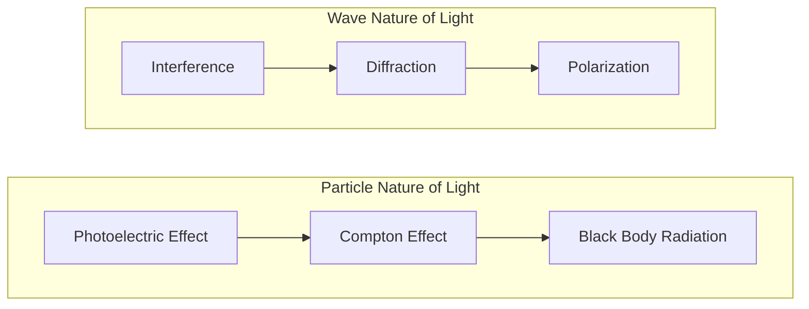

# FAD1022 L43 — Modern Physics

Introduction to quantum physics concepts including wave-particle duality and blackbody radiation.

## Lecture Files

- `Lecture 43 - Wave-particle duality and black body radiation.pdf` (Standard, 25 slides)
- `Lecture 43 - Wave-particle duality and black body radiation - advanced.pdf` (Advanced, 31 slides)
- Lecturer: [[Nurul Izzati (NIA)]]

## Key Concepts

- [[Modern Physics — Wave-Particle Duality]] — quantum dual nature
- Wave-Particle Duality — photons and matter waves
- De Broglie Hypothesis — matter waves, wavelength calculation
- Blackbody Radiation — spectrum, Stefan-Boltzmann law
- Ultraviolet Catastrophe — classical physics failure
- Planck's Quantum Hypothesis — energy quantization
- Photoelectric Effect — light as particles, Einstein's explanation
- Compton Effect — photon momentum, scattering
- Heisenberg Uncertainty Principle — fundamental limits
- Quantum Mechanics Introduction — wave functions, probability

## Diagrams

### Wave-Particle Duality Comparison

### Black Body Radiation Problem and Solution

## Summary

This final lecture introduces the revolutionary concepts of quantum physics. Students learn about the wave-particle duality of matter and radiation, understand how Planck's quantum hypothesis resolved the blackbody radiation problem, and explore key experimental evidence for the particle nature of light. The module sets the foundation for understanding quantum mechanics and its departure from classical physics.

## Advanced Content (L43 Advanced Slides)

### Learning Outcomes
- State wave-particle duality
- Understand black body radiation

### Classical Physics vs Modern Physics
| Classical Physics (Pre-1900) | Modern Physics (Post-1900) |
|------------------------------|----------------------------|
| Large objects, normal speed, visible world | Atoms, electrons, photons, very fast objects, microscopic particles |
| Newton's Laws, Thermodynamics, Waves & Optics, Electricity, Magnetism | Quantum Physics, Atomic Physics, Nuclear Physics, Relativity |

### Wave-Particle Duality
Wave-particle duality is a phenomenon where under certain circumstances a particle exhibits wave properties and under other conditions a wave exhibits properties of a particle. **Light is both wave and particle—not only one.**

| Wave Nature of Light | Particle (Light) Nature of Light |
|----------------------|----------------------------------|
| **Shown by:** Interference, Diffraction, Polarization | **Shown by:** Photoelectric effects, Compton effect, Black body radiation |
| | Light particles are called **photons** |

**Wave evidence:** Double-slit experiment produces interference patterns (bright and dark fringes). Only waves produce interference.
**Particle evidence:** Photoelectric effect and black body radiation show light behaves like particles.

### Black Body Radiation

#### What is a Black Body?
When light or energy is incident on an object, it can either reflect, absorb, or transmit that energy:

$$\text{Total Incoming energy} = \text{Absorbed} + \text{Reflected} + \text{Transmitted}$$

$$\alpha_v + \rho_v + \tau_v = 1$$

Where:
- $\alpha_v$ = Absorptivity
- $\rho_v$ = Reflectivity
- $\tau_v$ = Transmissivity

Bodies for which $\alpha_v = 1$ are called **black bodies**.

A black body is an ideal theoretical object that:
1. **Absorbs all radiation** — all heat and light that falls on it; reflects nothing; transmits nothing
2. **Emits radiation perfectly** — the best emitter of radiation; when hot, gives out electromagnetic radiation (infrared, visible light, ultraviolet)

**Conceptual model:** Idealized cavity with a small hole. Incident energy goes inside and gets reflected repeatedly against inner walls. The black body acts as a perfect absorber. When heated, all energy is emitted through the small hole.

**How blackbodies emit radiation:**
- Emission caused by thermal motion of charged particles (mainly electrons)
- Radiation depends **only on temperature**, not material
- Occurs even in absence of incoming light

**Real-world examples:**
- Stars (like the Sun) approximate blackbodies
- Heated metals glow and emit thermal radiation
- The Cosmic Microwave Background (CMB)
- Black holes are as close to a perfect black body as real objects come

#### The Ultraviolet Catastrophe
Scientists studied how a hot object (black body) emits radiation by measuring intensity vs wavelength. Experimentally, intensity increases first, reaches a maximum, then decreases at short wavelengths (UV region). Radiation does **not** become infinite.

However, classical physics (**Rayleigh-Jeans Law**) predicted that at very short wavelengths (UV region), intensity should become extremely large (infinity). This is impossible in real life. This problem is called the **Ultraviolet Catastrophe**.

> If Rayleigh-Jeans were correct, every time you turned on a toaster, it would blast lethal doses of UV rays, X-rays, and gamma rays.

#### Planck's Quantum Solution
In 1900, Max Planck realized the only way to stop energy from going to infinity was to stop treating energy like a "continuous slide." He proposed that energy isn't smooth; it comes in **packets** or "chunks," which he called **Quanta** (not continuous).

$$E = hf$$

Where $h = 6.626 \times 10^{-34}$ J·s (Planck's constant)

**Why this fixed everything:**
- At high frequency, energy packets become very large
- Atoms cannot easily emit them
- Therefore radiation **decreases** at short wavelength, instead of becoming infinite
- This perfectly matched experiment

**The water analogy:** NOT like water flowing smoothly, BUT like water dropping drop by drop.

#### Key Laws Governing Emission
| Law | Formula | Description |
|-----|---------|-------------|
| Planck's Law | — | Energy distribution across wavelengths |
| Wien's Law | $\lambda_{max} = \frac{b}{T}$ | Peak wavelength shifts with temperature ($b = 2.90 \times 10^{-3}$ m·K) |
| Stefan-Boltzmann Law | $\frac{P}{A} = \sigma T^4$ | Total power emitted ($\sigma = 5.67 \times 10^{-8}$ W·m⁻²·K⁻⁴) |

#### Why This Changed Physics Forever
This idea destroyed the classical belief that energy is continuous and introduced the **Quantization of Energy**. This became the foundation of Quantum Physics.

- **Classical Physics:** Everything is continuous and predictable.
- **Modern Physics (Quantum):** Everything is "pixelated" (quantized) at the smallest level.

This was the "Big Bang" of Modern Physics because it killed the idea of **Classical Determinism**. The resolution of the Ultraviolet Catastrophe is widely considered the "birth certificate" of modern physics.

## Lecturer

[[Nurul Izzati (NIA)]] — PASUM Physics Lecturer

## Related

- [[FAD1022 - Basic Physics II]] — main course page
- [[Atomic Physics]] — Bohr's quantum model foundation
- [[Nuclear Physics]] — quantum effects in nuclear structure
- [[Electrostatics]] — classical physics contrast