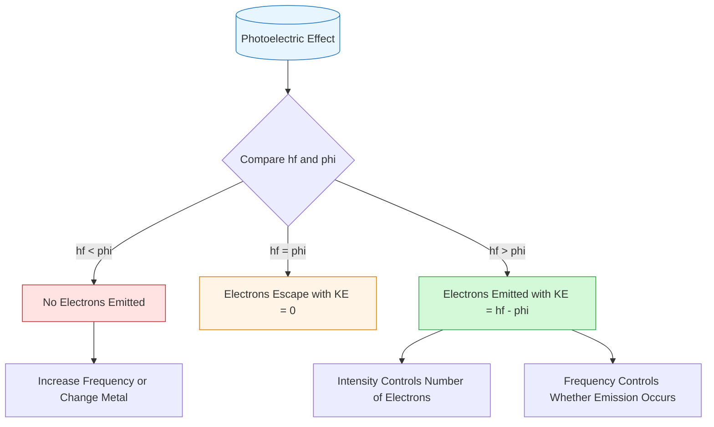
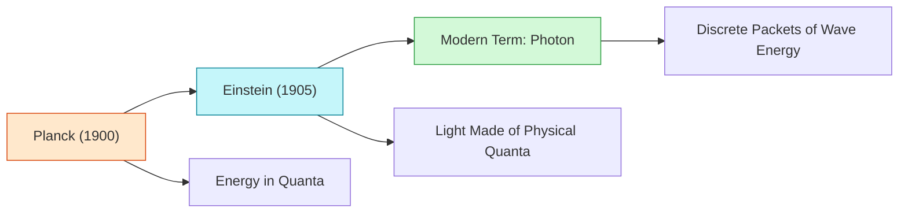

# FAD1022 L44 — Photons and Photoelectric Effect

This lecture covers the concept of photons as discrete packets of light energy and the photoelectric effect as experimental proof of light's particle nature.

## Lecture File

- `Lecture 44 - Photons and Photoelectric Effect.pdf` (29 slides)
- Lecturer: [[Nurul Izzati (NIA)]]

## Key Topics

### 1. Photon — Definition & Properties

A **photon** is the smallest packet (quantum) of electromagnetic radiation (light energy). It demonstrates that light exhibits **wave-particle duality**.

**Key Properties:**
- Elementary particle of light with **no charge**
- Always travels at speed of light in vacuum: $c = 3.00 \times 10^8$ m/s
- **Massless** particles (no resting mass)
- Carry both **energy and momentum**
- Exhibit **wave-particle duality**

### 2. Photon Energy Equations

The energy of a photon depends on its frequency and wavelength:

$$E = hf = \frac{hc}{\lambda}$$

Where:
- $E$ = energy of photon (J)
- $h$ = Planck's constant = $6.63 \times 10^{-34}$ J·s
- $f$ = frequency (Hz)
- $c$ = speed of light = $3.0 \times 10^8$ m/s
- $\lambda$ = wavelength (m)

**Key Relationships:**
- Higher frequency → Higher photon energy
- Shorter wavelength → Higher photon energy

**Examples:**
- Gamma rays: very high frequency → very high energy
- Radio waves: low frequency → low energy
- X-rays: short wavelength → high energy
- Red light: longer wavelength → lower energy

### 3. Historical Evolution of Light Theory

| Scientist | Contribution | View |
|-----------|--------------|------|
| **Max Planck (1900)** | Energy released in "chunks" or "quanta", $E = hf$ | Math trick (not physical) |
| **Albert Einstein (1905)** | Light itself is made of physical chunks called "light quanta" | Physical reality |
| **Modern Term** | These chunks are called **photons** | Discrete packets of wave energy |

### 4. The Photoelectric Effect

**Definition:** The emission of electrons from a metal surface when light of suitable frequency shines on it. The emitted electrons are called **photoelectrons**.

**Why Classical Wave Theory Failed:**
- Classical physics predicted stronger light (higher intensity) should always eject electrons
- But experiments showed low frequency bright light cannot eject electrons, while high-frequency dim light can

**Einstein's Photon Explanation:**
- Light consists of photons
- Each photon carries energy $E = hf$
- One photon transfers energy to one electron (one-to-one interaction)

### 5. Work Function & Threshold Frequency

**Work Function ($\phi$):** The minimum energy needed to remove an electron from the metal surface.

**Threshold Frequency ($f_0$):** The minimum frequency of light needed to eject electrons:

$$f_0 = \frac{\phi}{h}$$

**Three Cases:**

| Condition   | Result                                    |
| ----------- | ----------------------------------------- |
| $hf < \phi$ | No electron emitted                       |
| $hf = \phi$ | Electron escapes with zero kinetic energy |
| $hf > \phi$ | Electron emitted with kinetic energy      |

### 6. Einstein's Photoelectric Equation

$$KE_{max} = hf - \phi$$

Where:
- $KE_{max}$ = maximum kinetic energy of ejected electron
- $hf$ = photon energy
- $\phi$ = work function

### 7. Role of Intensity vs. Frequency

| Property | Controls |
|----------|----------|
| **Frequency** | WHETHER electrons are emitted (energy per photon) |
| **Intensity** | HOW MANY electrons are emitted (number of photons) |

### 8. Stopping Potential ($V_s$)

The minimum voltage needed to stop the most energetic photoelectrons:

$$KE_{max} = eV_s$$

Where $e$ = electron charge

## Example Problems

**Example 1:** Calculate energy of a photon with frequency $6 \times 10^{14}$ Hz

$$E = hf = 6.63 \times 10^{-34} \times 6 \times 10^{14} = 3.98 \times 10^{-19} \text{ J}$$

**Example 2:** Determine wavelength of photon with energy $3.0 \times 10^{-19}$ J

$$\lambda = \frac{hc}{E} = \frac{6.626 \times 10^{-34} \times 3.0 \times 10^8}{3.0 \times 10^{-19}} = 6.626 \times 10^{-7} \text{ m}$$

**Example 3 (from slides):** Electrons are ejected from a metallic surface with speeds ranging up to $4.6 \times 10^5$ m/s when light with a wavelength of $\lambda = 625$ nm is used.

(a) What is the work function of the surface?
(b) What is the cutoff frequency for this surface?

**Solution (a):**

$$KE_{max} = \frac{1}{2}m_e v_{max}^2 = \frac{1}{2}(9.11 \times 10^{-31})(4.6 \times 10^5)^2 = 9.6 \times 10^{-20} \text{ J}$$

$$\phi = \frac{hc}{\lambda} - KE_{max} = \frac{(6.63 \times 10^{-34})(3.00 \times 10^8)}{625 \times 10^{-9}} - 9.6 \times 10^{-20} = 2.2 \times 10^{-19} \text{ J} = \boxed{1.4 \text{ eV}}$$

**Solution (b):**

$$f_c = \frac{\phi}{h} = \frac{2.2 \times 10^{-19}}{6.63 \times 10^{-34}} = \boxed{3.3 \times 10^{14} \text{ Hz}}$$

**Example 4 (from slides):** When light of wavelength 350 nm falls on a potassium surface, electrons are emitted that have a maximum kinetic energy of 1.31 eV. Find:

(a) the work function of potassium,
(b) the cutoff wavelength, and
(c) the frequency corresponding to the cutoff wavelength.

**Solution (a):**

$$\phi = \frac{hc}{\lambda} - KE_{max} = \left(\frac{6.63 \times 10^{-34} \times 3.00 \times 10^8}{350 \times 10^{-9}} \times \frac{1 \text{ eV}}{1.60 \times 10^{-19}}\right) - 1.31 \text{ eV} = \boxed{2.24 \text{ eV}}$$

**Solution (b):**

$$\lambda_c = \frac{hc}{\phi} = \left(\frac{6.63 \times 10^{-34} \times 3.00 \times 10^8}{2.24 \text{ eV}} \times \frac{1 \text{ eV}}{1.60 \times 10^{-19}}\right) = \boxed{555 \text{ nm}}$$

**Solution (c):**

$$f_c = \frac{c}{\lambda_c} = \frac{3.00 \times 10^8}{555 \times 10^{-9}} = \boxed{5.41 \times 10^{14} \text{ Hz}}$$

## Applications

- [[Solar Panels]] — photon energy conversion
- [[Fiber Optics]] — light transmission via photons
- [[Lasers]] — coherent photon emission
- [[Phototherapy]] — medical applications

## Diagrams

### Photoelectric Effect Decision Tree

### Historical Evolution of Light Theory

## Related Concepts

- [[Modern Physics — Wave-Particle Duality]] — foundational concept
- [[Planck's Quantum Hypothesis]] — origin of quantization
- [[Atomic Physics]] — quantum foundations
- [[Blackbody Radiation]] — historical context

## Lecturer

[[Nurul Izzati (NIA)]] — PASUM Physics Lecturer

## Related

- [[FAD1022 L43 — Modern Physics]] — previous lecture on wave-particle duality
- [[FAD1022 - Basic Physics II]] — main course page
