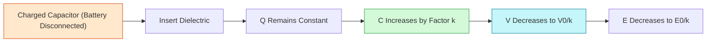
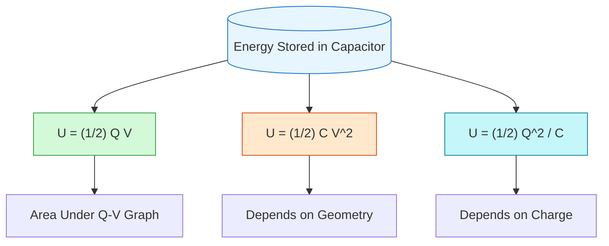

# FAD1022 L7-L9 — Capacitors

Lecture series on capacitors, dielectrics, energy storage, and RC circuit dynamics.

## Lecture Files

- Lecture 7 — Dielectrics & Stored Energy
- Lecture 8 — Combination of Capacitors
- Lecture 9 — Charging & Discharging

## Lecture 7: Dielectrics & Stored Energy

**Lecturer:** Dr Siti Nabila Aidit (nabilaidit@um.edu.my)

### Capacitor Fundamentals

A **capacitor** is a device that stores electric charge $Q$ across a potential difference $\Delta V$. Its simplest form is two parallel metal plates separated by an insulating gap.

**Key point:** A capacitor does not create charge — it separates and stores existing charges on opposite plates, creating a potential difference between them.

**Capacitance** $C$ is the amount of charge the capacitor can store per unit of potential difference:
$$C = \frac{Q}{\Delta V}$$
Unit: farad (F), where $Q$ is in coulombs (C) and $\Delta V$ is in volts (V).

**Symbols for capacitor:**
- Standard: two parallel lines (—||—)
- Polarized: straight line and curved line with + sign

### Parallel-Plate Capacitor

Consists of two conducting plates of area $A$ separated by distance $d$. The space between plates is vacuum or air.

**Electric field strength** between the plates:
$$E = \frac{\sigma}{\varepsilon_0} = \frac{Q}{A\varepsilon_0}$$
where $\sigma$ is surface charge density and $\varepsilon_0 = 8.85 \times 10^{-12} \text{ F m}^{-1}$ is the permittivity of free space.

Since $d \ll A$, the electric field $E$ is uniform between the plates and zero elsewhere:
$$E = \frac{\Delta V}{d}$$

**Capacitance** of a parallel-plate capacitor (vacuum/air):
$$C = \frac{A\varepsilon_0}{d}$$

**Factors affecting capacitance:**
1. **Area** of the plate, $A$ — directly proportional
2. **Distance** between the plates, $d$ — inversely proportional

To increase accumulated charge $Q$:
- Increase the voltage $V$
- Increase the capacitance $C$ (by increasing plate area $A$ or decreasing distance $d$)

### Capacitors with Dielectrics

A **dielectric** is a non-conducting material placed between the plates of a capacitor.

**Dielectric constant** $\kappa$:
$$\kappa = \frac{\varepsilon}{\varepsilon_0}$$
where $\varepsilon$ is the permittivity of the dielectric material.

**Advantages** of inserting a dielectric:
1. Increase the capacitance
2. Increase the maximum operating voltage
3. Mechanical support between the plates, allowing the plates to be close together without touching

**Dielectric strength** is the maximum electric field that can exist in a dielectric without electrical breakdown.

| Material | Dielectric constant, $\kappa$ | Dielectric Strength ($10^6$ V m$^{-1}$) |
|----------|------------------------------|----------------------------------------|
| Paper | 3.7 | 16 |
| Mylar | 3.2 | 7 |
| Rubber | 6.7 | 12 |
| Silicone oil | 2.5 | 15 |
| Nylon | 3.4 | 14 |
| Teflon | 2.1 | 60 |

**Effect on isolated capacitor (battery disconnected):**
When a dielectric is inserted into a charged capacitor with the battery disconnected:
- Charge $Q_0$ remains constant
- Potential difference decreases: $\Delta V = \frac{\Delta V_0}{\kappa}$
- Capacitance increases: $C = \kappa C_0 = \kappa \frac{A\varepsilon_0}{d}$

(Subscript 0 denotes parameters related to vacuum-filled capacitor)

**Atomic-level mechanism:**
- Polar molecules are randomly oriented in the absence of an electric field
- When $E$ is applied, molecules partially align with the field
- The polarized dielectric creates its own induced electric field $\vec{E}_{ind}$ in the direction opposite to the original field $\vec{E}_0$
- This reduces the net electric field strength inside: $\vec{E} = \frac{\vec{E}_0}{\kappa}$
- Weaker field means lower voltage for the same charge, resulting in higher capacitance

### Energy Stored in a Charged Capacitor

A charged capacitor stores electrical potential energy in the electric field between the plates.
$$\text{Energy stored} = \text{Work done to charge it}$$

Work is needed because electrons are forced onto a plate that already has electrons (they repel each other). The fuller the plate gets, the more work is required. This work gets stored as electrical potential energy.

From the area under the $\Delta V$ vs $Q$ graph:
$$U = W = \frac{1}{2}\frac{Q^2}{C} = \frac{1}{2}C(\Delta V)^2 = \frac{1}{2}Q\Delta V$$

### Examples from Lecture

**Example 1**
A parallel-plate capacitor with plates of area $280 \text{ cm}^2$ are separated by a $0.550 \text{ mm}$ distance. The plates are in vacuum. If a potential difference of $20.1 \text{ V}$ is supplied to the capacitor, determine:
a. the capacitance
b. the amount of charge on each plate
c. the electric field strength between the plates
($\varepsilon_0 = 8.85 \times 10^{-12} \text{ F m}^{-1}$)

**Example 2**
A vacuum-filled parallel-plate capacitor has plates of area $150 \text{ cm}^2$ and separation of $2 \text{ mm}$. The capacitor is charged to a potential difference $2000 \text{ V}$. Then the battery is disconnected and a dielectric material is placed between the plates. In the presence of the dielectric, the potential difference across the plates is reduced to $500 \text{ V}$. Determine:
a. initial capacitance
b. charge on each plate before the dielectric is inserted
c. capacitance after dielectric is inserted
d. dielectric constant
e. permittivity of dielectric material
f. initial electric field
g. electric field after dielectric is inserted
($\varepsilon_0 = 8.85 \times 10^{-12} \text{ F m}^{-1}$)

**Example 3**
A $3 \text{ μF}$ capacitor is connected to a $12 \text{ V}$ battery.
a. How much energy is stored in the capacitor?
b. Had the capacitor been connected to a $6 \text{ V}$, how much energy would have been stored?

### Quick Quizzes

1. A capacitor stores charge $Q$ at a potential difference $\Delta V$. What happens if the voltage applied to the capacitor by a battery is doubled to $2\Delta V$?
   - **Answer:** Capacitance remains the same, and charge doubles.

2. A capacitor is marked $35\text{V}$ $1000\text{μF}$.
   - (a) Explain the marking: maximum voltage $35\text{V}$, capacitance $1000\text{μF}$
   - (b) Calculate the charge on the capacitor when the potential difference across it is $30\text{V}$: $Q = CV = 1000 \times 10^{-6} \times 30 = 0.03 \text{ C}$
   - (c) What happens if connected to $40\text{V}$? The capacitor will break down / exceed its rated voltage.

## Key Concepts

- [[Capacitors & Dielectrics]] — capacitance definition, parallel plate capacitor
- Capacitor Energy Storage — energy density in electric fields
- Dielectrics — dielectric constant, polarization, effect on capacitance
- Capacitor Combinations — series and parallel configurations
- Equivalent Capacitance — calculating total capacitance for networks
- RC Circuits — charging and discharging transients
- Time Constant — $\tau = RC$, transient behavior analysis

## Diagrams

### Effect of Dielectric on Isolated Capacitor

### Energy Stored in a Capacitor

## Summary

This module extends electrostatic concepts to capacitor systems. Students learn how capacitors store energy in electric fields, how dielectrics enhance capacitance, and how to analyze combinations of capacitors. The transient behavior of RC circuits during charging and discharging is covered with emphasis on the time constant.

## Lecturer

[[Dr Siti Nabila Aidit]] — PASUM Physics Lecturer

## Related

- [[FAD1022 - Basic Physics II]] — main course page
- [[Electrostatics]] — prerequisite concepts
- [[AC Circuits]] — capacitors in AC circuits
